```{r setup, include=FALSE}
knitr::opts_chunk$set(echo = TRUE, message = F, warning = F)
```

---

```{r}
# devtools::install_github("derekmichaelwright/dblogr")
library(dblogr) # Loads: tidyverse, ggpubr, ggbeeswarm, ggrepel
library(readxl) # read_xlsx()
library(latex2exp)  # TeX()
```

# Introduction to Augmented Designs

Augmented designs were developed (Federer, 1956) as a way of controlling error in plant breeding trials which often have many genotypes that need to be tested, and limited seed or resources to do proper replications of all material. Therfore, in order to control for the heterogenity that exists within a field, a set of check cultivars are replicated in each *block*. The block effects and error estimated from the replicated checks, is then used to adjust the values of each new genotype being tested.

**Federer, W.** (1956) Augmented (or hoonuiaku) designs. *Hawaiian Planters Record*.

\pagebreak

# Augmented RCBD

In a **Randomized Complete Block Design** (**RCBD**), every genotype is present in each block, making each block a replicate with entries randomized within. As such, a field trial of 4 genotpes (A, B, C, D), with 4 replicates each (4 blocks) will look something like this: 

```{r echo = F}
genotypes <- c("A","B","C","D")
xx <- data.frame(Row = 1:4,
                 Block1 = genotypes,
                 Block2 = sample(genotypes),
                 Block3 = sample(genotypes),
                 Block4 = sample(genotypes)) %>%
  gather(Block, Genotype, 2:ncol(.))
xx <- read_xlsx("ExampleData.xlsx", "RCBD") %>%
  filter(Genotype %in% c("A","B","C","D")) %>%
  mutate(Row = rep(1:4, time = 3))
mycolors <- c("darkgreen","darkred","darkorange","darkblue","white")
# Plot
mp <- ggplot(xx, aes(x = "", y = Row)) + 
  geom_tile(aes(fill = Genotype), color = "black", alpha = 0.75) + 
  geom_label(aes(label = Genotype), size = 6) +
  facet_grid(.~Block) +
  scale_fill_manual(values = mycolors) +
  scale_y_reverse() +
  theme_dblogr(legend.position = "none",
               axis.text.y = element_blank()) +
  labs(y = NULL, x = NULL)
ggsave("Aug_00_1.png", mp, width = 6, height = 3)
```

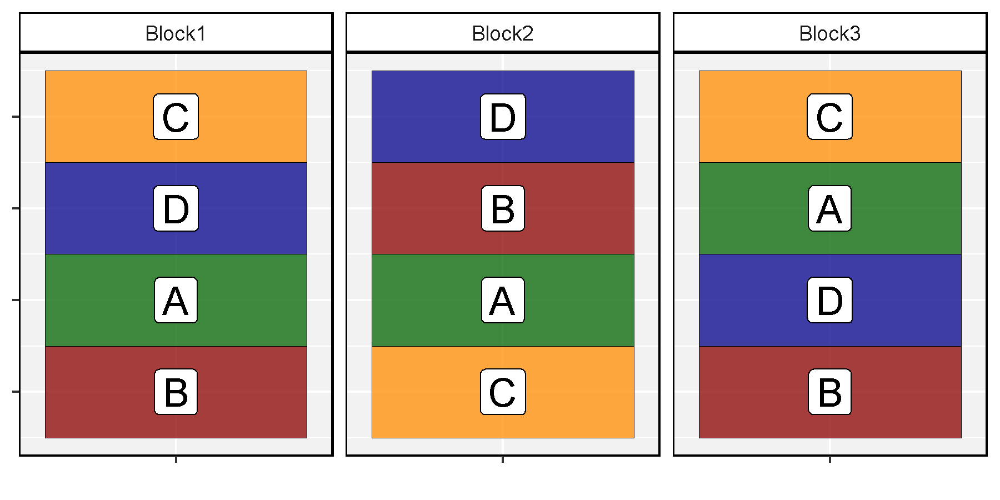

In an **Augmented RCBD**, the idea is to have a small set of check varieties which are present in each block, *i.e.*, an RCBD, augmented with unreplicated test varieties. *E.g.,* lets say we have 8 test varieties named: e, f, g, h, i, j, k, l. Our field trial might look like this:

```{r echo = F}
xx <- read_xlsx("ExampleData.xlsx", "RCBD") %>%
  mutate(Fill = ifelse(Genotype %in% c("A","B","C","D"), Genotype, "X"))
mycolors <- c("darkgreen","darkred","darkorange","darkblue","white")
# Plot
mp <- ggplot(xx, aes(x = "", y = Row)) + 
  geom_tile(aes(fill = Fill), color = "black", alpha = 0.75) + 
  geom_text(aes(label = Genotype)) +
  facet_grid(.~Block) +
  scale_fill_manual(values = mycolors) +
  scale_y_reverse() +
  theme_dblogr(legend.position = "none",
               axis.text.y = element_blank()) +
  labs(y = NULL, x = NULL)
ggsave("Aug_00_2.png", mp, width = 6, height = 3)
```

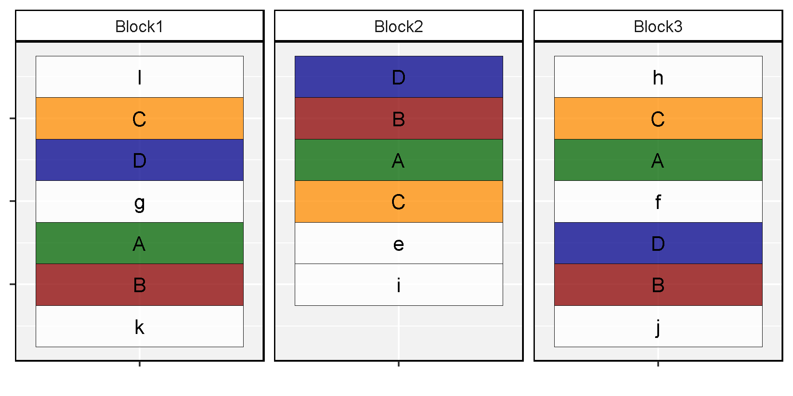

\pagebreak

Now lets explore the data analysis for such a trial. This data comes from a trial on Field 78 at Pioneer Mill Sugar Company, 1931 (**Federer, 1956**), which had 3 different level ditches (blocks), and the recorded data was in tons of sugar cane per acre (TCA).

```{r}
# Prep data
xx <- read_xlsx("ExampleData.xlsx", "RCBD") %>%
  mutate(Fill = ifelse(Genotype %in% c("A","B","C","D"), Genotype, "X"),
         Type = ifelse(Genotype %in% c("A","B","C","D"), "Check", "Treatment"))
mycolors <- c("darkgreen","darkred","darkorange","darkblue","white")
# Plot data
mp <- ggplot(xx, aes(x = "", y = Row)) + 
  geom_tile(aes(fill = Fill), color = "black", alpha = 0.75) + 
  geom_text(aes(label = paste(Genotype, Yield, sep = " = "))) +
  facet_grid(.~Block) +
  scale_fill_manual(values = mycolors) +
  scale_y_reverse() +
  theme_dblogr(legend.position = "none",
               axis.text.y = element_blank()) +
  labs(title = "Tons of sugar cane per acre", y = NULL, x = NULL)
ggsave("Aug_01_01.png", mp, width = 6, height = 3)
```

```{r echo = F}
ggsave("featured.png", mp, width = 6, height = 3)
```

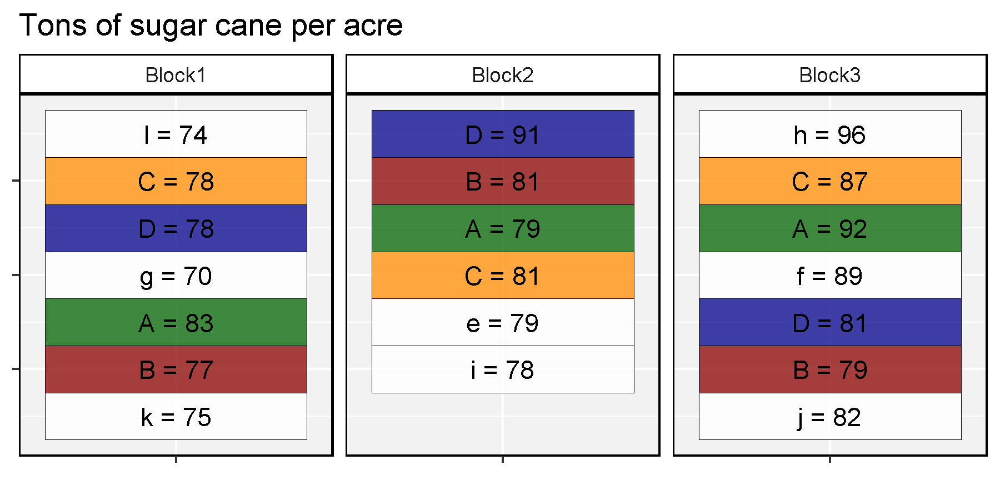

```{r}
xt <- xx %>% filter(Type != "Check")
xc <- xx %>% filter(Type == "Check")
mp <- ggplot(xx, aes(x = Block, y = Yield, color = Fill, shape = Type)) + 
  geom_beeswarm(size = 3) +
  geom_text_repel(data = xt, aes(label = Genotype), nudge_x = 0.1) +
  scale_color_manual(values = c(mycolors[1:4], "grey30")) +
  guides(shape = F) + ylim(c(70,96)) +
  theme_dblogr(legend.position = "none") +
  labs(y = "Tons of sugar cane per acre", x = NULL)
ggsave("Aug_01_02.png", mp, width = 6, height = 3)
```

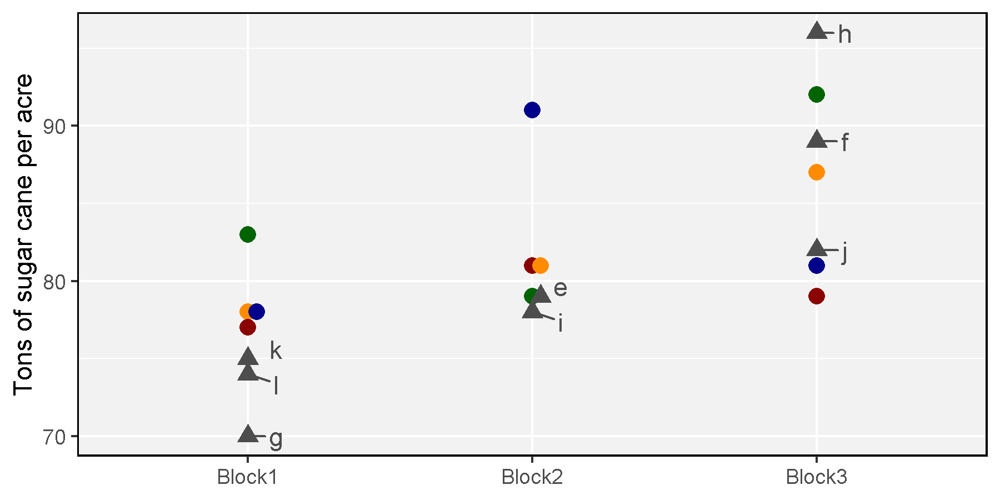

But first lets focus on the unreplicated test varieties.

```{r}
mp <- ggplot(xx, aes(x = Block, y = Yield, color = Fill, shape = Type, alpha = Type)) + 
  geom_beeswarm(size = 3) +
  geom_text_repel(data = xt, aes(label = Genotype), nudge_x = 0.1) +
  scale_color_manual(values = c(mycolors[1:4], "grey30")) +
  scale_alpha_manual(values = c(0.2,1)) +
  guides(shape = F) + ylim(c(70,96)) +
  theme_dblogr(legend.position = "none") +
  labs(y = "Tons of sugar cane per acre", x = NULL)
ggsave("Aug_01_03.png", mp, width = 6, height = 3)
```

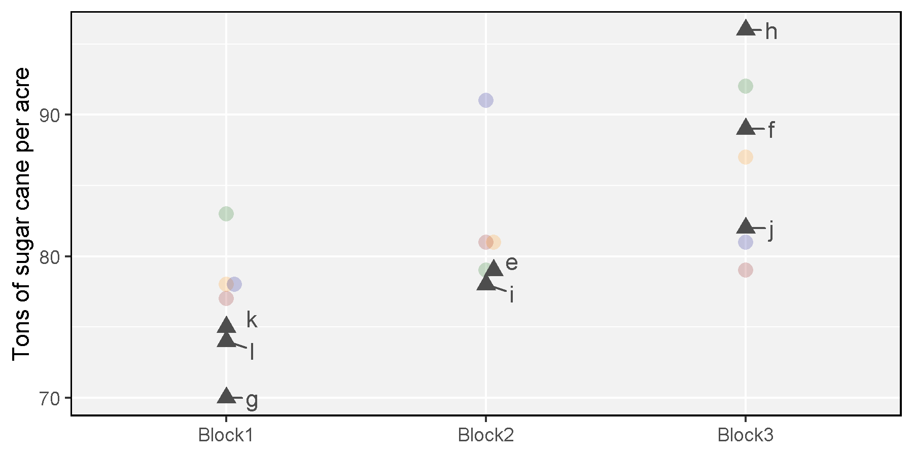

Clearly there are strong block effects, which is problematic since our test varieties are unreplicated, making comparions among genotypes from different blocks potentially unreliable. *E.g.,* is genotype **j** a higher yielding genotype than **k**? Or, is it just in a block where all genotypes yield higher? By runnaing an ANOVA on the replicated check varieties, we can get an estimate of the block effects and adjust our data accordingly.

```{r}
eq <- TeX("$y_{ij}=\\mu+b_i+g_i+error_{ij}$")
mp <- ggplot(xx, aes(x = Block, y = Yield, color = Fill, shape = Type, alpha = Type)) + 
  geom_beeswarm(size = 3) +
  geom_text(x = 1, y = 95, label = eq, parse = T, size = 6) + 
  scale_color_manual(values = c(mycolors[1:4], "grey30")) +
  scale_alpha_manual(values = c(1,0.2)) +
  guides(shape = F) + ylim(c(70,96)) +
  theme_dblogr(legend.position = "none") +
  labs(y = "Tons of sugar cane per acre", x = NULL)
ggsave("Aug_01_04.png", mp, width = 6, height = 3)
```

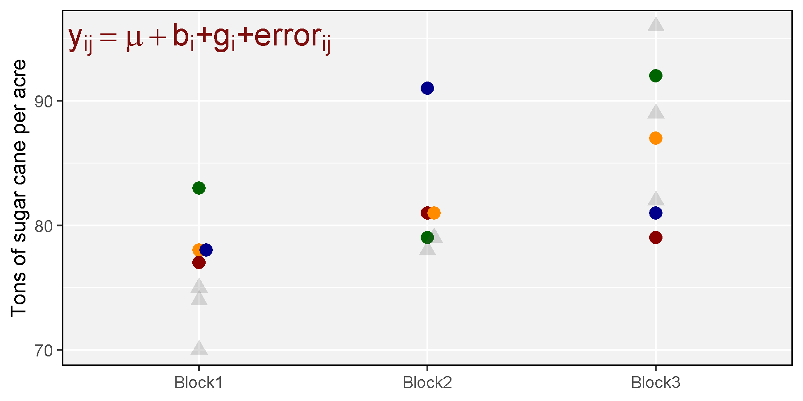

$$y_{ij}=\mu+b_i+g_j+error_{ij}$$

where:

- $\mu$ = Mean
- $b_i$ = Block effect
- $g_j$ = Genotype effect
- $error_ij$ = random error

```{r}
fit <- lm(Yield ~ Block + Genotype, data = xc)
aov(fit)
coef(fit)
blockeffects <- c(coef(fit)[2:3], sum(-as.numeric(coef(fit)[2:3])))
names(blockeffects)[3] <- "Block3"
blockeffects
```

```{r}
xx <- xx %>% 
  mutate(BlockEffect = as.numeric(plyr::mapvalues(Block, 
            c("Block1","Block2","Block3"), blockeffects)),
         Adj_Yield = Yield - BlockEffect)
xt <- xx %>% filter(Type != "Check") %>% arrange(Yield) %>%
  mutate(Genotype = factor(Genotype, levels = Genotype))
mp <- ggplot(xt, aes(x = Genotype, color = Block)) + 
  geom_point(aes(y = Yield), size = 3, alpha = 0.2) +
  geom_point(aes(y = Adj_Yield), size = 3) + 
  geom_errorbar(aes(ymin = Yield, ymax = Adj_Yield), size = 1, width = 0) +
  #facet_grid(.~Type, scales = "free_x", space = "free_x") +
  scale_color_manual(values = dblogr_Colors[c(10,11,7)]) +
  theme_dblogr(legend.position = "bottom") +
  labs(title = "Block Effect Adjustments", y = "Tons of sugar cane per acre")
ggsave("Aug_01_05.png", mp, width = 6, height = 4)
```

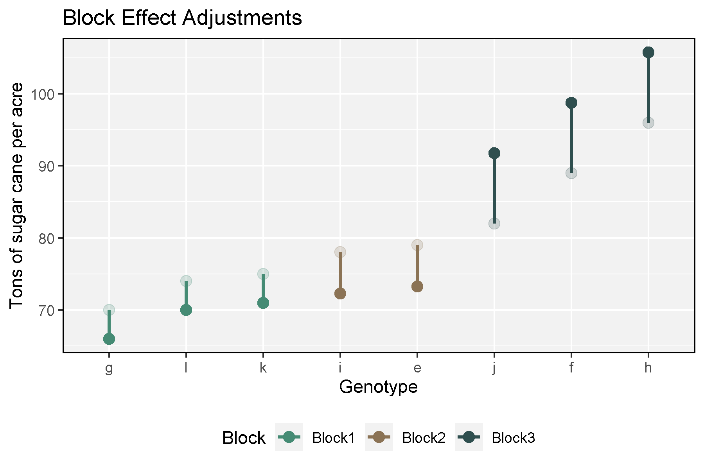

We can also do this with the `R` package [agumentedRCBD](https://aravind-j.github.io/augmentedRCBD/index.html) which contains a function `augmentedRCBD` that can carry make these adjustments.

```{r}
library(augmentedRCBD) # devtools::install_github("aravind-j/augmentedRCBD")
xx <- xx %>% mutate(Block = factor(Block), Genotype = factor(Genotype))
out <- augmentedRCBD(block = xx$Block, treatment = xx$Genotype, y = xx$Yield, 
                     checks = c("A", "B", "C", "D"), group = F)
out[[2]] # Adjusted Means
out[[5]] # Block Effects
out[[6]] # Genotype Effects
out[[7]] # Standard Errors 
out[[8]] # Overal Mean
out[[9]] # CV
```

```{r echo = F, eval = T}
adjMeans <- select(out[[2]], Genotype=Treatment, Means, Min, Max, `Adjusted Means`)
xx <- xx %>% 
  left_join(adjMeans, by = "Genotype") %>%
  mutate(BlockEffect = ifelse(Type == "Treatment", 
           Yield - `Adjusted Means`, Yield - Means))
xc <- xx %>% filter(Type == "Check")
xt <- xx %>% filter(Type == "Treatment")
mn <- min(xx$Yield, xx$Treatment)
mx <- max(xx$Yield, xx$Treatment)
mp <- ggplot(xx, aes(x = Yield, y = `Adjusted Means`, color = Block, alpha = Type)) + 
  geom_abline() + 
  geom_segment(data = xt, aes(xend = Yield, yend = Yield)) +
  geom_point(aes(shape = Type), size = 6) +
  geom_text(aes(label = Genotype), color = "black") + 
  scale_color_manual(name = NULL, values = mycolors) +
  scale_shape_manual(values = c(15,16), guide = F) +
  scale_alpha_manual(values = c(0.5,0.85), guide = F) +
  theme_dblogr(legend.position = "bottom") +
  ylim(c(mn,mx)) + xlim(c(mn,mx)) +
  labs(title = "Tons of sugar cane per acre")
ggsave("Aug_01_06.png", mp, width = 6, height = 4)
yy <- xx %>% 
  gather(Trait, Value, Yield, `Adjusted Means`) %>%
  mutate(Trait = factor(Trait, levels = c("Yield", "Adjusted Means")))
mp <- ggplot(yy, aes(x = Trait, y = Value)) + 
  geom_line(aes(color = Type, group = Genotype, size = Type, alpha = 0.5)) + 
  geom_text(aes(label = Genotype), size = 5) + 
  facet_grid(.~Block) +
  scale_color_manual(values = c("darkgreen", "darkred")) +
  scale_size_manual(values = c(0.5,1.5)) +
  theme_dblogr(legend.position = "none") +
  labs(title = "Tons of sugar cane per acre", x = NULL, y = NULL)
ggsave("Aug_01_07.png", mp, width = 6, height = 4)
mp <- ggplot(xt, aes(x = "", y = Row)) + 
  geom_tile(aes(fill = BlockEffect), color = "black", alpha = 0.75) + 
  geom_text(aes(label = paste(Genotype, round(BlockEffect, 2), sep = " = "))) +
  geom_text(data = xc, aes(label = Genotype)) +
  facet_grid(.~Block) +
  scale_fill_gradient(low = "darkgreen", high = "darkred") +
  scale_y_reverse() +
  theme_dblogr(legend.position = "none",
               axis.text.y = element_blank()) +
  labs(title = "Block Effects", y = NULL, x = NULL)
ggsave("Aug_01_08.png", mp, width = 6, height = 4)
yy <- out[[2]] %>% arrange(Means) %>% 
  mutate(Treatment = factor(Treatment, levels = Treatment),
         Block = ifelse(Treatment %in% c("A","B","C","D"), "Check", Block),
         Type = ifelse(Treatment %in% c("A","B","C","D"), "Checks", "Treatments"),
         Min = ifelse(!Treatment %in% c("A","B","C","D"), `Adjusted Means`, Min),
         Max = ifelse(!Treatment %in% c("A","B","C","D"), Means, Max))
mp <- ggplot(yy, aes(x = Treatment, y = `Adjusted Means`, color = Block)) + 
  geom_point() + geom_errorbar(aes(ymin = Min, ymax = Max), width = 0) +
  facet_grid(.~Type, scales = "free_x", space = "free_x") +
  scale_color_manual(values = mycolors) +
  theme_dblogr(legend.position = "none") +
  labs(title = "Adjustments", y = "Yield")
ggsave("Aug_01_09.png", mp, width = 6, height = 4)
yy <- out[[2]] %>% rename(Genotype=Treatment) %>%
  filter(!Genotype %in% c("A","B","C","D")) %>%
  arrange(Means) %>% 
  mutate(Genotype = factor(Genotype, levels = Genotype))
mp <- ggplot(yy, aes(x = Genotype, color = Block)) + 
  geom_point(aes(y = Means), size = 3, alpha = 0.2) +
  geom_point(aes(y = `Adjusted Means`), size = 3) + 
  geom_errorbar(aes(ymin = Means, ymax = `Adjusted Means`), size = 1, width = 0) +
  #facet_grid(.~Type, scales = "free_x", space = "free_x") +
  scale_color_manual(values = dblogr_Colors[c(10,11,7)]) +
  theme_dblogr(legend.position = "bottom") +
  labs(title = "Adjustments", y = "Yield")
ggsave("Aug_01_10.png", mp, width = 6, height = 4)
```

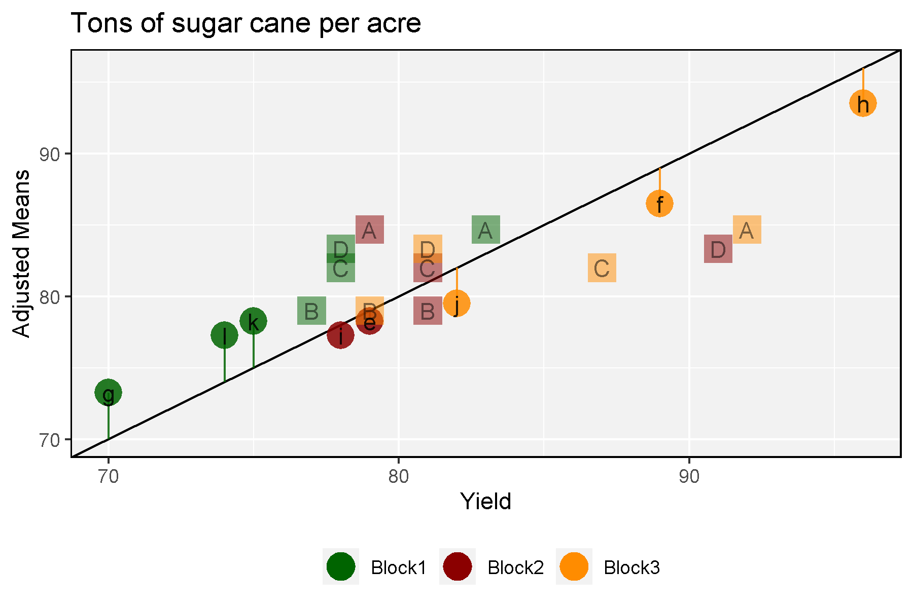

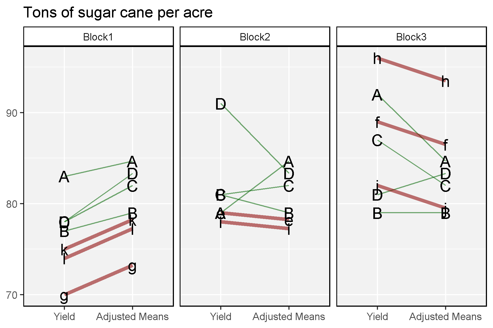

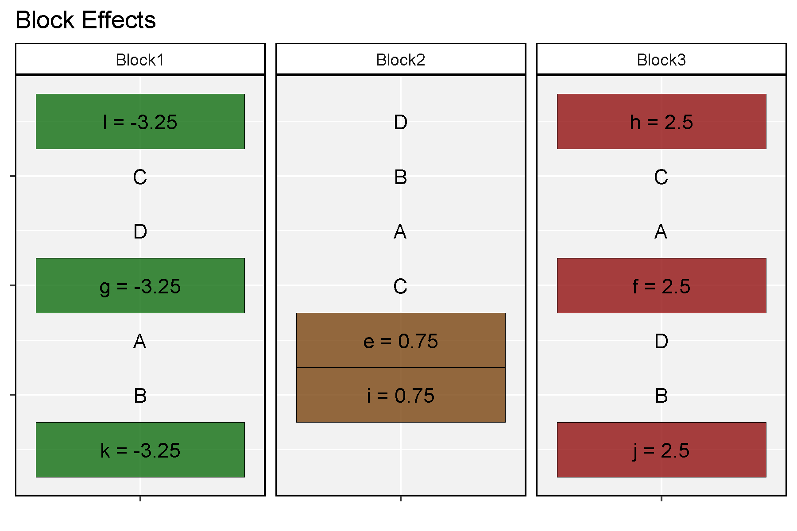

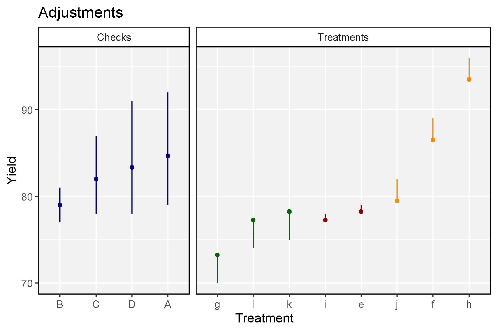

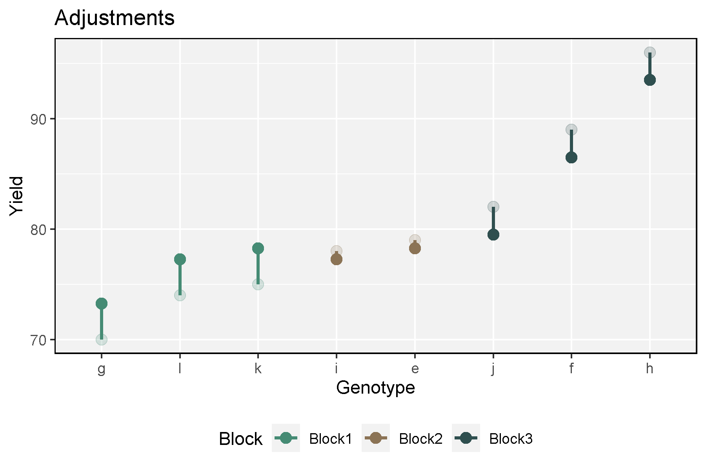

To help better understand, lets do these calculations ourselves.

Calculate block effects:

$$b_i=\frac{1}{n_c}*\left(\sum{y}_{bi}-\sum{\bar{y}}_c-\sum{y}_{ti}\right)$$

- $b_i$ = block effect
- $n_c$ = number of check varieties
- $\sum{y}_{bi}$ = sum of all measurements within block
- $\sum{\bar{y}}_c$ = sum of check means
- $\sum{y}_{ti}$ = measurement for individual treatment within block

Block1 effects:

$$b_1=\frac{1}{4}*\left(535-329-219\right)=-3.25$$

$$\sum{y}_{b1}=74+78+78+70+83+77+75=535$$

$$\sum{\bar{y}}_c=84.67+79.00+82.00+83.33=329$$

$$\sum{y}_{t1}=74+70+75=219$$

```{r}
# Data prep
y_c <- xx %>% filter(Genotype %in% c("A","B","C","D")) %>%
  group_by(Genotype) %>% summarise(Mean = mean(Yield))
y_c
# Block1 effects
y_t1 <- xx$Yield[xx$Block=="Block1" & xx$Type=="Treatment"]
y_b1 <- xx$Yield[xx$Block=="Block1"]
b1 <- ( 1/4 ) * ( sum(y_b1, -y_c$Mean, -y_t1) ) 
# Block2 effects
y_t2 <- xx$Yield[xx$Block=="Block2" & xx$Type=="Treatment"]
y_b2 <- sum(xx$Yield[xx$Block=="Block2"])
b2 <- ( 1/4 ) * ( sum(y_b2, -y_c$Mean, -y_t2) ) 
# Block3 effects
y_t3 <- xx$Yield[xx$Block=="Block3" & xx$Type=="Treatment"]
y_b3 <- sum(xx$Yield[xx$Block=="Block3"])
b3 <- ( 1/4 ) * ( sum(y_b3, -y_c$Mean, -y_t3) ) 
bb <- data.frame(Block = c("Block1","Block2","Block3"),
                 Block_Effect = c(b1, b2, b3))
bb
```

Calculate mean effect

$$m=\frac{1}{n_c+n_t}*\left(\sum{y}-(n_b-1)*\sum{\bar{y}}_c-\sum{(b_i*n_{ti})}\right)$$

- $m$ = mean effect
- $n_t$ = number of treatments (test varieties)
- $\sum{y}$ = sum of all measurements
- $n_ti$ = number of treatments (test varieties) wintin block
- $n_b$ = number of blocks

$$m=\frac{1}{4+8}*\left(1630-(3-1)*329-(-0.75)\right)=81.0625$$

$$\sum{y}=74+78+78...81+79+82=1630$$

$$\sum{(b_i*n_{ti}})=\left(3*(-3.25)+2*(0.75)+3*(2.5)\right)=-0.75$$

```{r}
m <- ( 1/(4+8) ) * ( sum(xx$Yield) - (3 - 1) * sum(y_c$Mean) - sum(3 * b1 + 2 * b2 + 3 * b3) )
m
```

Calculate genotype effects

```{r}
xx <- xx %>% 
  left_join(y_c, by = "Genotype") %>%
  left_join(bb, by = "Block") %>%
  mutate(AdjMean = ifelse(Type == "Treatment", Yield - BlockEffect, Mean),
         GenotypeEffect = AdjMean - m)
```

The sum of block effects should add to zero, along with the sum of check effects and treatment effects

```{r}
sum(bb$BlockEffect)
checkEffects <- unique(xx$GenotypeEffect[xx$Type == "Check"])
treatmentEffects <- xx$GenotypeEffect[xx$Type == "Treatment"]
sum(checkEffects, treatmentEffects)
```

Calculate total sum of squares

$$SS_t=\sum{y}^2-\frac{(\sum{y})^2}{n}=133652-\frac{1630^2}{20}=807$$

```{r}
sum(xx$Yield^2) - (sum(xx$Yield)^2 / 20)
```

$n_g$ = number of genotypes

$$SS_t=1630^2$$

# Modified Type II design

Modified augmented design (type II) was developed to account for row and column and heterogeneity.  

Table S1 – The raw phenotypic data of a population with 243 RILs derived from a cross between ‘CDC Bethune’ and ‘Macbeth’ (BM) for the case study.

[download data set](https://data.nal.usda.gov/dataset/data-estimation-genetic-parameters-and-their-sampling-variances-quantitative-traits-type-2-modified-augmented-design)

[Paper](https://www.sciencedirect.com/science/article/pii/S2214514116000179)


```{r}
checks <- data.frame(Check = c("Check1","Check2","Check3"),
                     Name = c("CDC Bethune","Hanley","Macbeth"))
dd <- read_xlsx("ExampleData.xlsx", "MAD2") %>% 
  rename(MainCheck=`Cp (plot control)`, SubCheck=`Csp (sub-plot control)`) %>%
  mutate(#Type = ifelse(Genotype %in% checks$Name, Genotype, "Treatment"),
         #Type = plyr::mapvalues(Type, checks$Name, checks$Check),
         Type = ifelse(MainCheck == 1, "Check1", "Treatment"),
         Type = ifelse(SubCheck == 1, "Check2", Type),
         Type = ifelse(SubCheck == 2, "Check3", Type),
         Type = factor(Type, levels = c("Treatment","Check1","Check2","Check3")),
         Block = paste0(Row, Col),
         Block = plyr::mapvalues(Block, c(11:17,21:27,31:37,41:47,51:57,61:67,71:77), 1:49),
         Block = factor(Block, levels = 1:49)) %>%
  as.data.frame()
#
expt <- "M2009"
gg_Fieldplan <- function(xx, expt) {
  xi <- xx %>% filter(Environment == expt)
  mp <- ggplot(xi, aes(x = 1, y = SubPlotNum)) + 
    geom_tile(aes(fill = Type), color = "black", alpha = 0.5) + 
    geom_text(aes(label = Genotype)) +
    facet_grid(Row~Col) +
    scale_fill_manual(values = c("white","darkred","darkblue","darkgreen")) +
    scale_y_reverse() + 
    labs(title = paste(expt, "- Field plan")) +
    theme_dblogr(axis.text = element_blank(), axis.ticks = element_blank(),
                 strip.text.x = element_blank(), legend.position = "none")
  ggsave(paste0("Aug_02_01_", expt, ".png"), mp, width = 20, height = 20)
}
unique(dd$Environment)
gg_Fieldplan(dd, "M2009")
gg_Fieldplan(dd, "M2010")
gg_Fieldplan(dd, "M2011")
gg_Fieldplan(dd, "M2012")
gg_Fieldplan(dd, "S2009")
gg_Fieldplan(dd, "S2010")
gg_Fieldplan(dd, "S2011")
gg_Fieldplan(dd, "S2012")
x4 <- dd %>% filter(Genotype == "CDC Bethune")
x5 <- dd %>% filter(Genotype %in% c("Hanley","Macbeth"))
```

```{r eval = F}
#
x1 <- dd %>% filter(Environment == "M2009")
length(4001:4343)
7*7*7
mp <- ggplot(x1, aes(x = 1, y = SubPlotNum)) + 
  geom_tile(fill = NA, color = "black") + 
  geom_text(aes(label = Plot)) +
  facet_wrap(Row~Col, scales = "free") +
  scale_y_reverse() +
  theme_dblogr(axis.text = element_blank(), axis.ticks = element_blank(),
               strip.text.x = element_blank(), legend.position = "none")
ggsave("test1.png", mp, width = 20, height = 20)
mp <- ggplot(x1, aes(x = 1, y = SubPlotNum)) + 
  geom_tile(aes(fill = Type), color = "black") + 
  geom_text(aes(label = Genotype)) +
  facet_wrap(Row~Col, scales = "free") +
  scale_y_reverse() +
  theme_dblogr(axis.text = element_blank(), axis.ticks = element_blank(),
               strip.text.x = element_blank(), legend.position = "none")
ggsave("test2.png", mp, width = 20, height = 20)
mp <- ggplot(x1, aes(x = 1, y = Plot)) + 
  geom_tile(aes(fill = Yield), color = "black") + 
  geom_text(aes(label = Yield)) +
  facet_wrap(Row~Col, scales = "free") +
  scale_y_reverse() +
  scale_fill_continuous(low = "white", high = "darkred") +
  theme_dblogr(axis.text = element_blank(), axis.ticks = element_blank(),
               strip.text.x = element_blank(), legend.position = "none")
ggsave("test3.png", mp, width = 20, height = 20)
x2 <- x1 %>% filter(Type == "Check1") %>% arrange(Yield) 
x2 <- x1 %>% mutate(Block = factor(Block, levels = unique(x2$Block)))
#x2 <- xx %>% filter(Environment == "M2009", Type == "Check") %>% 
#  mutate(Block = factor(Block, levels = x2$Block))
mp <- ggplot(x2, aes(x = Block, y = Yield, color = Type, pch = Type)) + 
  geom_beeswarm() +
  scale_color_manual(values = c("darkgreen", "darkred","darkblue", "Black"))
ggsave("test4.png", mp, width = 15, height = 6)
x3 <- x2 %>% filter(Type != "Treatment")
mp <- ggplot(x2, aes(x = Block, y = Yield, color = Type, pch = Type)) + 
  geom_beeswarm() +
  geom_line(data = x3, aes(group = Type)) +
  scale_color_manual(values = c("darkgreen", "darkred","darkblue", "Black"))
ggsave("test5.png", mp, width = 15, height = 6)


```

Method I (adjustment by design structure)

$$Y`_{ij(k)}=Y_{ij(k)}-R_i-C_j$$

$$R_i=\sum^{c}_{ij}X_{ij(A)}/c-\bar(X)_A$$

$$C_j=\sum^{r}_{ij}X_{ij(A)}/r-\bar(X)_A$$


$$\bar(X)_A=\sum_i}\sum_jX_{ij(A)}/rc$$ 

Method II


Method II (adjustment by regression)

$Y`$

Other...

Method I

$$m_a=y_{rc}-(\bar{c}_r-\bar{c})-(\bar{c}_c-\bar{c})$$

- $m_a$ = Adjusted mean
- $y_{rc}$ = Raw data of plot in row $_r$ and column $_c$
- $\bar{c}$ = Mean of all check1
- $\bar{c}_r$ = Mean of check1 in row $_r$
- $\bar{c}_c$ = Mean of check1 in column $_c$

Method III

$$m_a=y_{rc}-slope*(\bar{c}_r-\bar{c})-(\bar{c}_c-\bar{c})=y_{rc}-\bar{c}_r-\bar{c}_c-2\bar{c}$$

```{r}
x1 <- dd %>% filter(Environment == "M2009")
#
xx <- x1
trait <- "Yield"
MAD2_M1 <- function(xx, trait) {
  yy <- rep(NA,nrow(xx))
  xc <- xx %>% filter(Type == "Check1")
  for(i in 1:nrow(xx)) {
    yrc <- xx[i,trait]
    c_m <- mean(xc %>% pull(trait), na.rm = T)
    c_r <- mean(xc %>% filter(Row == xx%>%slice(i)%>%pull("Row")) %>% pull(trait), na.rm = T)
    c_c <- mean(xc %>% filter(Col == xx%>%slice(i)%>%pull("Col")) %>% pull(trait), na.rm = T)
    yy[i] <- yrc - (c_r - c_m) - (c_c - c_m)
  }
  yy
}
xx <- xx %>% mutate(Yield_adj_M1 = MAD2_M1(., "Yield"))
ggplot(xx, aes(x = Yield, y = Yield_adj_M1)) + geom_point()
```

```{r}
#library(lme4)
xx <- read_xlsx("ExampleData.xlsx", "Type2")
fit <- lm(Check23Avg ~ Check1, data = xx)
#fit <- lm(Check1 ~ Check23Avg, data = xx)
fit
mean(xx$Check1)
```

```{r}
xx <- read_xlsx("ExampleData.xlsx", "LongRows")
xr <- xx %>% group_by(Name, Row) %>% summarise(Mean = mean(Unadj))
xc <- xx %>% group_by(Name, Col) %>% summarise(Mean = mean(Unadj))
xb <- xx %>% group_by(Block) %>% summarise(Mean = mean(Unadj))
xg <- xx %>% group_by(Name) %>% summarise(Mean = mean(Unadj))
# Row 3 Colum 1
23.8 - 23.8 - 23.8 + (2*25.45)
23.8 - (23.8-25.45) - (23.8-25.45)
x1 <- xx %>% select(Block, Row, Col, Name, Unadj) %>% spread(Name, Unadj) %>%
  mutate(BC = (B + C) / 2)
fit <- lm(BC ~ A, data = x1)
fit
23.8 - 1.171*(23.8-25.45)
```

# Load Dataset 1 

- `Entry`: 1 Lentil Genotype
- `Expt`: 18 Site-years
- `DTF`: Days from sowing to flower
- `DTM`: Days from sowing to swollen pod
- `DTM`: Days from sowing to maturity
- `RDTF`: Rate of progress towards fowering

```{r}
# Prep data
d19 <- read_xlsx("NAM_2019_Sutherland.xlsx", "Measurements")
d20 <- read_xlsx("NAM_2020_Sutherland.xlsx", "Measurements")
#
checks <- d19 %>% filter(Generation == "Check", Block == 1) %>%
  select(Name, Check = Population) %>% arrange(Check)
#
d19 <- d19 %>% 
  filter(!is.na(Block)) %>%
  mutate(Name = plyr::mapvalues(Name, checks$Name, checks$Check),
         Selected = ifelse(Name %in% d20$Name, "Yes", "No"),
         VEG = DTF - DTE,
         REP = DTM - DTF)
sum(is.na(d19$Name))
sum(is.na(d19$Block))
sum(is.na(d19$DTF))
# Preview data
# knitr::kable(dd[1:10])
# dd$Comments[is.na(dd$DTT)]
```

```{r}
#checks <- as.character(unique(xx$Name[xx$Generation=="Check"]))
#
#summary(xx$Name)
#sum(is.na(xx$Name))
#sum(is.na(xx$Block))
#sum(is.na(xx$DTF))
```

# Analysis

... To Be Continued ...

```{r eval = T}
trait <- "DTF"
checks <- paste0("Check", 1:6)
xx <- d19 %>% rename(Trait=trait) %>% filter(!is.na(Trait)) %>% # Block %in% 1:3, ,  | Name %in% lines
  mutate(Block = factor(Block), Name = factor(Name))
#
out <- augmentedRCBD(block = xx$Block, treatment = xx$Name, y = xx$Trait, checks = checks, 
                     console = F, group = F)
zz <- xx %>% left_join(select(out[[2]], Name=Treatment, Means, `Adjusted Means`), by = "Name")
#
c_mean <- mean(zz$Trait[zz$Generation == "Check"])
zc <- zz %>% filter(Name %in% checks)
zcm <- zc %>% group_by(Name) %>% summarise(Trait = mean(Trait)) %>% mutate(Diff = Trait - c_mean)
zbm <- zc %>% group_by(Block) %>% summarise(Trait = mean(Trait)) %>% mutate(Diff = Trait - c_mean)
#
zz <- zz %>%
  mutate(Type = ifelse(Name %in% checks, as.character(Name), "Line"),
         Diff = Trait - `Adjusted Means`,
         cMean = ifelse(Generation == "Check", as.character(Name), NA),
         cMean = plyr::mapvalues(cMean, as.character(zcm$Name), as.character(zcm$Trait)),
         cMean = as.numeric(as.character(cMean)),
         AdjMean = ifelse(Generation == "Check", cMean, Trait - Diff))
#
tot_avg <- mean(xx$Trait)
# Checks
ggplot(zc, aes(x = Name, y = Trait, color = Name)) + 
  geom_beeswarm() + geom_point(data = zcm, color = "black") 
# Checks by Block
ggplot(zc, aes(x = Block, y = Trait, color = Name)) + 
  geom_beeswarm() + geom_point(data = zbm, color = "black") +
  #geom_line(aes(group = Name)) +
  geom_hline(yintercept = tot_avg)
# Blocks 
ggplot(zz, aes(x = Block, y = `Adjusted Means`, color = Type)) + geom_point()
# Trait vs means
ggplot(zz, aes(x = Trait, y = Means, color = Type)) + geom_point()
# Trait vs Adjusted Means
# ggplot(zc, aes(x = Trait, y = `Adjusted Means`, color = Type)) + geom_point() + geom_abline()
ggplot(zz, aes(x = Trait, y = `Adjusted Means`, color = Type)) + geom_point() + geom_abline() 
# adjustment by block
ggplot(zz, aes(x = Trait, y = Diff, color = Type)) + 
  geom_hline(yintercept = 0) + 
  geom_point() + facet_wrap(Block ~ ., ncol = 5)
#
ggplot(zz, aes(x = `Adjusted Means`, y = AdjMean, color = Type)) + geom_point()
#
xc <- zz %>% filter(Block == 1, Generation == "Check")
xcmean <- mean(xc$Trait)
xmean <- mean(zz$Trait[zz$Generation == "Check"])
round(xcmean - xc$Trait,2)
round(xmean - xc$Trait,2)
(-1.6666667) + (0.3333333) + (3.3333333)+(-1.6666667)+(-2.6666667)+2.3333333
0.33+0.33+2.33
1.67+1.67+2.67

2.67+0.67+2.67+3.67
2.33+1.33
mean(xmean - xc$Trait)
out[[5]]
```

```{r eval = F}
ggplot(xx, aes(x = ))
```


```{r eval = T}
xx<-d19
trait <- "DTF"
checks <- paste0("Check", 1:6)
augRCBD_analysis <- function(xx, trait) {
  xi <- xx %>% rename(Trait=trait) %>% filter(!is.na(Trait)) %>% # Block %in% 1:3, ,  | Name %in% lines
    mutate(Block = factor(Block), Name = factor(Name))
  #
  out <- augmentedRCBD(block = xi$Block, treatment = xi$Name, y = xi$Trait, checks = checks, 
                       console = F, group = F)
  #
  out2 <- out[[2]]
  colnames(out2)[c(1,3,6,7,8)] <- c("Name", paste0("means_", trait), paste0("min_", trait),
                                    paste0("max_", trait), paste0("Adj_", trait))
  out2[,c(1,3,6,7,8)] 
}
xx <- d19 %>%
  left_join(augRCBD_analysis(d19, "DTE"), by = "Name") %>%
  #left_join(augRCBD_analysis(dd, "DTT"), by = "Name") %>%
  left_join(augRCBD_analysis(d19, "DTF"), by = "Name") %>%
  left_join(augRCBD_analysis(d19, "DTS"), by = "Name") %>%
  left_join(augRCBD_analysis(d19, "DTM"), by = "Name") %>%
  left_join(augRCBD_analysis(d19, "DTH"), by = "Name") %>%
  left_join(augRCBD_analysis(d19, "VEG"), by = "Name") %>%
  left_join(augRCBD_analysis(d19, "REP"), by = "Name")
#
xm <- xx %>% group_by(Population) %>% summarise(Mean = mean(Adj_DTF, na.rm = T)) %>% arrange(Mean)
xr <- xm %>% filter(!Population %in% checks) %>% mutate(Mean = xm$Mean[xm$Population == "Check1"])
xp <- xx %>% filter(Generation == "Parent2", Name != "PI 426797-1") %>% arrange(Adj_DTF)
x2 <- xx %>% filter(!Name %in% checks) %>% 
  mutate(Population = factor(Population, levels = paste0("NAM-", 1:35)),
         Alpha = ifelse(Name %in% c(d20$Name, checks), "Yes","No"))
ggplot(x2, aes(x = Population, y = DTF)) + 
  geom_quasirandom() + 
  geom_point(data = xr, aes(y = Mean), color = "Red") +
  geom_point(data = xp, color = "darkorange") +
  theme_dblogr(rotx = T)
ggsave("adj_DTF1.png",width = 10, height = 4)
ggplot(x2, aes(x = Population, y = Adj_DTF)) + 
  geom_quasirandom() + 
  geom_point(data = xr, aes(y = Mean), color = "Red") +
  geom_point(data = xp, color = "darkorange") +
  theme_dblogr(rotx = T)
ggsave("adj_DTF2.png",width = 10, height = 4)
ggplot(x2, aes(x = Population, y = Adj_DTF)) + 
  geom_quasirandom(aes(alpha = Alpha)) + 
  geom_point(data = xr, aes(y = Mean), color = "Red") +
  geom_point(data = xp, color = "darkorange") +
  theme_dblogr(legend.position = "none", rotx = T)
ggsave("adj_DTF3.png", width = 10, height = 4)
ggplot(x2, aes(x = Population, y = DTF)) + 
  geom_quasirandom(aes(alpha = Alpha)) + 
  geom_point(data = xr, aes(y = Mean), color = "Red") +
  geom_point(data = xp, color = "darkorange") +
  theme_dblogr(legend.position = "none", rotx = T)
ggsave("adj_DTF3.2.png", width = 10, height = 4)
ggplot(x2, aes(x = Population, y = Adj_REP)) + 
  geom_quasirandom(aes(alpha = Alpha)) + 
  geom_point(data = xr, aes(y = Mean), color = "Red") +
  geom_point(data = xp, color = "darkorange") +
  theme_dblogr(rotx = T)
ggsave("adj_DTF4.png",width = 10, height = 4)
ggplot(x2, aes(x = 1, y = Adj_DTF)) + 
  geom_quasirandom() + 
  geom_point(data = xr, aes(y = Mean), color = "Red") +
  geom_point(data = xp, color = "darkorange") +
  facet_wrap(.~Population, ncol = 5, scales = "free_x") +
  theme_dblogr(axis.text.x = element_blank())
ggsave("adj_DTF5.png",width = 10, height = 10)
```


```{r eval = F}
# zc2 <- zz %>% filter(Generation == "Check") %>% group_by(Block) %>% summarise(Mean = mean(Diff))
# zc2 <- zz %>% filter(Generation == "Check") %>% select(Name, Block, Trait, Means, `Adjusted Means`)
# zt <- zz %>% filter(Generation == "Check", Block == 1) %>% mutate(Diff = Trait - tot_avg)
#mean(zt$Diff)
#xi <- xx %>% filter(Block == 1)
#ggplot(xi, aes(x = , ))
```


```{r eval = F}
xx <- d19 %>% filter(!is.na(DTF)) %>% mutate(Name = as.character(Name))
aa <- lm(DTF ~ Block + Name, data = xx)
a1 <- data.frame(Name = colnames(aa[[7]]$qr), assign = aa[[6]], Coef = coef(aa)) 
a1 <- a1 %>% filter(assign == 1) %>% 
  separate(Name, c("Name", "Block"), sep = "k") %>% 
  select(Block, Coef) %>% bind_rows(c(15, -sum(a1$Coef)))

a2 <- data.frame(Name = aa$model$Name, Residuals = aa$residuals, Effects = aa$effects, Fitted = aa$fitted.values) #2151
#
a3 <- xx %>% left_join(a2, by = "Name") %>% left_join(a1, "Block") %>%
  mutate(AdjMean = ifelse(Generation != "Check", Fitted - Coef, NA)) %>%
  select(Plot, Name, DTF, Fitted, AdjMean, Coef, Residuals, Effects)
for(i in checks) {
  mn <- mean(a3 %>% filter(Name == i) %>% pull(DTF))
  a3 <- a3 %>% mutate(AdjMean2 = ifelse(Name == i, mn, AdjMean))
}
a4 <- zz %>% left_join(a3, by = "Plot")
a5 <- a4 %>% filter(Generation == "Check")
a6 <- a4 %>% mutate(test = round(AdjMean2 - `Adjusted Means`, 1))
ggplot(a4, aes(x = AdjMean2, y = `Adjusted Means`)) + geom_point()
```


```{r eval = F}
aa <- aov(DTF ~ Block + Name, data = dd )
#coef(aa)
aa <- lm(DTF ~ Block + Name, data = dd %>% filter(Generation == "Check"))
#coef(aa) 
bb<- residuals(aa)
#fitted.values(aa)
bb <- data.frame(Name = aa$xlevels$Name, aa$residuals)
bb <- dd %>% mutate(Residuals = residuals(aa))
ggplot(dd, aes(x = DTF, y = residuals(aa))) + geom_point()
```


```{r eval = F}
checks <- c("Check1", "Check2", "Check3", "Check4", "Check5", "Check6")
xx <- dd %>% filter(!is.na(DTF)) %>% # Block %in% 1:3, ,  | Name %in% lines
  select(Block, Name, DTF) %>%
  mutate(Block = factor(Block), Name = factor(Name))
#
out1 <- augmentedRCBD(block = xx$Block, treatment = xx$Name, y = xx$DTF, group = F, method.comp = "lsd",
              checks = c("Check1", "Check2", "Check3", "Check4", "Check5", "Check6"))
#
out2 <- augmentedRCBD(block = xx$Block, treatment = xx$Name, y = xx$DTF, group = F, method.comp = "tukey",
              checks = c("Check1", "Check2", "Check3", "Check4", "Check5", "Check6"))
#
out3 <- augmentedRCBD(block = xx$Block, treatment = xx$Name, y = xx$DTF, group = F, method.comp = "none",
              checks = c("Check1", "Check2", "Check3", "Check4", "Check5", "Check6"))
#
out1;out2;out3
out1[[5]];out2[[5]];out3[[5]]
out1[[6]]
#
ad <- xx %>% 
  left_join(select(out1[[2]], Name=Treatment, Means, Ad_Mean1=`Adjusted Means`), by = "Name") %>%
  left_join(select(out2[[2]], Name=Treatment, Ad_Mean2=`Adjusted Means`), by = "Name") %>%
  left_join(select(out3[[2]], Name=Treatment, Ad_Mean3=`Adjusted Means`), by = "Name") %>% 
  mutate(Type = ifelse(Name %in% checks, as.character(Name), "Line"))
mp0 <- ggplot(ad, aes(x = DTF, y = Means, color = Type)) +
  geom_abline() + geom_point()
mp1 <- ggplot(ad, aes(x = DTF, y = Ad_Mean1, color = Type)) +
  geom_abline() + geom_point()
mp2 <- ggplot(ad, aes(x = DTF, y = Ad_Mean1, color = Type)) +
  geom_abline() + geom_point()
mp3 <- ggplot(ad, aes(x = DTF, y = Ad_Mean1, color = Type)) +
  geom_abline() + geom_point()
ggpubr::ggarrange(mp0,mp1,mp2,mp3, ncol=4, common.legend = T)
```


```{r eval = F}

xx <- dd %>% filter(!is.na(DTF),Block %in% 1:2, grepl("NAM", Name) | Name %in% checks) %>% # Block %in% 1:3, ,  | Name %in% lines
  select(Block, Name, DTF) %>%
  mutate(Block = factor(Block), Name = factor(Name))
out <- augmentedRCBD(block = xx$Block, treatment = xx$Name, y = xx$DTF,
              checks = c("Check1", "Check2", "Check3", "Check4", "Check5", "Check6"))


lines <- c("Check1", "Check2", "Check3", "Check4", "Check5", "Check6",
           "NAM-1-1","NAM-1-2","NAM-1-4","NAM-1-5","NAM-1-20","NAM-1-40",
           "NAM-2-20","NAM-2-25","NAM-2-60","NAM-2-86","NAM-2-110",
           "NAM-3-50","NAM-3-60","NAM-3-70","NAM-3-81","NAM-3-90","NAM-3-100")
# grepl("NAM", dd$Generation)
xx <- dd %>% filter(!is.na(DTF), Block %in% 1:3, Name %in% lines) %>% #  , grepl("NAM", Generation) | 
  select(Block, Name, DTF) %>%
  mutate(Block = factor(Block), Name = factor(Name))
out <- augmentedRCBD(block = xx$Block, treatment = xx$Name, y = xx$DTF,
              checks = c("Check1", "Check2", "Check3", "Check4", "Check5", "Check6"))
#
xx <- dd %>% filter(!is.na(DTF), grepl("NAM", Generation) | Name %in% checks) %>% #  ,  | 
  select(Block, Name, DTF) %>%
  mutate(Block = factor(Block), Name = factor(Name))
out <- augmentedRCBD(block = xx$Block, treatment = xx$Name, y = xx$DTF,
              checks = c("Check1", "Check2", "Check3", "Check4", "Check5", "Check6"))

#

xx <- dd %>% filter(!is.na(DTF), Block %in% 10:13, grepl("NAM", Name) | Name %in% checks) %>% #  ,  | 
  select(Block, Name, DTF) %>%
  mutate(Block = factor(Block), Name = factor(Name))
out <- augmentedRCBD(block = xx$Block, treatment = xx$Name, y = xx$DTF,
              checks = c("Check1", "Check2", "Check3", "Check4", "Check5", "Check6"))


out <- augmentedRCBD(block = xx$Block, treatment = xx$Name, y = xx$DTF)
#
summary(xx$Name)
#
length(xx$Block)
length(xx$Name)
length(xx$DTF)
sum(is.na(xx$Block))
sum(is.na(xx$Name))
sum(is.na(xx$DTF))
```


```{r eval = F}
xx <- dd %>% filter(Block ==1)
xx
```


```{r eval = F}
augmentedRCBD <- function(block, treatment, y, checks = NULL,
                          method.comp = c("lsd", "tukey", "none"),
                          alpha=0.05, group=TRUE, console = TRUE,
                          simplify = FALSE, truncate.means = TRUE) {
  # Checks
  # block
  if (!is.factor(block)) {
    stop('"block" should be of class "factor"')
  }
  # treatment
  if (!is.factor(treatment)) {
    stop('"treatment" should be of class "factor"')
  }
  # y
  if (!(is.vector(y, mode = "integer") | is.vector(y, mode = "numeric"))) {
    stop('"y" should be a vector of class "numeric" or "integer"')
  }
  if (!(length(y) == length(treatment) && length(treatment) == length(block))) {
    stop('"block", "treatment" and "y" are of unequal lengths')
  }
  if (TRUE %in% is.na(y)) { # check for missing values
    stop('"y" has missing value(s)')
  }
  # alpha
  if (!(0 < alpha && alpha < 1)) {
    stop('"alpha" should be between 0 and 1 (0 < alpha < 1)')
  }
  # method.comp
  method.comp <- match.arg(method.comp, c("lsd", "tukey", "none"),
                           several.ok = FALSE)
  if (method.comp == "none") group <- FALSE
  if (group == FALSE) method.comp <- "none"

  if (!missing(checks) && !is.null(checks)) {
  #if (!is.null(checks)) {
    checks <- as.character(checks)
    # checks are present in treatment levels
    if (FALSE %in% c(checks %in% levels(treatment))) {
      miss <- paste(checks[!(checks %in% levels(treatment))], collapse = ", ")
      stop(paste("Following check(s) are not present in treatment levels:\n",
                    paste(miss, collapse = ", ")))
    }
  }

  # Fix treatment order so that checks are in the beginning
  if (!missing(checks) && !is.null(checks)) { # i.e. checks are specified
  #if (!is.null(checks)) {
    treatmentorder <- data.frame(table(treatment, block))
    treatmentorder[treatmentorder$Freq != 0, ]$Freq <- 1
    treatmentorder <- reshape2::dcast(treatmentorder, treatment ~ block,
                                      value.var = "Freq")
    treatmentorder$Freq <- rowSums(subset(treatmentorder,
                                          select = -c(treatment)))
    treatmentorder <- treatmentorder[, c("treatment", "Freq")]

    nblocks <- length(levels(block))
    rownames(treatmentorder) <- NULL

    # check if "checks" are present in all the blocks
    if (!(all(treatmentorder[treatmentorder$treatment %in% checks, ]$Freq == nblocks))) {
      print(treatmentorder)
      stop(paste('"checks" are not replicated across all the blocks (',
                 nblocks, ')', sep = ""))
    }

    tests <- levels(treatment)[!(levels(treatment) %in% checks)]
    if (!all(table(droplevels(treatment[treatment %in% tests])) == 1)) {
      warning("Test treatments are replicated")
    }

    nworder <- c(levels(treatmentorder$treatment)[levels(treatmentorder$treatment) %in% checks],
                 tests)
    treatment <- factor(treatment, levels = nworder)

  } else {# i.e. "checks" is not specified
    treatmentorder <- data.frame(table(treatment, block))
    treatmentorder[treatmentorder$Freq != 0, ]$Freq <- 1
    treatmentorder <- reshape2::dcast(treatmentorder, treatment ~ block,
                                      value.var = "Freq")
    treatmentorder$Freq <- rowSums(subset(treatmentorder,
                                          select = -c(treatment)))
    treatmentorder <- treatmentorder[, c("treatment", "Freq")]
    treatmentorder <- treatmentorder[with(treatmentorder,
                                          order(-Freq, treatment)), ]
    nworder <- treatmentorder$treatment
    treatment <- factor(treatment, levels = treatmentorder$treatment)

    nblocks <- length(levels(block))
    rownames(treatmentorder) <- NULL

    # check if the checks can be inferred.
    # i.e. if any treatments are present in all the blocks
    if (!(nblocks %in% treatmentorder$Freq)) {
      print(treatmentorder)
      stop(paste("Checks cannot be inferred as none of the treatments are",
                 "replicated across all the blocks (",
                 nblocks, ")", sep = ""))
    }

    checks <- as.character(treatmentorder[treatmentorder$Freq == nblocks, ]$treatment)
    tests <- as.character(treatmentorder[treatmentorder$Freq != nblocks, ]$treatment)

    tests <- levels(treatment)[!(levels(treatment) %in% checks)]
    if (!all(table(droplevels(treatment[treatment %in% tests])) == 1)) {
      warning("Test treatments are replicated")
    }
  }


  r <- unique(table(treatment))
  b <- nlevels(block) # no. of blocks
  ntr <- nlevels(treatment)  # no. of treatments

  blockwisechecks <- as.data.frame.matrix(table(treatment, block))
  blockwisechecks <- cbind(treatment = rownames(blockwisechecks),
                           blockwisechecks)
  blockwisechecks <- blockwisechecks[blockwisechecks$treatment %in% checks, ]
  rownames(blockwisechecks) <- NULL

  Details <- list(`Number of blocks` = b, `Number of treatments` = ntr,
                  `Number of check treatments` = length(checks),
                  `Number of test treatments` = length(tests),
                  `Check treatments` =  checks)

  tb <- data.frame(treatment, block)
  tb$block <- as.character(tb$block)
  tb$Block <- ifelse(tb$treatment %in% checks, "", tb$block)
  tb$block <- NULL
  tb <- unique(tb)

  # Get means table
  Means <- tapply(y, treatment, function(x) mean(x, na.rm = TRUE))
  mi <- tapply(y, treatment, function(x) min(x, na.rm = TRUE))
  ma <- tapply(y, treatment, function(x) max(x, na.rm = TRUE))
  n.rep <- tapply(y, treatment, function(x) length(na.omit(x)))
  sds <- tapply(y, treatment, function(x) sd(x, na.rm = TRUE))
  std.err <- sds / sqrt(n.rep)
  Means <- data.frame(Treatment = names(Means), Means, SE = std.err, r = n.rep,
                      Min = mi, Max = ma)
  Means <- merge(Means, tb, by.x = "Treatment", by.y = "treatment")
  Means <- Means[c("Treatment", "Block", "Means", "SE", "r", "Min", "Max")]

  # ANOVA 1 - `ANOVA, Treatment Adjusted`
  options(contrasts = c("contr.helmert", "contr.poly"))
  augmented.aov <- aov(y ~ block + treatment)

  df.check <- length(checks) - 1
  df.treatment <- length(levels(treatment)) - 1

  A1 <- summary(augmented.aov,
                split = list(treatment = list(Check = 1:df.check,
                                              `Test and Test vs. Check` = (df.check + 1):df.treatment)))

  # Calculate adjusted treatment effects
  options(contrasts = c("contr.sum", "contr.poly"))
  augmented3.aov <- aov(y ~ block + treatment)
  co <- coef(augmented3.aov)

  co.treatment <- co[augmented3.aov$assign == 2]
  effects.treatment <- c(co.treatment, -sum(co.treatment))
  names(effects.treatment) <- levels(treatment)
  `Overall adjusted mean` <- co[1]
  names(`Overall adjusted mean`) <- NULL

  # Calculate adjusted block effects
  co.block <- co[augmented3.aov$assign == 1]
  effects.block <- c(co.block, -sum(co.block))
  names(effects.block) <- levels(block)

  # ANOVA 2 - `ANOVA, Block Adjusted`
  contr.augmented <- function(n1, n2){
    m1 <- contr.helmert(n1)
    m2 <- contr.helmert(n2)
    m10 <- cbind(m1, matrix(0, nrow(m1), ncol(m2)))
    m02 <- cbind(matrix(0, nrow(m2), ncol(m1)), m2)
    rbind(m10, m02)
  }

  contrasts(treatment) <- contr.augmented(df.check + 1,
                                          df.treatment - df.check)
  augmented2.aov <- aov(y ~ treatment + block)
  A2 <- summary(augmented2.aov,
                split = list(treatment = list(Check = 1:df.check,
                                              Test = (df.check + 1):(df.treatment - 1),
                                              `Test vs. check` = df.treatment)))

  rownames(A1[[1]])[1] <- "Block (ignoring Treatments)         "
  rownames(A1[[1]])[2] <- "Treatment (eliminating Blocks)      "
  rownames(A1[[1]])[3] <- "  Treatment: Check                  "
  rownames(A1[[1]])[4] <- "  Treatment: Test and Test vs. Check"

  rownames(A2[[1]])[1] <- "Treatment (ignoring Blocks)   "
  rownames(A2[[1]])[2] <- "  Treatment: Check            "
  rownames(A2[[1]])[3] <- "  Treatment: Test             "
  rownames(A2[[1]])[4] <- "  Treatment: Test vs. Check   "
  rownames(A2[[1]])[5] <- "Block (eliminating Treatments)"

  # Adjusted means
  if (method.comp == "none") {
    mean.adj1 <- data.frame(mean.adj = `Overall adjusted mean` + effects.treatment[1:(df.check + 1)])
    mean.adj1$Treatment <- rownames(mean.adj1)
    mean.adj2 <- data.frame(mean.adj = `Overall adjusted mean` + effects.treatment[(df.check + 2):(df.treatment + 1)])
    mean.adj2$Treatment <- rownames(mean.adj2)
    mean.adj <- rbind(mean.adj1, mean.adj2)

    Means <- merge.data.frame(Means, mean.adj, by = "Treatment", all = TRUE)

    colnames(Means) <- c("Treatment", "Block", "Means", "SE", "r",
                         "Min", "Max", "Adjusted Means")

  } else {
    LSMeans <- emmeans::emmeans(augmented3.aov, "treatment")
    LSMeans2 <- summary(LSMeans)[, c("treatment", "emmean")]
    colnames(LSMeans2) <- c("Treatment", "Adjusted Means")

    Means <- merge.data.frame(Means, LSMeans2, by = "Treatment", all = TRUE)

    colnames(Means) <- c("Treatment", "Block", "Means", "SE", "r",
                         "Min", "Max", "Adjusted Means")
  }

  if (simplify == TRUE) {
    A1 <- data.frame(A1[[1]])
    A1 <- cbind(Source = trimws(rownames(A1)), A1)
    A2 <- data.frame(A2[[1]])
    A2 <- cbind(Source = trimws(rownames(A2)), A2)
    rownames(A1) <- NULL
    rownames(A2) <- NULL
    }

  # Grouping of treatments
  Comparison <- NULL
  Groups <- NULL


  if (group == TRUE) {
    if (method.comp == "lsd") adjust <- "none"
    if (method.comp == "tukey") adjust <- "tukey"

    Comparison <- data.frame(summary(pairs(LSMeans, adjust = adjust)))
    Groups <- data.frame(multcomp::cld(LSMeans, adjust = adjust))

    Comparison$sig <- ifelse(Comparison$p.value < 0.001, "***",
                             ifelse(Comparison$p.value < 0.01, "**",
                                    ifelse(Comparison$p.value < 0.05, "*", "")))
    colnames(Groups) <- c("Treatment", "Adjusted Means", "SE", "df",
                          "lower.CL", "upper.CL", "Group")

  }

  # Compute SE and CD for various comparisons
  augmented3.anova <- anova(augmented3.aov)
  MSE <- augmented3.anova[[3]][3]

  CV <- sqrt(MSE) * 100 / mean(augmented3.aov$fitted.values)

  r <- augmented3.anova$Df[1] + 1 # Number of blocks
  c <- length(checks) # Number of check treatments
  t0 <- qt(1 - (alpha / 2), augmented3.aov$df.residual)

  S <- c("Control Treatment Means", "Two Test Treatments (Same Block)",
         "Two Test Treatments (Different Blocks)",
         "A Test Treatment and a Control Treatment")

  SE.check <- sqrt(2 * MSE / r) #Two Control Treatments
  SE.test1 <- sqrt(2 * MSE) #Two Augmented Treatments (Same Block)
  SE.test2 <- sqrt(2 * MSE * (1 + (1 / c))) #Two Augmented Treatments(Different Blocks)
  SE.testcheck <- sqrt(MSE * (1 + (1 / r) + (1 / c) + (1 / (r * c)))) #A Test Treatment and a Control Treatment

  SECD <- data.frame(`Std. Error of Diff.` =  c(SE.check, SE.test1,
                                                SE.test2, SE.testcheck),
                     row.names = S, check.names = FALSE)
  SECD$CD <- t0 * SECD$`Std. Error of Diff.`
  colnames(SECD) <- c("Std. Error of Diff.",
                      paste("CD (", alpha * 100, "%)", sep = ""))

  if (method.comp == "tukey") {
    q0 <- qtukey(p = 1 - alpha, nmeans = nlevels(treatment),
                 df = augmented3.aov$df.residual)

    SECD$THSD <- c((q0 * SECD[1:3,]$`Std. Error of Diff.`)/sqrt(2), 0)
    hm <- 4/(1 + (1 / r) + (1 / c) + (1 / (r * c)))
    SECD[4,]$THSD <- q0 * sqrt(MSE/hm)
    colnames(SECD) <- c("Std. Error of Diff.",
                        paste("CD (", alpha * 100, "%)", sep = ""),
                        paste("Tukey HSD (", alpha * 100, "%)", sep = ""))
  }

  rm(augmented.aov, augmented2.aov, augmented3.aov, augmented3.anova)

  # Truncate negative adjusted means
  if (any(Means$`Adjusted Means` < 0)){
    negadjmeans <- which(Means$`Adjusted Means` < 0)
    negadjmeanst <- as.character(Means$Treatment[negadjmeans])

    negmsg <- paste('Negative adjusted means for the following treatment(s)',
                    '\n', paste(negadjmeanst, collapse = ", "))

  if (truncate.means == TRUE) {
    Means$`Adjusted Means`[Means$`Adjusted Means` < 0] <- 0
    Groups$`Adjusted Means`[Groups$`Adjusted Means` < 0] <- 0

    warning(paste(negmsg, '\n',
                  'They were truncated to zero'))
  } else {
    warning(negmsg)
  }
  }

  output <- list(Details = Details, Means = Means,
                 `ANOVA, Treatment Adjusted` = A1,
                 `ANOVA, Block Adjusted` = A2, `Block effects` = effects.block,
                 `Treatment effects` = effects.treatment, `Std. Errors` = SECD,
                 `Overall adjusted mean` = `Overall adjusted mean`,
                 `CV` = CV, `Comparison method` = method.comp,
                 Comparisons = Comparison, Groups = Groups)

  # Set Class
  class(output) <- "augmentedRCBD"

  if (console) {
    print.augmentedRCBD(output)
  }

  return(output)

}
```


```{r eval = F}
blk <- c(1, 1, 1, 1, 1, 1, 1, 2, 2, 2, 2, 2, 2, 3, 3, 3, 3, 3, 3, 3)
trt <- c(1, 2, 3, 4, 7, 11, 12, 1, 2, 3, 4, 5, 9, 1, 2, 3, 4, 8, 6, 10)
y1 <- c(92, 79, 87, 81, 96, 89, 82, 79, 81, 81, 91, 79, 78, 83, 77, 78, 78,
        70, 75, 74)
y2 <- c(258, 224, 238, 278, 347, 300, 289, 260, 220, 237, 227, 281, 311, 250,
        240, 268, 287, 226, 395, 450)
# Convert block and treatment to factors
blk <- as.factor(blk)
trt <- as.factor(trt)
#
out1 <- augmentedRCBD(blk, trt, y1, method.comp = "lsd",
                      alpha = 0.05, group = TRUE, console = TRUE)
out1<-out
out1[[1]]  # details
out1[[2]]  # adjusted means
out1[[3]]  # ANOVA treatment adjusted
out1[[4]]  # ANOVA block adjusted
out1[[5]]  # block effects
out1[[6]]  # treatment effects
out1[[7]]  # standard errors
out1[[8]]  # overall adjusted mean
out1[[9]]  # CV
out1[[10]] # Comparison Method
out1[[11]] # Comparisons
out1[[12]] # Groups
```

```{r eval = F, echo = F}
xb <- bind_rows(xc %>% group_by(Block) %>% summarise_at(vars(Yield), funs(mean, sd)) %>% 
                  mutate(Group = "Checks"),
                xt %>% group_by(Block) %>% summarise_at(vars(Yield), funs(mean, sd)) %>%
                  mutate(Group = "Treatments"))
ggplot(xb, aes(x = Block, color = Block)) +
  geom_point(aes(y = mean), size = 3) +
  geom_errorbar(aes(ymin = mean - sd, ymax = mean + sd), width = 0.1) +
  facet_grid(. ~ Group) +
  scale_color_manual(values = mycolors) +
  theme_dblogr(legend.position = "none") +
  labs(title = "Tons of sugar cane per acre", y = "Yield", x = NULL)
```

```{r echo = F, eval = F}
xx <- data.frame(x = c("Then", "Now", "Now", "Future", "Now", "Future"),
                 y = c("Good", "Bad", "Bad", "Good", "Bad", "Really Bad"),
                 Type = c("","","Listen to me","Listen to me",
                          "Not listen to me","Not listen to me")) %>%
  mutate(x = factor(x, levels = c("Then", "Now", "Future")),
         y = factor(y, levels = c("Good", "Bad", "Really Bad")))
ggplot(xx, aes(x = x , y = y, color = Type, group = Type)) + 
  geom_line(intercept = "Now", alpha = 0.5) +
  geom_line() + 
  theme_dblogr() + 
  scale_y_discrete(expand = c(0.1,0)) +
  scale_x_discrete(expand = c(0.1,0))
```

