```{r setup, include = FALSE}
knitr::opts_chunk$set(echo = T, warning = F, message = F)
```

---

# Introduction

The purpose of this document is to provide a few examples of how to manipulate and plot the environmental data for the AGILE project.

Data sets can be downloaded from [**knowpulse.usask.ca/**](http://knowpulse.usask.ca/portal/)

---

# Prepare the data

```{r}
# devtools::install_github("derekmichaelwright/dblogr")
library(dblogr) # Loads: tidyverse, ggpubr, ggbeeswarm, ggrepel
```

```{r eval = F}
# Read in data
KP_file <- "environment_data.tar" # Location of File
files <- untar(KP_file, list = T) # Store filenames
untar(KP_file) # Extract files
```

```{r}
dd <- list() # Create Empty list
files <- list.files()[grepl(".csv", list.files())]
for (i in 1:length(files)) { 
  dd[[i]] <- read.csv(files[i], stringsAsFactors = T)
  colnames(dd[[i]])[1] <- "Location"
}
# Bind files together
dd <- do.call(rbind, dd)
# Filter data
dd <- dd %>% filter(!is.na(DaysAfterPlanting))
# Prep data for plotting
locs <- c("Rosthern, Canada", "Sutherland, Canada", "Central Ferry, USA",
          "Bhopal, India","Jessore, Bangladesh","Bardiya, Nepal",
          "Marchouch, Morocco", "Cordoba, Spain", "Metaponto, Italy")
dd <- dd %>% 
  mutate(Value = as.numeric(Value)) %>% 
  filter(!is.na(Value)) %>%
  mutate(Expt = paste(Location, Year),
         Time = ifelse(is.na(Time) | Time == "", "12:00:00", as.character(Time)),
         Date = as.Date(Date),
         DateTime = as.POSIXct(paste(Date, Time)),
         Location = factor(Location, levels = locs),
         LoggerID = factor(LoggerID, levels = unique(.$LoggerID)) )
# Create a color palette
myCols <- c("darkgreen", "darkred", "coral3", "deeppink3", "darkcyan",
          "burlywood4", "darkslateblue", "darkmagenta", "darkgoldenrod3")
# View table
dd %>% as_tibble()
# List experiments
dd %>% distinct(Location, Year)
#List Measurements from a single experiment
dd %>% filter(Location == "Sutherland, Canada", Year == 2016) %>% 
  distinct(Measurement)
# List data logger names from a single experiment
dd %>% filter(Location == "Sutherland, Canada", Year == 2016) %>% 
  distinct(LoggerID)
```

---

# Summarize data

Calucate min, mean and max for each measurement

```{r}
xx <- dd %>% 
  group_by(Location, Year, Date, Measurement) %>%
  summarise_at(vars(Value), funs(min, mean, max)) %>%
  ungroup()
str(xx)
```

```{r echo = F, eval = F}
#Remove specified data loggers from a particular experiment, then calucate min, mean and max for each measurement.
xx <- dd %>% 
  filter(paste(LoggerID, Location, Year, sep="_") != 
           "Weather Station_Rosthern, Canada_2016") %>% 
  group_by(Location, Year, Date, Measurement) %>%
  summarise_at(vars(Value), funs(min, mean, max)) %>%
  ungroup() 
str(xx)
```

---

# Plot all data

```{r}
# Filter data
xx <- dd %>% filter(Location == "Sutherland, Canada", Year == 2016)
# Plot graph
mp <- ggplot(xx, aes(x = DateTime, y = Value, color = LoggerID)) +
  geom_line() + 
  geom_point(size = 0.5) +
  facet_wrap(Measurement + Unit ~ ., scales = "free_y", switch = "y",
             ncol = 1, labeller = label_wrap_gen(width = 10)) +
  theme_dblogr(strip.placement = "outside", legend.position = "bottom") +
  scale_x_datetime(date_breaks = "1 month", date_minor_breaks = "1 day",
                   date_labels = "%b %Y") +
  scale_colour_manual(values = myCols) +
  labs(title = "Sutherland, Canada 2016", y = NULL, x = NULL,
       caption = "\xa9 www.dblogr.com/  |  Data: AGILE")
ggsave("envdata_01.png", mp, width = 12, height = 15, limitsize = F)
```

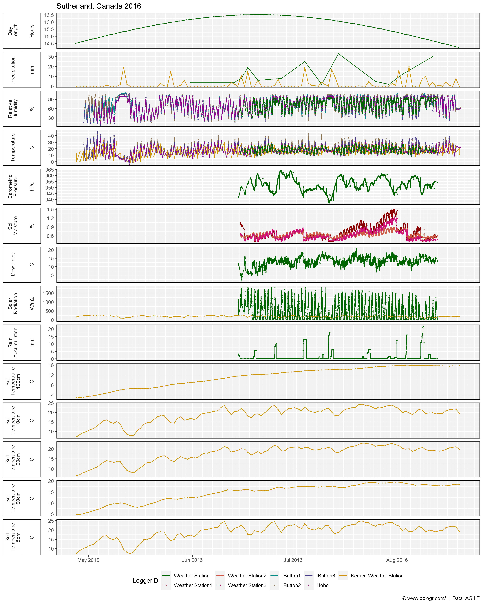

---

# Temperature

Plot and calculate daily min, mean and max

```{r}
# Filter data
xx <- dd %>% filter(Location == "Sutherland, Canada", Year == 2016,
                    Measurement == "Temperature")
# Plot graph
mp <- ggplot(xx, aes(x = DateTime, y = Value, color = LoggerID)) +
  geom_line() + 
  geom_point(size = 0.5) +
  theme_dblogr(legend.position = "bottom") +
  scale_colour_manual(values = myCols) +
  scale_x_datetime(date_labels = "%b %Y" , date_breaks = "1 month") +
  labs(title = "Sutherland, Canada 2016", y = "Temperautre (C)", x = NULL,
       caption = "\xa9 www.dblogr.com/  |  Data: AGILE")
ggsave("envdata_02.png", mp, width = 7, height = 5)
```

```{r echo = F}
ggsave("../../../myblog/content/graphs_academic/envdata/measurements/gallery/envdata_02.png", mp, width = 7, height = 5)
```

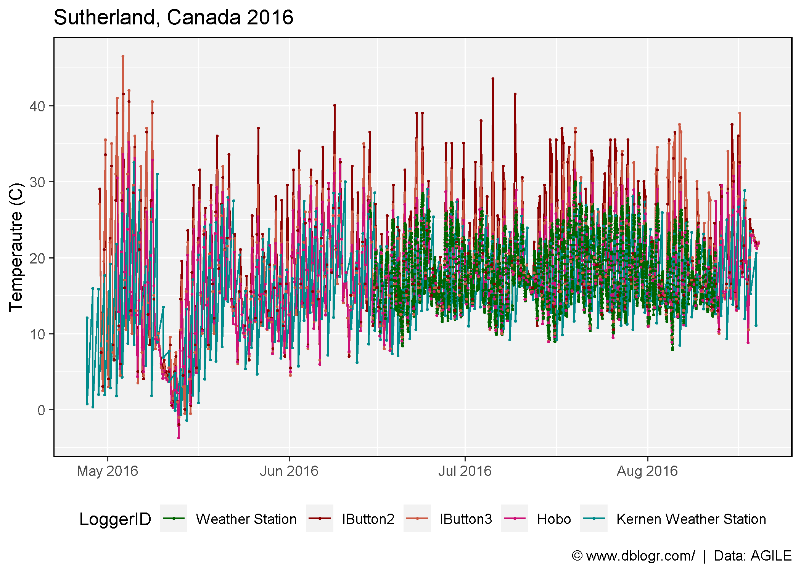

---

Plot temperatures for one month (July 2016)

```{r}
mp <- mp + 
  scale_x_datetime(date_breaks = "1 month", date_minor_breaks = "1 day", 
                   date_labels = "%b %Y" , 
                   limits = as.POSIXct(c("2016-07-01","2016-08-01"))) +
  ylim(c(5,45))
ggsave("envdata_03.png", mp, width = 7, height = 5)
```

```{r echo = F}
ggsave("../../../myblog/content/graphs_academic/envdata/measurements/gallery/envdata_03.png", mp, width = 7, height = 5)
```

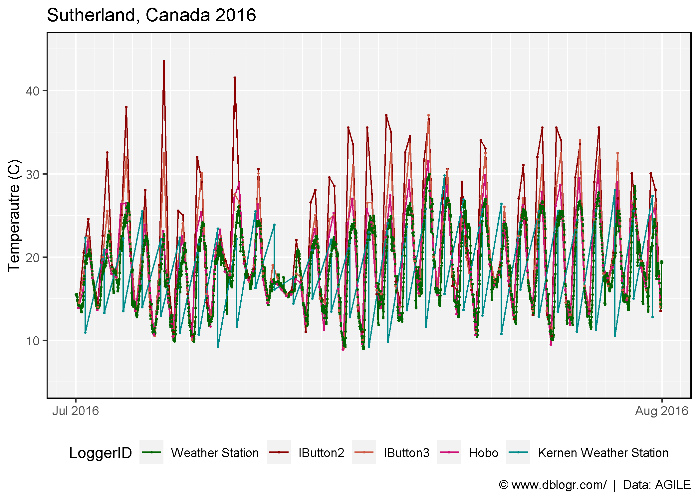

---

Calculate daily mean for each data logger

```{r}
yy <- xx %>% 
  group_by(LoggerID, Date) %>%
  summarise(Value = mean(Value)) %>%
  spread(LoggerID, Value) %>% 
  mutate(Temp_Mean = rowMeans(select(.,-Date), na.rm = T))
str(yy)
```

Calculate daily min, mean and max from specific data loggers

```{r}
yy <- xx %>% 
  filter(LoggerID %in% c("Ibutton2","IButton3","Hobo")) %>% 
  group_by(Location, Date) %>% 
  summarise_at(vars(Value), funs(min, mean, max), na.rm = T) %>%
  rename(Temp_min = min, Temp_mean = mean, Temp_max = max)
str(yy)
```

Plot daily mean temperatures for each experiment

```{r}
# Prep data
xx <- dd %>% 
  filter(Measurement == "Temperature", Year != 2018) %>% 
  group_by(Location, Year, Expt, DaysAfterPlanting) %>% 
  summarise(Mean = mean(Value))
# Plot graph
mp <- ggplot(xx, aes(x = DaysAfterPlanting, y = Mean, color = Location)) + 
  geom_smooth(method = "loess", size = 2) + 
  facet_grid(Year ~ .) +
  scale_color_manual(values = myCols) +
  theme_dblogr() +
  labs(title = "Temperature", 
       y = "Degrees Celsius", x = "Days After Planting",
       caption = "\xa9 www.dblogr.com/  |  Data: AGILE")
ggsave("envdata_04.png", mp, width = 6, height = 4)
```

```{r echo = F}
ggsave("../../../myblog/content/graphs_academic/envdata/measurements/gallery/envdata_04.png", mp, width = 6, height = 4)
```

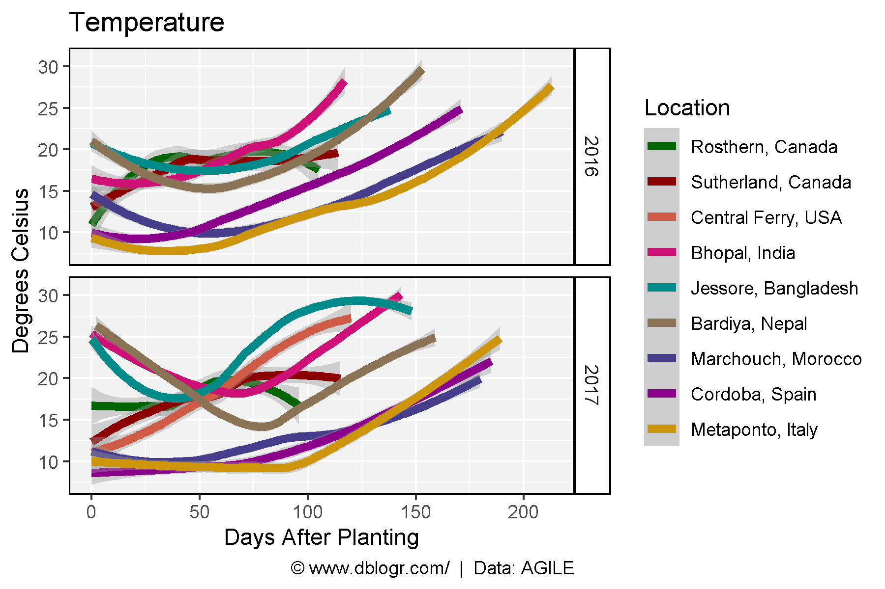

---

# Day Lengths

```{r}
# Prep data
xx <- dd %>% 
  filter(Measurement == "Day Length", Year != 2018) %>% 
  group_by(Location, Year, Expt, DaysAfterPlanting) %>% 
  summarise(Mean = mean(Value) )
# Plot graph
mp <- ggplot(xx, aes(x = DaysAfterPlanting, y = Mean, color = Location)) + 
  geom_line(size = 2) +
  facet_grid(Year ~ .) +
  scale_color_manual(values = myCols) +
  theme_dblogr() +
  labs(title = "Day Lengths",
       y = "Hours", x = "Days After Planting",
       caption = "\xa9 www.dblogr.com/  |  Data: AGILE")
ggsave("envdata_05.png", mp, width = 6, height = 4)
```

```{r echo = F}
ggsave("../../../myblog/content/graphs_academic/envdata/measurements/gallery/envdata_05.png", mp, width = 6, height = 4)
```

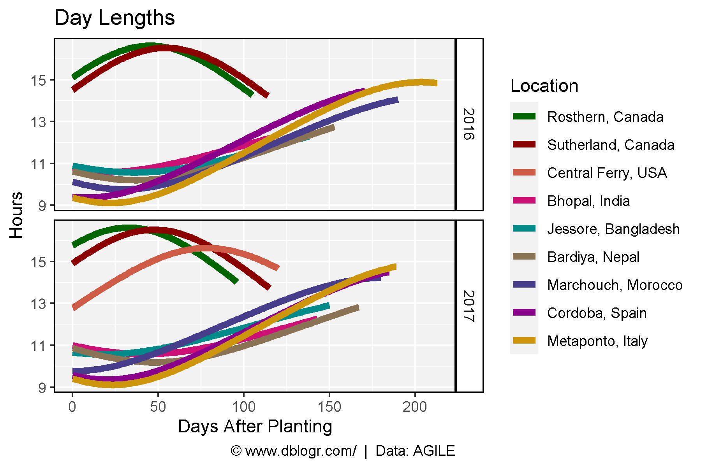

---

# Precipitation

```{r}
# Prep data
xx <- dd %>% 
  filter(Measurement == "Precipitation") %>%
  group_by(Expt, Location, Year) %>%
  summarise(Rainfall = sum(Value)) %>%
  arrange(Rainfall) %>%
  ungroup() %>%
  mutate(Expt = factor(Expt, levels = Expt),
         Year = factor(Year))
# Plot graph
mp <- ggplot(xx, aes(x = Location, y = Rainfall, fill = Year)) + 
  geom_bar(stat = "identity", 
           position = position_dodge2(preserve = "single")) + 
  scale_fill_manual(values = myCols) +
  theme_dblogr() +
  coord_flip() +
  labs(title = "Total Precipitation",
       caption = "\xa9 www.dblogr.com/  |  Data: AGILE")
ggsave("envdata_06.png", mp, width = 6, height = 4)
```

```{r echo = F}
ggsave("../../../myblog/content/graphs_academic/envdata/measurements/gallery/envdata_06.png", mp, width = 6, height = 4)
```

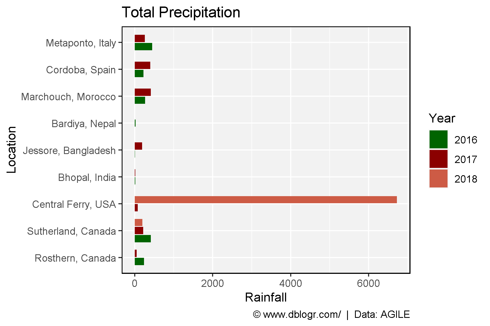

---

```{r}
# Prep data
xx <- dd %>% 
  filter(Measurement == "Precipitation", Year == 2016) %>% 
  group_by(Location, Year, Expt, Date, DaysAfterPlanting) %>% 
  summarise(Value = sum(Value))
# Plot graph
mp <- ggplot(xx, aes(x = DaysAfterPlanting, y = Value)) + 
  geom_bar(stat = "identity", fill = "darkblue") +
  facet_wrap(Location~., ncol = 1) +
  theme_dblogr() +
  labs(title = "Precipitation", y = "mm", x = "Days After Planting",
       caption = "\xa9 www.dblogr.com/  |  Data: AGILE")
ggsave("envdata_07.png", mp, width = 6, height = 8)
```

```{r echo = F}
ggsave("../../../myblog/content/graphs_academic/envdata/measurements/gallery/envdata_07.png", mp, width = 6, height = 8)
```

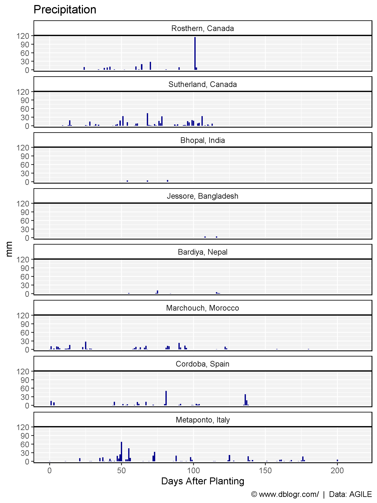

---

# Temperature, Day Length & Rainfall

Temperature and Daylength will require separate axes so we will have to rescale the data. 

$$y_{scaled}=(y_{2i}-min(y_2))*\frac{max(y_1)-min(y_1)}{max(y_2)-min(y_2)}$$

$$y_{2i}=y_{scaled}*\frac{max(y_2)-min(y_2)}{max(y_1)-min(y_1)}+min(y_2)$$

e.g.,

$$12=(11.333-9.11)*\frac{(40-0)}{16.52-9.11})$$

$$11.333=12*\frac{16.52-9.11}{40-0}+9.11$$

```{r}
# Prep rainfall data
locs <- c("Sutherland, Canada", "Metaponto, Italy", "Bhopal, India")
xR <- dd %>% 
  filter(Location %in% locs, Year == 2017, 
         Measurement == "Precipitation", Value > 0) %>%
  group_by(Expt, Date, DaysAfterPlanting) %>% 
  summarise(Value = sum(Value))
# Prep temperature and daylength data
xx <- dd %>% 
  filter(Location %in% locs, Year == 2017,
         Measurement %in% c("Temperature", "Day Length")) %>% 
  group_by(Expt, Measurement, Date) %>% 
  summarise_at(vars(Value), funs(min, mean, max)) %>%
  ungroup() %>%
  gather(Calc, Value, min, mean, max) %>%
  mutate(Measurement = plyr::mapvalues(Measurement, 
           c("Temperature", "Day Length"), c("Temp", "DayLen")),
         Measurement = paste(Measurement, Calc, sep="_")) %>%
  select(-Calc) %>%
  filter(!Measurement %in% c("DayLen_min", "DayLen_max")) %>%
  spread(Measurement, Value) %>%
  mutate(DayLen_Rescaled = scales::rescale(DayLen_mean, to = c(0, 45)))
# Print
str(xx)
# Collect values for rescaling seconday axis
range(xx$DayLen_mean)
# Plot graph
mp <- ggplot(xx, aes(x = Date, y = Temp_mean)) + 
  facet_wrap(Expt ~ ., ncol = 1, scales = "free_x") + 
  geom_line(color = "Red") +
  geom_line(aes(y = DayLen_Rescaled), color = "darkblue") +
  geom_bar(data = xR, aes(y = Value), stat = "identity", fill = "darkblue") +
  geom_ribbon(aes(ymin = Temp_min, ymax = Temp_max), 
              fill = alpha("Red", 0.25), 
              color = alpha("Red", 0.25) ) +
  scale_x_date(name = NULL, date_labels = "%b" , date_breaks = "1 month") +
  scale_y_continuous(name = "\u00B0Celcius / mm Rain",
    sec.axis = sec_axis(~ . * (16.62-9.11) / (45-0) + 9.11, 
                        breaks = c(10, 12, 14, 16), name = "Hours") ) +
  coord_cartesian(ylim=c(0, 45)) +
  theme_dblogr() +
  labs(caption = "\xa9 www.dblogr.com/  |  Data: AGILE")
ggsave("envdata_08.png", mp, width = 6, height = 5.5)
```

```{r echo = F}
ggsave("../../../myblog/content/graphs_academic/envdata/measurements/gallery/envdata_08.png", mp, width = 6, height = 5.5)
ggsave("../../../myblog/content/posts_academic/envdata/featured.png", mp, width = 6, height = 5.5, limitsize = F)
```

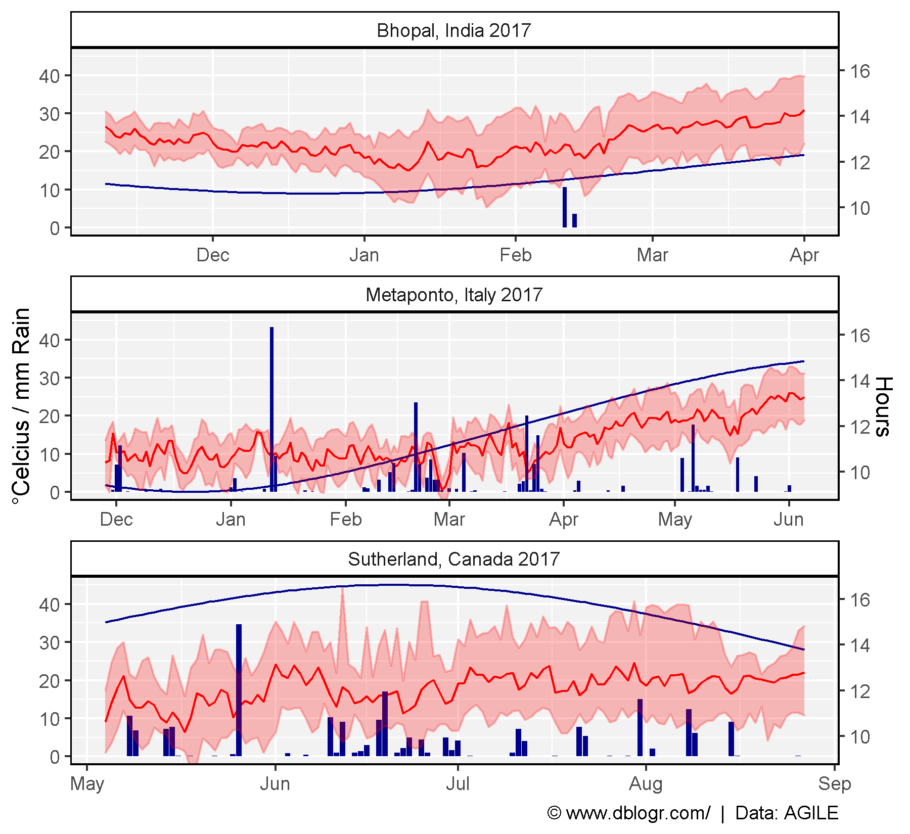

---

# Soil Temperature

```{r}
# Prep data
mm <- c("Soil Temperature 5cm",  "Soil Temperature 10cm",
        "Soil Temperature 20cm", "Soil Temperature 50cm",
        "Soil Temperature 100cm")
xx <- dd %>% 
  filter(Location == "Sutherland, Canada", Year == 2016, 
         Measurement %in% mm) %>%
  mutate(Measurement = factor(Measurement, levels = mm),
         Measurement = plyr::mapvalues(Measurement, mm, 
           c("5cm","10cm","20cm","50cm","100cm")))
# Plot
mp <- ggplot(xx, aes(x = DateTime, y = Value, color = Measurement)) +
  geom_line() +
  scale_color_manual(values = myCols) +
  theme_dblogr() +
  labs(title = "Soil Temperatures: Sutherland, Canada 2016",
       y = NULL, x = NULL,
       caption = "\xa9 www.dblogr.com/  |  Data: AGILE")
ggsave("envdata_09.png", mp, width = 6, height = 4)
```

```{r echo = F}
ggsave("../../../myblog/content/graphs_academic/envdata/measurements/gallery/envdata_09.png", mp, width = 6, height = 4)
```

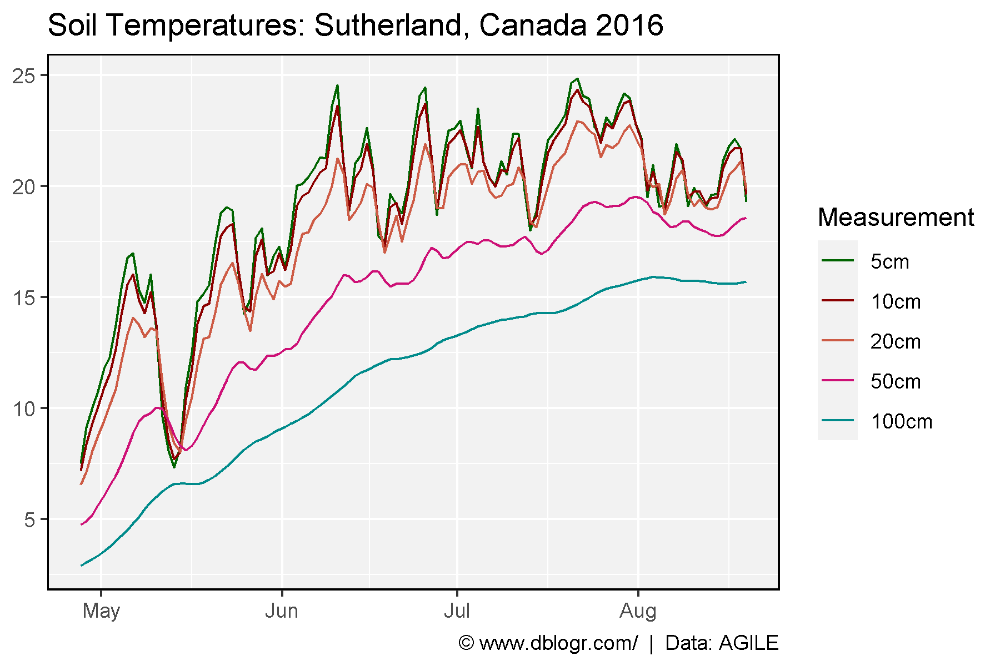

---

# Each experiment

```{r}
# Create Plotting function
envPlot <- function(xx) {
  ggplot(xx, aes(x = DateTime, y = Value, color = LoggerID)) +
  geom_line() + 
  geom_point(size = 0.5) +
  facet_grid(Measurement + Unit ~ ., scales = "free_y", switch = "y",
             labeller = label_wrap_gen(width = 10)) +
  theme_dblogr(strip.placement = "outside", legend.position = "bottom") +
  scale_x_datetime(date_labels = "%b %Y" , date_breaks = "1 month") +
  scale_color_manual(values = myCols) +
  labs(title = paste(unique(xx$Location), unique(xx$Year)), 
       y = NULL, x = NULL,
       caption = "\xa9 www.dblogr.com/  |  Data: AGILE")
}
```

---

## Sutherland, Canada 2016

```{r}
mp <- envPlot(filter(dd, Location == "Sutherland, Canada", Year == 2016))
ggsave("envdata_expt_01.png", mp, width = 12, height = 15)
```

```{r echo = F}
ggsave("../../../myblog/content/graphs_academic/envdata/temperate/gallery/envdata_expt_01.png", mp, width = 12, height = 15)
```


---

## Sutherland, Canada 2017

```{r}
mp <- envPlot(filter(dd, Location == "Sutherland, Canada", Year == 2017))
ggsave("envdata_expt_02.png", mp, width = 12, height = 11)
```

```{r echo = F}
ggsave("../../../myblog/content/graphs_academic/envdata/temperate/gallery/envdata_expt_02.png", mp, width = 12, height = 11)
```

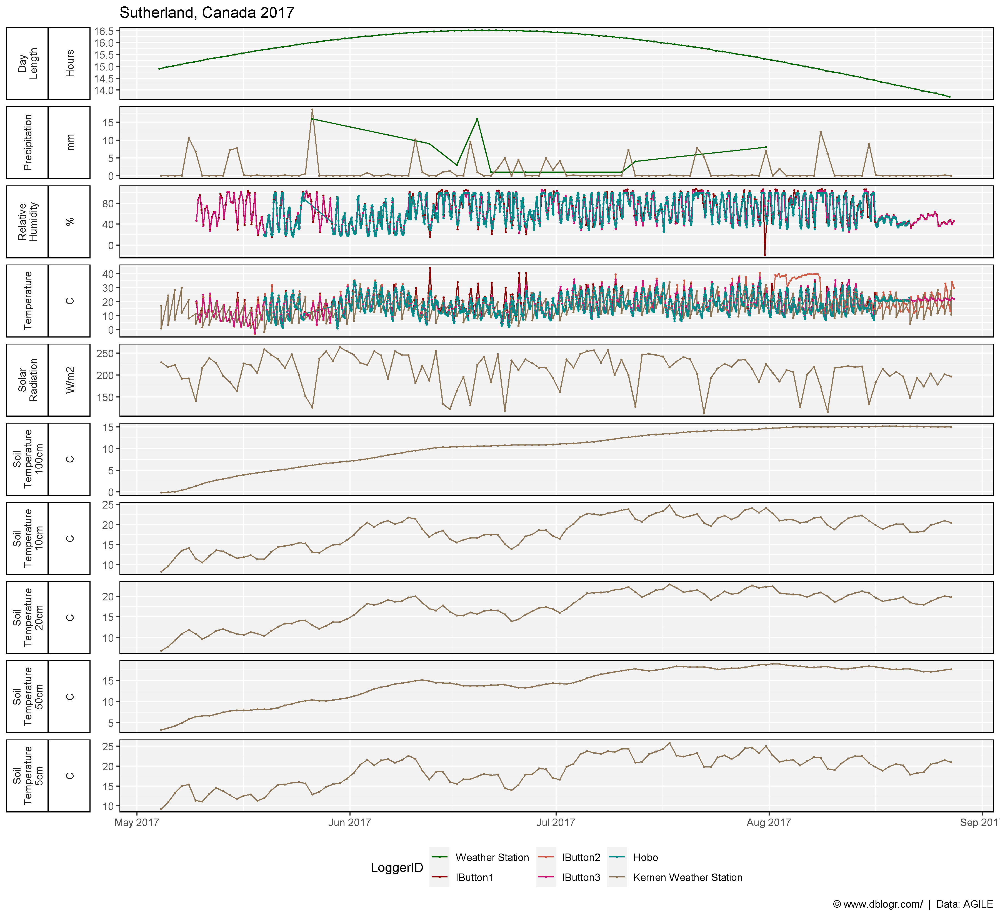

---

## Sutherland, Canada 2018

```{r}
mp <- envPlot(filter(dd, Location == "Sutherland, Canada", Year == 2018))
ggsave("envdata_expt_03.png", mp, width = 12, height = 11)
```

```{r echo = F}
ggsave("../../../myblog/content/graphs_academic/envdata/temperate/gallery/envdata_expt_03.png", mp, width = 12, height = 11)
```

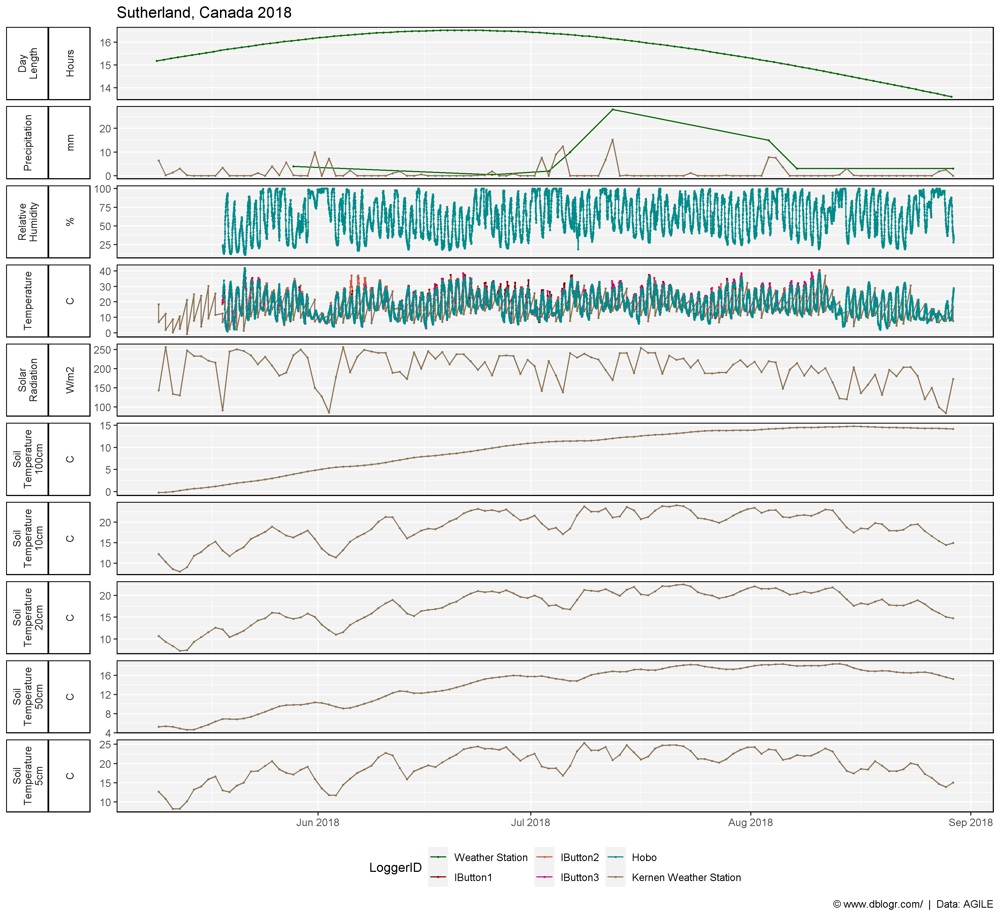

---

## Rosthern, Canada 2016

```{r}
mp <- envPlot(filter(dd, Location == "Rosthern, Canada", Year == 2016))
ggsave("envdata_expt_04.png", mp, width = 12, height = 10)
```

```{r echo = F}
ggsave("../../../myblog/content/graphs_academic/envdata/temperate/gallery/envdata_expt_04.png", mp, width = 12, height = 10)
```

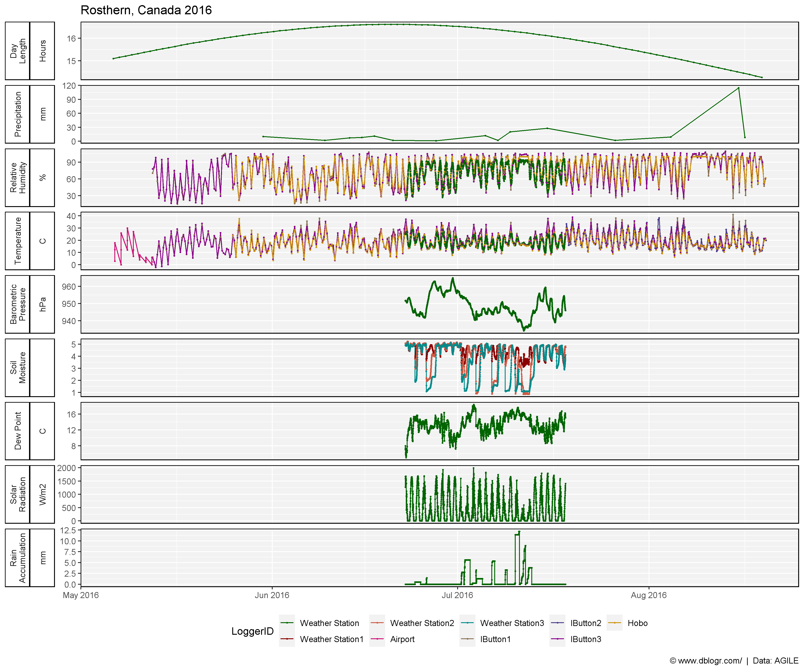

---

## Rosthern, Canada 2017

```{r}
mp <- envPlot(filter(dd, Location == "Rosthern, Canada", Year == 2017))
ggsave("envdata_expt_05.png", mp, width = 12, height = 10)
```

```{r echo = F}
ggsave("../../../myblog/content/graphs_academic/envdata/temperate/gallery/envdata_expt_05.png", mp, width = 12, height = 10)
```

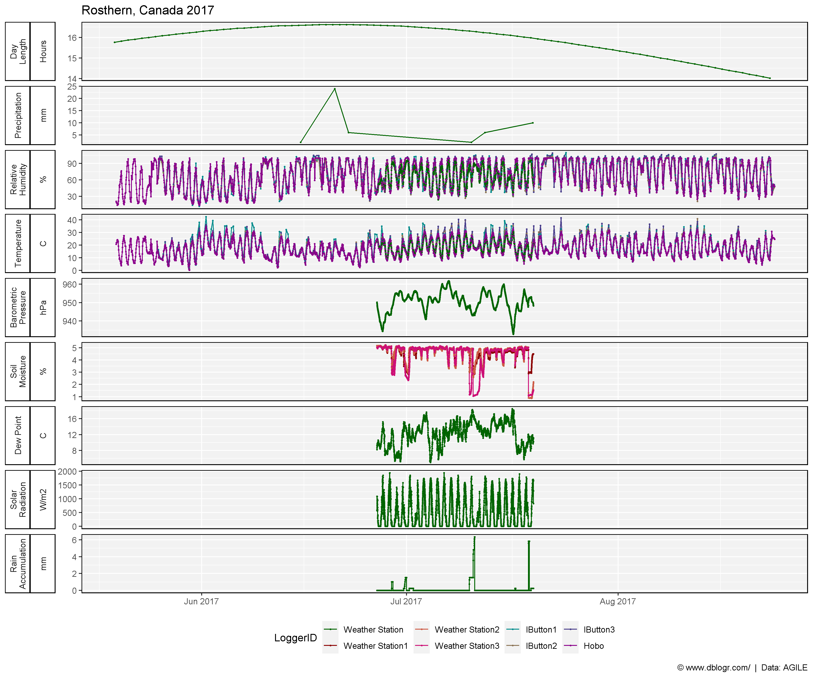

---

## Central Ferry, USA 2017

```{r}
mp <- envPlot(filter(dd, Location == "Central Ferry, USA", Year == 2017))
ggsave("envdata_expt_06.png", mp, width = 12, height = 23)
```

```{r echo = F}
ggsave("../../../myblog/content/graphs_academic/envdata/temperate/gallery/envdata_expt_06.png", mp, width = 12, height = 23)
```

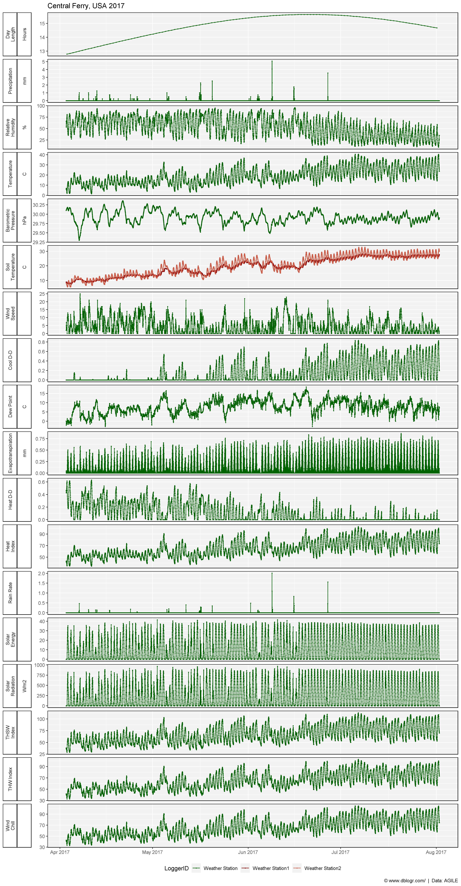

---

## Central Ferry, USA 2018

```{r}
mp <- envPlot(filter(dd, Location == "Central Ferry, USA", Year == 2018))
ggsave("envdata_expt_07.png", mp, width = 12, height = 10)
```

```{r echo = F}
ggsave("../../../myblog/content/graphs_academic/envdata/temperate/gallery/envdata_expt_07.png", mp, width = 12, height = 10)
```

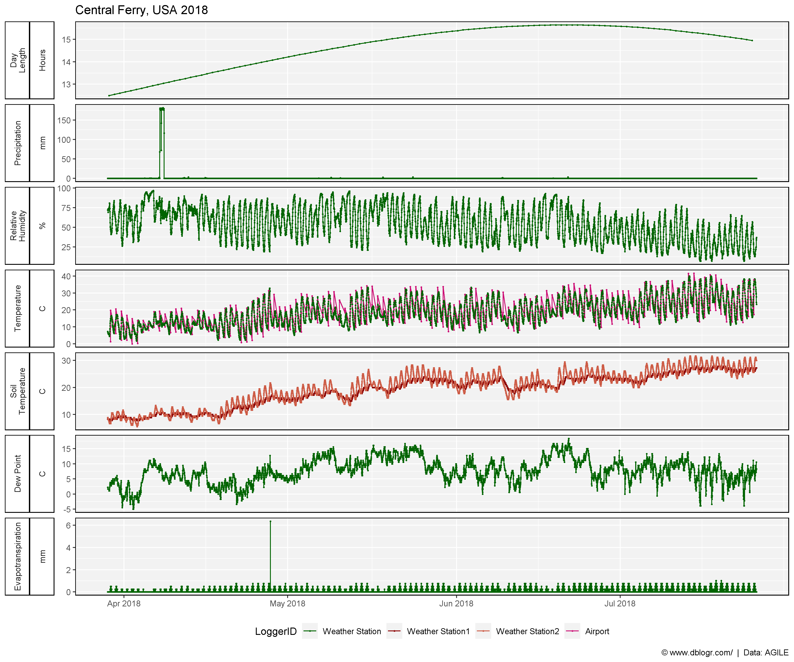

---

## Bhopal, India 2016

```{r}
mp <- envPlot(filter(dd, Location == "Bhopal, India", Year == 2016))
ggsave("envdata_expt_08.png", mp, width = 12, height = 10)
```

```{r echo = F}
ggsave("../../../myblog/content/graphs_academic/envdata/southasian/gallery/envdata_expt_08.png", mp, width = 12, height = 10)
```

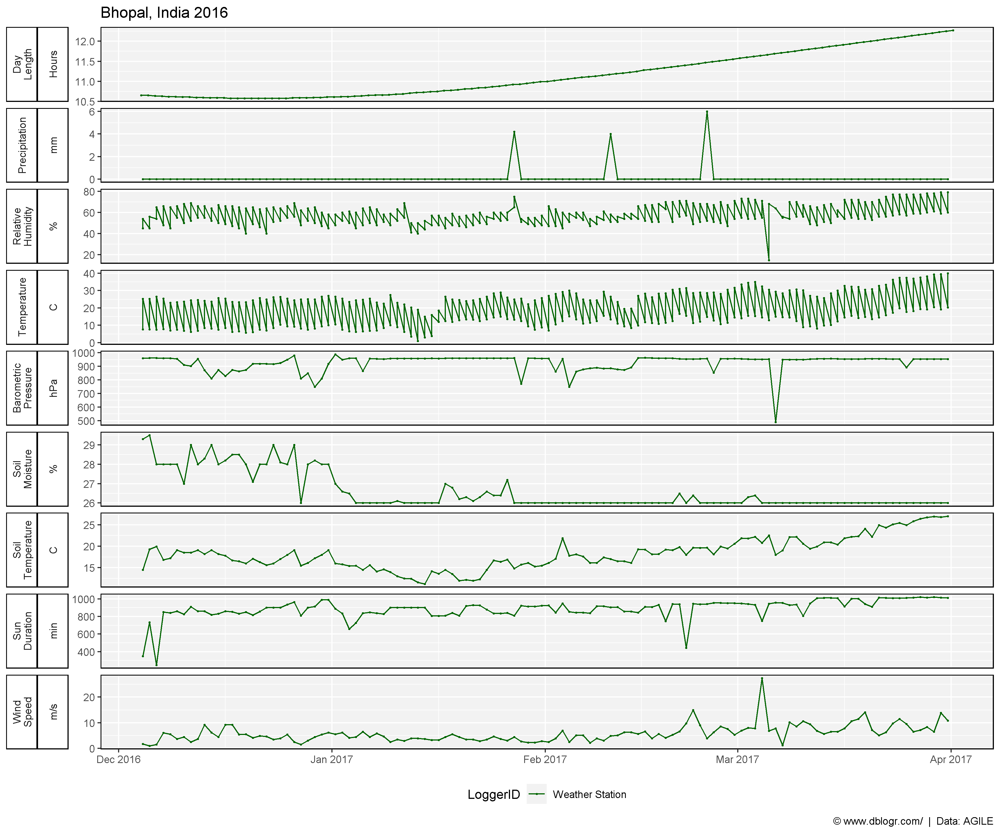

---

## Bhopal, India 2017

```{r}
mp <- envPlot(filter(dd, Location == "Bhopal, India", Year == 2017))
ggsave("envdata_expt_09.png", mp, width = 12, height = 5)
```

```{r echo = F}
ggsave("../../../myblog/content/graphs_academic/envdata/southasian/gallery/envdata_expt_09.png", mp, width = 12, height = 5)
```

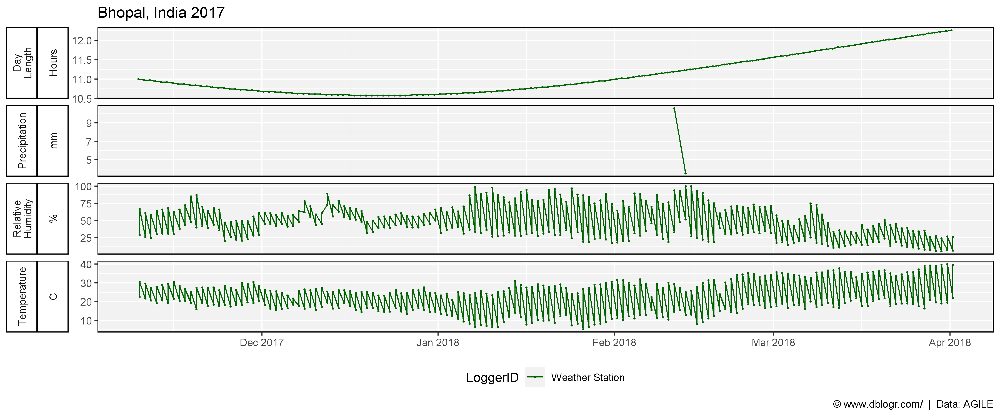

---

## Jessore, Bangladesh 2016

```{r}
mp <- envPlot(filter(dd, Location == "Jessore, Bangladesh", Year == 2016))
ggsave("envdata_expt_10.png", mp, width = 12, height = 8)
```

```{r echo = F}
ggsave("../../../myblog/content/graphs_academic/envdata/southasian/gallery/envdata_expt_10.png", mp, width = 12, height = 8)
```

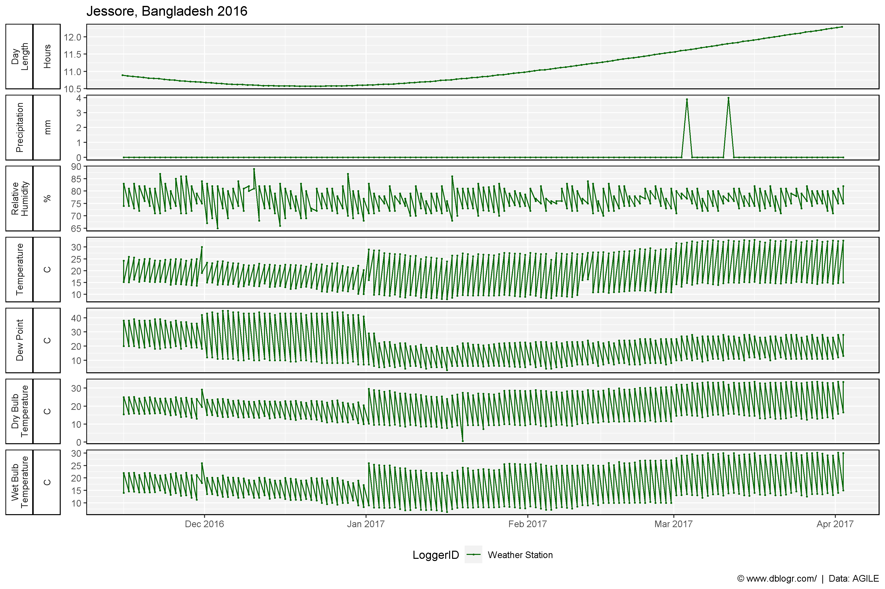

---

## Jessore, Bangladesh 2017

```{r}
mp <- envPlot(filter(dd, Location == "Jessore, Bangladesh", Year == 2017))
ggsave("envdata_expt_11.png", mp, width = 12, height = 4)
```

```{r echo = F}
ggsave("../../../myblog/content/graphs_academic/envdata/southasian/gallery/envdata_expt_11.png", mp, width = 12, height = 4)
```

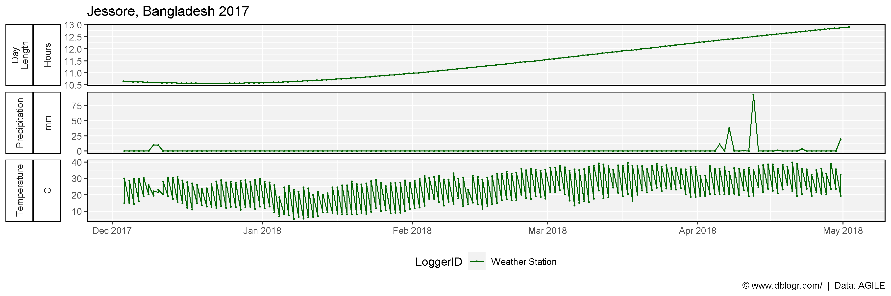

---

## Bardiya, Nepal 2016

```{r}
mp <- envPlot(filter(dd, Location == "Bardiya, Nepal", Year == 2016))
ggsave("envdata_expt_12.png", mp, width = 12, height = 5)
```

```{r echo = F}
ggsave("../../../myblog/content/graphs_academic/envdata/southasian/gallery/envdata_expt_12.png", mp, width = 12, height = 5)
```

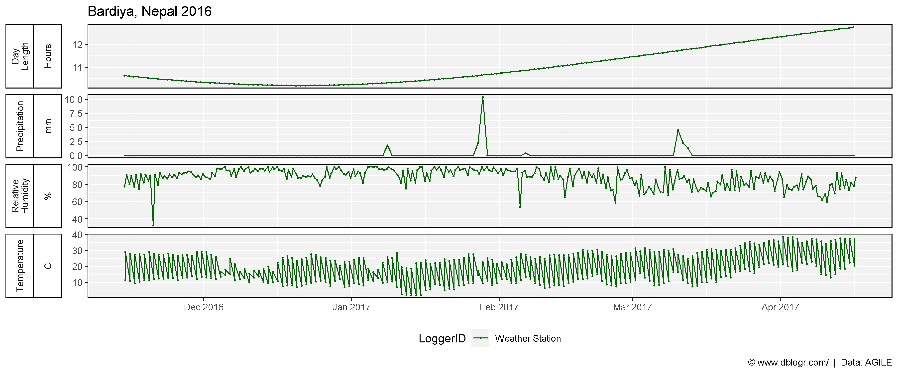

---

## Bardiya, Nepal 2017

```{r}
mp <- envPlot(filter(dd, Location == "Bardiya, Nepal", Year == 2017))
ggsave("envdata_expt_13.png", mp, width = 12, height = 4)
```

```{r echo = F}
ggsave("../../../myblog/content/graphs_academic/envdata/southasian/gallery/envdata_expt_13.png", mp, width = 12, height = 4)
```

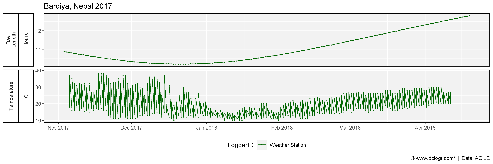

---

## Marchouch, Morocco 2016

```{r}
mp <- envPlot(filter(dd, Location == "Marchouch, Morocco", Year == 2016))
ggsave("envdata_expt_14.png", mp, width = 12, height = 9)
```

```{r echo = F}
ggsave("../../../myblog/content/graphs_academic/envdata/mediterranean/gallery/envdata_expt_14.png", mp, width = 12, height = 9)
```


---

## Marchouch, Morocco 2017

```{r}
mp <- envPlot(filter(dd, Location == "Marchouch, Morocco", Year == 2017))
ggsave("envdata_expt_15.png", mp, width = 12, height = 5)
```

```{r echo = F}
ggsave("../../../myblog/content/graphs_academic/envdata/mediterranean/gallery/envdata_expt_15.png", mp, width = 12, height = 5)
```

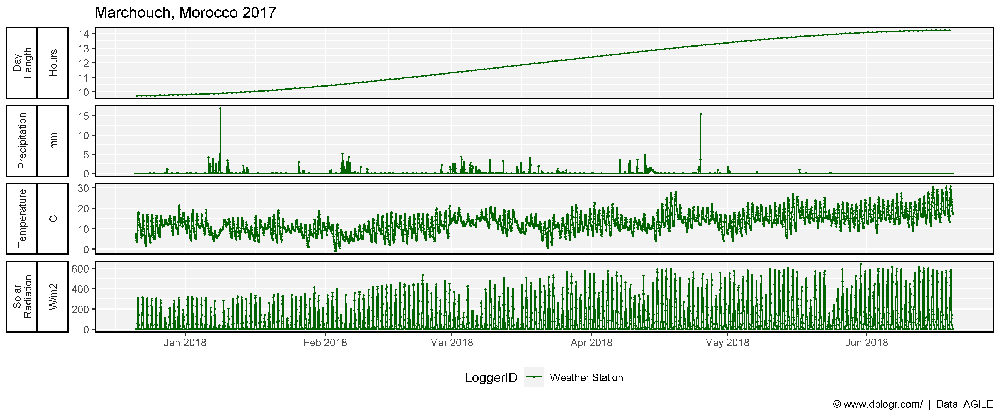

---

## Cordoba, Spain 2016

```{r}
mp <- envPlot(filter(dd, Location == "Cordoba, Spain", Year == 2016))
ggsave("envdata_expt_16.png", mp, width = 12, height = 6)
```

```{r echo = F}
ggsave("../../../myblog/content/graphs_academic/envdata/mediterranean/gallery/envdata_expt_16.png", mp, width = 12, height = 6)
```

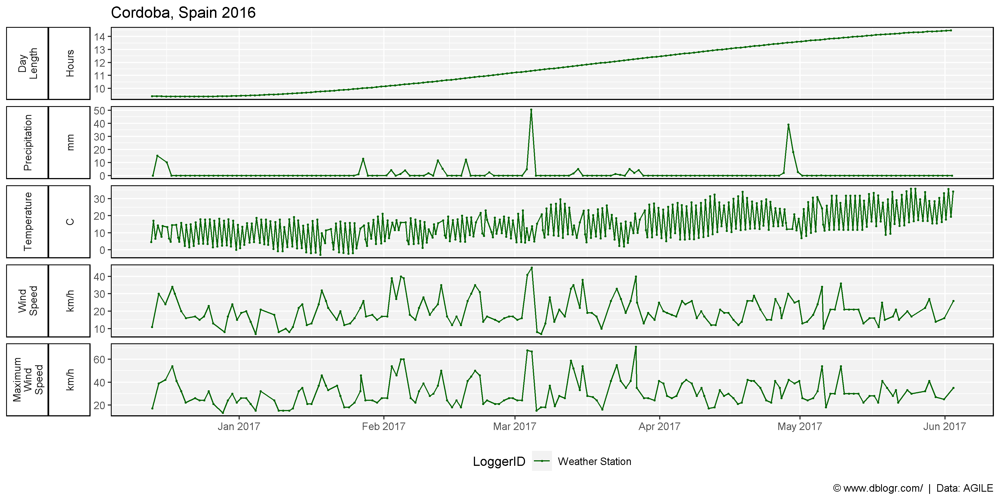

---

## Cordoba, Spain 2017

```{r}
mp <- envPlot(filter(dd, Location == "Cordoba, Spain", Year == 2017))
ggsave("envdata_expt_17.png", mp, width = 12, height = 6)
```

```{r echo = F}
ggsave("../../../myblog/content/graphs_academic/envdata/mediterranean/gallery/envdata_expt_17.png", mp, width = 12, height = 6)
```

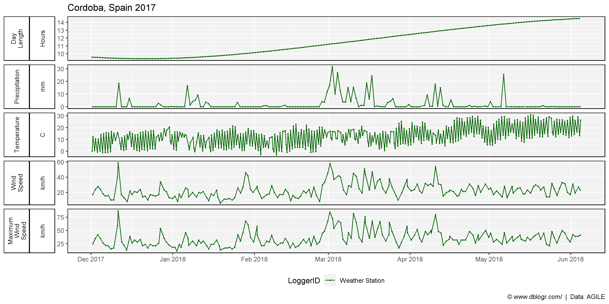

---

## Metaponto, Italy 2016

```{r}
mp <- envPlot(filter(dd, Location == "Metaponto, Italy", Year == 2016))
ggsave("envdata_expt_18.png", mp, width = 12, height = 12)
```

```{r echo = F}
ggsave("../../../myblog/content/graphs_academic/envdata/mediterranean/gallery/envdata_expt_18.png", mp, width = 12, height = 12)
```

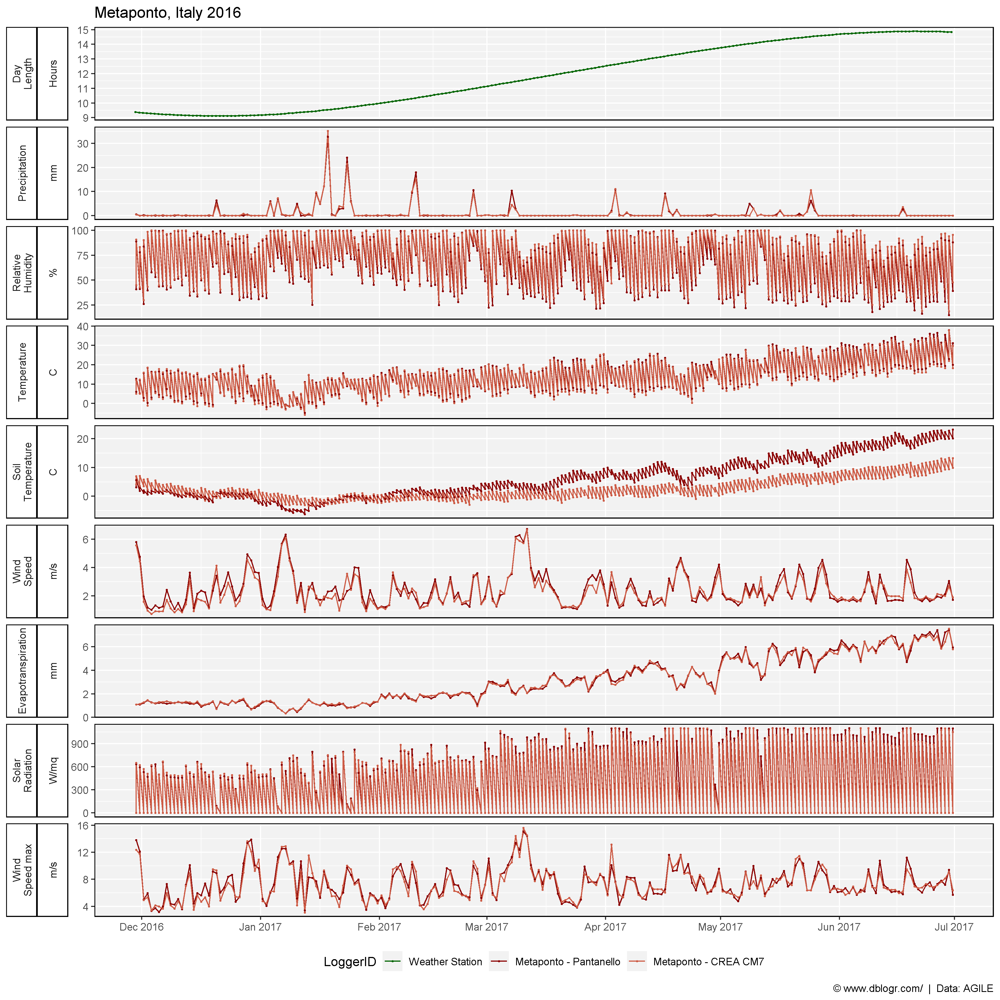

---

## Metaponto, Italy 2017

```{r}
mp <- envPlot(filter(dd, Location == "Metaponto, Italy", Year == 2017))
ggsave("envdata_expt_19.png", mp, width = 12, height = 11)
```

```{r echo = F}
ggsave("../../../myblog/content/graphs_academic/envdata/mediterranean/gallery/envdata_expt_19.png", mp, width = 12, height = 11)
```

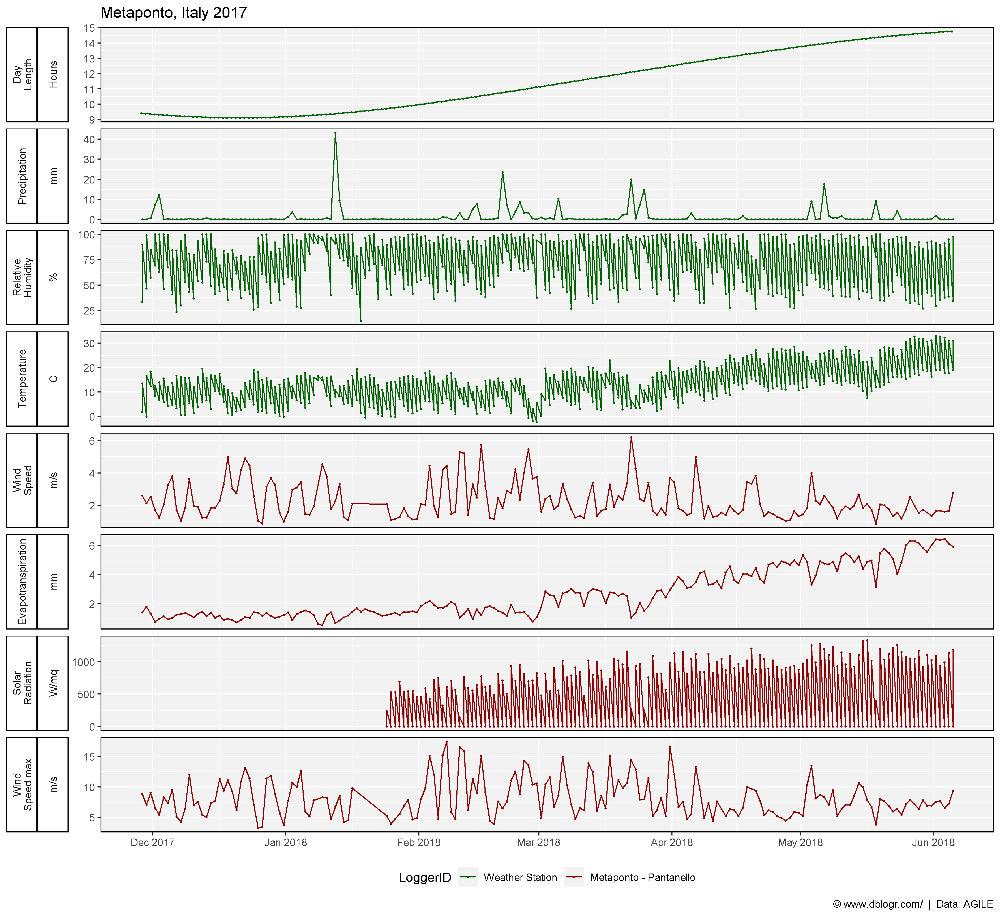

---

&copy; Derek Michael Wright 2020 [www.dblogr.com/](https://dblogr.netlify.com/)
