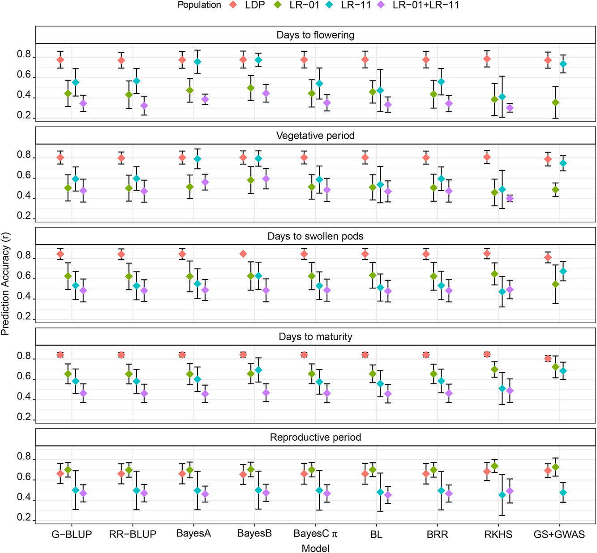
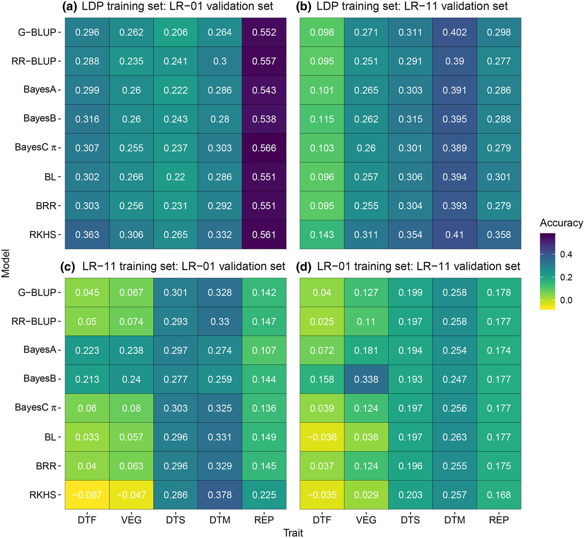

```{r setup, include=FALSE}
knitr::opts_chunk$set(echo = TRUE, message = F, warning = F)
```

---

# Abstract

Genomic selection (GS) is a marker-based selection initially suggested for livestock breeding and is being encouraged for crop breeding. Several statistical models are used to implement GS; however, none have been tested for use in lentil (*Lens culinaris* Medik.) breeding. This study was conducted to compare the accuracy of different GS models and prediction scenarios based on empirical data and to make recommendations for designing genomic selection strategies for lentil breeding. We evaluated nine single-trait (ST) models, two multiple-trait (MT) models, and a model that incorporates genotype × environment interaction (GEI) using populations from a lentil diversity panel and two recombinant inbred lines (RILs). The lines in all populations were phenotyped for five phenological traits and genotyped using a custom exome capture assay. Within-population, across-population, and across-environment genomic predictions were made. Prediction accuracy varied among the evaluated models, populations, prediction scenarios, and traits. Single-trait models showed similar accuracy in the absence of large effect quantitative trait loci (QTL) but BayesB outperformed all models when there were QTL with relatively large effects. Models that accounted for GEI and MT-GS models increased prediction accuracy for a low heritability trait by up to 66 and 14%, respectively. Moderate to high accuracies were obtained for within-population (range of .36–.85) and across-environment (range of .19–.89) predictions but across-population prediction accuracy was very low. Results suggest that GS can be implemented in lentil breeding to make predictions within populations and across environments, but across-population prediction should not be considered when the population size is small..






---

&copy; Derek Michael Wright 2020 [www.dblogr.com/](https://dblogr.netlify.com/)