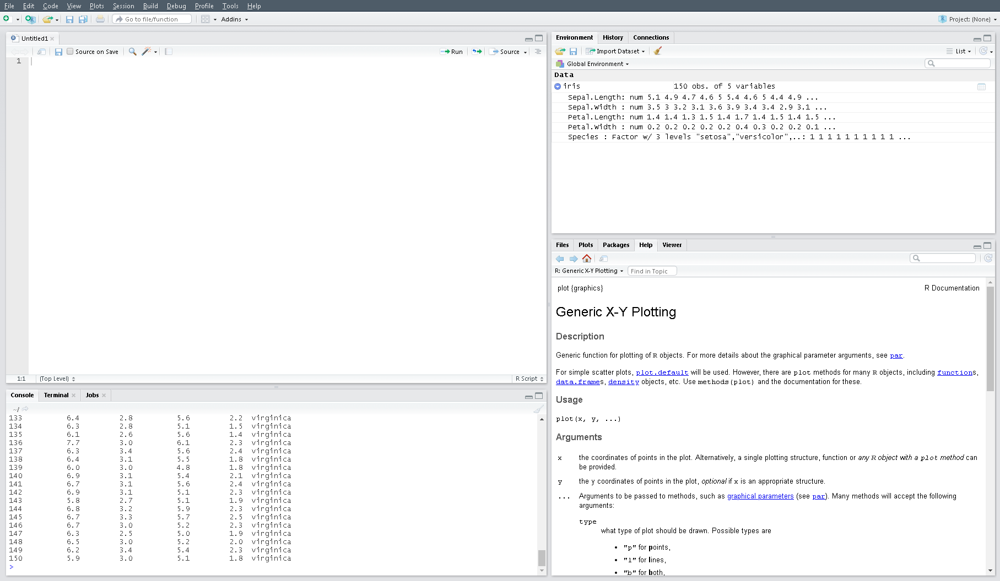
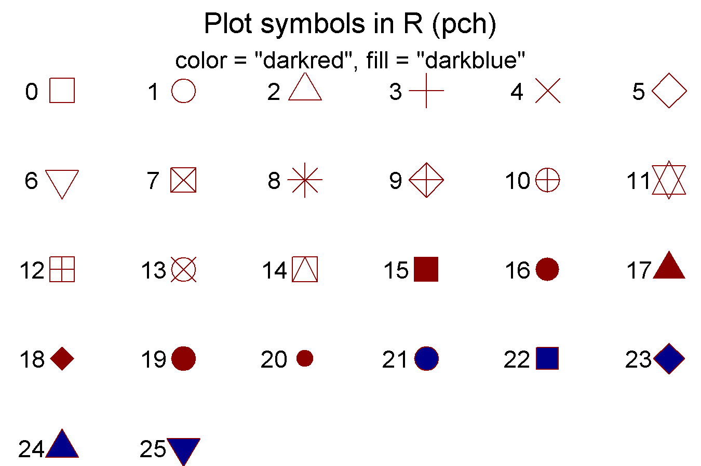

```{r setup, include=FALSE}
knitr::opts_chunk$set(echo = T, message = F, warning = F)
```

---

# Introduction

This vignette will introduce the reader to `R`, a free, open-source statistical computing environment and `RStudio`, a integrated development environment for `R`.   

{width=25%}

---

# Download R

[Download R](https://www.r-project.org/)

[Download RStudio](https://rstudio.com/products/rstudio/download/)



http://r-statistics.co/R-Tutorial.html

https://bookdown.org/rdpeng/exdata/getting-started-with-r.html#installation

---

# Calculator

R can be used as a caclulator

```{r}
# 5 + 3 = 8
5 + 3 
# 24 / (1 + 2) = 8
24 / (1 + 2) 
# 2 * 2 * 2 = 8
2^3 
# 8 * 8 = 64
sqrt(64) 
# -log10(0.05 / 5000000) = 8
-log10(0.05 / 5000000) 
```

---

# Functions

R has many useful built in functions

```{r}
1:10
as.character(1:10)
rep(1:2, times = 5)
rep(1:5, times = 2)
rep(1:5, each = 2)
rep(1:5, length.out = 7)
help(rep)
seq(5, 50, by = 5)
seq(5, 50, length.out = 5)
min(1:10)
max(1:10)
range(1:10)
mean(1:10)
sd(1:10)
```

Users can also create their own functions

```{r}
customFunction <- function(x) {
  mean(x) + sd(x)
}
customFunction(x = 1:10)
```

---

# Objects

Information can be stored in user defined objects, in multiple forms:

- `c()`: a string of values
- `matrix()`: a two dimensional matrix in one format 
- `data.frame()`: a two dimensional matrix where each column can be a different format 
- `list()`:

A string...

```{r}
xc <- 1:10
xc
xc <- c(1,2,3,4,5,6,7,8,9,10)
xc
```

A matrix...

```{r}
xm <- matrix(1:100, nrow = 10, ncol = 10, byrow = T)
xm
xm <- matrix(1:100, nrow = 10, ncol = 10, byrow = F)
xm
```

A data frame...

```{r}
xd <- data.frame(
  x1 = c("aa","bb","cc","dd","ee",
         "ff","gg","hh","ii","jj"),
  x2 = 1:10,
  x3 = c(1,1,1,1,1,2,2,2,3,3),
  x4 = rep(c(1,2), times = 5),
  x5 = rep(1:5, times = 2),
  x6 = rep(1:5, each = 2),
  x7 = seq(5, 50, by = 5),
  x8 = log10(1:10),
  x9 = (1:10)^3
)
xd
```

A list...

```{r}
xl <- list(xc, xm, xd)
xl[[1]]
xl[[2]]
xl[[3]]
xl[[3]]$x1
```

---

# Data Formats

Data can also be saved in many formats:

- numeric
- integer
- character
- factor

```{r}
xd[,"x3"]
xd$x3
xd$x3 <- as.character(xd$x3)
xd$x3
xd$x3 <- as.numeric(xd$x3)
xd$x3
xd$x3 <- as.factor(xd$x3)
xd$x3
xd$x3 <- factor(xd$x3, levels = c("3","2","1"))
xd$x3
```

Internal structure of an object can be checked with `str()`

```{r}
str(xc) # c()
str(xm) # matrix()
str(xd) # data.frame()
str(xl) # list()
```

---

# Installing Packages

Additional libraries can be installed and loaded for use.

```{r eval = F}
install.packages("scales")
```

```{r}
library(scales)
xx <- data.frame(Values = 1:10)
xx$Rescaled <- rescale(x = xx$Values, to = c(1,30))
xx
```

---

# Plotting

We will start with some basic plotting using the base function `plot()`

http://www.sthda.com/english/wiki/r-base-graphs

https://bookdown.org/rdpeng/exdata/the-base-plotting-system-1.html

```{r}
# A basic scatter plot
plot(x = xd$x8, y = xd$x9)
# Adjust color and shape of the points
plot(x = xd$x8, y = xd$x9, col = "darkred", pch = 0)
plot(x = xd$x8, y = xd$x9, col = xd$x4, pch = xd$x4)
# Adjust plot type 
plot(x = xd$x8, y = xd$x9, type = "line")
# Adjust linetype
plot(x = xd$x8, y = xd$x9, type = "line", lty = 2)
# Plot lines and points
plot(x = xd$x8, y = xd$x9, type = "both")
```

Now lets create some random and normally distributed data to make some more complicated plots

```{r}
# 100 random uniformly distributed numbers ranging from 0 - 100
ru <- runif(100, min = 0, max = 100)
ru
plot(x = ru)
order(ru)
ru<- ru[order(ru)]
ru
plot(x = ru)
# 100 normally distributed numbers with a mean of 50 and sd of 10
nd <- rnorm(100, mean = 50, sd = 10)
nd
nd <- nd[order(nd)]
nd
plot(x = nd)
hist(x = nd)
hist(nd, breaks = 20, col = "darkgreen")
plot(x = density(nd))
boxplot(x = nd)
boxplot(x = nd, horizontal = T)
```

## ggplot

Lets be honest, the base plots are ugly! The `ggplot2` package gives the user to create a better, more visually appealing plots. Additional packages such as `ggbeeswarm` and `ggrepel` also contain useful functions to add to the functionality of `ggplot2`.

https://ggplot2.tidyverse.org/

https://www.r-graph-gallery.com/ggplot2-package.html

http://r-statistics.co/ggplot2-Tutorial-With-R.html

https://www.statsandr.com/blog/graphics-in-r-with-ggplot2/

```{r}
library(ggplot2)
mp <- ggplot(xd, aes(x = x8, y = x9))
mp + geom_point()
mp + geom_point(aes(color = x3, shape = x3), size = 4)
mp + geom_line(size = 2)
mp + geom_line(aes(color = x3), size = 2)
mp + geom_smooth(method = "loess")
mp + geom_smooth(method = "lm")
xx <- data.frame(data = c(rnorm(50, mean = 40, sd = 10),
                          rnorm(50, mean = 60, sd = 5)),
                 group = factor(rep(1:2, each = 50)),
                 label = c("Label1", rep(NA, 49), "Label2", rep(NA, 49)))
mp <- ggplot(xx, aes(x = data, fill = group))
mp + geom_histogram(color = "black")
mp + geom_histogram(color = "black", position = "dodge")
mp + geom_density(alpha = 0.5)
mp <- ggplot(xx, aes(x = group, y = data, fill = group))
mp + geom_boxplot(color = "black")
mp + geom_boxplot() + geom_point()
mp + geom_violin() 
mp <- mp + 
  geom_violin(alpha = 0.5) + 
  geom_boxplot(width = 0.1, fill = "white")
library(ggbeeswarm)
mp + geom_quasirandom()
mp + geom_quasirandom(aes(shape = group))
mp <- mp + geom_beeswarm(alpha = 0.5)
mp
library(ggrepel)
mp + geom_text_repel(aes(label = label), nudge_x = 0.4)
```

---

Statistics

Under construction…

---

# pch Plot

```{r}
xx <- data.frame(x = rep(1:6, times = 5, length.out = 26),
                 y = rep(5:1, each = 6, length.out = 26),
                 pch = 0:25)
mp <- ggplot(xx, aes(x = x, y = y, shape = as.factor(pch))) +
  geom_point(color = "darkred", fill = "darkblue", size = 5) +
  geom_text(aes(label = pch), nudge_x = -0.25) +
  scale_shape_manual(values = xx$pch) +
  scale_x_continuous(breaks = 6:1) +
  scale_y_continuous(breaks = 6:1) +
  theme_void() +
  theme(legend.position = "none",
        plot.title = element_text(hjust = 0.5),
        plot.subtitle = element_text(hjust = 0.5),
        axis.text = element_blank(),
        axis.ticks = element_blank()) +
  labs(title = "Plot symbols in R (pch)",
       subtitle = "color = \"darkred\", fill = \"darkblue\"",
       x = NULL, y = NULL)
ggsave("pch.png", mp, width = 4.5, height = 3)
```



---

&copy; Derek Michael Wright 2020 [www.dblogr.com/](https://dblogr.netlify.com/)