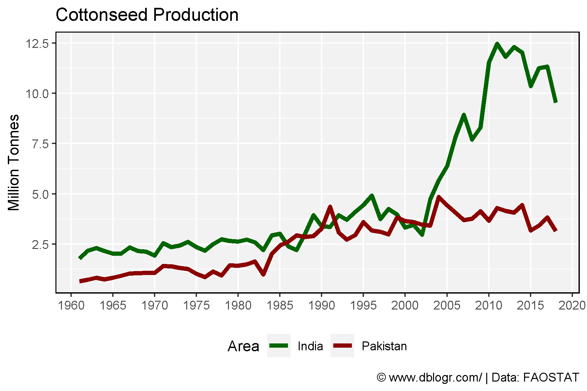
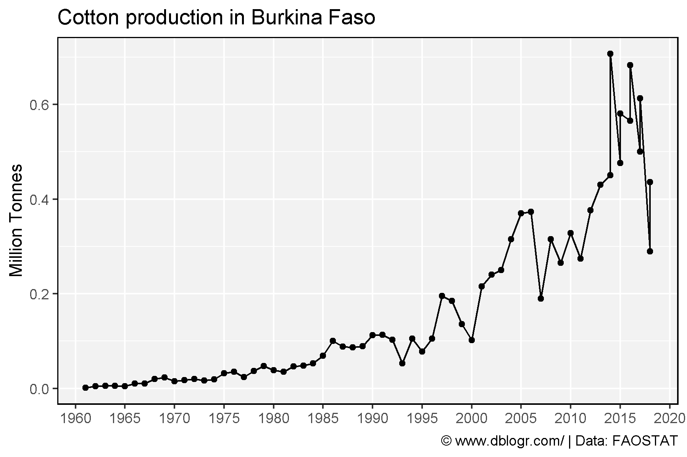

```{r setup, include = FALSE}
knitr::opts_chunk$set(echo = TRUE, warning = F, message = F)
```

---

```{r}
# devtools::install_github("derekmichaelwright/agData")
library(agData) # Loads: tidyverse, ggpubr, ggbeeswarm, ggrepel
```

\pagebreak

# India vs Pakistan

```{r}
# Prep Data
xx <- agData_FAO_Crops %>% 
  filter(Crop == "Cottonseed", Area %in% c("India", "Pakistan") )
# Plot Data
mp <- ggplot(xx, aes(x = Year, y = Value / 1000000, color = Area)) + 
  geom_line(size = 1.5) +
  scale_color_manual(values = c("darkgreen", "darkred")) +
  scale_x_continuous(breaks = seq(1960, 2020, 5), minor_breaks = NULL) +
  theme_agData(legend.position = "bottom") +
  labs(title = "Cottonseed Production", y = "Million Tonnes", x = NULL,
       caption = "\xa9 www.dblogr.com/ | Data: FAOSTAT")
ggsave("cotton_01.png", mp, width = 6, height = 4)
```

```{r echo = F}
ggsave("../../agdata_graphs/cotton/gallery/gallery/cotton_01.png", mp, width = 6, height = 4)
ggsave("featured.png", mp, width = 6, height = 4)
```



\pagebreak

# Burkina Faso

```{r}
# Prep data
x1 <- data.frame(Area = "Burkina Faso", Measurement = "Production", 
                 Year = c(2014,2015,2016,2017, 2018),
                 Value = c(707000,581000,682940,613000,436000))
xx <- agData_FAO_Crops %>% 
  filter(Crop == "Cottonseed", Measurement == "Production",
         Area == "Burkina Faso") %>% bind_rows(x1)
# Plot
mp <- ggplot(xx, aes(x = Year, y = Value / 1000000)) + 
  geom_point() + 
  geom_line() +
  scale_x_continuous(breaks = seq(1960, 2020, 5), minor_breaks = NULL) +
  theme_agData() +
  labs(title = "Cotton production in Burkina Faso", y = "Million Tonnes", x = NULL,
       caption = "\xa9 www.dblogr.com/ | Data: FAOSTAT")
ggsave("cotton_02.png", mp, width = 6, height = 4)
```

```{r echo = F}
ggsave("../../agdata_graphs/cotton/gallery/gallery/cotton_02.png", mp, width = 6, height = 4)
```


