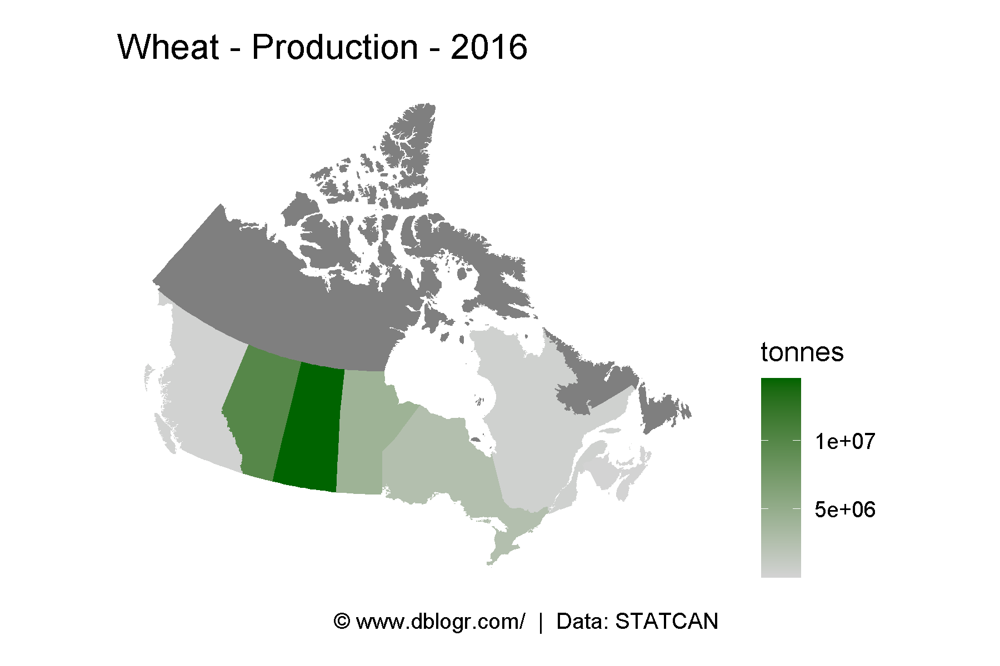
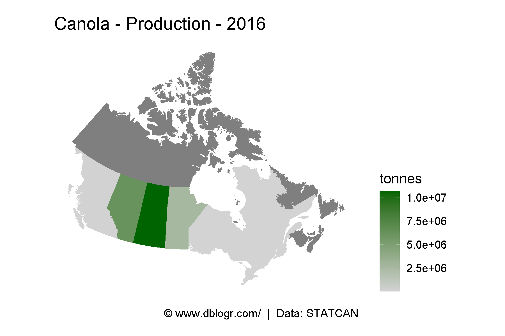
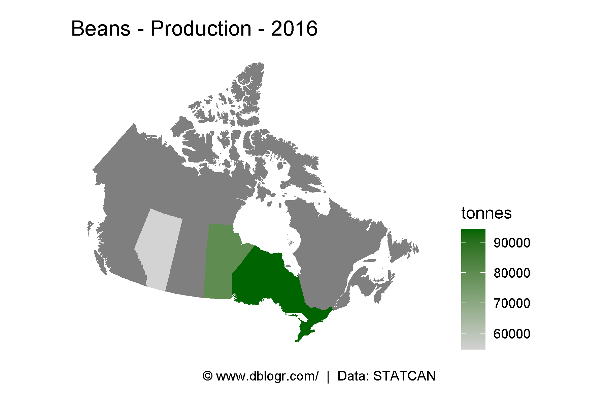
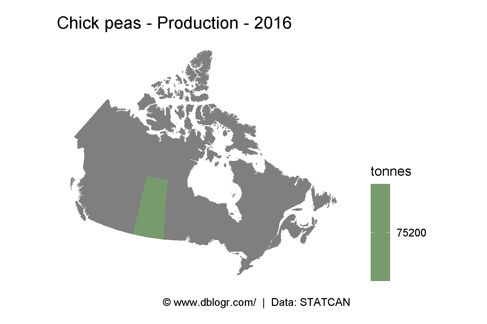

```{r setup, include = FALSE}
knitr::opts_chunk$set(echo = TRUE, message = F, warning = F)
```

---

```{r}
# devtools::install_github("derekmichaelwright/agData")
library(agData) # Loads: tidyverse, ggpubr, ggbeeswarm, ggrepel
library(mapcan)
```

# PDF

```{r eval = F}
# Prep data
xx <- agData_STATCAN_Crops
# Plot
pdf("maps_canada_crops.pdf")
for(i in unique(xx$Crop)) {
  xi <- xx %>% filter(Crop == i, Year == 2016, Measurement == "Production") 
  xi <- mapcan(boundaries = province, type = standard) %>% 
    left_join(xi, by = c("pr_english"="Area"))
  print(ggplot(xi, aes(x = long, y = lat, group = group, fill = Value / 1000000)) +
    geom_polygon() + coord_fixed() + theme_mapcan() +
    scale_fill_continuous(name = "Million Tonnes", low = "lightgrey", high = "darkgreen") +
    theme(legend.position = "right") + 
    labs(title = paste(i, "Production 2016"),
         caption = "\xa9 www.dblogr.com/  |  Data: STATCAN")) 
}
dev.off()
```

[**pdf**: Crop production Canada.](maps_canada_crops.pdf)

\pagebreak

# Plotting Function

```{r}
cropMapCan <- function(crop, measurement, year) {
  xx <- agData_STATCAN_Crops %>% 
    filter(Crop == crop, Year == year, Measurement == measurement) 
  xx <- mapcan(boundaries = province, type = standard) %>% 
    left_join(xx, by = c("pr_english"="Area"))
  # Plot
  ggplot(xx, aes(x = long, y = lat, group = group, fill = Value)) +
    geom_polygon() + coord_fixed() + theme_mapcan() +
    scale_fill_continuous(name = unique(xx$Unit[!is.na(xx$Unit)]),
                          low = "lightgrey", high = "darkgreen") +
    theme(legend.position = "right") +
    labs(title = paste(crop, measurement, year, sep = " - "),
         caption = "\xa9 www.dblogr.com/  |  Data: STATCAN")
}
```

## Wheat

```{r}
# Plot
mp <- cropMapCan("Wheat", "Production", 2016)
ggsave("maps_crops_canada_01.png", mp, width = 6, height = 4)
```

```{r echo = F}
ggsave("../../../myblog/content/graphs_agdata/crops_canada_maps/gallery/gallery/maps_crops_canada_01.png", width = 6, height = 4)
```



\pagebreak

## Canola

```{r}
# Plot
mp <- cropMapCan("Canola", "Production", 2016)
ggsave("maps_crops_canada_02.png", mp, width = 6, height = 4)
```

```{r echo = F}
ggsave("../../../myblog/content/graphs_agdata/crops_canada_maps/gallery/gallery/maps_crops_canada_02.png", mp, width = 6, height = 4)
ggsave("../../../myblog/content/posts_agdata/crops_canada_maps/featured.png", mp, width = 6, height = 4)
```


\pagebreak

## Soybeans

```{r}
# Plot
mp <- cropMapCan("Canola", "Production", 2016)
ggsave("maps_crops_canada_03.png", mp, width = 6, height = 4)
```

```{r echo = F}
ggsave("../../../myblog/content/graphs_agdata/crops_canada_maps/gallery/gallery/maps_crops_canada_03.png", mp, width = 6, height = 4)
```


\pagebreak

## Barley

```{r}
# Plot
mp <- cropMapCan("Canola", "Production", 2016)
ggsave("maps_crops_canada_04.png", mp, width = 6, height = 4)
```

```{r echo = F}
ggsave("../../../myblog/content/graphs_agdata/crops_canada_maps/gallery/gallery/maps_crops_canada_04.png", mp, width = 6, height = 4)
```


\pagebreak

## Peas

```{r}
# Plot
mp <- cropMapCan("Canola", "Production", 2016)
ggsave("maps_crops_canada_05.png", mp, width = 6, height = 4)
```

```{r echo = F}
ggsave("../../../myblog/content/graphs_agdata/crops_canada_maps/gallery/gallery/maps_crops_canada_05.png", mp, width = 6, height = 4)
```


\pagebreak

## Oats

```{r}
# Plot
mp <- cropMapCan("Canola", "Production", 2016)
ggsave("maps_crops_canada_06.png", mp, width = 6, height = 4)
```

```{r echo = F}
ggsave("../../../myblog/content/graphs_agdata/crops_canada_maps/gallery/gallery/maps_crops_canada_06.png", width = 6, height = 4)
```



\pagebreak

## Lentils

```{r}
# Plot
mp <- cropMapCan("Canola", "Production", 2016)
ggsave("maps_crops_canada_07.png", mp, width = 6, height = 4)
```

```{r echo = F}
ggsave("../../../myblog/content/graphs_agdata/crops_canada_maps/gallery/gallery/maps_crops_canada_07.png", mp, width = 6, height = 4)
```


\pagebreak

## Beans

```{r}
# Plot
mp <- cropMapCan("Beans", "Production", 2016)
ggsave("maps_crops_canada_08.png", mp, width = 6, height = 4)
```

```{r echo = F}
ggsave("../../../myblog/content/graphs_agdata/crops_canada_maps/gallery/gallery/maps_crops_canada_08.png", mp, width = 6, height = 4)
```



\pagebreak

## Chickpeas

```{r}
# Plot
mp <- cropMapCan("Chick peas", "Production", 2016)
ggsave("maps_crops_canada_09.png", mp, width = 6, height = 4)
```

```{r echo = F}
ggsave("../../../myblog/content/graphs_agdata/crops_canada_maps/gallery/gallery/maps_crops_canada_09.png", mp, width = 6, height = 4)
```

