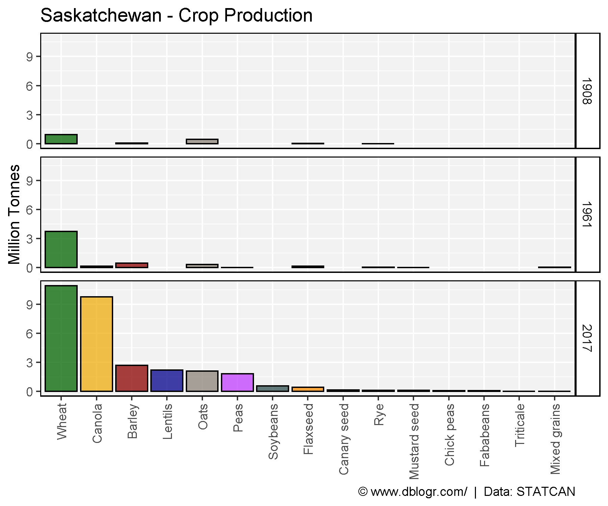
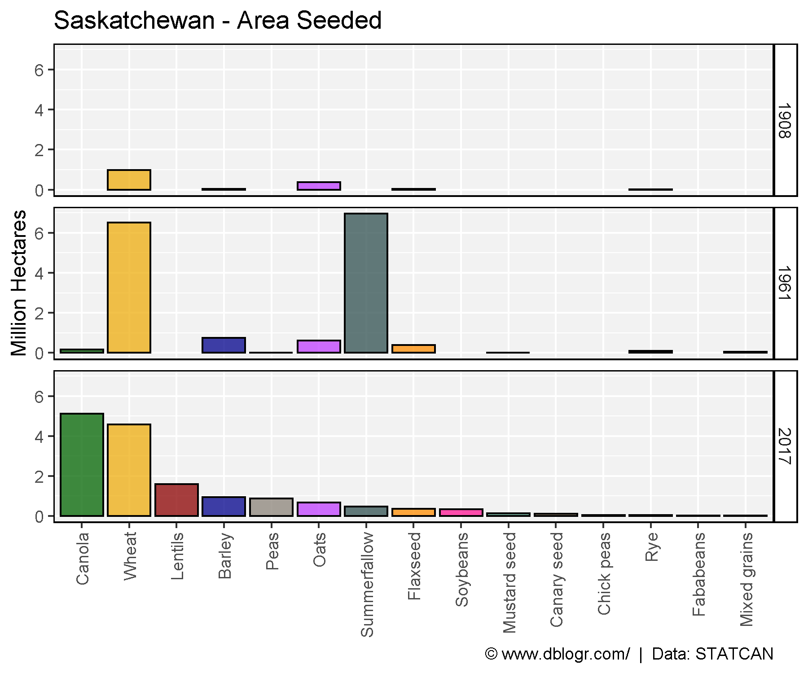
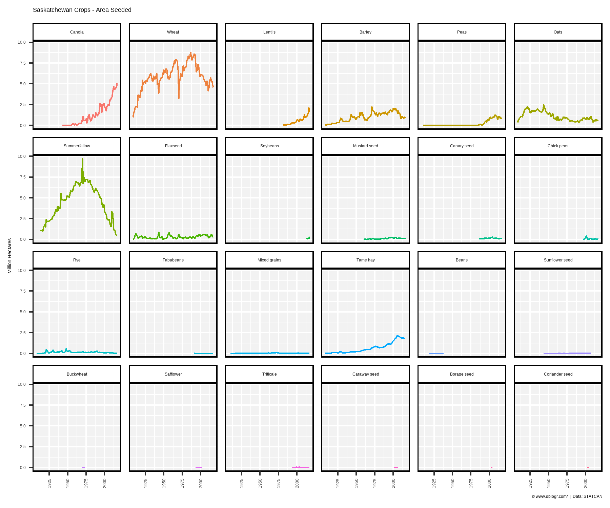
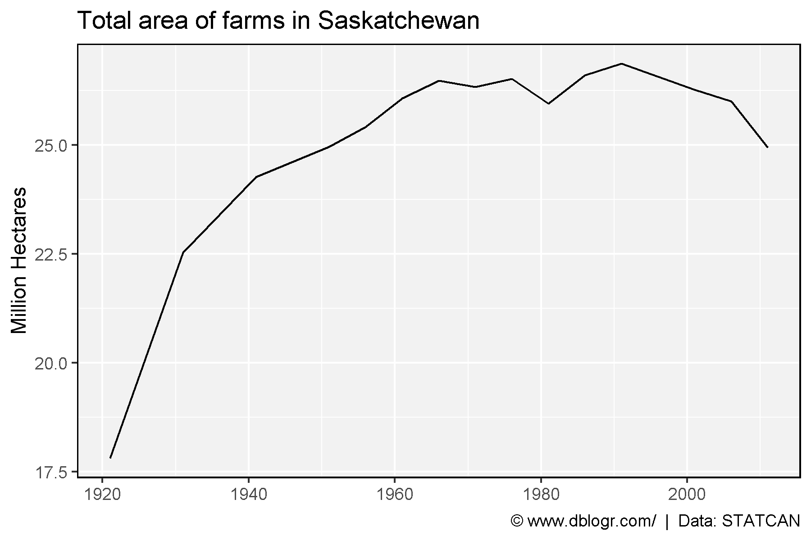

```{r setup, include = FALSE}
knitr::opts_chunk$set(echo = TRUE, message = F, warning = F)
```

---

```{r}
# devtools::install_github("derekmichaelwright/agData")
library(agData) # Loads: tidyverse, ggpubr, ggbeeswarm, ggrepel
```

---

```{r}
# Create function to determine top crops
cropList <- function(measurement = "Production") {
  # Prep data
  xx <- agData_STATCAN_Crops %>% 
    filter(Area == "Saskatchewan", Year %in% c(1908, 1961, 2017),
           Measurement == measurement)
  # Get top 15 crops from each year
  topcrops <- function(x, year, num) {
    x <- x %>% filter(Year == year) %>% arrange(desc(Value)) %>% 
      slice(1:num) %>% pull(Crop) %>% unique() %>% as.character()
    x
  }
  crops1908 <- topcrops(xx, 1908, 15)
  crops1961 <- topcrops(xx, 1961, 15)
  crops2017 <- topcrops(xx, 2017, 15)
  # Order crop list based on 2017 production
  myCrops <- unique(c(crops1908, crops1961, crops2017))
  xx %>% filter(Year == 2017, Crop %in% myCrops) %>%
    arrange(desc(Value)) %>% pull(Crop) %>% as.character()
}
```

---

# Crop Production 1908, 1961, 2017

```{r}
# Prep data
myCrops <- cropList(measurement = "Production")
xx <- agData_STATCAN_Crops %>% 
  filter(Area == "Saskatchewan", Year %in% c(1908, 1961, 2017),
         Measurement == "Production", Crop %in% myCrops) %>%
  mutate(Crop = factor(Crop, levels = myCrops) )
# Plot
mp <- ggplot(xx, aes(x = Crop, y = Value / 1000000, fill = Crop)) + 
  geom_bar(stat = "identity", color = "Black") + 
  facet_grid(Year~.) + 
  scale_fill_manual(values = alpha(agData_Colors, 0.75)) +
  theme_agData(legend.position = "none", rotx = T) + 
  labs(title = "Saskatchewan - Crop Production", y = "Million Tonnes", x = NULL,
       caption = "\xa9 www.dblogr.com/  |  Data: STATCAN")
ggsave("crops_saskatchewan_01.png", mp, width = 6, height = 5)
```

```{r echo = F}
ggsave("../../../myblog/content/graphs_agdata/crops_saskatchewan/gallery/gallery/crops_saskatchewan_01.png", mp, width = 6, height = 5)
ggsave("../../../myblog/content/posts_agdata/crops_saskatchewan/featured.png", mp, width = 6, height = 5)
```



---

# Crop Area 1908, 1961, 2017

```{r}
# Prep data
myCrops <- cropList(measurement = "Area seeded")
xx <- agData_STATCAN_Crops %>% 
  filter(Area == "Saskatchewan", Year %in% c(1908, 1961, 2017),
         Measurement == "Area seeded", Crop %in% myCrops) %>%
  mutate(Crop = factor(Crop, levels = myCrops) )
# Plot
mp <- ggplot(xx, aes(x = Crop, y = Value / 1000000, fill = Crop)) + 
  geom_bar(stat = "identity", color = "Black") + 
  facet_grid(Year ~ .) + 
  scale_fill_manual(values = alpha(agData_Colors, 0.75)) +
  theme_agData(legend.position = "none", rotx = T) + 
  labs(title = "Saskatchewan - Area Seeded", y = "Million Hectares", x = NULL,
       caption = "\xa9 www.dblogr.com/  |  Data: STATCAN")
ggsave("crops_saskatchewan_02.png", mp, width = 6, height = 5)
```

```{r echo = F}
ggsave("../../../myblog/content/graphs_agdata/crops_saskatchewan/gallery/gallery/crops_saskatchewan_02.png", mp, width = 6, height = 5)
ggsave("../../../myblog/content/home/gallery/gallery/02_crops_saskatchewan_02.png", mp, width = 6, height = 5)
```



---

# All Crops

```{r}
# Prep data
xx <- agData_STATCAN_Crops %>% 
  filter(Area == "Saskatchewan", Measurement == "Area seeded") 
myCrops <- unique(c(cropList(measurement = "Area seeded"), as.character(xx$Crop)))
xx <- xx %>% mutate(Crop = factor(Crop, levels = myCrops))
# Plot
mp <- ggplot(xx, aes(x = Year, y = Value / 1000000, color = Crop)) + 
  geom_line() + 
  facet_wrap(Crop~., ncol = 6) + 
  scale_fill_manual(values = alpha(agData_Colors, 0.75)) +
  theme_agData(legend.position = "none", rotx = T) + 
  labs(title = "Saskatchewan Crops - Area Seeded", y = "Million Hectares", x = NULL,
       caption = "\xa9 www.dblogr.com/  |  Data: STATCAN")
ggsave("crops_saskatchewan_03.png", mp, width = 6, height = 5)
```

```{r echo = F}
ggsave("../../../myblog/content/graphs_agdata/crops_saskatchewan/gallery/gallery/crops_saskatchewan_03.png", mp, width = 6, height = 5)
```



---

# Farm Area

```{r}
# Prep data
xx <- agData_STATCAN_FarmUse_Land %>% 
  filter(Area == "Saskatchewan", Item == "Total area of farms", 
         Unit == "Hectares", !is.na(Value))
# Plot
mp <- ggplot(xx, aes(x = Year, y = Value / 1000000)) + 
  geom_line() +
  theme_agData() +
  labs(title = "Total area of farms in Saskatchewan", y = "Million Hectares", x = NULL,
       caption = "\xa9 www.dblogr.com/  |  Data: STATCAN")
ggsave("crops_saskatchewan_04.png", mp, width = 6, height = 4)
```

```{r echo = F}
ggsave("../../../myblog/content/graphs_agdata/crops_saskatchewan/gallery/gallery/crops_saskatchewan_04.png", mp, width = 6, height = 4)
```



---

&copy; Derek Michael Wright 2020 [www.dblogr.com/](https://dblogr.netlify.com/)