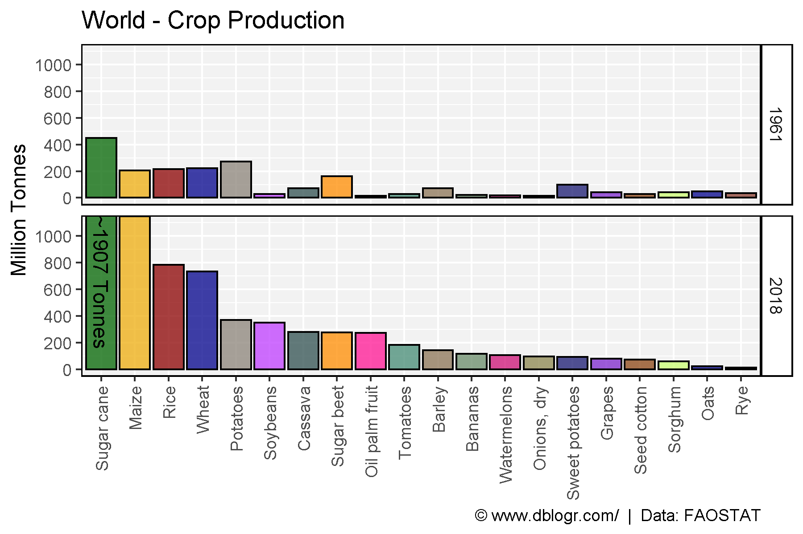
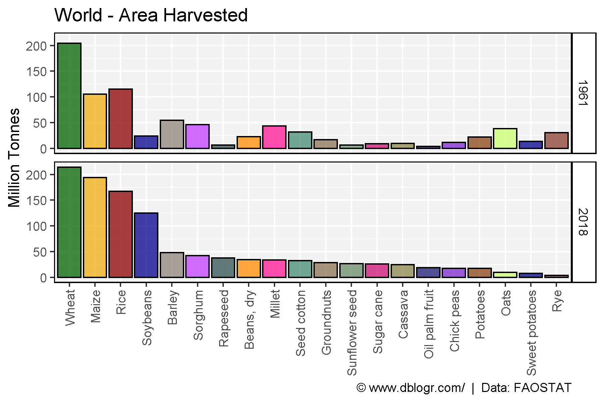
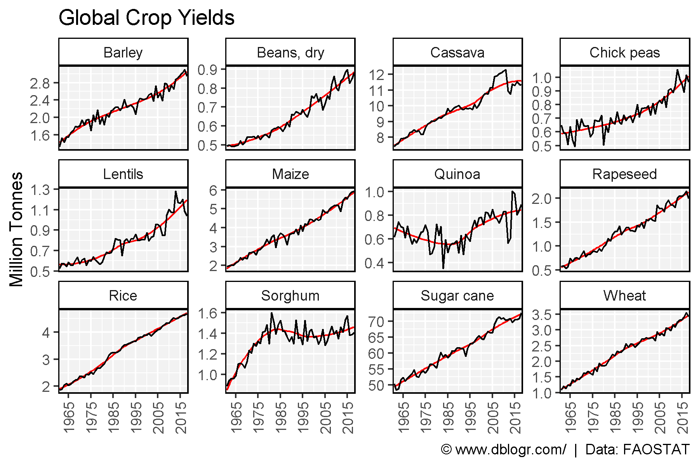
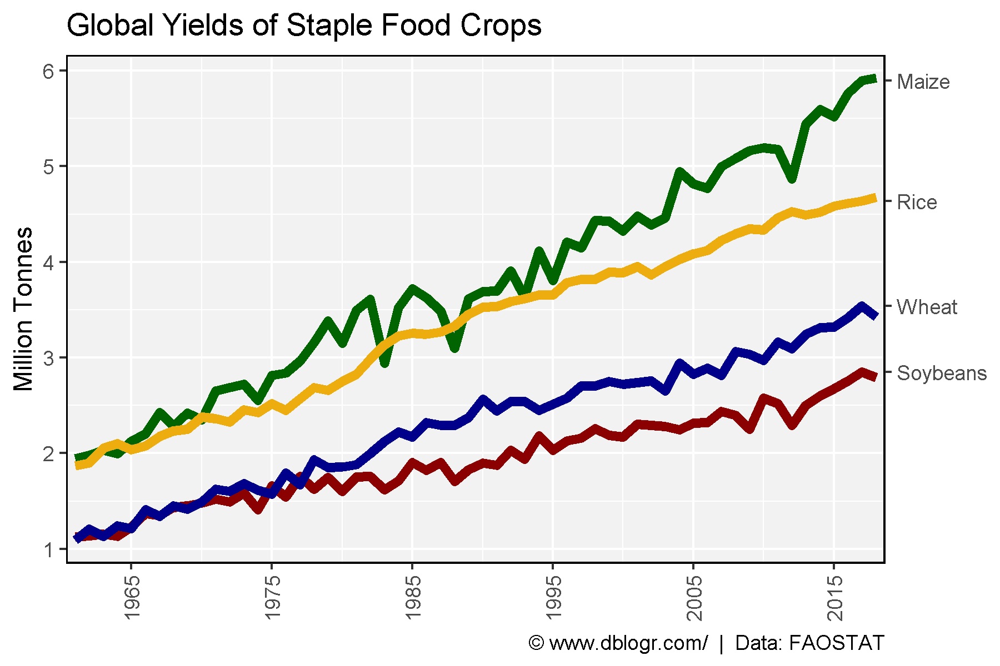

```{r setup, include = FALSE}
knitr::opts_chunk$set(echo = TRUE, message = F, warning = F)
```

---

```{r}
# devtools::install_github("derekmichaelwright/agData")
library(agData) # Loads: tidyverse, ggpubr, ggbeeswarm, ggrepel
```

---

```{r}
# Create function to determine top crops
cropList <- function(measurement) {
  # Prep data
  xx <- agData_FAO_Crops %>% 
    filter(Area == "World", Measurement == measurement, Year %in% c(1961, 2018))
  # Get top 15 crops from each year
  topcrops <- function(x, year, num) {
    x <- x %>% filter(Year == year) %>% arrange(desc(Value)) %>% 
      slice(1:num) %>% pull(Crop) %>% unique() %>% as.character()
  }
  crops1961 <- topcrops(xx, 1961, 15)
  crops2018 <- topcrops(xx, 2018, 15)
  # Order crop list based on 2018 production
  myCrops <- unique(c(crops1961, crops2018))
  xx %>% filter(Year == 2018, Crop %in% myCrops) %>%
    arrange(desc(Value)) %>% pull(Crop) %>% as.character()
}
```

---

# Crop Production 1961 and 2018

```{r}
# Prep data
myCrops <- cropList(measurement = "Production")
xx <- agData_FAO_Crops %>% 
    filter(Area == "World", Year %in% c(1961, 2018),
           Measurement == "Production", Crop %in% myCrops) %>% 
  mutate(Text = ifelse(Crop == "Sugar cane" & Year == 2018, 
                       paste0("~", round(Value / 1000000), " Tonnes"), NA),
         Crop = factor(Crop, levels = myCrops) )
# Plot
mp <- ggplot(xx, aes(x = Crop, y = Value / 1000000, fill = Crop)) + 
  geom_bar(stat = "identity", color = "Black") + 
  geom_text(aes(label = Text), y = 1150, angle = 270, hjust = 0, vjust = 0.5 ) + 
  facet_grid(Year ~ .) + 
  scale_fill_manual(values = alpha(agData_Colors, 0.75)) +
  scale_y_continuous(breaks = seq(0, 1000, by = 200)) +
  coord_cartesian(ylim = c(0,1100)) +
  theme_agData(legend.position = "none", rotx = T) +
  labs(title = "World - Crop Production", y = "Million Tonnes", x = NULL,
       caption = "\xa9 www.dblogr.com/  |  Data: FAOSTAT")
ggsave("crops_world_01.png", mp, width = 6, height = 4)
```

```{r echo = F}
ggsave("../../../myblog/content/graphs_agdata/crops_world/gallery/gallery/crops_world_01.png", mp, width = 6, height = 4)
ggsave("../../../myblog/content/home/gallery/gallery/01_crops_world_01.png", mp, width = 6, height = 4)
ggsave("../../../myblog/content/posts_agdata/crops_world/featured.png", mp, width = 6, height = 4)
```



---

# Crop Area 1961 and 2018

```{r}
# Prep data
myCrops <- cropList(measurement = "Area harvested")
xx <- agData_FAO_Crops %>% 
    filter(Area == "World", Year %in% c(1961, 2018),
           Measurement == "Area harvested", Crop %in% myCrops) %>% 
  mutate(Crop = factor(Crop, levels = myCrops),
         Crop = plyr::mapvalues(Crop, "Groundnuts, with shell", "Groundnuts"))
# Plot
mp <- ggplot(xx, aes(x = Crop, y = Value / 1000000, fill = Crop)) + 
  geom_bar(stat = "identity", color = "Black") + 
  facet_grid(Year ~ .) + 
  scale_fill_manual(values = alpha(agData_Colors, 0.75)) +
  theme_agData(legend.position = "none", rotx = T) +
  labs(title = "World - Area Harvested", y = "Million Tonnes", x = NULL,
       caption = "\xa9 www.dblogr.com/  |  Data: FAOSTAT")
ggsave("crops_world_02.png", mp, width = 6, height = 4)
```

```{r echo = F}
ggsave("../../../myblog/content/graphs_agdata/crops_world/gallery/gallery/crops_world_02.png", width = 6, height = 4)
```



---

# Crop Yields

```{r}
# Prep data
crops <- c("Barley", "Beans, dry", "Cassava", "Chick peas", 
           "Lentils", "Maize", "Quinoa", "Rapeseed", 
           "Rice", "Sorghum", "Sugar cane", "Wheat" )
xx <- agData_FAO_Crops %>% 
  filter(Area == "World", Measurement == "Yield", Crop %in% crops) 
# Plot
mp <- ggplot(xx, aes(x = Year, y = Value)) + 
  geom_smooth(se = F, color = "red", size = 0.5) +
  geom_line(stat = "identity", color = "Black") + 
  facet_wrap(Crop ~ ., scale = "free_y", ncol = 4) + 
  scale_x_continuous(breaks = seq(1965, 2015, by = 10)) +
  coord_cartesian(xlim = c(min(xx$Year)+2, max(xx$Year)-2)) +
  theme_agData(rotx = T) +
  labs(title = "Global Crop Yields", y = "Million Tonnes", x = NULL,
       caption = "\xa9 www.dblogr.com/  |  Data: FAOSTAT")
ggsave("crops_world_03.png", mp, width = 6, height = 4)
```

```{r echo = F}
ggsave("../../../myblog/content/graphs_agdata/crops_world/gallery/gallery/crops_world_03.png", mp, width = 6, height = 4)
```



---

# Major Crop Yields

```{r}
# Prep data
xx <- agData_FAO_Crops %>% 
  filter(Area == "World", Measurement == "Yield",
         Crop %in% c("Maize","Rice","Wheat","Soybeans"))
xT <- xx %>% filter(Year == 2017)
# Plot
mp <- ggplot(xx, aes(x = Year, y = Value, color = Crop)) + 
  geom_line(size = 2) + 
  scale_x_continuous(breaks = seq(1965, 2015, by = 10)) +
  scale_y_continuous(sec.axis = sec_axis(~., breaks = xT$Value, labels = xT$Crop)) +
  scale_color_manual(values = agData_Colors) +
  coord_cartesian(xlim = c(min(xx$Year)+2, max(xx$Year)-2)) +
  theme_agData(legend.position = "none", rotx = T) +
  labs(title = "Global Yields of Staple Food Crops", y = "Million Tonnes", x = NULL,
       caption = "\xa9 www.dblogr.com/  |  Data: FAOSTAT")
ggsave("crops_world_04.png", mp, width = 6, height = 4)
```

```{r echo = F}
ggsave("../../../myblog/content/graphs_agdata/crops_world/gallery/gallery/crops_world_04.png", mp, width = 6, height = 4)
```



---

&copy; Derek Michael Wright 2020 [www.dblogr.com/](https://dblogr.netlify.com/)
