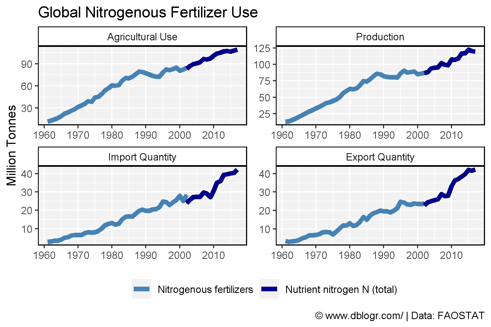
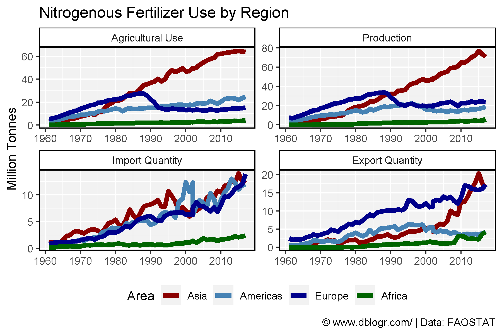
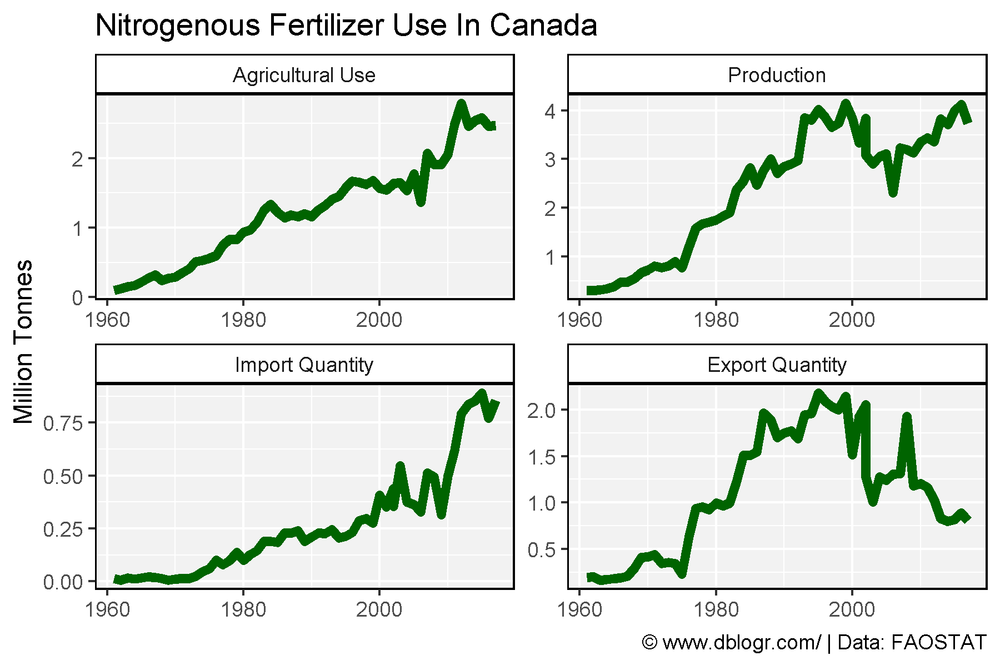
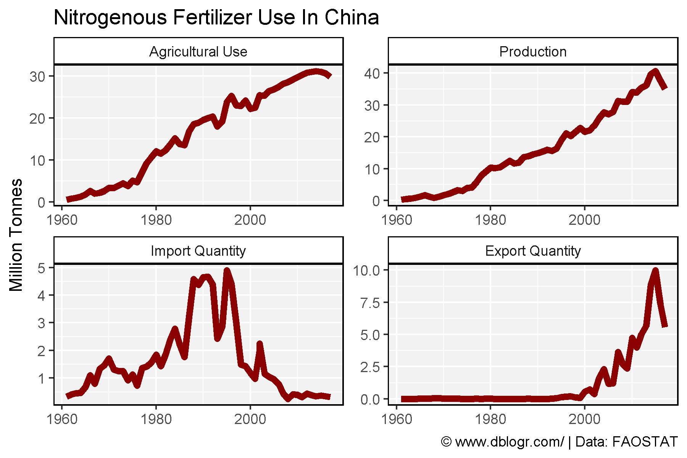
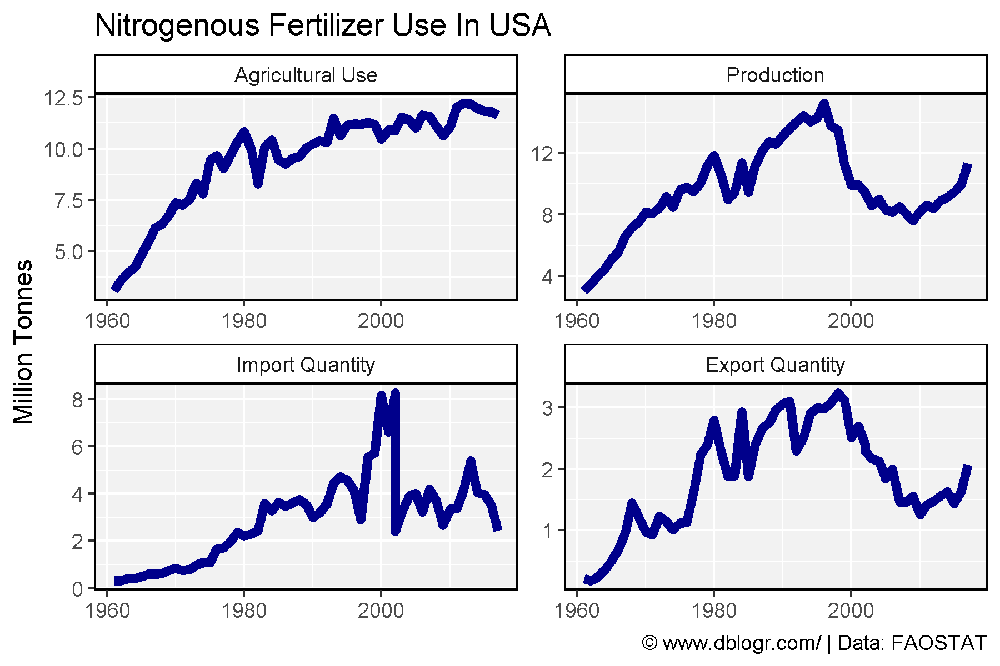
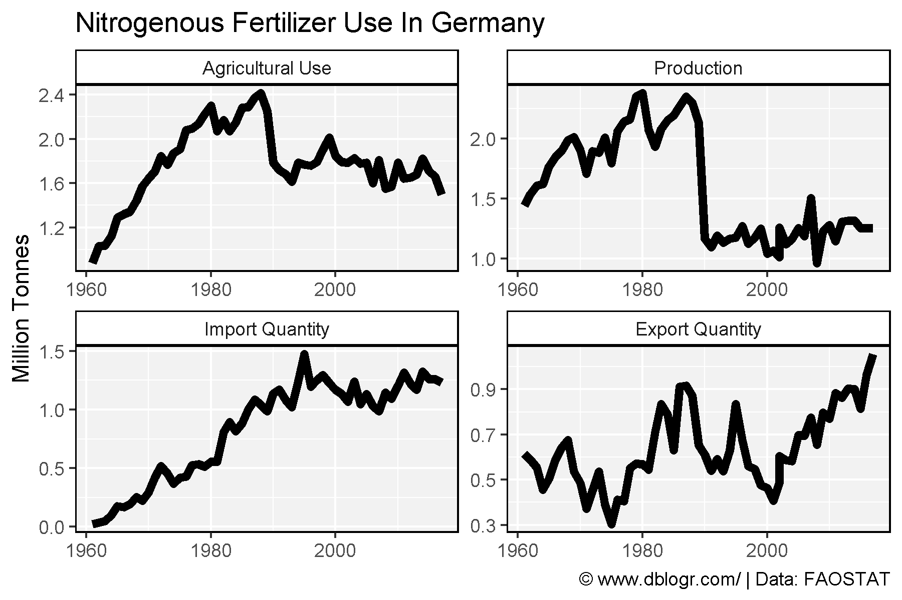
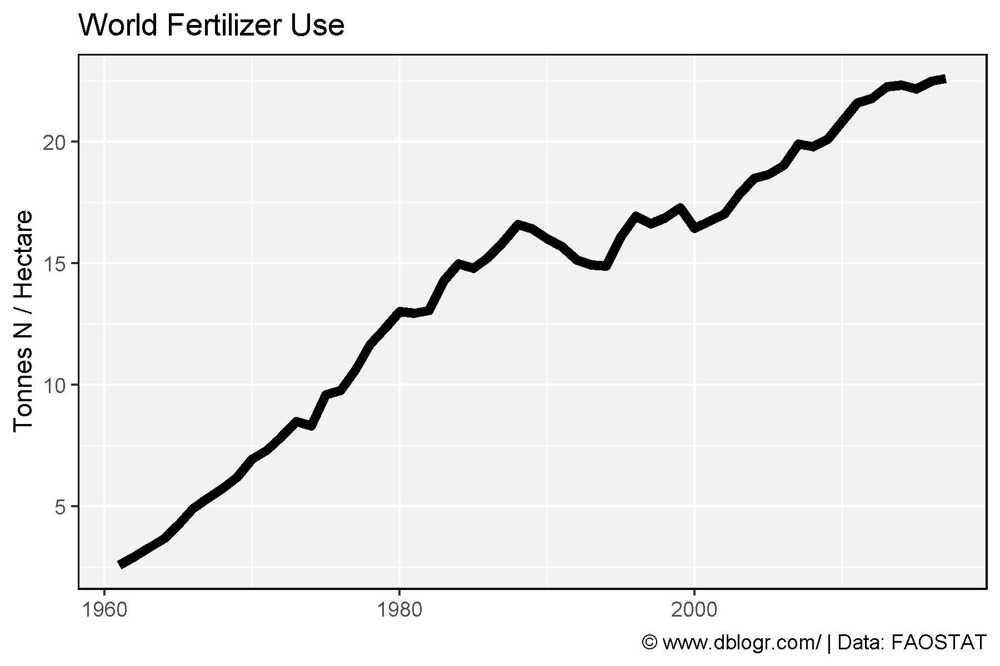
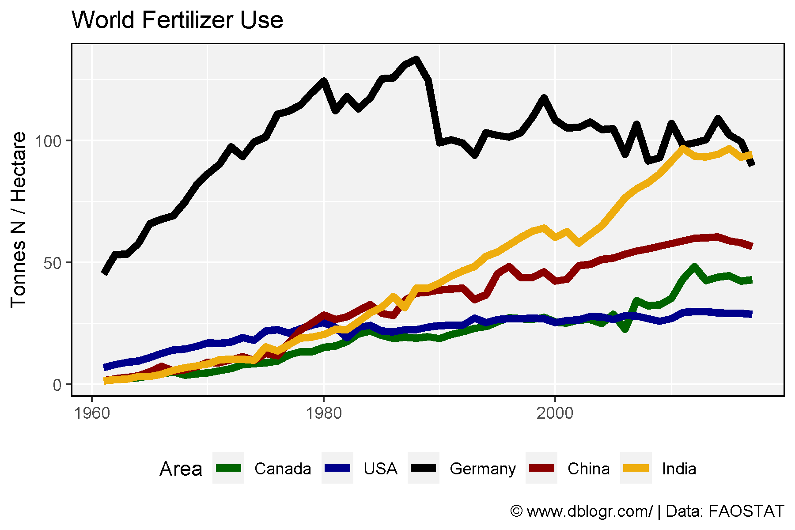
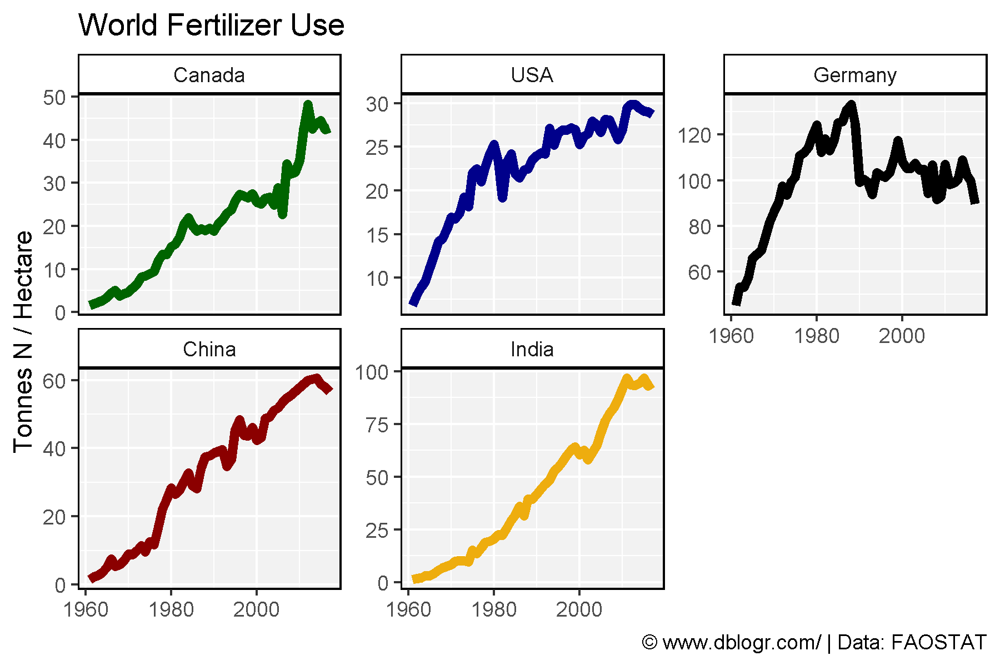

```{r setup, include = FALSE}
knitr::opts_chunk$set(echo = TRUE, message = F, warning = F)
```

---

```{r}
# devtools::install_github("derekmichaelwright/agData")
library(agData) # Loads: tidyverse, ggpubr, ggbeeswarm, ggrepel
```

---

# Nitrogenous Fertilizer

## World

```{r}
# Prep data
mm <- c("Agricultural Use", "Production", "Import Quantity", "Export Quantity")
xx <- agData_FAO_Fertilizers %>% 
  filter(Area == "World", Measurement %in% mm,
         Item %in% c("Nitrogenous fertilizers", "Nutrient nitrogen N (total)")) %>%
  mutate(Measurement = factor(Measurement, levels = mm))
# Plot
mp <- ggplot(xx, aes(x = Year, y = Value / 1000000)) + 
  geom_line() +
  geom_line(size = 2, aes(color = Item)) + 
  facet_wrap(Measurement~., scales = "free") +
  scale_x_continuous(breaks = seq(1960, 2020, by = 10)) + 
  scale_color_manual(name = NULL, values = c("steelblue","darkblue")) + 
  theme_agData(legend.position = "bottom") +
  labs(title = "Global Nitrogenous Fertilizer Use",
       caption = "\xa9 www.dblogr.com/ | Data: FAOSTAT",
       y = "Million Tonnes", x = NULL)
ggsave("fertilizers_01.png", mp, width = 6, height = 4)
```

```{r echo = F}
ggsave("../../../myblog/content/graphs_agdata/fertilizers/gallery/gallery/fertilizers_01.png", mp, width = 6, height = 4)
```



---

## Regions

```{r}
# Prep data
mm <- c("Agricultural Use", "Production", "Import Quantity", "Export Quantity")
areas <- c("Asia","Americas","Europe","Africa")
xx <- agData_FAO_Fertilizers %>% 
  filter(Area %in% areas, Measurement != "Other Uses",
         Item %in% c("Nitrogenous fertilizers", "Nutrient nitrogen N (total)")) %>%
  mutate(Measurement = factor(Measurement, levels = mm),
         Area = factor(Area, levels = areas))
# Plot
mp <- ggplot(xx, aes(x = Year, y = Value / 1000000, color = Area)) + 
  geom_line(size = 2) + 
  facet_wrap(Measurement~., scales = "free") +
  theme_agData(legend.position = "bottom") +
  scale_x_continuous(breaks = seq(1960, 2020, by = 10)) + 
  scale_color_manual(values = c("darkred","steelblue","darkblue","darkgreen")) + 
  labs(title = "Nitrogenous Fertilizer Use by Region",
       caption = "\xa9 www.dblogr.com/ | Data: FAOSTAT",
       y = "Million Tonnes", x = NULL)
ggsave("fertilizers_02.png", mp, width = 6, height = 4)
```

```{r echo = F}
ggsave("../../../myblog/content/graphs_agdata/fertilizers/gallery/gallery/fertilizers_02.png", mp, width = 6, height = 4)
```



---

## Countries

```{r}
# Create plotting function
ggFertN <- function(area, color = "darkred") {
  # Prep data
  mm <- c("Agricultural Use", "Production", "Import Quantity", "Export Quantity")
  xx <- agData_FAO_Fertilizers %>% 
    filter(Area == area, Measurement != "Other Uses",
           Item %in% c("Nitrogenous fertilizers", "Nutrient nitrogen N (total)")) %>%
    mutate(Measurement = factor(Measurement, levels = mm))
  # Plot
  ggplot(xx, aes(x = Year, y = Value / 1000000)) + 
    geom_line(size = 2, color = color) + 
    facet_wrap(Measurement ~ ., scales = "free") +
    theme_agData() +
    labs(title = paste("Nitrogenous Fertilizer Use In", area),
         caption = "\xa9 www.dblogr.com/ | Data: FAOSTAT",
         y = "Million Tonnes", x = NULL)
}
```

---

### Canada

```{r}
# Plot
mp <- ggFertN("Canada", "darkgreen")
ggsave("fertilizers_03.png", mp, width = 6, height = 4)
```

```{r echo = F}
ggsave("../../../myblog/content/graphs_agdata/fertilizers/gallery/gallery/fertilizers_03.png", mp, width = 6, height = 4)
```



---

### China

```{r}
# Plot
mp <- ggFertN("China", "darkred")
ggsave("fertilizers_04.png", mp, width = 6, height = 4)
```

```{r echo = F}
ggsave("../../../myblog/content/graphs_agdata/fertilizers/gallery/gallery/fertilizers_04.png", mp, width = 6, height = 4)
```



---

### USA

```{r}
# Plot
mp <- ggFertN("USA", "darkblue")
ggsave("fertilizers_05.png", mp, width = 6, height = 4)
```

```{r echo = F}
ggsave("../../../myblog/content/graphs_agdata/fertilizers/gallery/gallery/fertilizers_05.png", mp, width = 6, height = 4)
```



---

### Germany

```{r}
# Plot
mp <- ggFertN("Germany", "black")
ggsave("fertilizers_06.png", mp, width = 6, height = 4)
```

```{r echo = F}
ggsave("../../../myblog/content/graphs_agdata/fertilizers/gallery/gallery/fertilizers_06.png", mp, width = 6, height = 4)
```



---

# N / Ha

```{r}
# Prep data
y1 <- agData_FAO_Fertilizers %>% 
  filter(Measurement == "Agricultural Use",
         Item == "Nitrogenous fertilizers", Year < 2002 )
y2 <- agData_FAO_Fertilizers %>% 
  filter(Measurement == "Agricultural Use",
         Item == "Nutrient nitrogen N (total)") %>%
  mutate(Item = "Nitrogenous fertilizers")
y3 <- agData_FAO_LandUse %>% filter(Item == "Agricultural land")
yy <- bind_rows(y1, y2, y3) %>% select(-Measurement, -Unit) %>% 
  spread(Item, Value) %>%
  mutate(NPH = `Nitrogenous fertilizers` / `Agricultural land`)
```

---

## World

```{r}
# Prep data
xx <- yy %>% filter(Area == "World")
# Plot
mp <- ggplot(xx, aes(x = Year, y = NPH)) + 
  geom_line(size = 2) + theme_agData() +
  labs(title = "World Fertilizer Use", y = "Tonnes N / Hectare", x = NULL,
       caption = "\xa9 www.dblogr.com/ | Data: FAOSTAT")
ggsave("fertilizers_07.png", mp, width = 6, height = 4)
```

```{r echo = F}
ggsave("../../../myblog/content/graphs_agdata/fertilizers/gallery/gallery/fertilizers_07.png", mp, width = 6, height = 4)
```



---

## Regions

```{r}
# Prep data
areas <- c("Europe","Americas","Asia","Africa")
xx <- yy %>% filter(Area %in% areas) %>%
  mutate(Area = factor(Area, levels = areas))
# Plot
mp <- ggplot(xx, aes(x = Year, y = NPH, color = Area)) + 
  geom_line(size = 2) + 
  scale_color_manual(values = c("darkblue","steelblue","darkred","darkgreen")) + 
  theme_agData(legend.position = "bottom") +
  labs(title = "World Fertilizer Use", y = "Tonnes N / Hectare", x = NULL,
       caption = "\xa9 www.dblogr.com/ | Data: FAOSTAT")
ggsave("fertilizers_08.png", mp, width = 6, height = 4)
```

```{r echo = F}
ggsave("../../../myblog/content/graphs_agdata/fertilizers/gallery/gallery/fertilizers_08.png", mp, width = 6, height = 4)
```


---

## Countries

```{r}
# Prep data
colors <- c("darkgreen", "darkblue", "black",   "darkred", "darkgoldenrod2")
areas  <- c("Canada",    "USA",      "Germany", "China",   "India")
xx <- yy %>% filter(Area %in% areas) %>%
  mutate(Area = factor(Area, levels = areas))
# Plot
mp <- ggplot(xx, aes(x = Year, y = NPH, color = Area)) + 
  geom_line(size = 2) + 
  scale_color_manual(values = colors) + 
  theme_agData(legend.position = "bottom") +
  labs(title = "World Fertilizer Use", y = "Tonnes N / Hectare", x = NULL,
       caption = "\xa9 www.dblogr.com/ | Data: FAOSTAT")
ggsave("fertilizers_09.png", mp, width = 6, height = 4)
```

```{r echo = F}
ggsave("../../../myblog/content/posts_agdata/fertilizers/featured.png", mp, width = 6, height = 4)
ggsave("../../../myblog/content/graphs_agdata/fertilizers/gallery/gallery/fertilizers_09.png", mp, width = 6, height = 4)
```



---

```{r}
# Plot
mp <- mp + facet_wrap(Area ~., ncol = 3, scales = "free_y") +
  theme(legend.position = "none")
ggsave("fertilizers_10.png", mp, width = 6, height = 4)
```

```{r echo = F}
ggsave("../../../myblog/content/graphs_agdata/fertilizers/gallery/gallery/fertilizers_10.png", mp, width = 6, height = 4)
```



---

&copy; Derek Michael Wright 2020 [www.dblogr.com/](https://dblogr.netlify.com/)
