```{r setup, include = FALSE}
knitr::opts_chunk$set(echo = TRUE, message = F, warning = F)
```

---

```{r}
# devtools::install_github("derekmichaelwright/agData")
library(agData) # Loads: tidyverse, ggpubr, ggbeeswarm, ggrepel
```

# Prep data

```{r}
# Prep Data
areas <- c("World", agData_FAO_Country_Table %>% pull(SubRegion) %>% unique() %>% as.character())
crops <- c("Cereals, Total", "Pulses, Total", "Roots and Tubers, Total")
dd <- agData_FAO_Crops2 %>% select(-Unit) %>%
  filter(Area %in% areas, Crop %in% crops) %>%
  spread(Measurement, Value)
pp <- agData_FAO_Population %>%
  filter(Measurement == "Total") %>%
  select(Area, Year, Population=Value)
dd <- left_join(dd, pp, by = c("Area", "Year")) %>%
  left_join(agData_FAO_Region_Table, by = c("Area"="SubRegion")) %>%
  mutate(TonnesPerPerson = Production / Population,
         Crop = plyr::mapvalues(Crop, crops, c("Cereals", "Pulses", "Tubers")),
         Area = plyr::mapvalues(Area, "Australia and New Zealand", "Au and NZ"))
for(i in 1:nrow(dd)) {
  p1961 <- dd %>% filter(Area == dd$Area[i], Crop == dd$Crop[i], Year == 1961) %>% 
    pull(Population)
  dd$Population_R1961[i] <- ifelse(length(p1961)>0, 100*(dd$Population[i] - p1961) / p1961, NA)
  p1961 <- dd %>% filter(Area == dd$Area[i], Crop == dd$Crop[i], Year == 1961) %>% 
    pull(Production)
  dd$Production_R1961[i] <- ifelse(length(p1961), 100*(dd$Production[i] - p1961) / p1961, NA)
  p1961 <- dd %>% filter(Area == dd$Area[i], Crop == dd$Crop[i], Year == 1961) %>% 
    pull(Yield)
  dd$Yield_R1961[i] <- ifelse(length(p1961), 100*(dd$Yield[i] - p1961) / p1961, NA)
  p1961 <- dd %>% filter(Area == dd$Area[i], Crop == dd$Crop[i], Year == 1961) %>% 
    pull(`Area harvested`)
  dd$Area_R1961[i] <- ifelse(length(p1961), 100*(dd$`Area harvested`[i] - p1961) / p1961, NA)
}
```

# Relative to Population

```{r}
# Prep data
xx <- dd %>% filter(Area == "World")
# Plot
mp <- ggplot(xx, aes(x = Year)) +
  geom_line(aes(y = Population_R1961, color = "Population")) +
  geom_line(aes(y = Production_R1961, color = Crop)) +
  scale_color_manual(name = NULL, values = agData_Colors,
                     breaks = c("Population","Cereals", "Pulses", "Tubers")) +
  theme_agData() +
  labs(title = "Production Relative to 1961", y = "%", x = NULL)
ggsave("global_food_security_01.png", mp, width = 6, height = 4)
```

```{r echo = F}
ggsave("../../../myblog/content/graphs_agdata/global_food_security/gallery/gallery/global_food_security_01.png", mp, width = 6, height = 4)
```

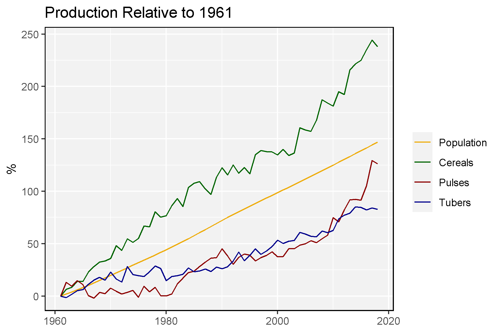

```{r}
# Prep data
xx <- dd %>% filter(Area == "World")
# Plot
mp <- ggplot(xx, aes(x = Year)) +
  geom_line(aes(y = Population_R1961, color = "Population")) +
  geom_line(aes(y = Production_R1961, color = "Production")) +
  geom_line(aes(y = Yield_R1961, color = "Yield")) +
  geom_line(aes(y = Area_R1961, color = "Area")) +
  facet_grid(.~Crop) +
  scale_x_continuous(breaks = seq(1965,2015, by = 25)) +
  scale_color_manual(name = NULL, values = agData_Colors,
                     breaks = c("Population","Production", "Yield", "Area")) +
  theme_agData(legend.position = "bottom") +
  labs(title = "Relative to 1961", y = "%", x = NULL)
ggsave("global_food_security_02.png", mp, width = 6, height = 4)
```

```{r echo = F}
ggsave("../../../myblog/content/graphs_agdata/global_food_security/gallery/gallery/global_food_security_02.png", mp, width = 6, height = 4)
```


```{r}
# Prep data
xx <- dd %>% filter(Crop == "Cereals", Area == "World")
# Plot
mp <- ggplot(xx, aes(x = Year)) +
  geom_line(aes(y = Population_R1961, color = "Population")) +
  geom_line(aes(y = Production_R1961, color = "Production")) +
  geom_line(aes(y = Yield_R1961, color = "Yield")) +
  geom_line(aes(y = Area_R1961, color = "Area")) +
  scale_x_continuous(breaks = seq(1965,2015, by = 25)) +
  scale_color_manual(name = NULL, values = agData_Colors,
                     breaks = c("Population","Production", "Yield", "Area")) +
  theme_agData(legend.position = "bottom") +
  labs(title = "Relative to 1961 - Cereals", y = "%", x = NULL)
ggsave("global_food_security_03.png", mp, width = 6, height = 4)
```
```{r echo = F}
ggsave("../../../myblog/content/graphs_agdata/global_food_security/gallery/gallery/global_food_security_03.png", mp, width = 6, height = 4)
```

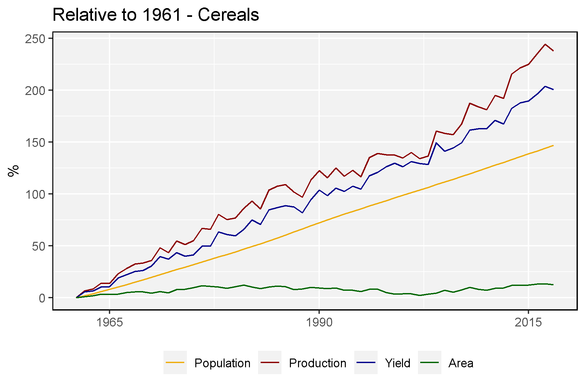

# Regions

```{r}
# Prep data
xx <- dd %>% filter(Year == 2017, Area != "World")
# Plot
mp <- ggplot(xx, aes(x = Area, y = TonnesPerPerson, fill = Region)) + 
  geom_bar(stat = "identity", color = "black") +
  facet_grid(Crop ~ Region, scales = "free", space = "free_x") +
  scale_fill_manual(values = agData_Colors[c(1,4,3,2,7)]) +
  theme_agData(legend.position = "none", rotx = T) +
  labs(title = "Food Security - 2017", y = "Tonnes Per Person", x = NULL,
       caption = "\xa9 www.dblogr.com/  |  Data: FAOSTAT")
ggsave("global_food_security_04.png", mp, width = 6, height = 4)
```

```{r echo = F}
ggsave("../../../myblog/content/graphs_agdata/global_food_security/gallery/gallery/global_food_security_04.png", mp, width = 6, height = 4)
ggsave("../../../myblog/content/posts_agdata/global_food_security/featured.png", mp, width = 6, height = 4)
```

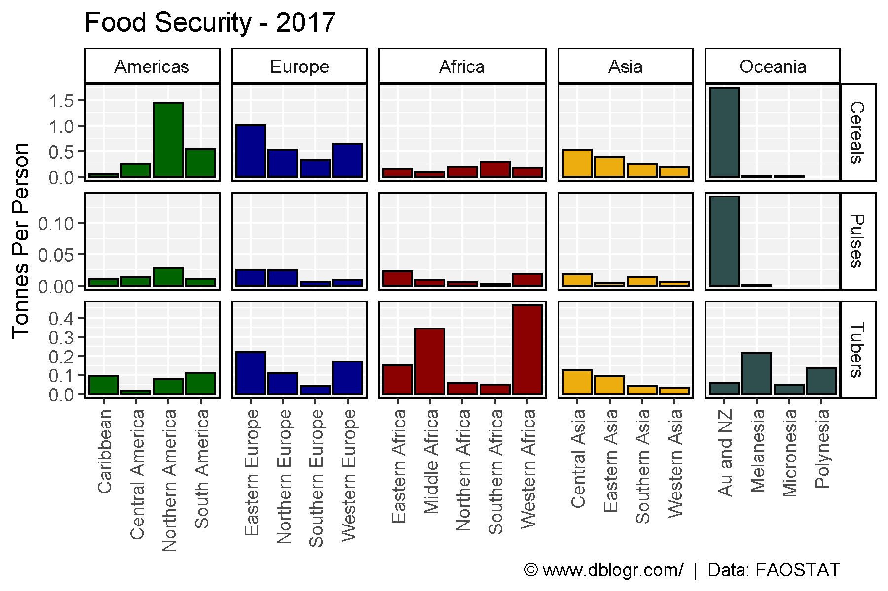

```{r}
# Prep Data
xx <- dd %>% filter(Year == 2017, Area != "World") %>%
  select(Area, Region, Crop, TonnesPerPerson) %>%
  spread(Crop, TonnesPerPerson)
# Plot
mp <- ggplot(xx, aes(x = Cereals, y = Pulses)) + 
  geom_point(aes(size = Tubers, color = Region), alpha = 0.5) + 
  geom_text_repel(aes(label = Area), size = 3) +
  scale_color_manual(values = agData_Colors[c(1,4,3,2,7)]) +
  theme_agData(rotx = T) +
  labs(title = "Food Security - 2017",
       caption = "\xa9 www.dblogr.com/  |  Data: FAOSTAT")
ggsave("global_food_security_05.png", mp, width = 6, height = 4)
```

```{r echo = F}
ggsave("../../../myblog/content/graphs_agdata/global_food_security/gallery/gallery/global_food_security_05.png", mp, width = 6, height = 4)
```

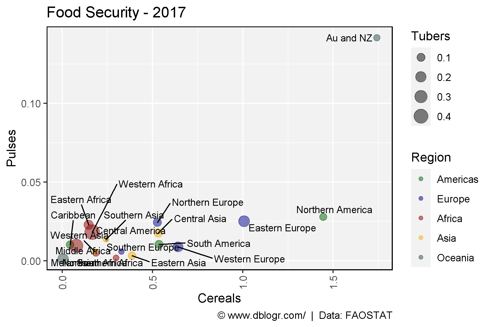

```{r}
# Prep data
xx <- dd %>% filter(Area != "World")
# Plot
mp <- ggplot(xx, aes(x = Year, y = TonnesPerPerson, color = Crop)) + 
  geom_line() +
  facet_wrap(. ~ Area, ncol = 6) +
  theme_agData(legend.position = "bottom") +
  labs(caption = "\xa9 www.dblogr.com/  |  Data: FAOSTAT")
ggsave("global_food_security_06.png", mp, width = 12, height = 8)
```

```{r echo = F}
ggsave("../../../myblog/content/graphs_agdata/global_food_security/gallery/gallery/global_food_security_06.png", mp, width = 12, height = 8)
```

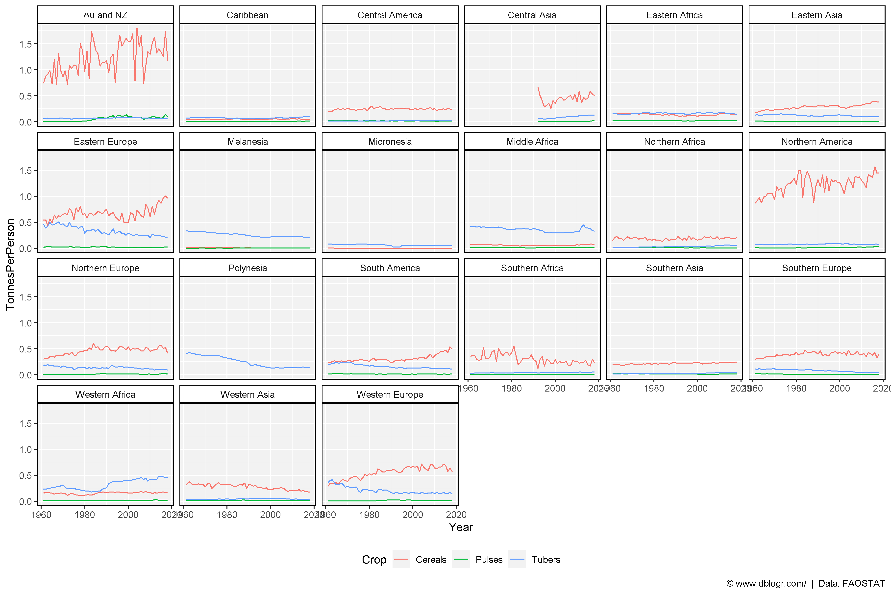

# Crops

```{r}
# Prep data
crops <- c("Wheat", "Maize", "Rice", "Soybeans", "Sorghum", "Beans, dry", "Chick peas", "Lentils")
xx <- agData_FAO_Trade %>%
  addRegionInfo() %>%
  filter(Measurement %in% c("Import Quantity", "Export Quantity"),
         Crop %in% crops, Area %in% agData_FAO_Country_Table$Region) %>%
  mutate(Area = factor(Area, levels = levels(.$Region)))
# Plot
mp <- ggplot(xx, aes(x = Year, y = Value / 1000000, group = Area, color = Area)) + 
  geom_line() + 
  facet_grid(Crop ~ Measurement, scales = "free_y") +
  scale_x_continuous(breaks       = seq(1960, 2015, by = 10),
                     minor_breaks = seq(1960, 2015, by = 5))  +
  scale_color_manual(values = agData_Colors[c(1,4,3,2,7)]) +
  theme_agData(legend.position = "bottom") + 
  labs(title = "Import/Export of Major Crops", y = "Million Tonnes", x = NULL,
       caption = "\xa9 www.dblogr.com/  |  Data: FAOSTAT")
ggsave("global_food_security_07.png", mp, width = 6, height = 8)
```

```{r echo = F}
ggsave("../../../myblog/content/graphs_agdata/global_food_security/gallery/gallery/global_food_security_07.png", mp, width = 6, height = 8)
```

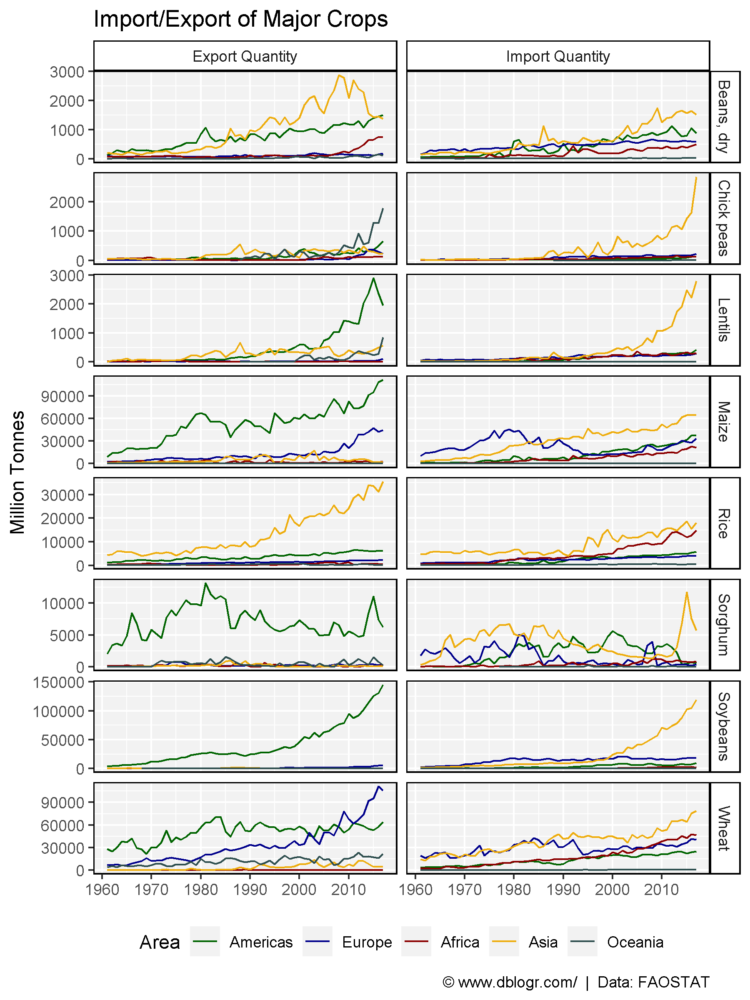

```{r}
# Create plotting function
netImportExport <- function(crop = "Wheat", year = 2017) {
  # Prep data
  xx <- agData_FAO_Trade %>% addRegionInfo() %>%
    filter(Measurement %in% c("Import Quantity", "Export Quantity"), 
           Area %in% unique(agData_FAO_Country_Table$Country),
           Crop == crop, Year == year) %>%
    spread(Measurement, Value) %>%
    mutate(Net = `Export Quantity` - `Import Quantity`) %>%
    filter(!is.na(Net)) %>% arrange(Net) %>%
    mutate(Area = factor(Area, levels = rev(unique(.$Area))))
  x1 <- top_n(xx, 10, Net) %>% mutate(Label = "Top 10")
  x2 <- top_n(xx %>% mutate(Net = -Net), 10, Net) %>% mutate(Label = "Bottom 10", Net = -Net)
  xx <- bind_rows(x1, x2) %>% mutate(Label = factor(Label, levels = c("Top 10", "Bottom 10")))
  # Plot
  ggplot(xx, aes(x = Area, y = Net / 1000000, fill = Region)) + 
    geom_bar(stat = "identity", color = "black", alpha = 0.8) +
    facet_grid(. ~ Label, scales = "free_x") +
    scale_fill_manual(values = agData_Colors[c(1,4,3,2,7)]) +
    theme_agData(rotx = T) + 
    labs(title = crop, subtitle = "Export - Import", y = "Million Tonnes", x = NULL,
         caption = "\xa9 www.dblogr.com/  |  Data: FAOSTAT")
}
```

```{r}
mp <- netImportExport(crop = "Wheat", year = 2017)
ggsave("global_food_security_08.png", mp, width = 6, height = 3.75)
```

```{r echo = F}
ggsave("../../../myblog/content/graphs_agdata/global_food_security/gallery/gallery/global_food_security_08.png", mp, width = 6, height = 3.75)
```


```{r}
mp <- netImportExport(crop = "Maize", year = 2017)
ggsave("global_food_security_09.png", mp, width = 6, height = 3.75)
```

```{r echo = F}
ggsave("../../../myblog/content/graphs_agdata/global_food_security/gallery/gallery/global_food_security_09.png", mp, width = 6, height = 3.75)
```

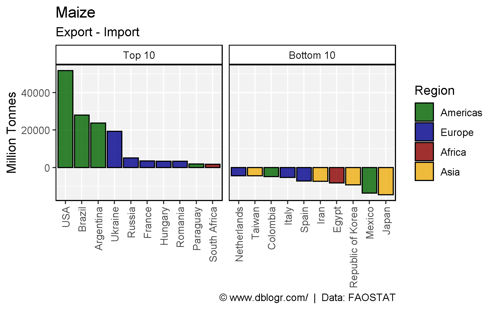

```{r}
mp <- netImportExport(crop = "Rice", year = 2017)
ggsave("global_food_security_10.png", mp, width = 6, height = 3.75)
```

```{r echo = F}
ggsave("../../../myblog/content/graphs_agdata/global_food_security/gallery/gallery/global_food_security_10.png", mp, width = 6, height = 3.75)
```

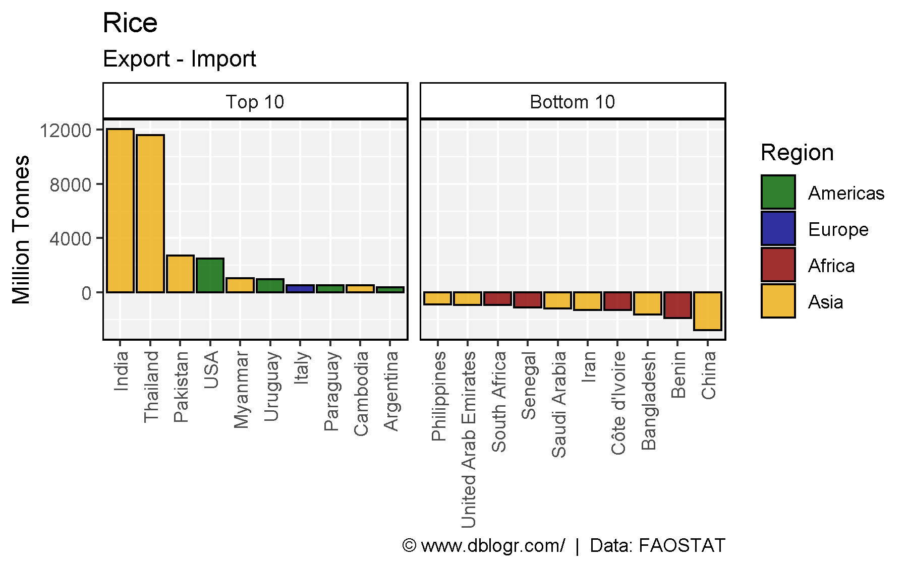

```{r}
mp <- netImportExport(crop = "Soybeans", year = 2017)
ggsave("global_food_security_11.png", mp, width = 6, height = 3.75)
```

```{r echo = F}
ggsave("../../../myblog/content/graphs_agdata/global_food_security/gallery/gallery/global_food_security_11.png", mp, width = 6, height = 3.75)
```

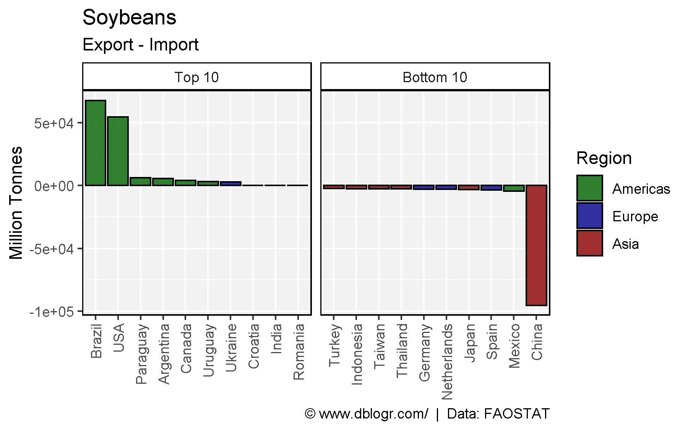

```{r}
mp <- netImportExport(crop = "Sorghum", year = 2017)
ggsave("global_food_security_12.png", mp, width = 6, height = 3.75)
```

```{r echo = F}
ggsave("../../../myblog/content/graphs_agdata/global_food_security/gallery/gallery/global_food_security_12.png", mp, width = 6, height = 3.75)
```


```{r}
mp <- netImportExport(crop = "Beans, dry", year = 2017)
ggsave("global_food_security_13.png", mp, width = 6, height = 3.75)
```

```{r echo = F}
ggsave("../../../myblog/content/graphs_agdata/global_food_security/gallery/gallery/global_food_security_13.png", mp, width = 6, height = 3.75)
```

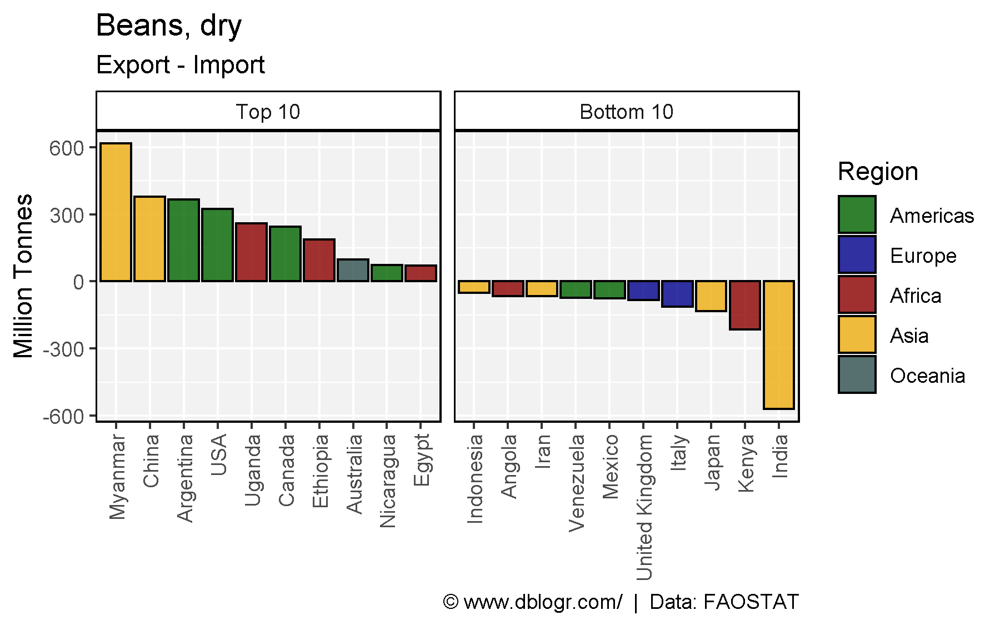

```{r}
mp <- netImportExport(crop = "Chick peas", year = 2017)
ggsave("global_food_security_14.png", mp, width = 6, height = 3.75)
```

```{r echo = F}
ggsave("../../../myblog/content/graphs_agdata/global_food_security/gallery/gallery/global_food_security_14.png", mp, width = 6, height = 3.75)
```

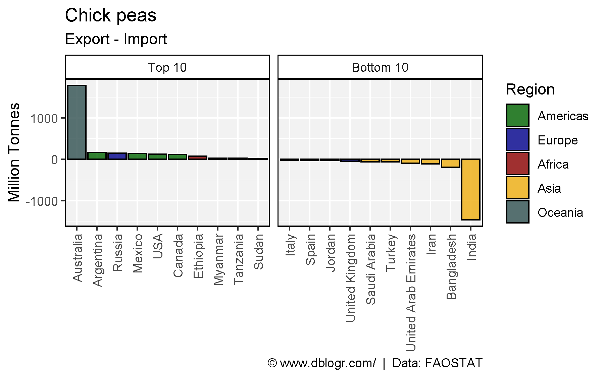

```{r}
mp <- netImportExport(crop = "Lentils", year = 2017)
ggsave("global_food_security_15.png", mp, width = 6, height = 3.75)
```

```{r echo = F}
ggsave("../../../myblog/content/graphs_agdata/global_food_security/gallery/gallery/global_food_security_15.png", mp, width = 6, height = 3.75)
```


```{r eval = F, echo = F}
library(gganimate)
# Plot
mp <- ggplot(xx, aes(x = Area, y = TonnesPerPerson, fill = Region)) + 
  geom_bar(stat = "identity", color = "black") +
  facet_grid(Crop ~ Region, scales = "free") +
  scale_fill_manual(values = agData_Colors[c(1,4,3,2,7)]) +
  theme_agData(legend.position = "none", rotx = T) +
  labs(title = "Food Security - {frame_time}", y = "Tonnes Per Person", x = NULL,
       caption = "\xa9 www.dblogr.com/  |  Data: FAOSTAT") +
  # Here comes the gganimate specific bits
  transition_time(Year) +
  ease_aes('linear')
anim_save("global_food_security_gifs_01.gif", mp, width = 600, height = 400)


  
  
  geom_text_repel(aes(label = Area), size = 3) +
  theme_agData(rotx = T) +
  labs(caption = "\xa9 www.dblogr.com/  |  Data: FAOSTAT") +
  # Here comes the gganimate specific bits
  labs(title = 'Year: {frame_time}') +
  transition_time(year) +
  ease_aes('linear')
anim_save("global_food_security_gifs_02.gif", mp, width = 600, height = 400)
```