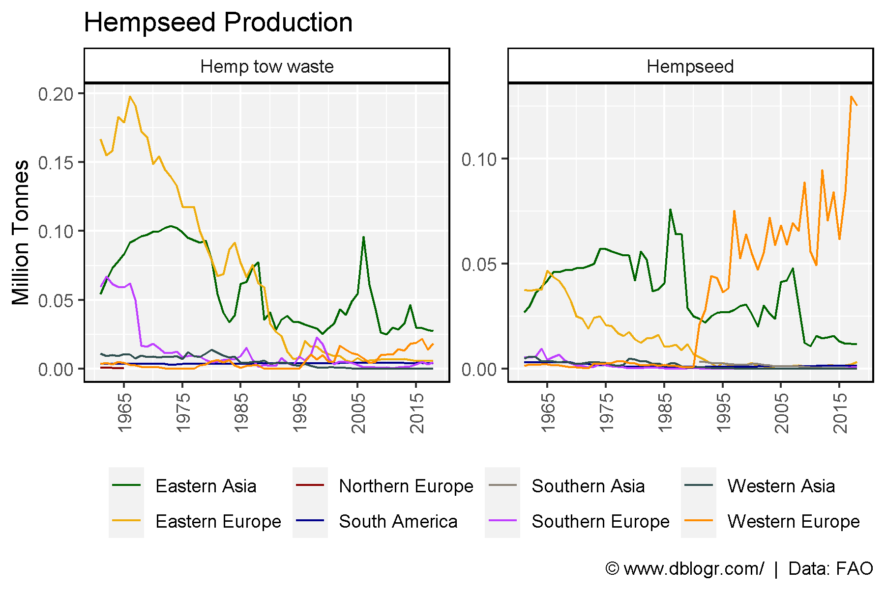
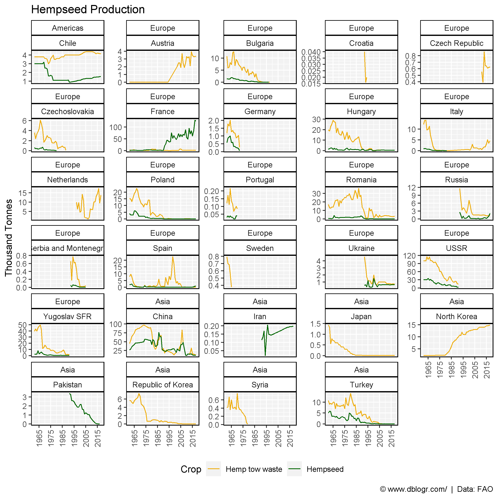

```{r setup, include = FALSE}
knitr::opts_chunk$set(echo = T, warning = F, message = F)
```

---

```{r}
# devtools::install_github("derekmichaelwright/agData")
library(agData) # Loads: tidyverse, ggpubr, ggbeeswarm, ggrepel
```

# SubRegions

```{r}
# Prep Data
xx <- agData_FAO_Crops %>% 
  left_join(agData_FAO_Country_Table, by = c("Area"="Country")) %>%
  filter(Crop %in% c("Hempseed", "Hemp tow waste"), 
         Measurement == "Production")
x1 <- xx %>% filter(Area %in% agData_FAO_Country_Table$SubRegion)
# Plot Data
mp <- ggplot(x1, aes(x = Year, y = Value / 1000000, color = Area)) + 
  geom_line() +
  facet_wrap(Crop~., nrow = 1, scales = "free_y") + 
  scale_color_manual(name = NULL, values = agData_Colors) +
  scale_x_continuous(breaks = seq(1965, 2015, 10)) +
  theme_agData() +
  theme(legend.position = "bottom",
        axis.text.x = element_text(angle = 90, vjust = 0.5)) +
  labs(title = "Hempseed Production", y = "Million Tonnes", x = NULL,
       caption = "\xa9 www.dblogr.com/  |  Data: FAO")
ggsave("hemp_01.png", mp, width = 6, height = 4)
```

```{r echo = F}
ggsave("../../agdata_graphs/hemp/gallery/gallery/hemp_01.png", mp, width = 6, height = 4)
ggsave("featured.png", mp, width = 6, height = 4)
```



# Countries

```{r}
# Prep Data
x1 <- xx %>% filter(Area %in% agData_FAO_Country_Table$Country)
# Plot Data
mp <- ggplot(x1, aes(x = Year, y = Value / 1000, color = Crop)) + 
  geom_line() +
  facet_wrap(Region + Area ~ ., ncol = 5, scales = "free_y") + 
  scale_color_manual(values = c("darkgoldenrod2", "darkgreen")) +
  scale_x_continuous(breaks = seq(1965, 2015, 10)) +
  theme_agData(legend.position = "bottom",
               axis.text.x = element_text(angle = 90, hjust = 1, vjust = 0.5)) +
  labs(title = "Hempseed Production", y = "Thousand Tonnes", x = NULL,
       caption = "\xa9 www.dblogr.com/  |  Data: FAO")
ggsave("hemp_02.png", mp, width = 8, height = 8)
```

```{r echo = F}
ggsave("../../agdata_graphs/hemp/gallery/gallery/hemp_02.png", mp, width = 8, height = 8)
```


