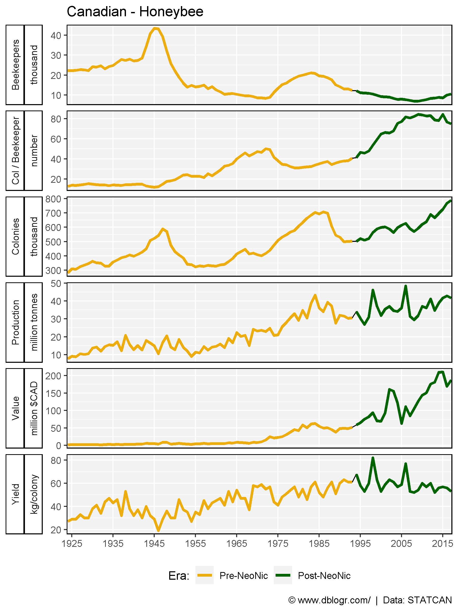
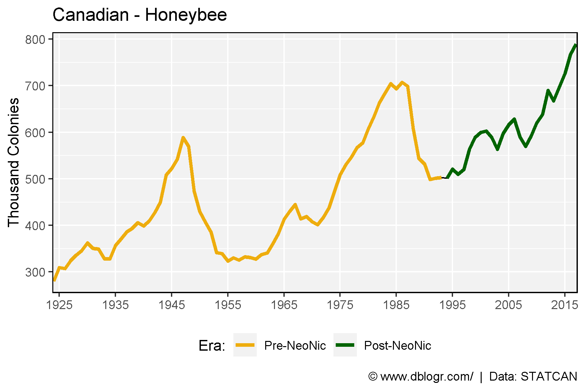

```{r setup, include = FALSE}
knitr::opts_chunk$set(echo = T, message = F, warning = F)
```

---

```{r}
# devtools::install_github("derekmichaelwright/agData")
library(agData) # Loads: tidyverse, ggpubr, ggbeeswarm, ggrepel
```

---

# All Data

```{r}
# Prep data
xx <- agData_STATCAN_Beehives %>%
  filter(Area == "Canada") %>%
  mutate(Measurement = as.character(Measurement),
         Unit = as.character(Unit),
         Value = ifelse(Measurement == "Colonies", Value / 1000, Value),
         Unit  = ifelse(Measurement == "Colonies", "thousand", Unit),
         Value = ifelse(Measurement == "Production", Value / 1000000, Value),
         Unit  = ifelse(Measurement == "Production", "million tonnes", Unit),
         Value = ifelse(Measurement == "Beekeepers", Value / 1000, Value),
         Unit  = ifelse(Measurement == "Beekeepers", "thousand", Unit),
         Era   = ifelse(Year >= 1994, "Post-NeoNic", "Pre-NeoNic"),
         Era   = factor(Era, levels = c("Pre-NeoNic", "Post-NeoNic")),
         Measurement = ifelse(Measurement == "Colonies/Beekeeper", 
                              "Col / Beekeeper", Measurement) )
# Plot
mp <- ggplot(xx, aes(x = Year, y = Value)) + 
  geom_line() + 
  geom_line(aes(color = Era), size = 1.25) +
  facet_grid(Measurement + Unit ~ ., scales = "free", switch = "y") +
  scale_colour_manual(name = "Era:", values = c("darkgoldenrod2", "Dark Green")) +
  scale_x_continuous(breaks = seq(1925, 2020, 10), minor_breaks = NULL) + 
  coord_cartesian(xlim = c(min(xx$Year)+4, max(xx$Year)-4)) +
  theme_agData(strip.placement = "outside", legend.position = "bottom") + 
  labs(title = "Canadian - Honeybee", y = NULL, x = NULL,
       caption = "\xa9 www.dblogr.com/  |  Data: STATCAN")
ggsave("honeybee_canada_01.png", mp, width = 6, height = 8)
```

```{r echo = F}
ggsave("../../../myblog/content/graphs_agdata/honeybee_canada/gallery/gallery/honeybee_canada_01.png", mp, width = 6, height = 8)
ggsave("../../../myblog/content/home/gallery/gallery/07_honeybee_canada_01.png", mp, width = 6, height = 8)
ggsave("../../../myblog/content/posts_agdata/honeybee_canada/featured.png", mp, width = 6, height = 8)
```



---

# Colonies

```{r}
# Plot
mp <- ggplot(xx %>% filter(Measurement == "Colonies"), aes(x = Year, y = Value)) + 
  geom_line() + 
  geom_line(aes(color = Era), size = 1.25) +
  scale_colour_manual(name = "Era:", values = c("darkgoldenrod2", "Dark Green")) +
  scale_x_continuous(breaks = seq(1925, 2020, 10), minor_breaks = NULL) + 
  coord_cartesian(xlim = c(min(xx$Year)+4, max(xx$Year)-4)) +
  theme_agData(strip.placement = "outside", legend.position = "bottom") + 
  labs(title = "Canadian - Honeybee", y = "Thousand Colonies", x = NULL,
       caption = "\xa9 www.dblogr.com/  |  Data: STATCAN" )
ggsave("honeybee_canada_02.png", mp, width = 6, height = 4)
```

```{r echo = F}
ggsave("../../../myblog/content/graphs_agdata/honeybee_canada/gallery/gallery/honeybee_canada_02.png", mp, width = 6, height = 4)
```



---

&copy; Derek Michael Wright 2020 [www.dblogr.com/](https://dblogr.netlify.com/)