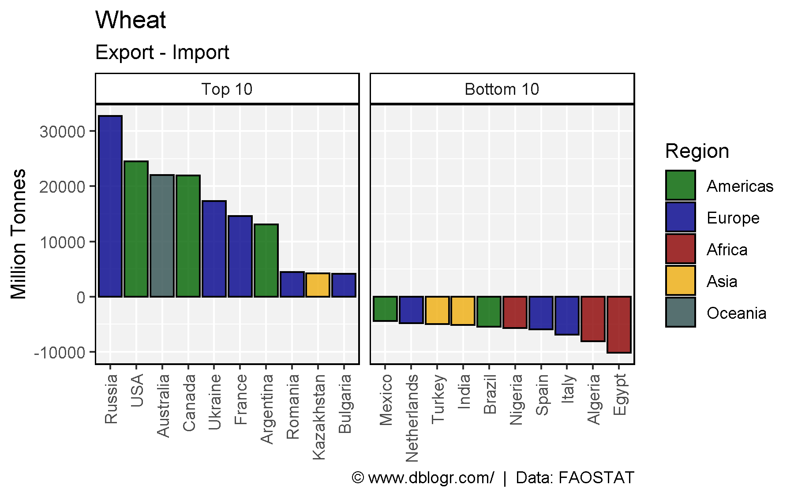
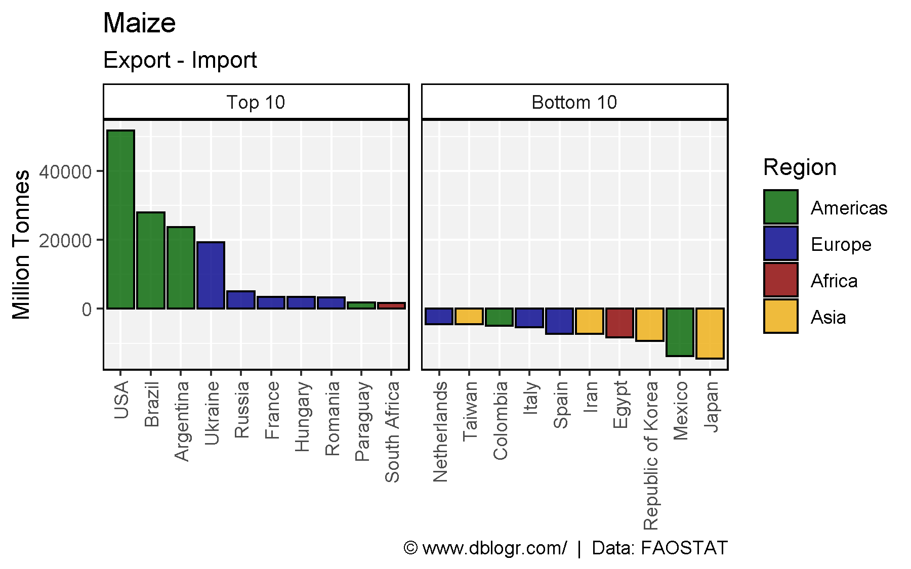
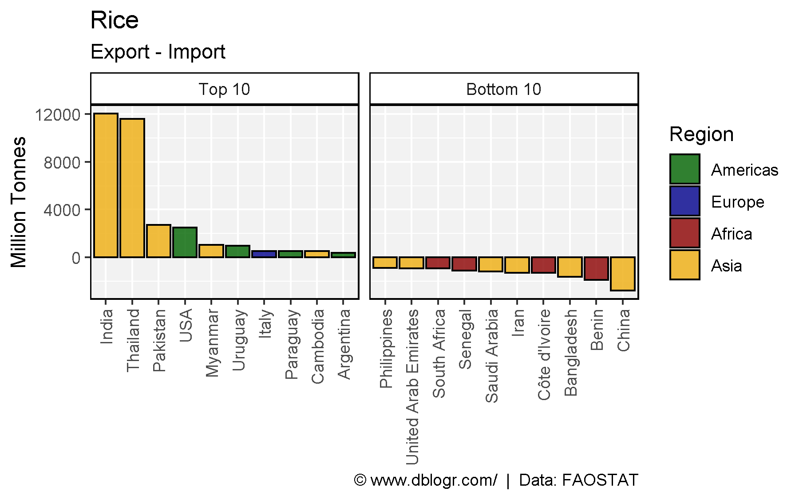
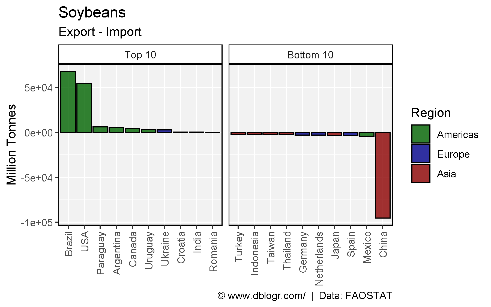
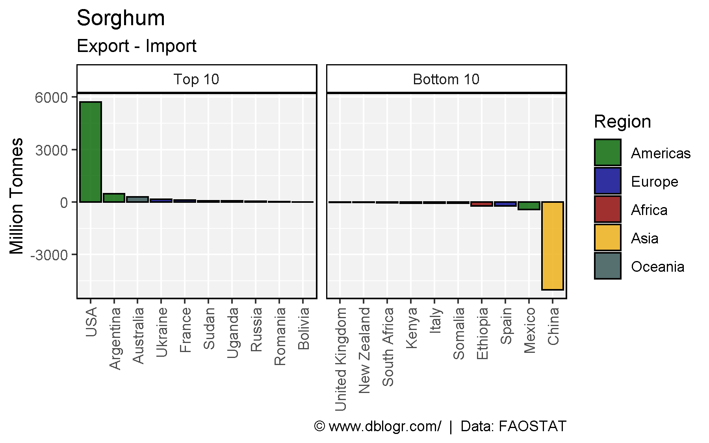
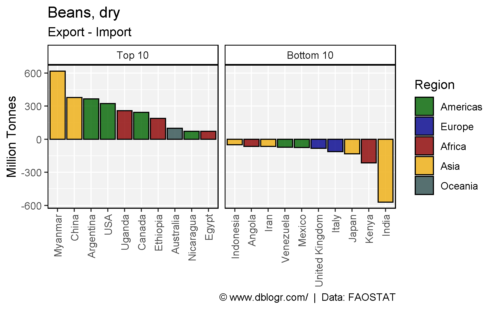
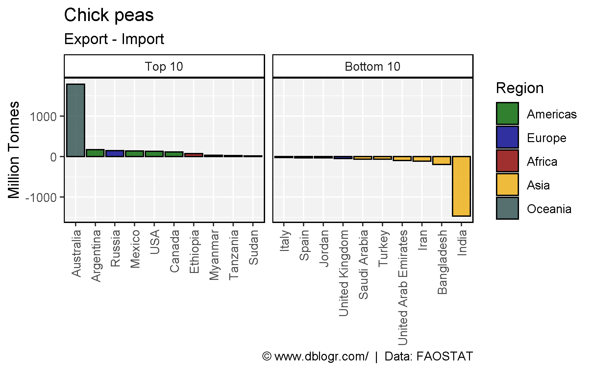
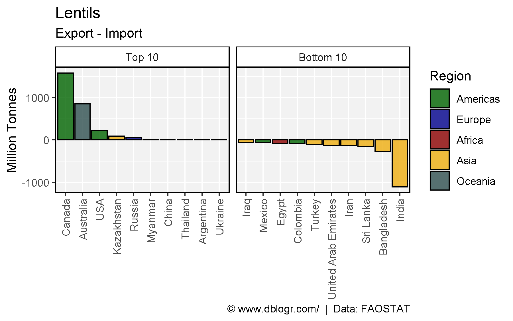
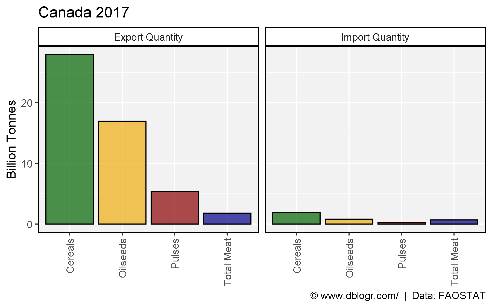
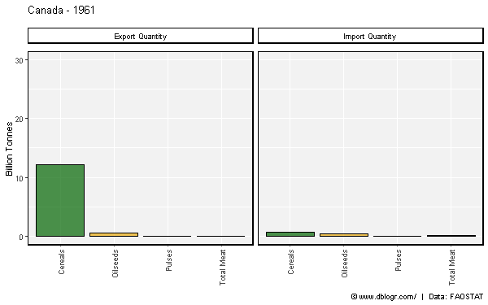

```{r setup, include = FALSE}
knitr::opts_chunk$set(echo = TRUE, message = F, warning = F)
```

---

```{r}
# devtools::install_github("derekmichaelwright/agData")
library(agData) # Loads: tidyverse, ggpubr, ggbeeswarm, ggrepel
library(gganimate)
```

---

# Plotting Function

```{r}
# Create plotting function
netImportExport <- function(crop = "Wheat", year = 2017) {
  # Prep data
  xx <- agData_FAO_Trade %>% addRegionInfo() %>%
    filter(Measurement %in% c("Import Quantity", "Export Quantity"), 
           Area %in% unique(agData_FAO_Country_Table$Country),
           Crop == crop, Year == year) %>%
    spread(Measurement, Value) %>%
    mutate(Net = `Export Quantity` - `Import Quantity`) %>%
    filter(!is.na(Net)) %>% arrange(Net) %>%
    mutate(Area = factor(Area, levels = rev(unique(.$Area))))
  x1 <- top_n(xx, 10, Net) %>% mutate(Label = "Top 10")
  x2 <- top_n(xx %>% mutate(Net = -Net), 10, Net) %>% mutate(Label = "Bottom 10", Net = -Net)
  xx <- bind_rows(x1, x2) %>% mutate(Label = factor(Label, levels = c("Top 10", "Bottom 10")))
  # Plot
  ggplot(xx, aes(x = Area, y = Net / 1000000, fill = Region)) + 
    geom_bar(stat = "identity", color = "black", alpha = 0.8) +
    facet_grid(. ~ Label, scales = "free_x") +
    scale_fill_manual(values = agData_Colors[c(1,4,3,2,7)]) +
    theme_agData(rotx = T) + 
    labs(title = crop, subtitle = "Export - Import", y = "Million Tonnes", x = NULL,
         caption = "\xa9 www.dblogr.com/  |  Data: FAOSTAT")
}
```

---

# Wheat

```{r}
mp <- netImportExport(crop = "Wheat", year = 2017)
ggsave("import_export_01.png", mp, width = 6, height = 3.75)
```

```{r echo = F}
ggsave("../../../myblog/content/graphs_agdata/import_export/gallery/gallery/import_export_01.png", mp, width = 6, height = 3.75)
```



---

# Maize

```{r}
mp <- netImportExport(crop = "Maize", year = 2017)
ggsave("import_export_02.png", mp, width = 6, height = 3.75)
```

```{r echo = F}
ggsave("../../../myblog/content/graphs_agdata/import_export/gallery/gallery/import_export_02.png", mp, width = 6, height = 3.75)
```



---

# Rice

```{r}
mp <- netImportExport(crop = "Rice", year = 2017)
ggsave("import_export_03.png", mp, width = 6, height = 3.75)
```

```{r echo = F}
ggsave("../../../myblog/content/graphs_agdata/import_export/gallery/gallery/import_export_03.png", mp, width = 6, height = 3.75)
```



---

# Soybeans

```{r}
mp <- netImportExport(crop = "Soybeans", year = 2017)
ggsave("import_export_04.png", mp, width = 6, height = 3.75)
```

```{r echo = F}
ggsave("../../../myblog/content/graphs_agdata/import_export/gallery/gallery/import_export_04.png", mp, width = 6, height = 3.75)
```



---

# Sorghum

```{r}
mp <- netImportExport(crop = "Sorghum", year = 2017)
ggsave("import_export_05.png", mp, width = 6, height = 3.75)
```

```{r echo = F}
ggsave("../../../myblog/content/graphs_agdata/import_export/gallery/gallery/import_export_05.png", mp, width = 6, height = 3.75)
```



---

# Beans

```{r}
mp <- netImportExport(crop = "Beans, dry", year = 2017)
ggsave("import_export_06.png", mp, width = 6, height = 3.75)
```

```{r echo = F}
ggsave("../../../myblog/content/graphs_agdata/import_export/gallery/gallery/import_export_06.png", mp, width = 6, height = 3.75)
```



---

# Chickpeas

```{r}
mp <- netImportExport(crop = "Chick peas", year = 2017)
ggsave("import_export_07.png", mp, width = 6, height = 3.75)
```

```{r echo = F}
ggsave("../../../myblog/content/graphs_agdata/import_export/gallery/gallery/import_export_07.png", mp, width = 6, height = 3.75)
```



---

# Lentils

```{r}
mp <- netImportExport(crop = "Lentils", year = 2017)
ggsave("import_export_08.png", mp, width = 6, height = 3.75)
```

```{r echo = F}
ggsave("../../../myblog/content/graphs_agdata/import_export/gallery/gallery/import_export_08.png", mp, width = 6, height = 3.75)
ggsave("../../../myblog/content/posts_agdata/import_export/featured.png", mp, width = 6, height = 3.75)
```



---

# Canada

```{r}
# Prep data
crops <- c("Cereals","Oilseeds","Pulses","Total Meat")
xx <- agData_FAO_Trade %>%
  filter(Area == "Canada", Year == 2017, Crop %in% crops,
         Measurement %in% c("Import Quantity","Export Quantity")) %>%
  mutate(Crop = factor(Crop, levels = crops))
# Plot
mp <- ggplot(xx, aes(x = Crop, y = Value / 1000000000, fill = Crop)) +
  geom_bar(stat = "identity", color = "black", alpha = 0.7) +
  facet_grid(. ~ Measurement) +
  scale_fill_manual(values = agData_Colors) +
  theme_agData(legend.position = "none", rotx = T) +
  labs(title = "Canada 2017", y = "Billion Tonnes", x = NULL,
       caption = "\xa9 www.dblogr.com/  |  Data: FAOSTAT")
ggsave("import_export_09.png", mp, width = 6, height = 3.75)
```

```{r echo = F}
ggsave("../../../myblog/content/graphs_agdata/import_export/gallery/gallery/import_export_09.png", mp, width = 6, height = 3.75)
```



---

```{r}
# Prep data
crops <- c("Cereals","Oilseeds","Pulses","Total Meat")
xx <- agData_FAO_Trade %>%
  filter(Area == "Canada", Crop %in% crops,
         Measurement %in% c("Import Quantity","Export Quantity")) %>%
  mutate(Crop = factor(Crop, levels = crops))
# Plot
mp <- ggplot(xx, aes(x = Crop, y = Value / 1000000000, fill = Crop)) +
  geom_bar(stat = "identity", color = "black", alpha = 0.7) +
  facet_grid(. ~ Measurement) +
  scale_fill_manual(values = agData_Colors) +
  theme_agData(legend.position = "none", rotx = T) +
  labs(title = "Canada 2017 - {round(frame_time)}",
       y = "Billion Tonnes", x = NULL,
       caption = "\xa9 www.dblogr.com/  |  Data: FAOSTAT") +
  # gganimate specific bits
  transition_time(Year) +
  ease_aes('linear')
anim_save("import_export_01.gif", mp, width = 600, height = 375)
```

```{r echo = F}
anim_save("../../../myblog/content/graphs_agdata/import_export/gallery/gallery/import_export_01.gif", mp, width = 600, height = 375)
```



---

&copy; Derek Michael Wright 2020 [www.dblogr.com/](https://dblogr.netlify.com/)