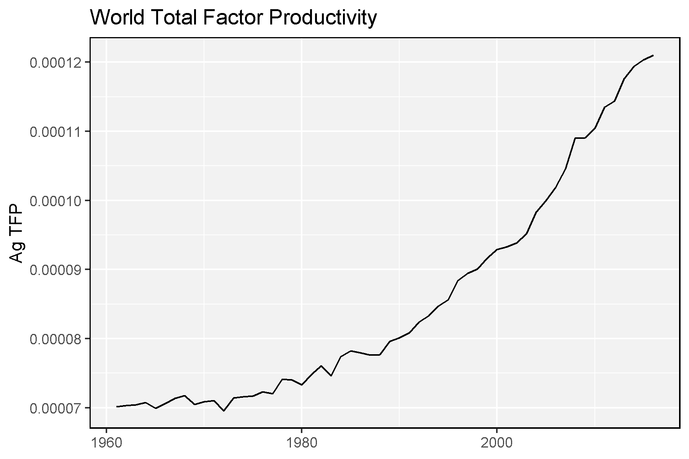

```{r setup, include = FALSE}
knitr::opts_chunk$set(echo = T, message = F, warning = F, fig.height = 3.5)
```

---


# Data Sources

- `FAO` Food and Agriculture Organization of the United Nations [fao.org/faostat/](fao.org/faostat/)
- `STATCAN` Statistics Canada [statcan.gc.ca/](statcan.gc.ca/)
- `USDA` United States Department of Agriculture [usda.gov/](usda.gov/)
- `ISAAA` International Service for the Acquisition of Agri-biotech Applications [isaaa.org/](isaaa.org/)

---

# Instalation

```{r eval = F}
devtools::install_github("derekmichaelwright/agData")
```

```{r warning = F, message = F}
library(agData) # Loads: tidyverse, ggpubr, ggbeeswarm, ggrepel
```

This will also the load the following packages: `tidyverse`, `ggpubr`, `ggbeeswarm`  & `ggrepel`.

---

# Data Sets & Functions

- [theme_agData()](#theme_agdata)
- [agData_FAO_Crops](#agdata_fao_crops)
- [agData_FAO_LandUse](#agdata_fao_landuse)
- [agData_FAO_Trade](#agdata_fao_trade)
- [agData_FAO_Fertilizers](#agdata_fao_fertilizers)
- [agData_FAO_Population](#agdata_fao_population)
- [agData_STATCAN_Beehives](#agdata_statcan_beehives)
- [agData_STATCAN_Crops](#agdata_statcan_crops)
- [agData_STATCAN_Livestock](#agdata_statcan_livestock)
- [agData_USDA_Crops](#agdata_usda_crops)
- [agData_USDA_TFP](#agdata_usda_tfp)
- [agData_ISAAA_Area](#agdata_isaaa_area)
- [agData_ISAAA_Country](#agdata_isaaa_country)
- [agData_ISAAA_Crop](#agdata_isaaa_crop)
- [agData_ISAAA_CropPercent](#agdata_isaaa_croppercent)
- [agData_ISAAA_DVDDVG](#agdata_isaaa_dvddvg)
- [agData_ISAAA_Value](#agdata_isaaa_value)
- [agData_People](#agdata_people)

---

# theme_agData

```{r}
xx <- data.frame(x = 1:10, y = 1:10, color = rep(c("1","2"), times = 5, each = 2))
mp <- ggplot(xx, aes(x = x, y = y, color = color)) + 
  geom_point(size = 4) + facet_grid(.~color)
mp
mp + theme_agData()
mp + theme_agData(legend.position = "none")
mp + theme_agData(linesize = 1.5, rotx = T,
                  bgFill = alpha("darkgreen",0.2), 
                  stripFill = alpha("darkred",0.2),
                  lineColor = "darkorange")
```

---

# agData_FAO_Crops

```{r}
# Get Data
xx <- agData_FAO_Crops %>% as_tibble()
xx
# List Measurements
xx %>% distinct(Measurement, Unit)
# List Crops
xx %>% distinct(Crop)
# Spread data to wide format
xx %>% select(-Unit) %>% spread(Measurement, Value) %>% arrange(Year)
```

```{r}
# Prep data for an example plot
xx <- xx %>% filter(Area == "World", Crop == "Lentils", Measurement == "Production")
# Plot
mp <- ggplot(xx, aes(x = Year, y = Value / 1000000, group = Area)) + 
  geom_line() + 
  theme_agData() +
  labs(title = "Global Lentil Production", 
       y = "Million Tonnes", x = NULL)
ggsave("introduction_to_agdata_01.png", mp, width = 6, height = 4)
```

```{r echo = F}
ggsave("../../../myblog/content/graphs_agdata/introduction_to_agdata/gallery/gallery/introduction_to_agdata_01.png", mp, width = 6, height = 4)
```


---

# agData_FAO_LandUse

```{r}
# Get Data
xx <- agData_FAO_LandUse %>% as_tibble()
xx
# List Measurements
xx %>% distinct(Measurement, Unit)
# List Crops
xx %>% distinct(Item)
```

```{r}
# Prep data for an example plot
xx <- xx %>% filter(Area == "World", Item == "Agricultural land")
# Plot
mp <- ggplot(xx, aes(x = Year, y = Value / 1000000, group = Area)) + 
  geom_line() + 
  theme_agData() +
  labs(title = "Global Agricultural Area", 
       y = "Billion Hectares", x = NULL)
ggsave("introduction_to_agdata_02.png", mp, width = 6, height = 4)
```

```{r echo = F}
ggsave("../../../myblog/content/graphs_agdata/introduction_to_agdata/gallery/gallery/introduction_to_agdata_02.png", mp, width = 6, height = 4)
```


---

# agData_FAO_Livestock
  
```{r}
# Get Data
xx <- agData_FAO_Livestock %>% as_tibble()
xx
# List Measurements
xx %>% distinct(Measurement, Unit)
# List Crops
xx %>% distinct(Animal)
```

```{r}
# Prep data for an example plot
xx <- xx %>% filter(Area == "Canada", Animal == "Chickens")
# Plot
mp <- ggplot(xx, aes(x = Year, y = Value / 1000000, group = Area)) + 
  geom_line() + 
  theme_agData() +
  labs(title = "Chicken Production in Canada", 
       y = "Million Animals", x = NULL)
ggsave("introduction_to_agdata_03.png", mp, width = 6, height = 4)
```

```{r echo = F}
ggsave("../../../myblog/content/graphs_agdata/introduction_to_agdata/gallery/gallery/introduction_to_agdata_03.png", mp, width = 6, height = 4)
```


---

# agData_FAO_Trade
  
```{r}
# Get Data
xx <- agData_FAO_Trade %>% as_tibble()
xx
# List Measurements
xx %>% distinct(Measurement, Unit)
# List Crops
xx %>% distinct(Crop)
```

```{r}
# Prep data for an example plot
xx <- xx %>% filter(Area == "India", Crop == "Lentils", Measurement == "Import Quantity")
# Plot
mp <- ggplot(xx, aes(x = Year, y = Value / 1000000, group = Measurement)) + 
  geom_line() + 
  theme_agData() +
  labs(title = "Lentil Imports in India", 
       y = "Million Tonnes", x = NULL)
ggsave("introduction_to_agdata_04.png", mp, width = 6, height = 4)
```

```{r echo = F}
ggsave("../../../myblog/content/graphs_agdata/introduction_to_agdata/gallery/gallery/introduction_to_agdata_04.png", mp, width = 6, height = 4)
```


---

# agData_FAO_Fertilizers

```{r}
# Get Data
xx <- agData_FAO_Fertilizers %>% as_tibble()
xx
# List Measurements
xx %>% distinct(Measurement, Unit)
# List Crops
xx %>% distinct(Item)
```

```{r}
# Prep data for an example plot
xx <- xx %>% filter(Area == "China", 
                    Item == "Nitrogenous fertilizers", 
                    Measurement == "Agricultural Use")
# Plot
mp <- ggplot(xx, aes(x = Year, y = Value / 1000000, group = Measurement)) + 
  geom_line() + 
  theme_agData() +
  labs(title = "Nitrogenous fertilizer use in China", 
       y = "Million Tonnes", x = NULL)
ggsave("introduction_to_agdata_05.png", mp, width = 6, height = 4)
```

```{r echo = F}
ggsave("../../../myblog/content/graphs_agdata/introduction_to_agdata/gallery/gallery/introduction_to_agdata_05.png", mp, width = 6, height = 4)
```


---

# agData_FAO_Population

```{r}
# Get Data
xx <- agData_FAO_Population %>% as_tibble()
# List Measurements
xx %>% distinct(Measurement, Unit)
```

```{r}
# Prep data for an example plot
xx <- xx %>% filter(Area == "World", Measurement == "Total")
# Plot
mp <- ggplot(xx, aes(x = Year, y = Value / 1000000000, group = Measurement)) + 
  geom_line() + 
  theme_agData() +
  labs(title = "World Population", 
       y = "Billion", x = NULL)
ggsave("introduction_to_agdata_06.png", mp, width = 6, height = 4)
```

```{r echo = F}
ggsave("../../../myblog/content/graphs_agdata/introduction_to_agdata/gallery/gallery/introduction_to_agdata_06.png", mp, width = 6, height = 4)
```


---

# agData_STATCAN_Beehives
  
```{r}
# Get Data
xx <- agData_STATCAN_Beehives %>% as_tibble()
xx
# List Measurements
xx %>% distinct(Measurement, Unit)
# Spread data to wide format
yy <- xx %>% select(-Unit) %>% spread(Measurement, Value) %>% arrange(Year)
str(yy)
```

```{r}
# Prep data for an example plot
xx <- xx %>% filter(Area == "Saskatchewan", Measurement == "Colonies")
# Plot
mp <- ggplot(xx, aes(x = Year, y = Value / 1000, group = Area)) + 
  geom_line() + 
  theme_agData() +
  labs(title = "Honeybee Colonies in Saskatchewan, Canada", 
       y = "Thousand Colonies", x = NULL)
ggsave("introduction_to_agdata_07.png", mp, width = 6, height = 4)
```

```{r echo = F}
ggsave("../../../myblog/content/graphs_agdata/introduction_to_agdata/gallery/gallery/introduction_to_agdata_07.png", mp, width = 6, height = 4)
```


---

# agData_STATCAN_Crops
  
```{r}
# Get Data
xx <- agData_STATCAN_Crops %>% as_tibble()
xx
# List Measurements
xx %>% distinct(Measurement, Unit)
# List Crops
xx %>% distinct(Crop)
```

```{r}
# Prep data for an example plot
xx <- xx %>% filter(Area == "Saskatchewan", Crop == "Canola", Measurement == "Production")
# Plot
mp <- ggplot(xx, aes(x = Year, y = Value / 1000000, group = Area)) + 
  geom_line() + 
  theme_agData() +
  labs(title = "Canola Production in Saskatchewan, Canada", 
       y = "Million Tonnes", x = NULL)
ggsave("introduction_to_agdata_08.png", mp, width = 6, height = 4)
```

```{r echo = F}
ggsave("../../../myblog/content/graphs_agdata/introduction_to_agdata/gallery/gallery/introduction_to_agdata_08.png", mp, width = 6, height = 4)
```


---

# agData_STATCAN_Livestock
  
```{r}
# Get Data
xx <- agData_STATCAN_Livestock %>% as_tibble()
xx
# List Measurements
xx %>% distinct(Measurement, Unit)
# List Crops
xx %>% distinct(Animal)
```

```{r}
# Prep data for an example plot
xx <- xx %>% filter(Area == "Saskatchewan", 
                    Measurement == "Number of animals",
                    Animal == "Total hens and chickens (birds)")
# Plot
mp <- ggplot(xx, aes(x = Year, y = Value / 1000000)) + 
  geom_line() + 
  theme_agData() +
  labs(title = "Chicken Production in Saskatchewan", 
       y = "Million Animals", x = NULL)
ggsave("introduction_to_agdata_09.png", mp, width = 6, height = 4)
```

```{r echo = F}
ggsave("../../../myblog/content/graphs_agdata/introduction_to_agdata/gallery/gallery/introduction_to_agdata_09.png", mp, width = 6, height = 4)
```


---

# agData_STATCAN_FarmUse_Land

```{r}
# Get Data
xx <- agData_STATCAN_FarmUse_Land %>% as_tibble()
xx
# List Measurements
xx %>% distinct(Measurement, Unit)
# List Area
xx %>% distinct(Area)
# List Crops
xx %>% distinct(Item)
```

```{r}
# Prep data for an example plot
xx <- xx %>% filter(Area == "Saskatchewan", Item == "Total area of farms",
                    Unit == "Hectares", !is.na(Value))
# Plot
mp <- ggplot(xx, aes(x = Year, y = Value / 1000000)) + 
  geom_line() + 
  geom_point() + 
  theme_agData() +
  labs(title = "Saskatchewan Hectares", 
       y = "Million Hectares", x = NULL)
ggsave("introduction_to_agdata_10.png", mp, width = 6, height = 4)
```

```{r echo = F}
ggsave("../../../myblog/content/graphs_agdata/introduction_to_agdata/gallery/gallery/introduction_to_agdata_10.png", mp,width = 6, height = 4)
```


---

# agData_USDA_Crops
  
```{r}
# Get Data
xx <- agData_USDA_Crops %>% as_tibble()
xx
# List Measurements
xx %>% distinct(Measurement, Unit)
# List Area
xx %>% distinct(Area)
# List Crops
xx %>% distinct(Crop)
# Spread data to wide format
xx %>% select(-Unit) %>% spread(Measurement, Value) %>% arrange(Year)
```

```{r}
# Prep data for an example plot
xx <- xx %>% filter(Crop == "Wheat", Measurement == "Production")
# Plot
mp <- ggplot(xx, aes(x = Year, y = Value / 1000000, group = Area)) + 
  geom_line() + 
  theme_agData() +
  labs(title = "Wheat Production in the United States of America", 
       y = "Million Tonnes", x = NULL)
ggsave("introduction_to_agdata_11.png", mp, width = 6, height = 4)
```

```{r echo = F}
ggsave("../../../myblog/content/graphs_agdata/introduction_to_agdata/gallery/gallery/introduction_to_agdata_11.png", mp, width = 6, height = 4)
```


---

# agData_USDA_TFP
  
```{r}
# Get Data
xx <- agData_USDA_TFP %>% as_tibble()
xx
# List Measurements
xx %>% distinct(Measurement)
```

```{r}
# Prep data for an example plot
xx <- xx %>% filter(Area == "World", Measurement == "Ag TFP")
# Plot
mp <- ggplot(xx, aes(x = Year, y = Value / 1000000)) + 
  geom_line() + 
  theme_agData() +
  labs(title = "World Total Factor Productivity", 
       y = "Ag TFP", x = NULL)
ggsave("introduction_to_agdata_12.png", mp, width = 6, height = 4)
```

```{r echo = F}
ggsave("../../../myblog/content/graphs_agdata/introduction_to_agdata/gallery/gallery/introduction_to_agdata_12.png", mp, width = 6, height = 4)
```



---

# agData_ISAAA_Area

```{r}
# Get Data
xx <- agData_ISAAA_Area %>% filter(Measurement == "Area") %>% 
  as_tibble()
xx
```

```{r}
# Plot
mp <- ggplot(xx, aes(x = Year, y = Value / 1000000)) + 
  geom_line() + 
  theme_agData() +
  labs(title = "Global Area of Genetically Engineered Crops", 
       y = "Million Hectares", x = NULL)
ggsave("introduction_to_agdata_13.png", mp, width = 6, height = 4)
```

```{r echo = F}
ggsave("../../../myblog/content/graphs_agdata/introduction_to_agdata/gallery/gallery/introduction_to_agdata_13.png", mp, width = 6, height = 4)
```


---

# agData_ISAAA_Country

```{r}
# Get Data
xx <- agData_ISAAA_Country %>% as_tibble()
xx
# List Area
xx %>% distinct(Area)
```

```{r}
# Prep data for an example plot
xx <- xx %>% filter(Area == "Canada", Measurement == "Area")
# Plot
mp <- ggplot(xx, aes(x = Year, y = Value / 1000000)) + 
  geom_line() + 
  theme_agData() +
  labs(title = "Area of Genetically Engineered in Canada", 
       y = "Million Hectares", x = NULL)
ggsave("introduction_to_agdata_14.png", mp, width = 6, height = 4)
```

```{r echo = F}
ggsave("../../../myblog/content/graphs_agdata/introduction_to_agdata/gallery/gallery/introduction_to_agdata_14.png", mp, width = 6, height = 4)
```


---

# agData_ISAAA_Crop

```{r}
# Get Data
xx <- agData_ISAAA_Crop %>% as_tibble()
xx
# List Crops
xx %>% distinct(Crop)
```

```{r}
# Prep data for an example plot
xx <- xx %>% filter(Crop %in% c("Soybean","Maize"),
                    Measurement == "Area")
# Plot
mp <- ggplot(xx, aes(x = Year, y = Value / 1000000, color = Crop)) + 
  geom_line() + 
  theme_agData() +
  labs(title = "Area of Genetically Engineered Maize and Soybean", 
       y = "Million Hectares", x = NULL)
ggsave("introduction_to_agdata_15.png", mp, width = 6, height = 4)
```

```{r echo = F}
ggsave("../../../myblog/content/graphs_agdata/introduction_to_agdata/gallery/gallery/introduction_to_agdata_15.png", mp, width = 6, height = 4)
```


---

# agData_ISAAA_CropPercent

```{r}
# Get Data
xx <- agData_ISAAA_CropPercent %>% as_tibble()
xx
# List Crops
xx %>% distinct(Crop)
```

```{r}
# Prep data for an example plot
xx <- xx %>% filter(Crop %in% c("Soybean","Maize"),
                    Measurement == "Percent")
# Plot
mp <- ggplot(xx, aes(x = Year, y = Value, color = Crop)) + 
  geom_line() + 
  theme_agData() +
  labs(title = "Percent of Global Crop Area Dedicated to GE Varieties", 
       y = "%", x = NULL)
ggsave("introduction_to_agdata_16.png", mp, width = 6, height = 4)
```

```{r echo = F}
ggsave("../../../myblog/content/graphs_agdata/introduction_to_agdata/gallery/gallery/introduction_to_agdata_16.png", mp, width = 6, height = 4)
```


---

# agData_ISAAA_DVDDVG

```{r}
# Get Data
xx <- agData_ISAAA_DVDDVG %>% as_tibble()
xx
```

```{r}
# Prep data
xx <- xx %>% filter(Unit == "Percent")
# Plot
mp <- ggplot(xx, aes(x = Year, y = Value, color = Area)) + 
  geom_line() + 
  theme_agData() +
  labs(title = "Percentage of Genetically Engineered Crops", 
       y = "%", x = NULL)
ggsave("introduction_to_agdata_17.png", mp, width = 6, height = 4)
```

```{r echo = F}
ggsave("../../../myblog/content/graphs_agdata/introduction_to_agdata/gallery/gallery/introduction_to_agdata_17.png", mp, width = 6, height = 4)
```


---

# agData_ISAAA_Value

```{r}
# Get Data
xx <- agData_ISAAA_Value %>% as_tibble()
xx
```

```{r}
# Plot
mp <- ggplot(xx, aes(x = Year, y = Value)) + 
  geom_line() + 
  theme_agData() +
  labs(title = "Value of Genetically Engineered Seed", 
       y = "Billion USD", x = NULL)
ggsave("introduction_to_agdata_18.png", mp, width = 6, height = 4)
```

```{r echo = F}
ggsave("../../../myblog/content/graphs_agdata/introduction_to_agdata/gallery/gallery/introduction_to_agdata_18.png", mp, width = 6, height = 4)
```


---

# agData_People

```{r}
# Get Data
xx <- agData_People %>% as_tibble()
xx
```

---

&copy; Derek Michael Wright 2020 [www.dblogr.com/](https://dblogr.netlify.com/)