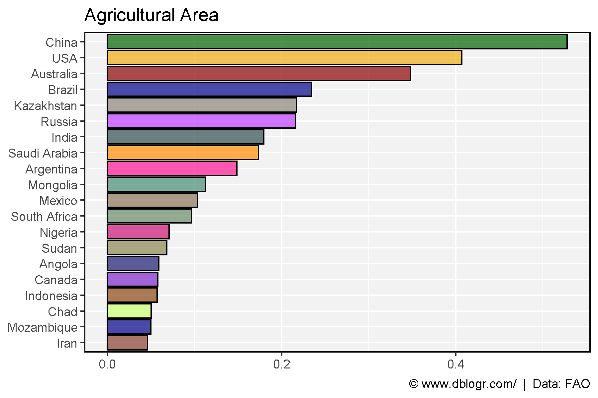
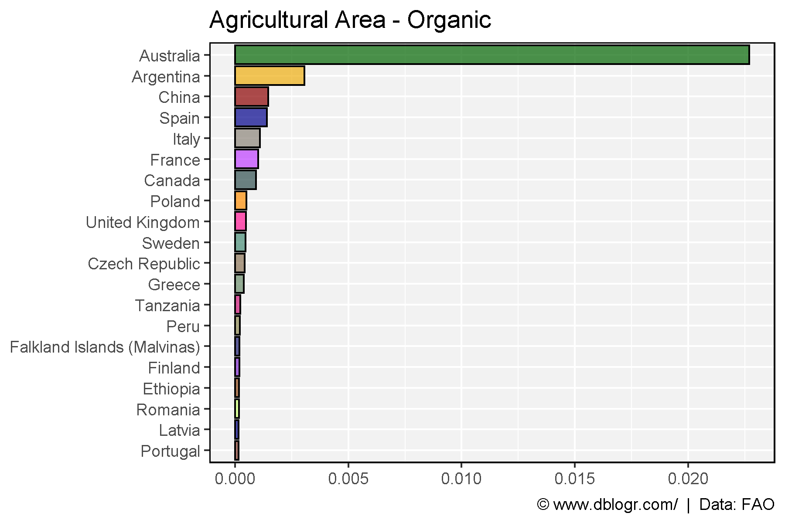
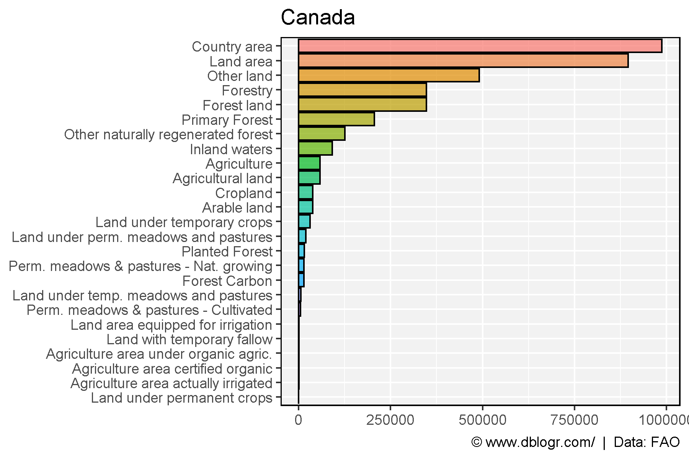

```{r setup, include = FALSE}
knitr::opts_chunk$set(echo = TRUE, warning = F, message = F)
```

---

```{r}
# devtools::install_github("derekmichaelwright/agData")
library(agData) # Loads: tidyverse, ggpubr, ggbeeswarm, ggrepel
```

---

# Agricultural Area

```{r}
# Prep Data
xx <- agData_FAO_LandUse %>% 
  filter(Item == "Agricultural land",
         Year == 2015) %>%
  addRegionInfo() %>%
  filter(Area %in% agData_FAO_Country_Table$Country) %>%
  arrange(desc(Value)) %>%
  slice(1:20) %>%
  mutate(Area = factor(Area, levels = unique(Area)))
# Plot Data
mp <- ggplot(xx, aes(x = Area, y = Value / 1000000, fill = Area)) + 
  geom_bar(stat = "identity", color = "black", alpha = 0.7) +
  scale_fill_manual(values = agData_Colors) +
  scale_x_discrete(limits = rev(levels(xx$Area))) +
  theme_agData(legend.position = "none") + 
  coord_flip() +
  labs(title = "Agricultural Area",
       caption = "\xa9 www.dblogr.com/  |  Data: FAO",
       y = NULL, x = NULL)
ggsave("land_use_01.png", mp, width = 6, height = 4)
```

```{r echo = F}
ggsave("../../../myblog/content/graphs_agdata/land_use/gallery/gallery/land_use_01.png", mp, width = 6, height = 4)
ggsave("../../../myblog/content/posts_agdata/land_use/featured.png", mp, width = 6, height = 4)
```



---

# Organic Area

```{r}
# Prep Data
xx <- agData_FAO_LandUse %>% 
  filter(Item == "Agriculture area certified organic",
         Year == 2015) %>%
  addRegionInfo() %>%
  filter(Area %in% agData_FAO_Country_Table$Country) %>%
  arrange(desc(Value)) %>%
  slice(1:20) %>%
  mutate(Area = factor(Area, levels = unique(Area)))
# Plot Data
mp <- ggplot(xx, aes(x = Area, y = Value / 1000000, fill = Area)) + 
  geom_bar(stat = "identity", color = "black", alpha = 0.7) +
  scale_fill_manual(values = agData_Colors) +
  scale_x_discrete(limits = rev(levels(xx$Area))) +
  theme_agData(legend.position = "none") +
  coord_flip() +
  labs(title = "Agricultural Area - Organic",
       caption = "\xa9 www.dblogr.com/  |  Data: FAO",
       y = NULL, x = NULL)
ggsave("land_use_02.png", mp, width = 6, height = 4)
```

```{r echo = F}
ggsave("../../../myblog/content/graphs_agdata/land_use/gallery/gallery/land_use_02.png", mp, width = 6, height = 4)
```



---

# Canada

```{r}
# Prep Data
xx <- agData_FAO_LandUse %>% 
  filter(Area == "Canada", Year == 2015) %>%
  arrange(desc(Value)) %>%
  mutate(Item = factor(Item, levels = unique(Item)))
# Plot Data
mp <- ggplot(xx, aes(x = Item, y = Value, fill = Item)) + 
  geom_bar(stat = "identity", color = "black", alpha = 0.7) +
  scale_x_discrete(limits = rev(levels(xx$Item))) +
  theme_agData(legend.position = "none") + 
  coord_flip() +
  labs(title = "Canada",
       caption = "\xa9 www.dblogr.com/  |  Data: FAO",
       y = NULL, x = NULL)
ggsave("land_use_03.png", mp, width = 6, height = 4)
```

```{r echo = F}
ggsave("../../../myblog/content/graphs_agdata/land_use/gallery/gallery/land_use_03.png", mp, width = 6, height = 4)
```



---

&copy; Derek Michael Wright 2020 [www.dblogr.com/](https://dblogr.netlify.com/)