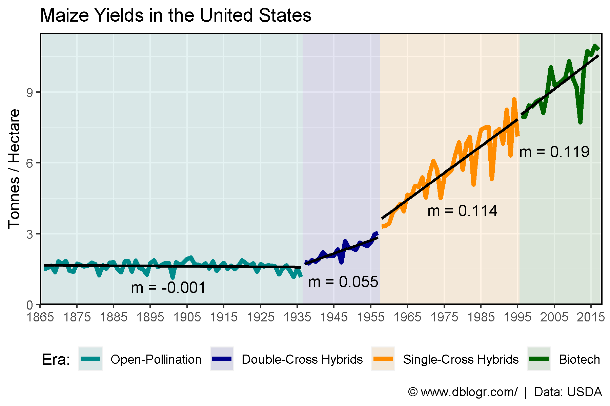
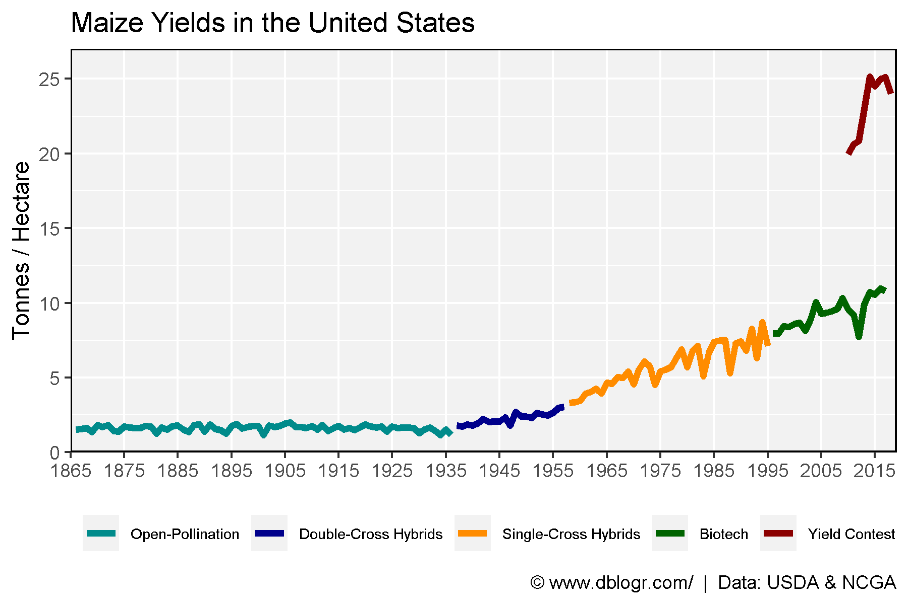
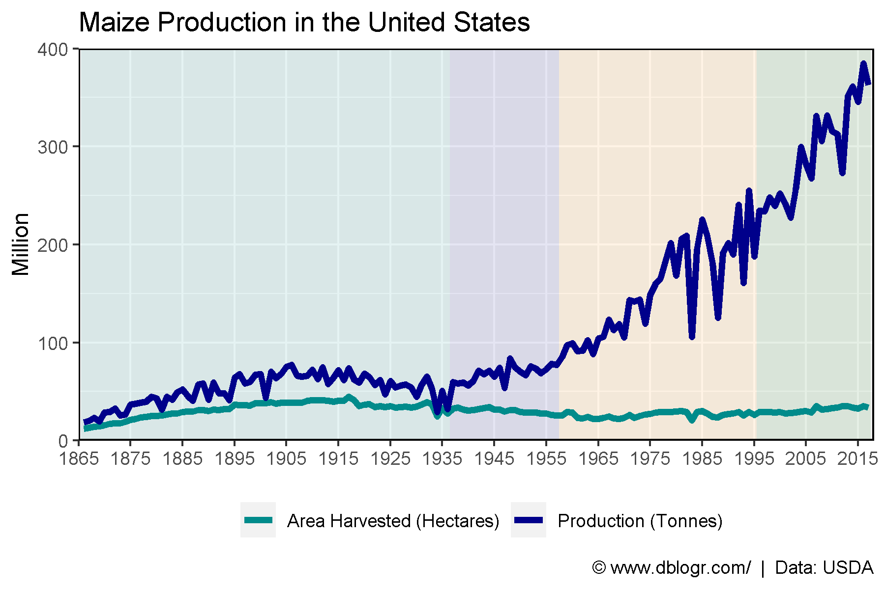
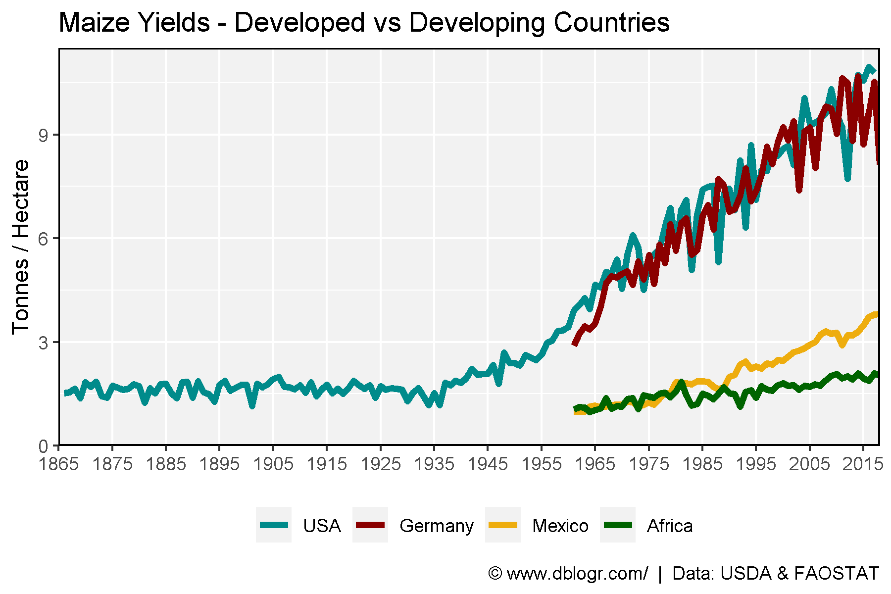
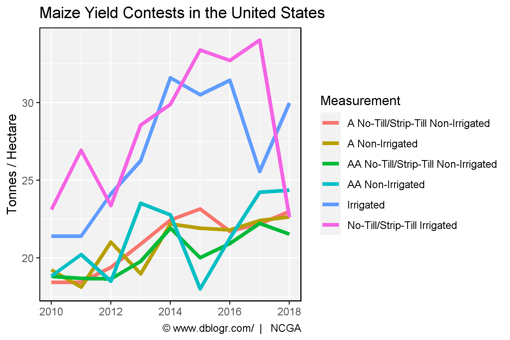
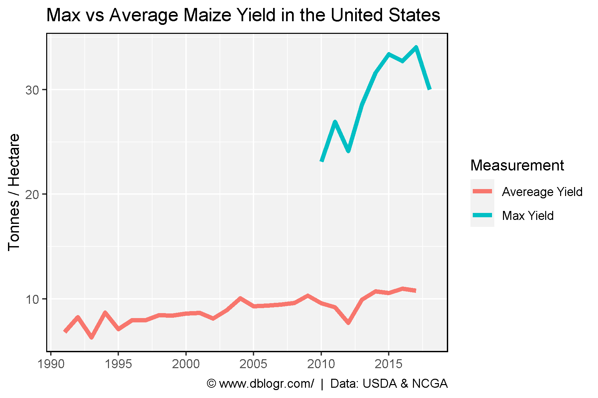
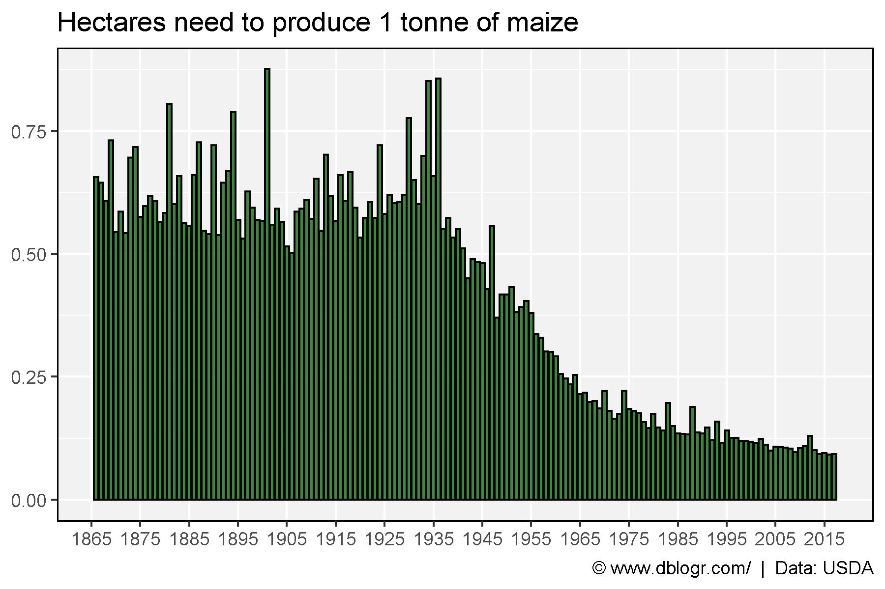
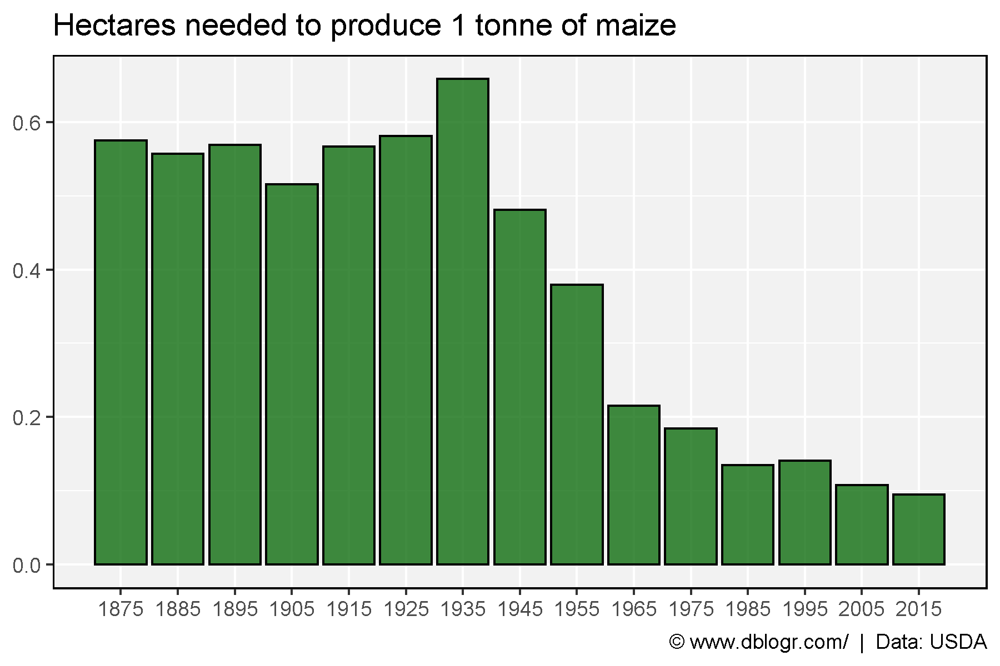
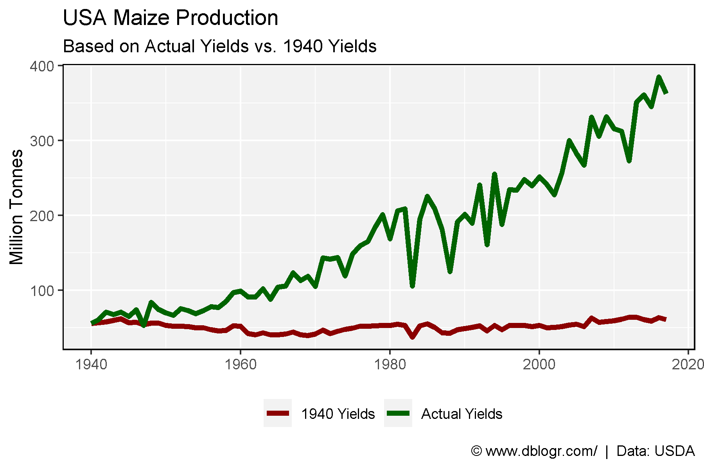
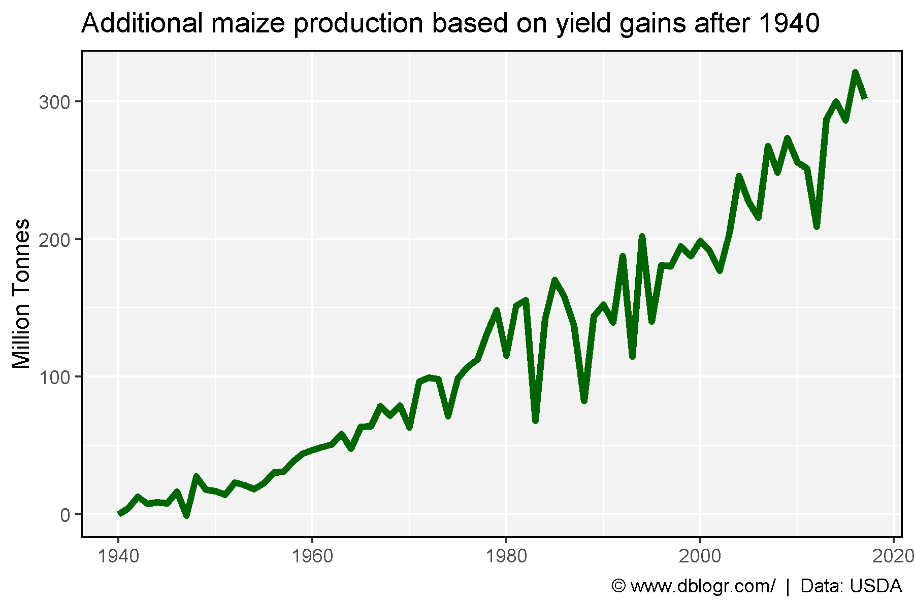

```{r setup, include = FALSE}
knitr::opts_chunk$set(echo = T, message = F, warning = F)
```

---

```{r}
# devtools::install_github("derekmichaelwright/agData")
library(agData) # Loads: tidyverse, ggpubr, ggbeeswarm, ggrepel
```

---

# Heterosis

```{r}
# Prep Data
ee <- c("Open-Pollination", "Double-Cross Hybrids", "Single-Cross Hybrids", "Biotech")
xx <- agData_USDA_Crops %>% 
  filter(Crop == "Maize") %>%
  mutate(Era = ifelse(Year < 1937, ee[1], ifelse(Year < 1958, ee[2],
                 ifelse(Year < 1996, ee[3], ee[4]))),
         Era = factor(Era, levels = ee))
x1 <- xx %>% filter(Measurement == "Yield")
# Prep rect data
x2 <- x1 %>% group_by(Era) %>% summarise(min = min(Year), max = max(Year))
# Calculate slopes
c1 <- x1 %>% filter(Era == ee[1]); c2 <- x1 %>% filter(Era == ee[2])
c3 <- x1 %>% filter(Era == ee[3]); c4 <- x1 %>% filter(Era == ee[4])
c1 <- round(summary(lm(data = c1, Value ~ Year))$coefficients[2], 3)
c2 <- round(summary(lm(data = c2, Value ~ Year))$coefficients[2], 3)
c3 <- round(summary(lm(data = c3, Value ~ Year))$coefficients[2], 3)
c4 <- round(summary(lm(data = c4, Value ~ Year))$coefficients[2], 3)
# Create color palette
cols <- c("darkcyan", "darkblue", "darkorange", "darkgreen")
# Plot Yields
mp <- ggplot(x1) +
  geom_rect(data = x2, alpha = 0.1,
            aes(xmin = min-0.5, xmax = max+0.5, ymin = -Inf, ymax = Inf, fill = Era)) +
  geom_line(aes(x = Year, y = Value, color = Era), size = 1.5) + 
  geom_smooth(aes(x = Year, y = Value, group = Era), 
              method = "lm", se = F, colour = "Black") +
  scale_color_manual(name = "Era:", values = cols) +
  scale_fill_manual(name = "Era:",  values = cols) +
  scale_x_continuous(breaks = seq(1865, 2015, 10), minor_breaks = NULL) +
  coord_cartesian(xlim = c(1865, 2018), ylim = c(0, 11.5), expand = F) +
  annotate("text", x = 1900,   y = 0.75, size = 4, label = paste("m =", c1)) +
  annotate("text", x = 1947.5, y = 1,    size = 4, label = paste("m =", c2)) +
  annotate("text", x = 1980,   y = 4,    size = 4, label = paste("m =", c3)) +
  annotate("text", x = 2005,   y = 6.5,  size = 4, label = paste("m =", c4)) +
  theme_agData(legend.position = "bottom") + 
  labs(title = "Maize Yields in the United States", y = "Tonnes / Hectare", x = NULL,
       caption = "\xa9 www.dblogr.com/  |  Data: USDA")
ggsave("maize_usa_01.png", mp, width = 6, height = 4)
```

```{r echo = F}
ggsave("../../../myblog/content/graphs_agdata/maize_usa/gallery/gallery/maize_usa_01.png", mp, width = 6, height = 4)
ggsave("../../../myblog/content/home/gallery/gallery/04_maize_usa_01.png", mp, width = 6, height = 4)
#ggsave("C:/gitfolder/personalblog/content/articles/A_Quick_History_of_Hybrid_Crops/maize_usa_01.png", width = 9, height = 5)
ggsave("../../../myblog/content/posts_agdata/maize_usa/featured.png", mp, width = 8, height = 5)
```



---

# Maize Potential

```{r}
# Prep data
ee <- c(ee, "Yield Contest")
cols <- c(cols, "darkred")
x3 <- agData_MaizeContest %>% 
  filter(Unit == "Tonnes/Hectare") %>% 
  mutate(Era = "Yield Contest") %>% 
  group_by(Era, Year) %>% 
  summarise(Value = mean(Value))
x3 <- bind_rows(x1, x3) %>%
  mutate(Era = factor(Era, levels = ee))
# Plot
mp <- ggplot(x3, aes(x = Year, y = Value, color = Era)) + 
  geom_line(size = 1.5) +
  scale_color_manual(name = NULL, values = cols) +
  scale_x_continuous(breaks = seq(1865, 2015, 10), minor_breaks = NULL) +
  coord_cartesian(xlim = c(1865, 2019), ylim = c(0, 27), expand = F) +
  theme_agData(legend.position = "bottom",
               legend.text=element_text(size = 7)) +
  labs(title = "Maize Yields in the United States", y = "Tonnes / Hectare", x = NULL,
       caption = "\xa9 www.dblogr.com/  |  Data: USDA & NCGA")
ggsave("maize_usa_02.png", mp, width = 6, height = 4)
```

```{r echo = F}
ggsave("../../../myblog/content/graphs_agdata/maize_usa/gallery/gallery/maize_usa_02.png", mp, width = 6, height = 4)
```



---

# Area vs Production

```{r}
# Prep Data
x1 <- xx %>% filter(Measurement %in% c("Area harvested", "Production"))
# Plot Production
mp <- ggplot(x1) +
  geom_rect(data = x2, alpha = 0.1, 
            aes(xmin = min-0.5, xmax = max+0.5, ymin = -Inf, ymax = Inf, fill = Era)) +
  geom_line(aes(x = Year, y = Value / 1000000, color = Measurement), size = 1.5) + 
  guides(fill = F) +
  scale_fill_manual(values = cols) +
  scale_color_manual(name = NULL, values = cols,
                     labels = c("Area Harvested (Hectares)", "Production (Tonnes)")) +
  scale_x_continuous(breaks = seq(1865, 2015, 10), minor_breaks = NULL) +
  coord_cartesian(xlim = c(1865, 2018), ylim = c(0,400), expand = c(0, 0)) +
  theme_agData(legend.position = "bottom", legend.box = "vertical") +
  labs(title = "Maize Production in the United States",  y = "Million", x = NULL,
       caption = "\xa9 www.dblogr.com/  |  Data: USDA") 
ggsave("maize_usa_03.png", mp, width = 6, height = 4)
```

```{r echo = F}
ggsave("../../../myblog/content/graphs_agdata/maize_usa/gallery/gallery/maize_usa_03.png", mp, width = 6, height = 4)
#ggsave("C:/gitfolder/personalblog/content/articles/A_Quick_History_of_Hybrid_Crops/maize_usa_03.png", width = 9, height = 5)
```



---

# Developed vs Developing Countries

```{r}
# Prep Data
x1 <- agData_USDA_Crops %>% filter(Crop == "Maize", Measurement == "Yield")
x2 <- agData_FAO_Crops %>% filter(Crop == "Maize", Measurement == "Yield", 
                                  Area %in% c("Germany","Mexico","Africa"))
xx <- bind_rows(x1, x2) %>%
  mutate(Area = factor(Area, levels = c("USA", "Germany", "Mexico", "Africa")))
# Create color palette
cols <- c("darkcyan", "darkred", "darkgoldenrod2", "darkgreen")
# Plot Yields
mp <- ggplot(xx, aes(x = Year, y = Value,color = Area)) +
  geom_line(size = 1.5) + 
  scale_color_manual(name = NULL, values = cols) +
  scale_x_continuous(breaks = seq(1865, 2015, 10), minor_breaks = NULL) +
  coord_cartesian(xlim = c(1865, 2018), ylim = c(0, 11.5), expand = c(0, 0)) +
  theme_agData(legend.position = "bottom") +
  labs(title   = "Maize Yields - Developed vs Developing Countries", 
       y = "Tonnes / Hectare", x = NULL,
       caption = "\xa9 www.dblogr.com/  |  Data: USDA & FAOSTAT")
ggsave("maize_usa_04.png", mp, width = 6, height = 4)
```

```{r echo = F}
ggsave("../../../myblog/content/graphs_agdata/maize_usa/gallery/gallery/maize_usa_04.png", mp, width = 6, height = 4)
ggsave("../../../myblog/content/home/gallery/gallery/04_maize_usa_04.png", mp, width = 6, height = 4)
#ggsave("C:/gitfolder/personalblog/content/articles/A_Quick_History_of_Hybrid_Crops/maize_usa_04.png", width = 9, height = 5)
```



---

# Maize Contest

```{r}
# Prep data
xx <- agData_MaizeContest %>% filter(Unit == "Tonnes/Hectare")
# Plot
mp <- ggplot(xx, aes(x = Year, y = Value, color = Measurement, group = Measurement)) + 
  geom_line(size = 1.5) + theme_agData() +
  labs(title = "Maize Yield Contests in the United States",
       y = "Tonnes / Hectare", x = NULL,
       caption = "\xa9 www.dblogr.com/  |   NCGA")
ggsave("maize_usa_05.png", mp, width = 6, height = 4)
```

```{r echo = F}
ggsave("../../../myblog/content/graphs_agdata/maize_usa/gallery/gallery/maize_usa_05.png", mp, width = 6, height = 4)
```



---

# Average vs Max Yield

```{r}
# Prep data
x1 <- agData_MaizeContest %>% filter(Unit == "Tonnes/Hectare") %>% 
  group_by(Year) %>% summarise(Value = max(Value)) %>% 
  mutate(Measurement = "Max Yield")
x2 <- agData_USDA_Crops %>% 
  filter(Crop == "Maize", Year > 1990, Measurement == "Yield") %>% 
  mutate(Measurement = "Avereage Yield")
xx <- bind_rows(x1, x2) 
# Plot
mp <- ggplot(xx, aes(x = Year, y = Value, color = Measurement, group = Measurement)) + 
  geom_line(size = 1.5) + theme_agData() +
  scale_x_continuous(breaks = seq(1990, 2020, by = 5)) +
  labs(title = "Max vs Average Maize Yield in the United States",
       y = "Tonnes / Hectare", x = NULL,
       caption = "\xa9 www.dblogr.com/  |  Data: USDA & NCGA")
ggsave("maize_usa_06.png", mp, width = 6, height = 4)
```

```{r echo = F}
ggsave("../../../myblog/content/graphs_agdata/maize_usa/gallery/gallery/maize_usa_06.png", mp, width = 6, height = 4)
```



---

# Hectares per tonne

```{r}
# Prep data
xx <- agData_USDA_Crops %>% 
  filter(Crop == "Maize", Measurement == "Yield") %>%
  mutate(Value = 1 / Value)
# Plot
mp <- ggplot(xx, aes(x = Year, y = Value)) + 
  geom_bar(stat = "identity", color = "black", fill = "darkgreen", alpha = 0.75) +
  scale_x_continuous(breaks = seq(1865, 2015, 10), minor_breaks = NULL) +
  theme_agData() +
  labs(title = "Hectares need to produce 1 tonne of maize", 
       y = NULL, x = NULL,
       caption = "\xa9 www.dblogr.com/  |  Data: USDA")
ggsave("maize_usa_07.png", mp, width = 6, height = 4)
```

```{r echo = F}
ggsave("../../../myblog/content/graphs_agdata/maize_usa/gallery/gallery/maize_usa_07.png", mp, width = 6, height = 4)
```



---

```{r}
# Prep data
xx <- xx %>% filter(Year %in% seq(1875, 2015, by = 10))
# Plot
mp <- ggplot(xx, aes(x = Year, y = Value)) + 
  geom_bar(stat = "identity", color = "black", fill = "darkgreen", alpha = 0.75) +
  scale_x_continuous(breaks = seq(1875, 2015, 10), minor_breaks = NULL) +
  theme_agData() +
  labs(title = "Hectares needed to produce 1 tonne of maize", 
       y = NULL, x = NULL,
       caption = "\xa9 www.dblogr.com/  |  Data: USDA")
ggsave("maize_usa_08.png", mp, width = 6, height = 4)
```

```{r echo = F}
ggsave("../../../myblog/content/graphs_agdata/maize_usa/gallery/gallery/maize_usa_08.png", mp, width = 6, height = 4)
```



---

# Yield Gains

```{r}
# Prep data
xx <- agData_USDA_Crops %>% filter(Crop == "Maize", Year >= 1940)
y1 <- xx %>% filter(Year == 1940, Measurement == "Yield") %>% pull(Value)
x1 <- xx %>% filter(Measurement == "Area harvested") %>%
  mutate(Value = Value * y1, Measurement = "1940 Yields")
xx <- xx %>% filter(Measurement == "Production") %>% 
  mutate(Measurement = "Actual Yields") %>%
  bind_rows(x1)
# Plot
mp <- ggplot(xx, aes(x = Year, y = Value / 1000000, color = Measurement)) + 
  geom_line(size = 1.5) +
  scale_color_manual(name = NULL, values = c("darkred","darkgreen")) +
  theme_agData(legend.position = "bottom") +
  labs(title = "USA Maize Production",
       subtitle = "Based on Actual Yields vs. 1940 Yields",
       y = "Million Tonnes", x = NULL,
       caption = "\xa9 www.dblogr.com/  |  Data: USDA")
ggsave("maize_usa_09.png", mp, width = 6, height = 4)
```

```{r echo = F}
ggsave("../../../myblog/content/graphs_agdata/maize_usa/gallery/gallery/maize_usa_09.png", mp, width = 6, height = 4)
```



---

```{r}
# Prep data
xx <- xx %>% select(-Unit) %>% 
  spread(Measurement, Value) %>%
  mutate(Difference = `Actual Yields` - `1940 Yields`)
# Plot
mp <- ggplot(xx, aes(x = Year, y = Difference / 1000000)) + 
  geom_line(size = 1.5, color = "darkgreen") + 
  theme_agData() +
  labs(title = "Additional maize production based on yield gains after 1940",
       y = "Million Tonnes", x = NULL,
       caption = "\xa9 www.dblogr.com/  |  Data: USDA")
ggsave("maize_usa_10.png", mp, width = 6, height = 4)
```

```{r echo = F}
ggsave("../../../myblog/content/graphs_agdata/maize_usa/gallery/gallery/maize_usa_10.png", mp, width = 6, height = 4)
```



---

&copy; Derek Michael Wright 2020 [www.dblogr.com/](https://dblogr.netlify.com/)