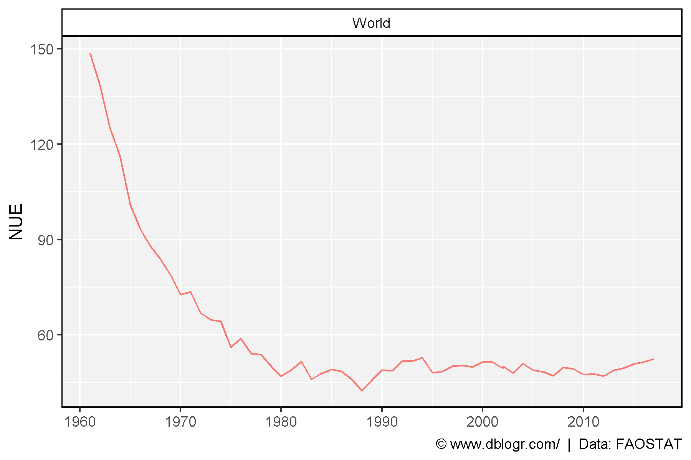
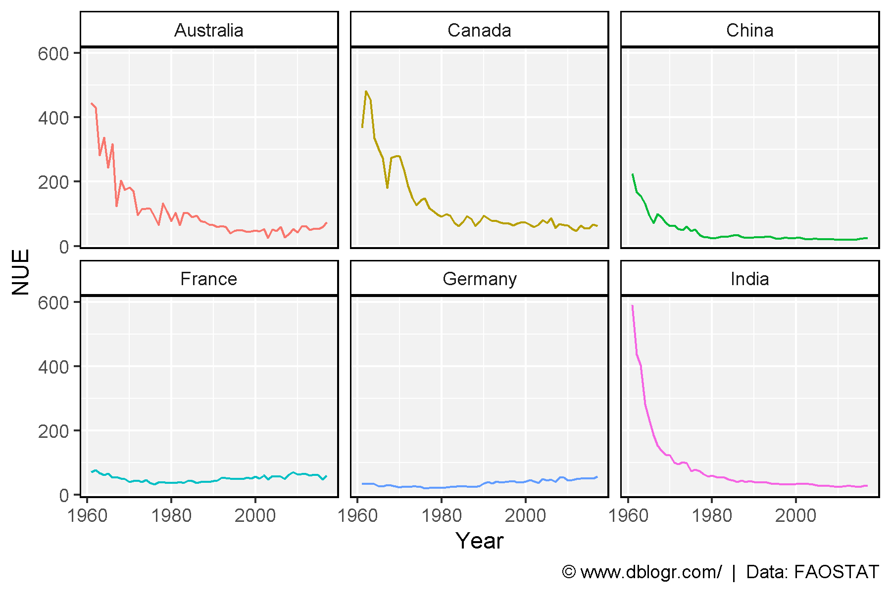
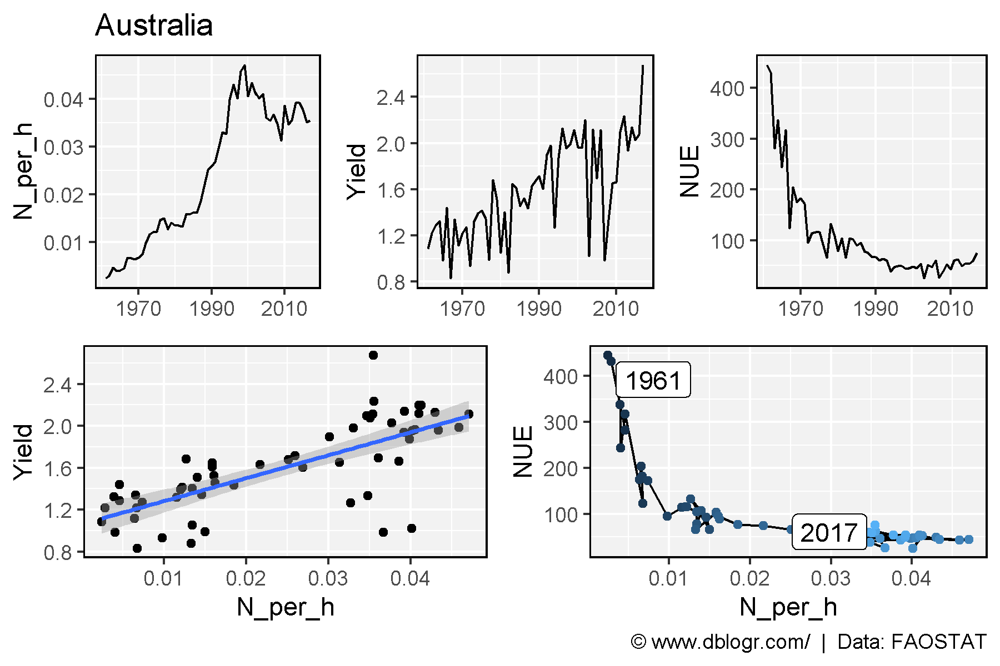
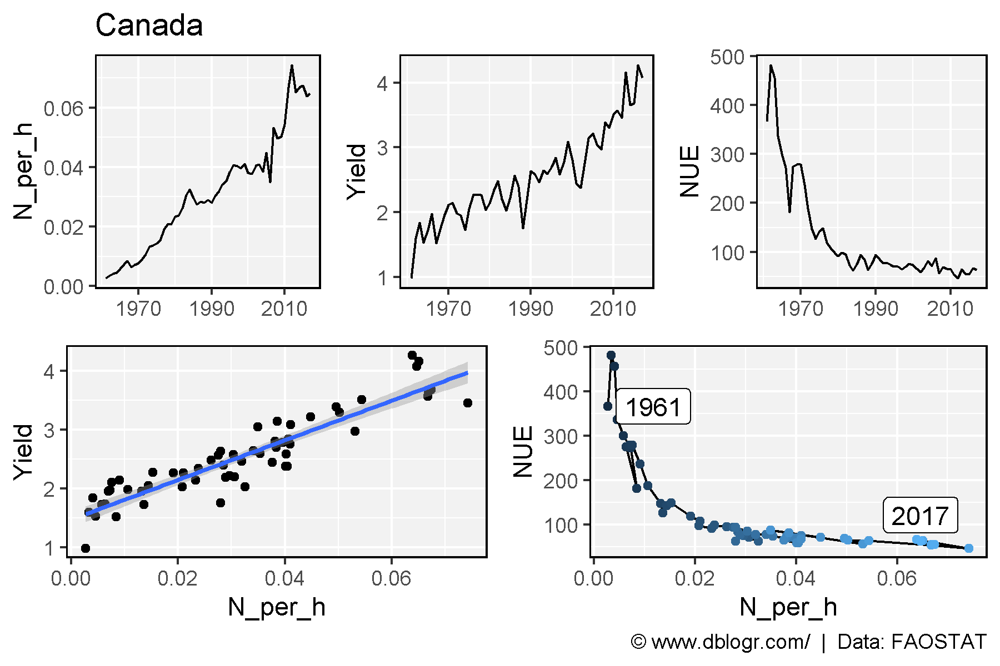
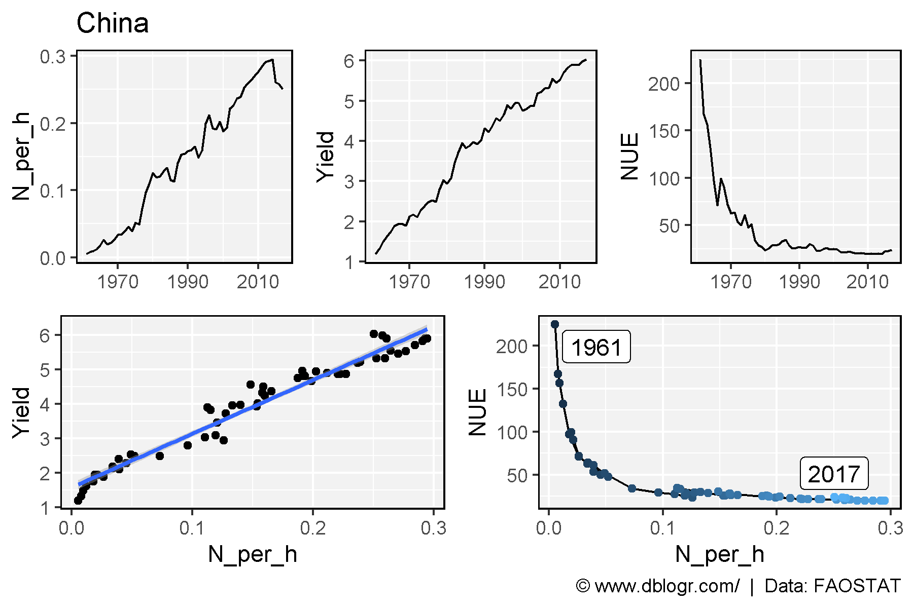
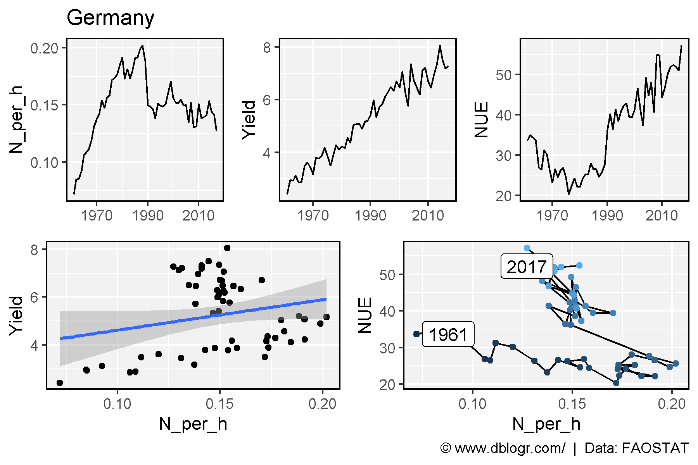
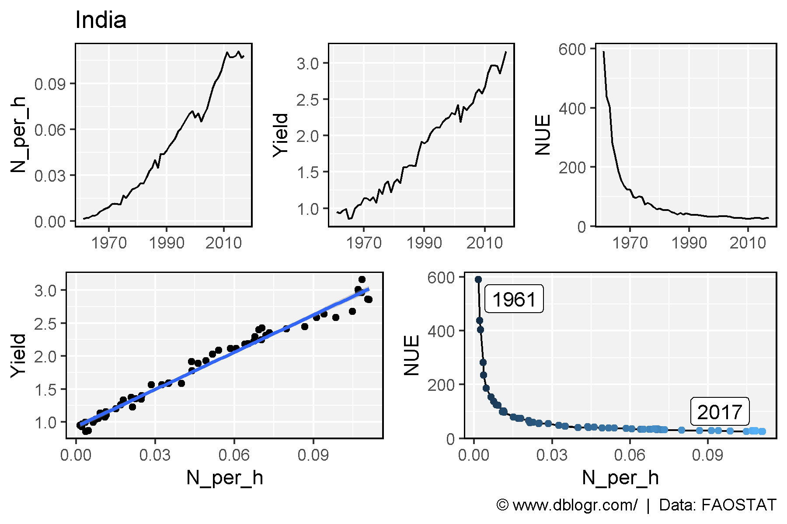
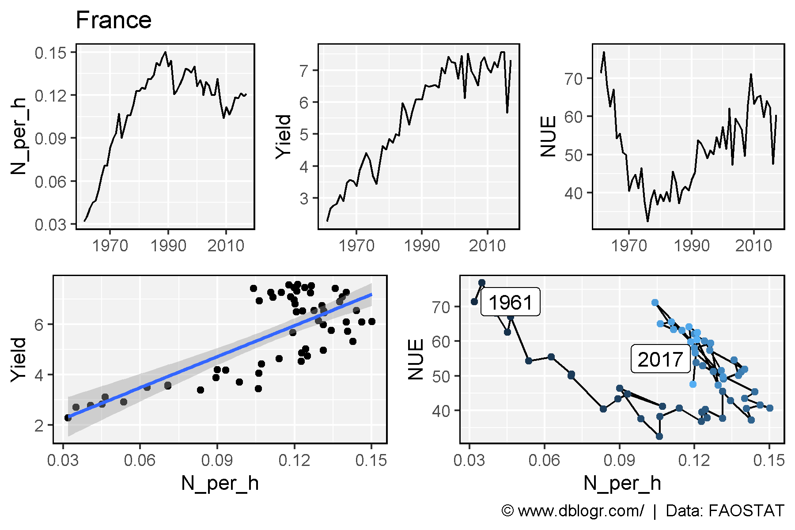

```{r setup, include = FALSE}
knitr::opts_chunk$set(echo = TRUE, message = F, warning = F)
```

---

```{r}
# devtools::install_github("derekmichaelwright/agData")
library(agData) # Loads: tidyverse, ggpubr, ggbeeswarm, ggrepel
```

---

Formula 1: $NUE=N_{in Seed}/N_{Available}$

Formula 2: $NUE=Yield/N_{Available}$

# Prepare data

```{r}
x1 <- agData_FAO_Fertilizers %>% 
  filter(Item %in% c("Nitrogenous fertilizers", "Nutrient nitrogen N (total)"),
         Measurement == "Agricultural Use") %>% select(Area, Year, TonnesN = Value)
x2 <- agData_FAO_Crops2 %>% 
  filter(Crop == "Cereals, Total", Measurement != "Production") %>%
  select(-Unit) %>% spread(Measurement, Value) %>%
  select(Area, Year, Yield, `Area harvested`)
x3 <- agData_FAO_LandUse %>% filter(Item == "Arable land") %>% 
  mutate(Value = Value * 1000) %>% select(Area, Year, AgArea=Value)
xx <- left_join(x1, x2, by = c("Area","Year")) %>%
  left_join(x3, by = c("Area","Year")) %>%
  mutate(Area_P = `Area harvested` / AgArea,
         N_per_h = (TonnesN * Area_P) / `Area harvested`,
         NUE = Yield / N_per_h)
```

---

# Global NUE

```{r}
xi <- xx %>% filter(Area == "World")
mp <- ggplot(xi, aes(x = Year, y = NUE, color = Area)) + 
  geom_line() + 
  facet_wrap(Area ~ .) +
  scale_x_continuous(breaks = seq(1960,2020, by = 10)) +
  theme_agData(legend.position = "none") +
  labs(x = NULL, caption = "\xa9 www.dblogr.com/  |  Data: FAOSTAT")
ggsave("nue_01.png", mp, width = 6, height = 4)
```

```{r echo = F}
ggsave("../../../myblog/content/graphs_agdata/nue/gallery/gallery/nue_01.png", mp, width = 6, height = 4)
```



---

# Countries

```{r}
areas <- c("Australia", "Canada", "China", "Germany", "India", "France")
xi <- xx %>% filter(Area %in% areas)
mp <- ggplot(xi, aes(x = Year, y = NUE, color = Area)) + 
  geom_line() + 
  facet_wrap(Area~.) +
  theme_agData(legend.position = "none") +
  labs(caption = "\xa9 www.dblogr.com/  |  Data: FAOSTAT")
ggsave("nue_02.png", mp, width = 6, height = 4)
```

```{r echo = F}
ggsave("../../../myblog/content/posts_agdata/nue/featured.png", mp, width = 6, height = 4)
ggsave("../../../myblog/content/graphs_agdata/nue/gallery/gallery/nue_02.png", mp, width = 6, height = 4)
```



---

# Plotting function

```{r}
ggNUE <- function(area) {
  xi <- xx %>% filter(Area == area) %>% arrange(Year)
  mp1 <- ggplot(xi, aes(x = Year, y = N_per_h)) + 
    geom_line() + theme_agData() + labs(x = NULL, title = area) +
    scale_x_continuous(breaks = c(1970,1990,2010))
  mp2 <- ggplot(xi, aes(x = Year, y = Yield)) + 
    geom_line() + theme_agData() + labs(x = NULL) +
    scale_x_continuous(breaks = c(1970,1990,2010))
  mp3 <- ggplot(xi, aes(x = Year, y = NUE)) + 
    geom_line() + theme_agData() + labs(x = NULL) +
    scale_x_continuous(breaks = c(1970,1990,2010)) +
    scale_x_continuous(breaks = c(1970,1990,2010))
  mp4 <- ggplot(xi, aes(x = N_per_h, y = Yield)) + 
    geom_point() + theme_agData() + geom_smooth(method = "lm")
  mp5 <- ggplot(xi, aes(x = N_per_h, y = NUE, label = Year)) + 
    geom_path() + geom_point(aes(color = Year)) +
    geom_label_repel(data = xi %>% filter(Year %in% c(1961, 2017))) +
    theme_agData(legend.position = "none") +
    labs(caption = "\xa9 www.dblogr.com/  |  Data: FAOSTAT")
  mp1 <- ggarrange(mp1, mp2, mp3, ncol = 3, align = "h") 
  mp2 <- ggarrange(mp4, mp5, ncol = 2, align = "h") 
  ggarrange(mp1, mp2, nrow = 2)
}
```

# Australia

```{r}
mp <- ggNUE("Australia")
ggsave("nue_03_australia.png", mp, width = 6, height = 4)
```

```{r echo = F}
ggsave("../../../myblog/content/graphs_agdata/nue/gallery/gallery/nue_03_australia.png", mp, width = 6, height = 4)
```



---

# Canada

```{r}
mp <- ggNUE("Canada")
ggsave("nue_04_canada.png", mp, width = 6, height = 4)
```

```{r echo = F}
ggsave("../../../myblog/content/graphs_agdata/nue/gallery/gallery/nue_04_canada.png", mp, width = 6, height = 4)
```



---

# China

```{r}
mp <- ggNUE("China")
ggsave("nue_05_china.png", mp, width = 6, height = 4)
```

```{r echo = F}
ggsave("../../../myblog/content/graphs_agdata/nue/gallery/gallery/nue_05_china.png", mp, width = 6, height = 4)
```



---

# Germany

```{r}
mp <- ggNUE("Germany")
ggsave("nue_06_germany.png", mp, width = 6, height = 4)
```

```{r echo = F}
ggsave("../../../myblog/content/graphs_agdata/nue/gallery/gallery/nue_06_germany.png", mp, width = 6, height = 4)
```



---

# India

```{r}
mp <- ggNUE("India")
ggsave("nue_07_india.png", mp, width = 6, height = 4)
```

```{r echo = F}
ggsave("../../../myblog/content/graphs_agdata/nue/gallery/gallery/nue_07_india.png", mp, width = 6, height = 4)
```



---

# France

```{r}
mp <- ggNUE("France")
ggsave("nue_08_france.png", mp, width = 6, height = 4)
```

```{r echo = F}
ggsave("../../../myblog/content/graphs_agdata/nue/gallery/gallery/nue_08_france.png", mp, width = 6, height = 4)
```



---

&copy; Derek Michael Wright 2020 [www.dblogr.com/](https://dblogr.netlify.com/)