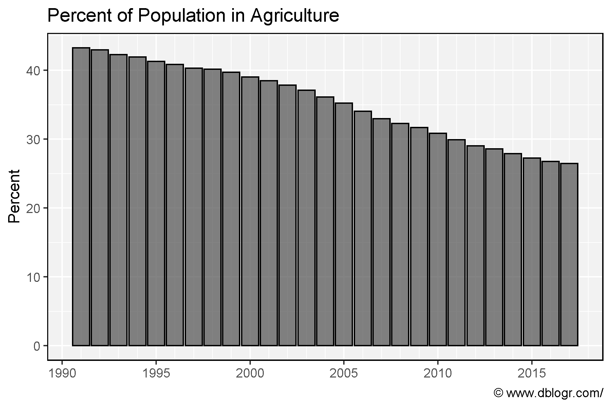
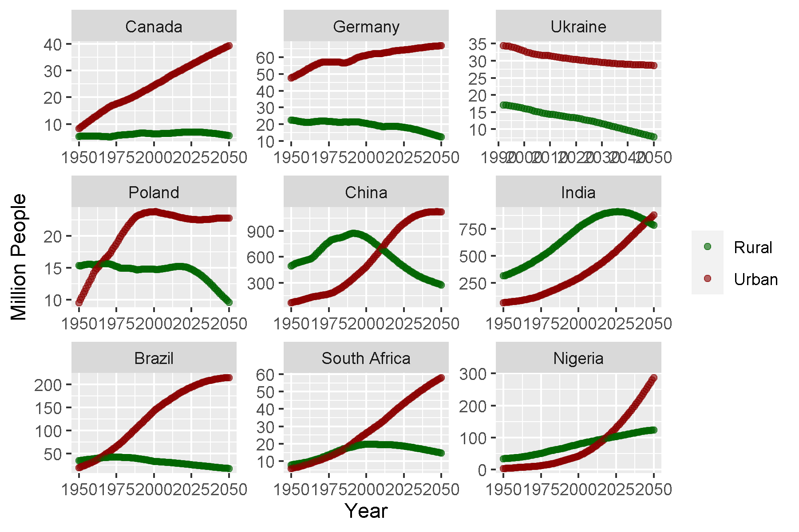
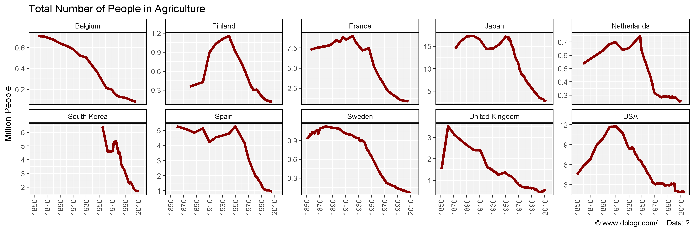
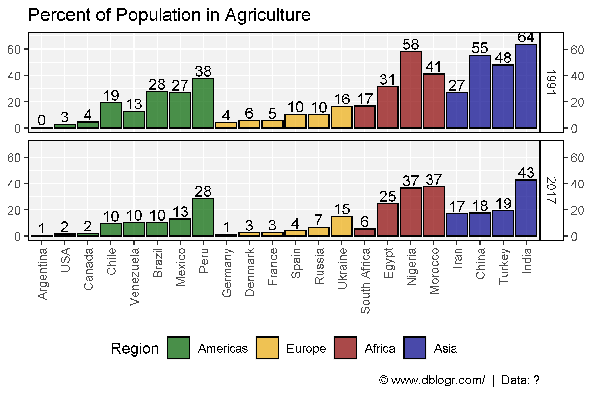

```{r setup, include = FALSE}
knitr::opts_chunk$set(echo = T, message = F, warning = F)
```

---

```{r}
# devtools::install_github("derekmichaelwright/agData")
library(agData) # Loads: tidyverse, ggpubr, ggbeeswarm, ggrepel
```

---

```{r}
# Prep data
xx <- agData_People %>% 
  filter(Measurement == "Percent", Area == "World")
# Plot
mp <- ggplot(xx, aes(x = Year, y = Value)) + 
  geom_bar(stat= "identity", color = "black", alpha = 0.75) +
  scale_x_continuous(breaks       = seq(1990, 2020, by = 5),
                     minor_breaks = seq(1990, 2020, by = 1)) +
  theme_agData() +
  labs(title = "Percent of Population in Agriculture", y = "Percent", x = NULL,
       caption = "\xa9 www.dblogr.com/")
ggsave("People_in_Ag_01.png", mp, width = 6, height = 4)
```

```{r echo = F}
ggsave("../../../myblog/content/graphs_agdata/people_in_ag/gallery/gallery/People_in_Ag_01.png", mp, width = 6, height = 4)
```



---

```{r}
# Prep data
areas <- c("Canada", "Germany", "Ukraine",
           "Poland", "China", "India", 
           "Brazil", "South Africa", "Nigeria" )
xx <- agData_FAO_Population %>% 
  filter(Measurement %in% c("Rural","Urban"),
         Area %in% areas) %>%
  mutate(Area = factor(Area, levels = areas))
# Plot
mp <- ggplot(xx, aes(x = Year, y = Value / 1000000, color = Measurement)) +
  geom_point(alpha = 0.6) + 
  facet_wrap(.~Area, scales = "free") +
  scale_color_manual(name = NULL, values = c("darkgreen", "darkred")) +
  labs(y = "Million People")
ggsave("People_in_Ag_02.png", mp, width = 6, height = 4)
```

```{r echo = F}
ggsave("../../../myblog/content/graphs_agdata/people_in_ag/gallery/gallery/People_in_Ag_02.png", mp, width = 6, height = 4)
```



---

```{r}
# Prep data
xx <- agData_People %>% 
  filter(Measurement == "Total")
# Plot
mp <- ggplot(xx, aes(x = Year, y = Value/1000000)) + 
  geom_line(color = "darkred", size = 1.5) + 
  facet_wrap(Area~., scales = "free_y", ncol = 5) +
  scale_x_continuous(breaks       = seq(1850, 2020, by = 20),
                     minor_breaks = seq(1850, 2020, by = 10)) +
  theme_agData(rotx = T) +
  labs(title = "Total Number of People in Agriculture", 
       caption = "\xa9 www.dblogr.com/  |  Data: ?",
       y = "Million People", x = NULL)
ggsave("People_in_Ag_03.png", mp, width = 12, height = 4)
```

```{r echo = F}
ggsave("../../../myblog/content/graphs_agdata/people_in_ag/gallery/gallery/People_in_Ag_03.png", mp, width = 12, height = 4)
```



---

```{r}
# Prep data
areas <- c("Canada", "USA", "Mexico", 
           "Venezuela", "Brazil", "Chile", "Argentina", "Peru",
           "Spain","France","Germany", "Denmark", "Ukraine", "Russia",
           "China", "India", "Turkey", "Syria","Iran",
           "Ethiopoia", "South Africa", "Nigeria","Morocco", "Egypt")
xx <- agData_People %>% 
  filter(Measurement == "Percent", Year %in% c(1991, 2017), Area %in% areas) %>%
  addRegionInfo() %>%
  arrange(Region, Value) %>%
  mutate(Area = factor(Area, levels = unique(.$Area)))
# Plot
mp <- ggplot(xx, aes(x = Area, y = Value, fill = Region, label = round(Value))) + 
  geom_bar(stat= "identity", alpha = 0.7, color = "black") +
  geom_text(nudge_y = 6) +
  facet_grid(Year~.) +
  scale_y_continuous(sec.axis = dup_axis(name = NULL)) +
  scale_fill_manual(values = agData_Colors) +
  theme_agData() +
  theme(axis.text.x = element_text(angle = 90, hjust = 1, vjust = 0.5),
        legend.position = "bottom") +
  labs(y = NULL, x = NULL,
       title = "Percent of Population in Agriculture", 
       caption = "\xa9 www.dblogr.com/  |  Data: ?")
ggsave("People_in_Ag_04.png", mp, width = 6, height = 4)
```

```{r echo = F}
ggsave("../../../myblog/content/graphs_agdata/people_in_ag/gallery/gallery/People_in_Ag_04.png", mp, width = 6, height = 4)
ggsave("../../../myblog/content/posts_agdata/people_in_ag/featured.png", mp, width = 6, height = 4)
```



---

&copy; Derek Michael Wright 2020 [www.dblogr.com/](https://dblogr.netlify.com/)