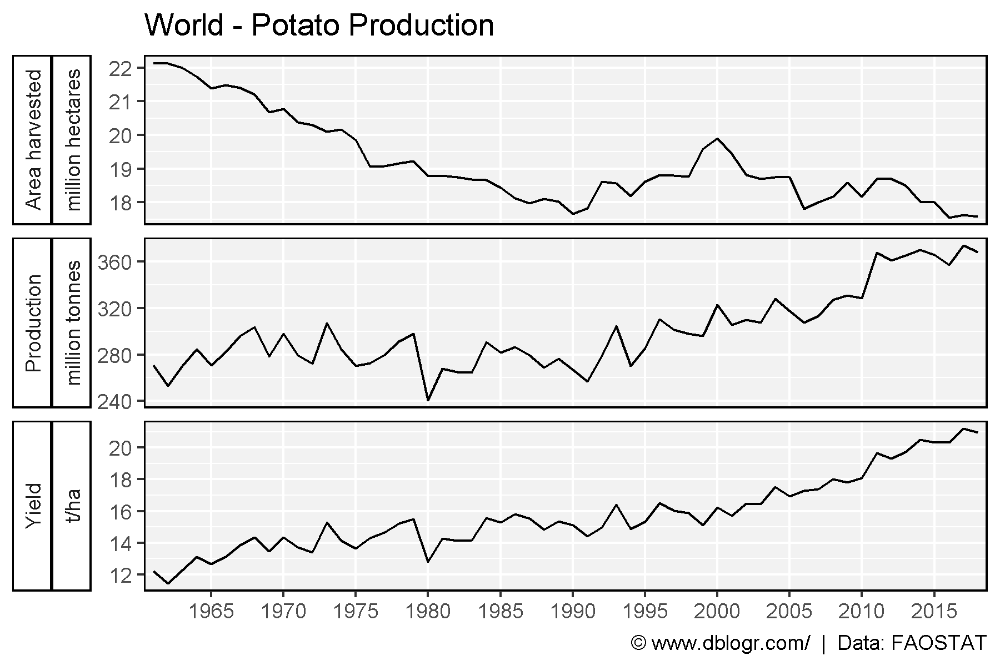
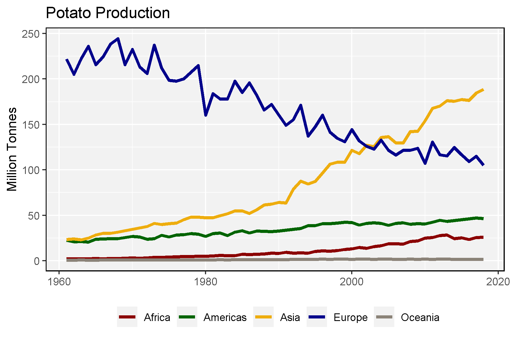
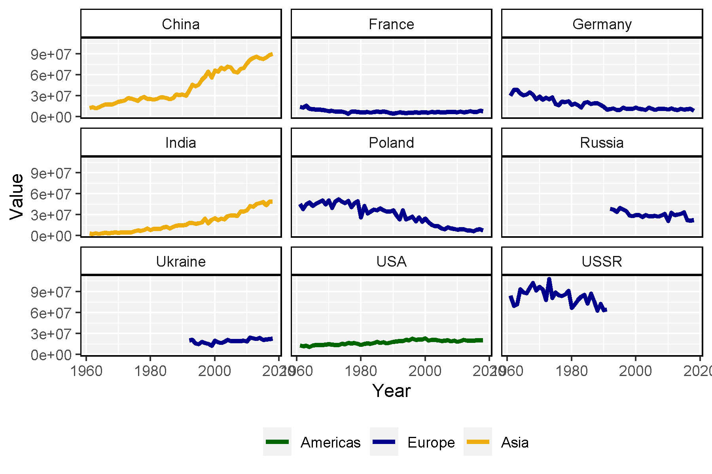
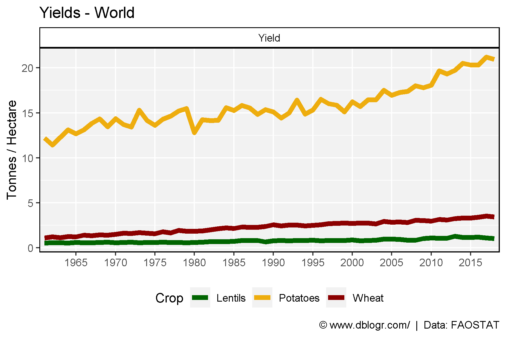

```{r setup, include = FALSE}
knitr::opts_chunk$set(echo = TRUE, message = F, warning = F)
```

---

```{r}
# devtools::install_github("derekmichaelwright/agData")
library(agData) # Loads: tidyverse, ggpubr, ggbeeswarm, ggrepel
```

# Global Production

```{r}
# Prep data
xx <- agData_FAO_Crops %>% 
  filter(Area == "World", Crop == "Potatoes") %>%
  mutate(Value = ifelse(Measurement != "Yield", Value / 1000000, Value),
         Unit = plyr::mapvalues(Unit, c("tonnes","hectares"),
                                c("million tonnes","million hectares")))
# Plot
mp <- ggplot(xx, aes(x = Year, y = Value)) + 
  geom_line() + 
  facet_grid(Measurement+Unit~., scales = "free", switch = "y") +
  scale_x_continuous(breaks = seq(1960, 2015, 5), minor_breaks = NULL) +
  coord_cartesian(xlim = c(min(xx$Year)+2, max(xx$Year)-2)) +
  theme_agData(strip.placement = "outside") +
  labs(title = "World - Potato Production", y = NULL, x = NULL,
       caption = "\xa9 www.dblogr.com/  |  Data: FAOSTAT")
ggsave("potato_01.png", mp, width = 6, height = 4)
```

```{r echo = F}
ggsave("../../../myblog/content/graphs_agdata/potato/gallery/gallery/potato_01.png", mp, width = 6, height = 4)
```



# Production by Region

```{r}
# Prep data
xx <- agData_FAO_Crops %>% 
  filter(Area %in% agData_FAO_Region_Table$Region, 
         Measurement == "Production", Crop == "Potatoes")
# Plot
mp <- ggplot(xx, aes(x = Year, y = Value/1000000, color = Area)) + 
  geom_line(size = 1.25) +
  scale_color_manual(name = NULL, values = agData_Colors[c(3,1,2,4,5)]) +
  theme_agData(legend.position = "bottom") +
  labs(title = "Potato Production", x = NULL, y = "Million Tonnes")
ggsave("potato_02.png", mp, width = 6, height = 4)
```

```{r echo = F}
ggsave("../../../myblog/content/graphs_agdata/potato/gallery/gallery/potato_02.png", mp, width = 6, height = 4)
```



```{r}
# Prep data
areas <- agData_FAO_Crops %>% 
  filter(Year %in% c(1961,2017), Area %in% agData_FAO_Country_Table$Country,
         Measurement == "Production", Crop == "Potatoes") %>% 
  arrange(desc(Value)) %>% slice(1:9) %>% pull(Area) %>% unique()
xx <- agData_FAO_Crops %>% addRegionInfo() %>%
  filter(Area %in% areas, Measurement == "Production", Crop == "Potatoes")
# Plot
mp <- ggplot(xx, aes(x = Year, y = Value, color = Region)) + 
  geom_line(size = 1.25) +
  facet_wrap(Area ~ .) +
  scale_color_manual(name = NULL, values = agData_Colors[c(1,4,2)]) +
  theme_agData(legend.position = "bottom")
ggsave("potato_03.png", mp, width = 6, height = 4)
```

```{r echo = F}
ggsave("../../../myblog/content/graphs_agdata/potato/gallery/gallery/potato_03.png", mp, width = 6, height = 4)
```



# potato vs Wheat and Lentil

```{r}
# Prep data
xx <- agData_FAO_Crops %>% 
  filter(Area == "World", Measurement == "Yield", 
         Crop %in% c("Potatoes", "Wheat", "Lentils"))
# Plot
mp <- ggplot(xx, aes(x = Year, y = Value, color = Crop)) + 
  geom_line(size = 2) + 
  facet_wrap(.~Measurement, scales = "free") +
  scale_color_manual(values = agData_Colors) +
  scale_x_continuous(breaks = seq(1960, 2015, 5), minor_breaks = NULL) +
  coord_cartesian(xlim = c(min(xx$Year)+2, max(xx$Year)-2)) +
  theme_agData(legend.position = "bottom") +
  labs(title = "Yields - World", y = "Tonnes /\ Hectare", x = NULL,
       caption = "\xa9 www.dblogr.com/  |  Data: FAOSTAT")
ggsave("potato_04.png", mp, width = 6, height = 4)
```

```{r echo = F}
ggsave("../../../myblog/content/graphs_agdata/potato/gallery/gallery/potato_04.png", mp, width = 6, height = 4)
ggsave("../../../myblog/content/posts_agdata/potato/featured.png", mp, width = 6, height = 4)
```

