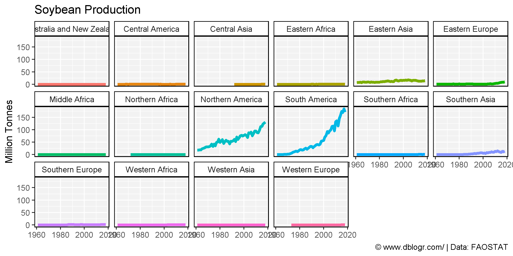
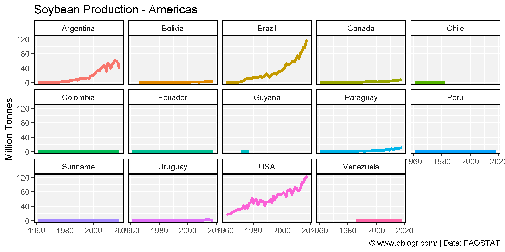
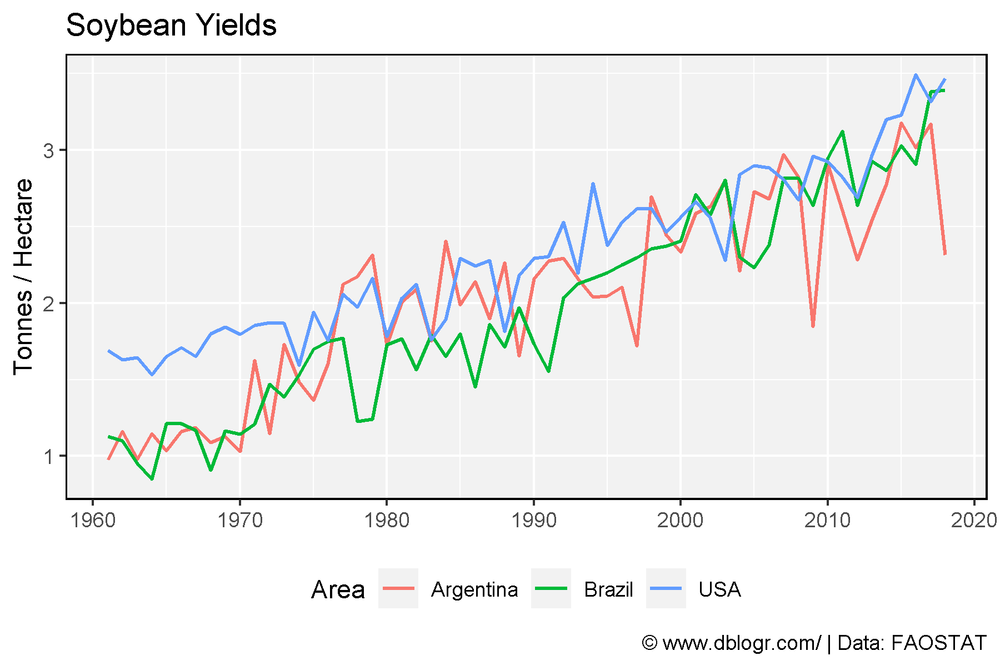
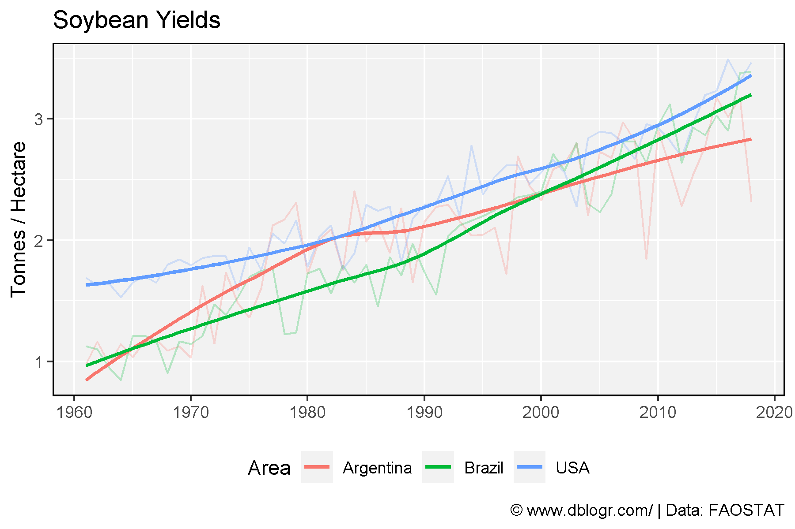
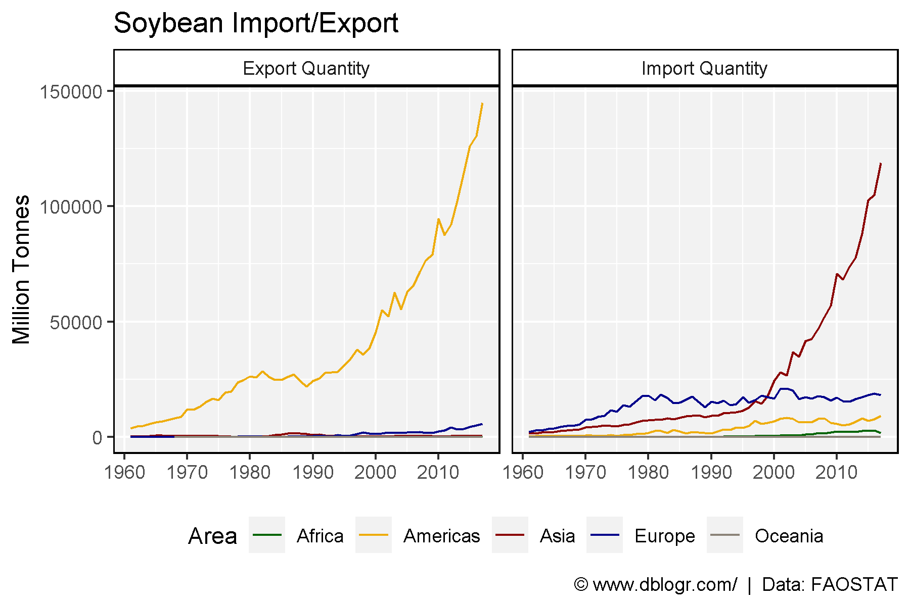
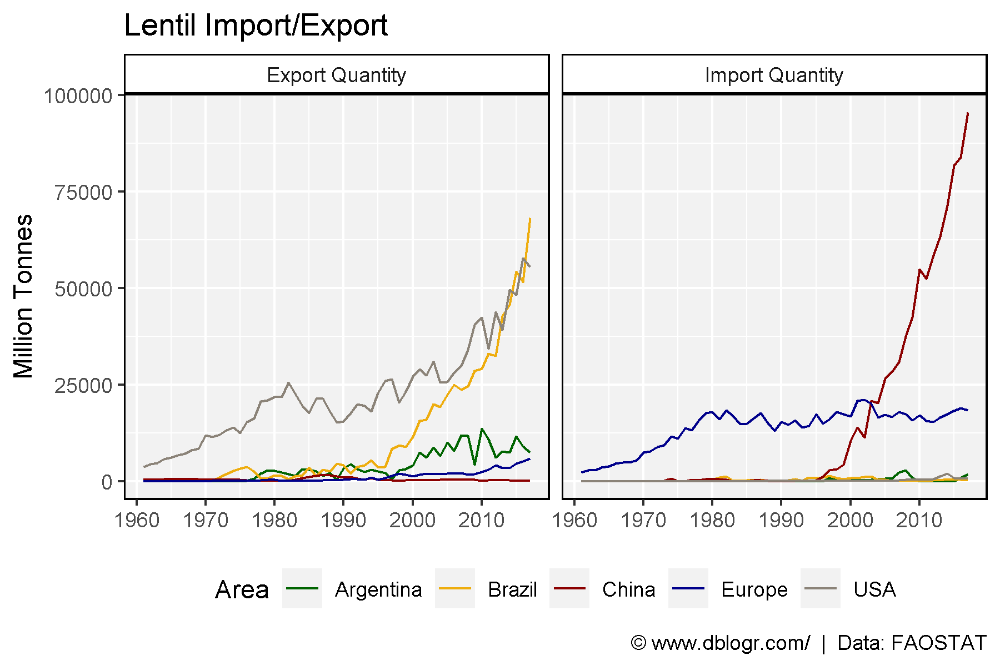

```{r setup, include = FALSE}
knitr::opts_chunk$set(echo = TRUE, warning = F, message = F)
```

---

```{r}
# devtools::install_github("derekmichaelwright/agData")
library(agData) # Loads: tidyverse, ggpubr, ggbeeswarm, ggrepel
```

---

# Production

```{r}
# Prep Data
xx <- agData_FAO_Crops %>% 
  filter(Crop == "Soybeans", Measurement == "Production",
         Area %in% agData_FAO_Region_Table$SubRegion) 
# Plot Data
mp <- ggplot(xx, aes(x = Year, y = Value / 1000000, color = Area)) + 
  geom_line(size = 1.5) + 
  facet_wrap(Area ~ ., ncol = 6) +
  theme_agData(legend.position = "none") +
  labs(title = "Soybean Production", y = "Million Tonnes", x = NULL,
       caption = "\xa9 www.dblogr.com/ | Data: FAOSTAT")
ggsave("soybean_01.png", mp, width = 8, height = 4)
```

```{r echo = F}
ggsave("../../../myblog/content/graphs_agdata/soybean/gallery/gallery/soybean_01.png", mp, width = 8, height = 4)
ggsave("../../../myblog/content/posts_agdata/soybean/featured.png", mp, width = 8, height = 4)
```



---

```{r}
# Prep Data
xx <- agData_FAO_Crops %>% addRegionInfo() %>%
  filter(Crop == "Soybeans", Measurement == "Production",
         SubRegion %in% c("South America", "Northern America")) 
# Plot Data
mp <- ggplot(xx, aes(x = Year, y = Value / 1000000, color = Area)) + 
  geom_line(size = 1.5) + 
  facet_wrap(Area ~ ., ncol = 5) +
  theme_agData(legend.position = "none") +
  labs(title = "Soybean Production - Americas", y = "Million Tonnes", x = NULL,
       caption = "\xa9 www.dblogr.com/ | Data: FAOSTAT")
ggsave("soybean_02.png", mp, width = 8, height = 4)
```

```{r echo = F}
ggsave("../../../myblog/content/graphs_agdata/soybean/gallery/gallery/soybean_02.png", mp, width = 8, height = 4)
```



---

```{r}
# Prep Data
xx <- agData_FAO_Crops %>% 
  filter(Crop == "Soybeans", Measurement == "Yield",
         Area %in% c("Argentina", "Brazil", "USA")) 
# Plot Data
mp <- ggplot(xx, aes(x = Year, y = Value, color = Area)) + 
  geom_line(size = 0.75) + 
  theme_agData(legend.position = "bottom") +
  scale_x_continuous(breaks = seq(1960, 2020, 10)) +
  labs(title = "Soybean Yields", y = "Tonnes / Hectare", x = NULL,
       caption = "\xa9 www.dblogr.com/ | Data: FAOSTAT")
ggsave("soybean_03.png", mp, width = 6, height = 4)
```

```{r echo = F}
ggsave("../../../myblog/content/graphs_agdata/soybean/gallery/gallery/soybean_03.png", mp, width = 6, height = 4)
```



---

```{r}
# Plot Data
mp <- ggplot(xx, aes(x = Year, y = Value, color = Area)) + 
  geom_line(alpha = 0.25) + 
  geom_smooth(se = F) + 
  theme_agData(legend.position = "bottom") +
  scale_x_continuous(breaks = seq(1960, 2020, 10)) +
  labs(title = "Soybean Yields", y = "Tonnes / Hectare", x = NULL,
       caption = "\xa9 www.dblogr.com/ | Data: FAOSTAT")
ggsave("soybean_04.png", mp, width = 6, height = 4)
```

```{r echo = F}
ggsave("../../../myblog/content/graphs_agdata/soybean/gallery/gallery/soybean_04.png", mp, width = 6, height = 4)
```



---

# Import and Export

```{r}
xx <- agData_FAO_Trade %>%
  filter(Measurement %in% c("Import Quantity", "Export Quantity"),
         Crop == "Soybeans", Area %in% agData_FAO_Region_Table$Region)
#
mp <- ggplot(xx, aes(x = Year, y = Value / 1000000, group = Area, color = Area)) + 
  geom_line() + 
  facet_grid(. ~ Measurement) +
  scale_x_continuous(breaks       = seq(1960, 2015, by = 10),
                     minor_breaks = seq(1960, 2015, by = 5))  +
  scale_color_manual(values = agData_Colors) +
  theme_agData(legend.position = "bottom") + 
  labs(title = "Soybean Import/Export", y = "Million Tonnes", x = NULL,
       caption = "\xa9 www.dblogr.com/  |  Data: FAOSTAT")
ggsave("soybean_05.png", mp, width = 6, height = 4)
```

```{r echo = F}
ggsave("../../../myblog/content/graphs_agdata/soybean/gallery/gallery/soybean_05.png", mp, width = 6, height = 4)
```



---

```{r}
xx <- agData_FAO_Trade %>%
  filter(Measurement %in% c("Import Quantity", "Export Quantity"),
         Crop == "Soybeans", 
         Area %in% c("USA", "Brazil", "Argentina", "Europe", "China"))
#
mp <- ggplot(xx, aes(x = Year, y = Value / 1000000, group = Area, color = Area)) + 
  geom_line() + 
  facet_grid(. ~ Measurement) +
  scale_x_continuous(breaks       = seq(1960, 2015, by = 10),
                     minor_breaks = seq(1960, 2015, by = 5))  +
  scale_color_manual(values = agData_Colors) +
  theme_agData(legend.position = "bottom") + 
  labs(title = "Soybean Import/Export", y = "Million Tonnes", x = NULL,
       caption = "\xa9 www.dblogr.com/  |  Data: FAOSTAT")
ggsave("soybean_06.png", mp, width = 6, height = 4)
```

```{r echo = F}
ggsave("../../../myblog/content/graphs_agdata/soybean/gallery/gallery/soybean_06.png", mp, width = 6, height = 4)
```



---

&copy; Derek Michael Wright 2020 [www.dblogr.com/](https://dblogr.netlify.com/)