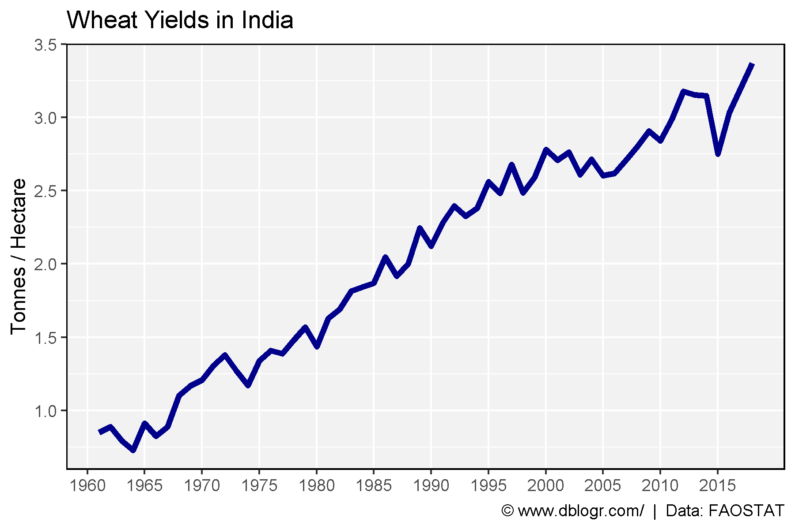
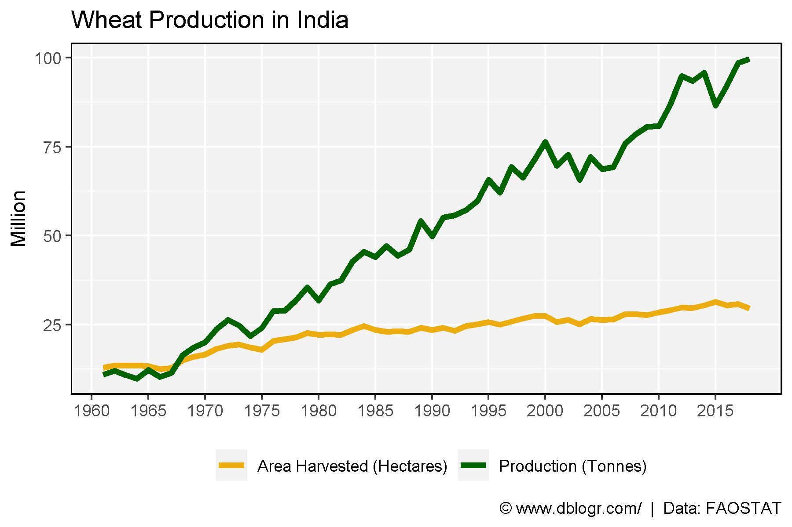

```{r setup, include = FALSE}
knitr::opts_chunk$set(echo = T, message = F, warning = F)
```

---

```{r}
# devtools::install_github("derekmichaelwright/agData")
library(agData) # Loads: tidyverse, ggpubr, ggbeeswarm, ggrepel
```

---

# Yield

```{r}
# Prep data
xx <- agData_FAO_Crops %>% 
  filter(Crop == "Wheat", Area == "India", Measurement == "Yield")
# Plot yield data
mp <- ggplot(xx %>% filter(Measurement =="Yield"), aes(x = Year, y = Value) ) +
  geom_line(size = 1.5, color = "darkblue") +
  scale_x_continuous(breaks = seq(1960, 2015, 5), minor_breaks = NULL) +
  theme_agData() +
  labs(title = "Wheat Yields in India", y = "Tonnes / Hectare", x = NULL,
       caption = "\xa9 www.dblogr.com/  |  Data: FAOSTAT")
ggsave("wheat_india_01.png", mp, width = 6, height = 4)
```

```{r echo = F}
ggsave("../../../myblog/content/graphs_agdata/wheat_india/gallery/gallery/wheat_india_01.png", mp, width = 6, height = 4)
#ggsave("C:/gitfolder/personalblog/content/articles/Norman_Borlaug/wheat_india_02.png", width = 6, height = 4)
```



---

# Area and Production

```{r}
# Prep data
xx <- agData_FAO_Crops %>% 
  filter(Crop == "Wheat", Area == "India", Measurement != "Yield")
# Plot production data
mp <- ggplot(xx, aes(x = Year, y = Value/1000000, color = Measurement) ) +
  geom_line(size = 1.5) +
  scale_x_continuous(breaks = seq(1960, 2015, 5), minor_breaks = NULL) +
  scale_color_manual(name   = NULL,
                     labels = c("Area Harvested (Hectares)", "Production (Tonnes)"),
                     values = c("darkgoldenrod2",            "darkgreen")) +
  theme_agData(legend.position = "bottom") + 
  labs(title = "Wheat Production in India", y = "Million", x = NULL,
       caption = "\xa9 www.dblogr.com/  |  Data: FAOSTAT")
ggsave("wheat_india_02.png", mp, width = 6, height = 4)
```

```{r echo = F}
ggsave("../../../myblog/content/graphs_agdata/wheat_india/gallery/gallery/wheat_india_02.png", mp, width = 6, height = 4)
#ggsave(".../articles/Norman_Borlaug/wheat_india_01.png", width = 6, height = 4)
ggsave("../../../myblog/content/posts_agdata/wheat_india/featured.png", mp, width = 6, height = 4)
```



---

&copy; Derek Michael Wright 2020 [www.dblogr.com/](https://dblogr.netlify.com/)