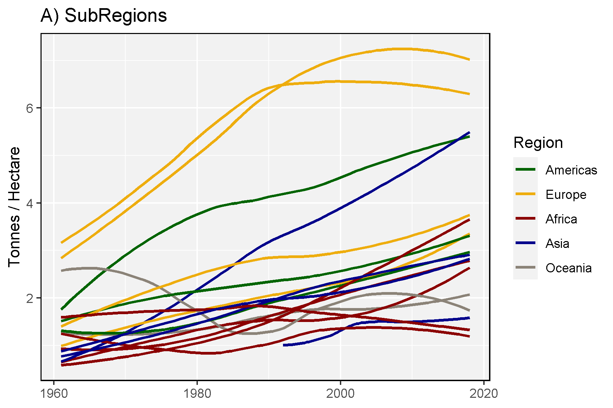
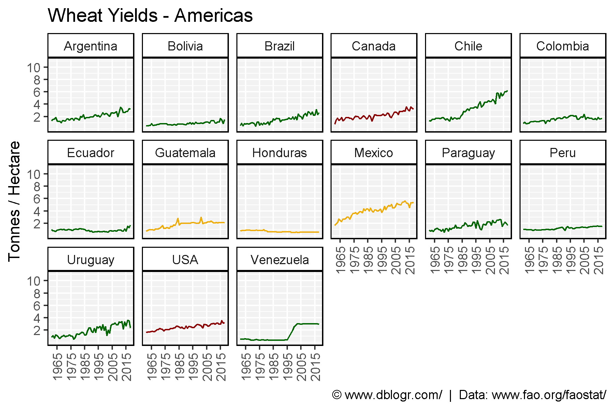
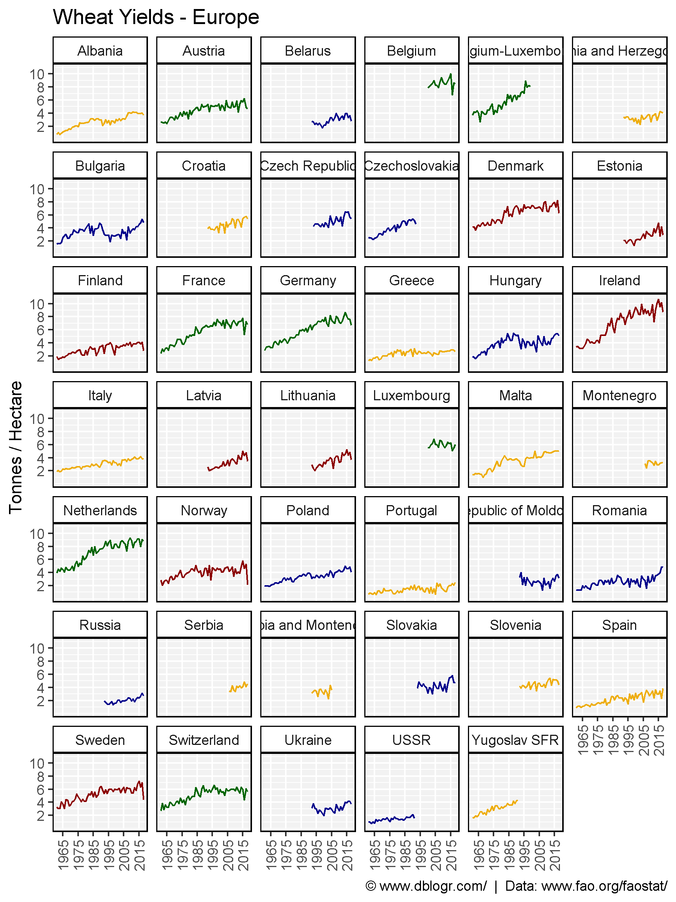
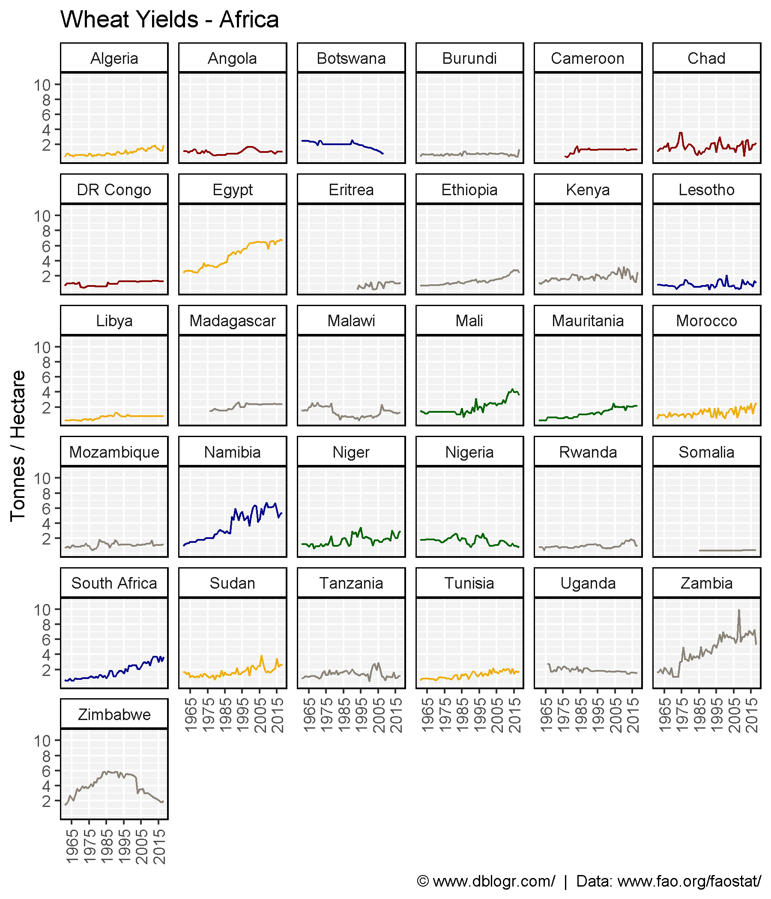
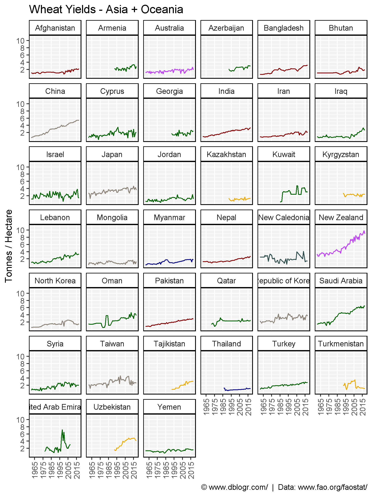
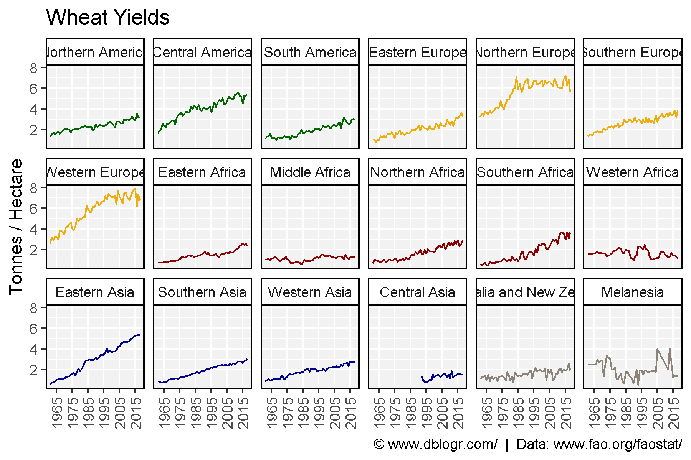
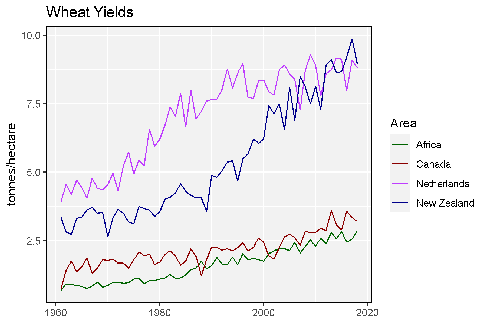

```{r setup, include = FALSE}
knitr::opts_chunk$set(echo = T, message = F, warning = F)
```

---

```{r}
# devtools::install_github("derekmichaelwright/agData")
library(agData) # Loads: tidyverse, ggpubr, ggbeeswarm, ggrepel
```

---

```{r}
# Prep data
xx <- agData_FAO_Crops %>% 
  filter(Crop == "Wheat", Measurement == "Yield", 
         Area %in% agData_FAO_Country_Table$SubRegion) %>%
  left_join(agData_FAO_Country_Table, by = c("Area"="SubRegion"))
# Plot
mp <- ggplot(xx, aes(x = Year, y = Value)) + 
  geom_smooth(aes(color = Region, group = Area), method = "loess", se = F) +
  scale_color_manual(values = agData_Colors) + 
  theme_agData() +
  labs(title = "A) SubRegions", y = "Tonnes / Hectare", x = NULL)
ggsave("wheat_yields_01.png", mp, width = 6, height = 4)
```

```{r echo = F}
ggsave("../../../myblog/content/graphs_agdata/wheat_yields/gallery/gallery/wheat_yields_01.png", mp, width = 6, height = 4)
```



---

```{r}
# Prep data
xx <- agData_FAO_Crops %>% 
  filter(Crop == "Wheat", Measurement == "Yield", 
         Area %in% agData_FAO_Country_Table$Country) %>%
  left_join(agData_FAO_Country_Table, by = c("Area"="Country"))
x1 <- xx %>% filter(Region == "Americas")
x2 <- xx %>% filter(Region == "Europe")
x3 <- xx %>% filter(Region == "Africa")
x4 <- xx %>% filter(Region %in% c("Asia", "Oceania"))
# Create plot function
my_ggplot <- function(x){
  ggplot(x, aes(x = Year, y = Value, color = SubRegion) ) +
    geom_line() +
  facet_wrap(Area~., ncol = 6) +
  theme_agData() +
  theme(legend.position = "none",
        axis.text.x = element_text(angle = 90, vjust = 0.5),
        plot.caption = element_text(vjust = 1)) +
  scale_color_manual(values = agData_Colors) +
  scale_x_continuous(breaks = seq(1965, 2015, by = 10), minor_breaks = NULL) +
  scale_y_continuous(breaks = c(2, 4, 6, 8, 10)) +
  coord_cartesian(ylim = c(0,11)) +
  labs(caption = "\xa9 www.dblogr.com/  |  Data: www.fao.org/faostat/",
       y = "Tonnes / Hectare", x = NULL)
}
# Plot
mp <- my_ggplot(x1) + labs(title = "Wheat Yields - Americas")
ggsave("wheat_yields_02.png", mp, width = 6, height = 4)
```

```{r echo = F}
ggsave("../../../myblog/content/graphs_agdata/wheat_yields/gallery/gallery/wheat_yields_02.png", mp, width = 6, height = 4)
```



---

```{r}
# Plot
mp <- my_ggplot(x2) + labs(title = "Wheat Yields - Europe")
ggsave("wheat_yields_03.png", mp, width = 6, height = 8)
```

```{r echo = F}
ggsave("../../../myblog/content/graphs_agdata/wheat_yields/gallery/gallery/wheat_yields_03.png", mp, width = 6, height = 8)
```



---

```{r}
# Plot
mp <- my_ggplot(x3) + labs(title = "Wheat Yields - Africa")
ggsave("wheat_yields_04.png", mp, width = 6, height = 7)
```

```{r echo = F}
ggsave("../../../myblog/content/graphs_agdata/wheat_yields/gallery/gallery/wheat_yields_04.png", mp, width = 6, height = 7)
```



---

```{r}
# Plot
mp <- my_ggplot(x4) + labs(title = "Wheat Yields - Asia + Oceania")
ggsave("wheat_yields_05.png", mp, width = 6, height = 8)
```

```{r echo = F}
ggsave("../../../myblog/content/graphs_agdata/wheat_yields/gallery/gallery/wheat_yields_05.png", mp, width = 6, height = 8)
```



---

```{r}
# Prep data
xx <- agData_FAO_Crops %>% 
  filter(Crop == "Wheat", Measurement == "Yield",
         Area %in% agData_FAO_Country_Table$SubRegion) %>%
  left_join(agData_FAO_Country_Table, by = c("Area"="SubRegion")) %>%
  arrange(Region) %>%
  mutate(Area = factor(Area, levels = unique(Area)))
# Plot
mp <- ggplot(xx, aes(x = Year, y = Value, color = Region) ) +
  geom_line() + facet_wrap(Area~., ncol = 6) + theme_agData() +
  theme(legend.position = "none",
        axis.text.x = element_text(angle = 90, vjust = 0.5),
        plot.caption = element_text(vjust = 1)) +
  scale_color_manual(values = agData_Colors) +
  scale_x_continuous(breaks = seq(1965, 2015, by = 10), minor_breaks = NULL) +
  scale_y_continuous(breaks = c(2, 4, 6, 8)) +
  labs(title = "Wheat Yields", y = "Tonnes / Hectare", x = NULL,
       caption = "\xa9 www.dblogr.com/  |  Data: www.fao.org/faostat/")
ggsave("wheat_yields_06.png", mp, width = 6, height = 4)
```

```{r echo = F}
ggsave("../../../myblog/content/graphs_agdata/wheat_yields/gallery/gallery/wheat_yields_06.png", mp, width = 6, height = 4)
```



---

```{r}
# Prep data
xx <- agData_FAO_Crops %>% 
  filter(Crop == "Wheat", Measurement == "Yield", 
         Area %in% c("New Zealand", "Netherlands", "Africa", "Canada"))
mp <- ggplot(xx, aes(x = Year, y = Value, color = Area)) +
  geom_line() +
  scale_color_manual(values = agData_Colors[c(1,3,6,4)]) +
  theme_agData() +
  labs(title = "Wheat Yields", x = NULL, y = "tonnes/hectare")
ggsave("wheat_yields_07.png", mp, width = 6, height = 4)
```

```{r echo = F}
ggsave("../../../myblog/content/graphs_agdata/wheat_yields/gallery/gallery/wheat_yields_07.png", mp, width = 6, height = 4)
ggsave("../../../myblog/content/posts_agdata/wheat_yields/featured.png", mp, width = 6, height = 4)
```



---

&copy; Derek Michael Wright 2020 [www.dblogr.com/](https://dblogr.netlify.com/)