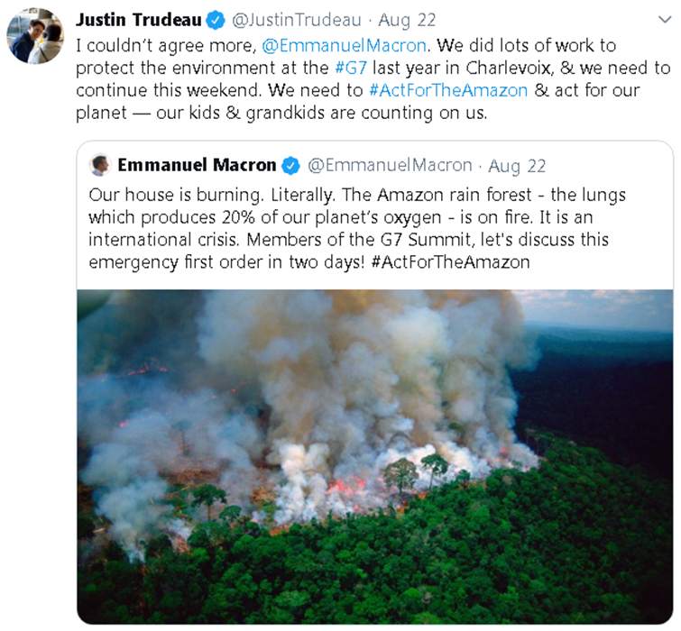
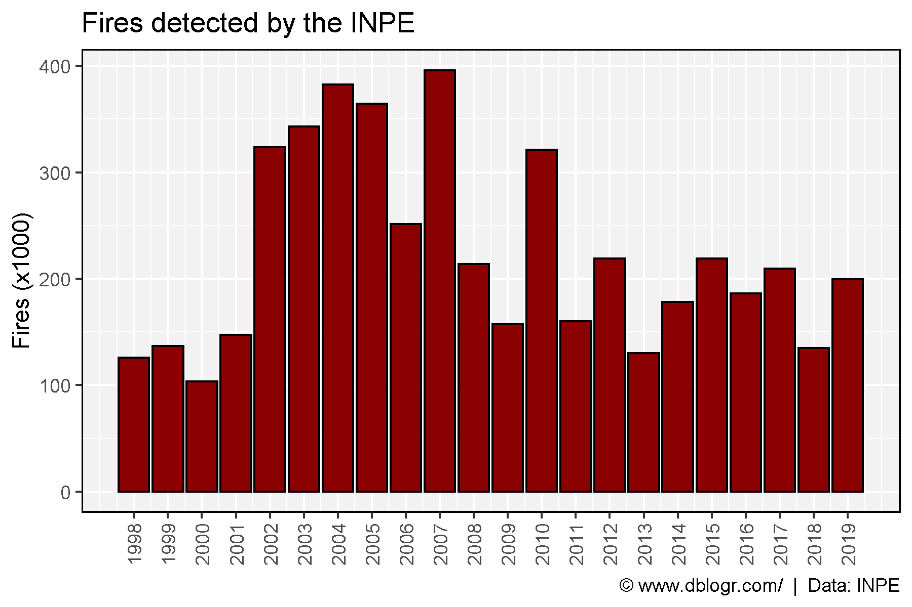
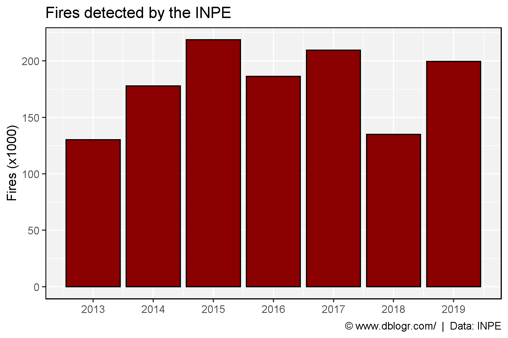
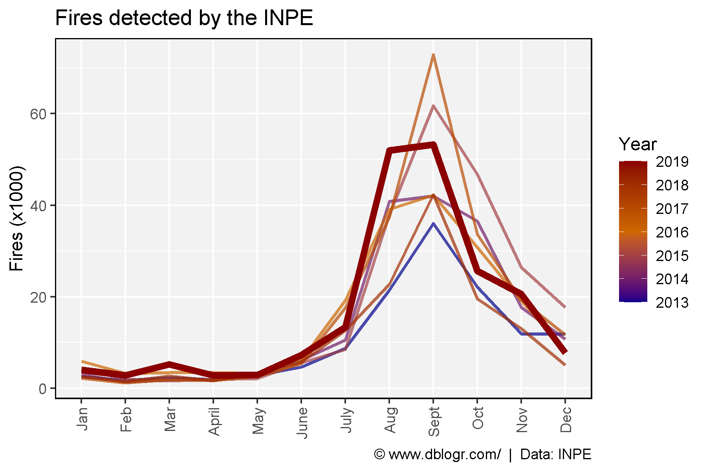
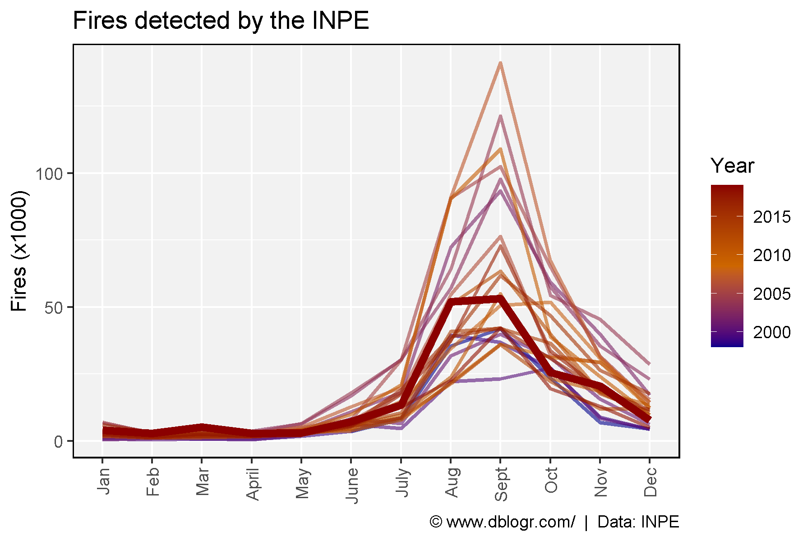
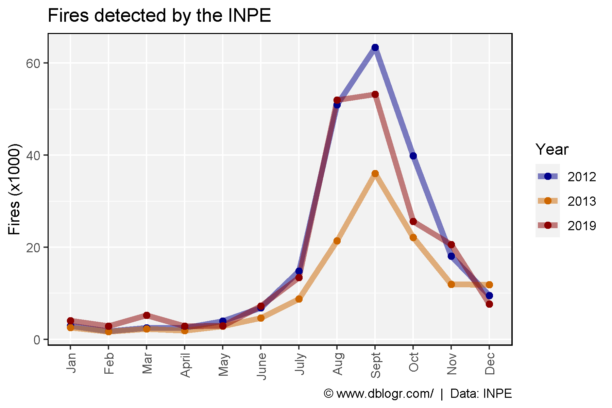
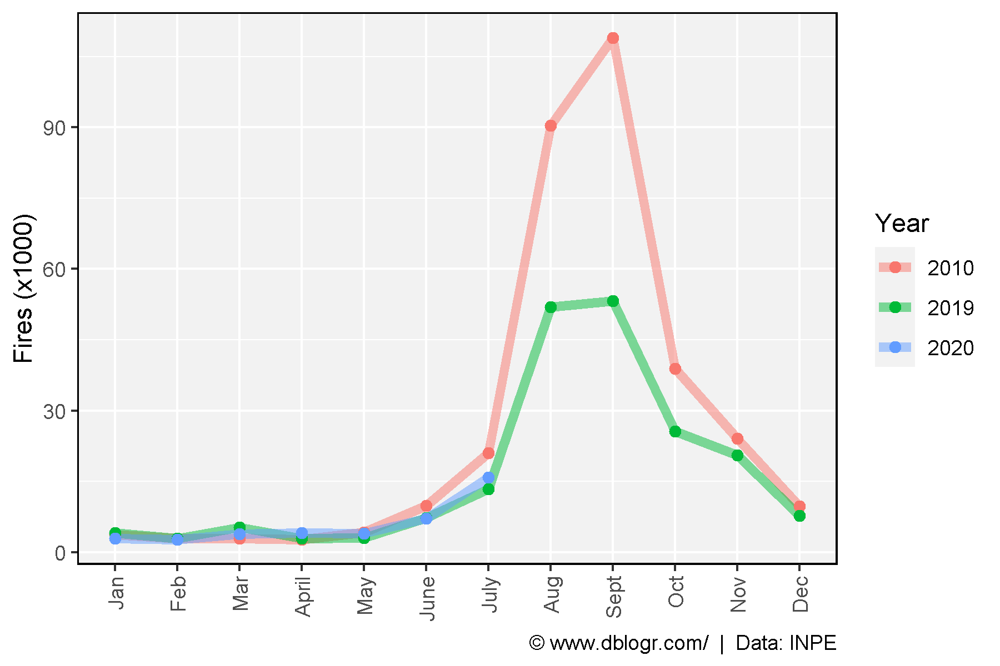
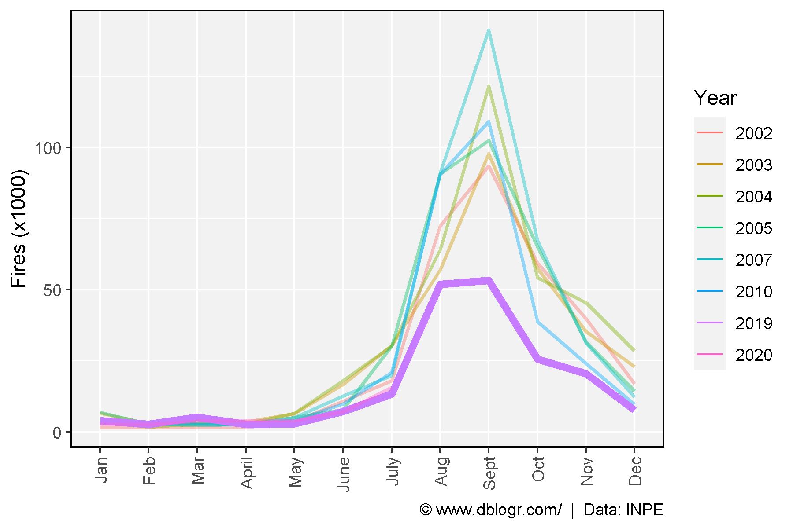
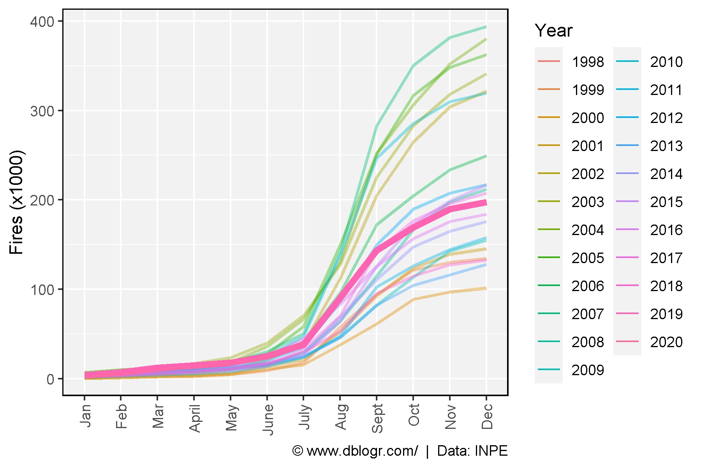

```{r setup, include=FALSE}
knitr::opts_chunk$set(echo = T, message = F, warning = F)
```

---

# Introduction

In August of 2019, fires in the Amazon made international news after the story became viral on social media. Notably, the story was tweeted out by the French President [Emmanuel Macron](https://twitter.com/EmmanuelMacron/status/1164617008962527232), and retweeted by the Canadian Prime Minister [Justin Trudeau](https://twitter.com/JustinTrudeau/status/1164703456453681153). These two tweets got > 70,000 retweets and > 200,000 likes combined, and serve as an example of how misleading information can quickly be spread online.



- **Does the Amazon produce 20% of our planet's oxygen? Is that a photo of the fires in question? Is the Amazon on fire?** 

> *No*, phytoplankton in the ocean our are planet's "lungs". *No*, its over 20 years old. *Yes/No*, it is important to distinguish between *forest fires* (such as the one pictured in the tweet) and *controlled burning of dry scrub and felled trees as a strategy to gain ownership of land* (the type of fires in question).

For a good explanation, refer to this article by Machael Shellenberger: [**Click Here**](https://www.forbes.com/sites/michaelshellenberger/2019/08/26/why-everything-they-say-about-the-amazon-including-that-its-the-lungs-of-the-world-is-wrong/#546e8bd75bde) 

# CBC reporting

In Canada, the story made national news for a week straight on the CBC:

[The National Aug 21 starting around 19:30](https://www.youtube.com/watch?v=oN4Wa-7eKyA)

> "Record number of wildfires burning in the amazon rain forest. Brazil's space reserach centre has said its detected more than 74,000 fires this year. That's 83% more than last year"

[The National Aug 22 starting around  5:58](https://www.youtube.com/watch?v=ZKEj45YaymI&t=417s)

> "Continues to burn at a record pace"

[The National Aug 23 starting around  3:33](https://www.youtube.com/watch?v=jCfPm2Qu58U&t=2403s) 

> "The numbers show just how dire the situation is"

[The National Aug 25 starting around 6:55](https://www.youtube.com/watch?v=quMeStA20yk)

> "At least 41,000 wildfires have sparked in the world largest rain forest this year"

[The National Aug 26 starting around 4:05](https://www.youtube.com/watch?v=RQw251jYjj4)

> "Nearly 80,000 wildfires have been recorded this year"

[The National Aug 27 starting around 3:43](https://www.youtube.com/watch?v=3CmbJnJ9aWk) 

> "The rain forrest is being consumed at a rate not seen in 9 years"

So what started as a *"record number"* eventually became a *"rate not seen in 9 years"* with no correction or acknowledgment of error. *"More than 74,000 fires"*, *"at least 41,000"*, *"nearly 80,000"*, where is the CBC getting this information? This article gives a source:

https://www.cbc.ca/news/world/trudeau-more-work-needed-g7-summit-amazon-burns-1.5257458

> "According to Brazil's space research centre, INPE, which has been recording wildfires since 2013, more than 75,000 fires are burning in Brazil, which is a more than 80 per cent increase over the same period of 2018, the agency told Reuters."

Ok, lets check out the data ourselves.

Data source: National Institute for Space Reserach (*INPE*)

[http://queimadas.dgi.inpe.br/queimadas/portal-static/estatisticas_paises/](http://queimadas.dgi.inpe.br/queimadas/portal-static/estatisticas_paises/)

---

# Exploring the data

```{r}
# devtools::install_github("derekmichaelwright/agData")
library(agData) # Loads: tidyverse, ggpubr, ggbeeswarm, ggrepel
library(readxl) # read_xlsx()
```

```{r}
# Prep data
dd <- read_xlsx("INPE_Forest_Fires.xlsx", "INPE") %>%
  filter(Year < 2020)
DT::datatable(dd)
```

[*Table: INPE wild fire data.*](https://github.com/derekmichaelwright/myblog/tree/master/content/dblogr/INPE_Forest_Fires.xlsx)

---

First thing we notice, they have been recording data prior to 2013. That's odd, why would the CBC say that? Perhaps a look at the data will tell us why.

```{r}
# Prep data
xx <- dd %>% mutate(Total = rowSums(., na.rm = T))
# Plot
mp <- ggplot(xx, aes(x = Year, y = Total / 1000)) + 
  geom_bar(stat = "identity", fill = "Darkred", color = "Black") +
  scale_x_continuous(breaks = c(min(xx$Year):max(xx$Year))) +
  theme_agData(rotx = T) +
  labs(title = "Fires detected by the INPE",
       y = "Fires (x1000)", x= NULL,
       caption = "\xa9 www.dblogr.com/  |  Data: INPE")
ggsave("amazon_fires_01.png", mp, width = 6, height = 4)
```

```{r echo = F}
ggsave("../../../myblog/content/graphs_dblogr/amazon_fires/gallery/gallery/amazon_fires_01.png", mp, width = 6, height = 4)
ggsave("../../../myblog/content/posts_dblogr/amazon_fires/featured.png", mp, width = 6, height = 4)
```



Hmm, looking at *Figure 1* there seems to have been a lot more forest fires prior to 2013. Lets look at just the data CBC claimed was available (since 2013).

```{r}
# Prep data
xx <- xx %>% filter(Year > 2012)
# Plot
mp <- ggplot(xx, aes(x = Year, y = Total / 1000)) + 
  geom_bar(stat = "identity", fill = "Darkred", color = "Black") +
  scale_x_continuous(breaks = c(min(xx$Year):max(xx$Year))) +
  theme_agData() +
  labs(title = "Fires detected by the INPE",
       y = "Fires (x1000)", x= NULL,
       caption = "\xa9 www.dblogr.com/  |  Data: INPE")
ggsave("amazon_fires_02.png", mp, width = 6, height = 4)
```



Even when looking at this subset of the data, it doesn't appear to be some kind of crisis. However, lets look at the data by month and see if it tells a different story:

```{r}
# Prep data
xx <- dd %>% filter(Year > 2012) %>%
  gather(Month, Value, 2:ncol(.)) %>%
  mutate(Month = factor(Month, levels = unique(Month)),
         Value = as.numeric(Value),
         Highlight = ifelse(Year == 2019, "1", "2"))
# Plot
mp <- ggplot(xx, aes(x = Month, y = Value / 1000, color = Year, group = Year)) + 
  geom_line(aes(size = Highlight, alpha = Highlight)) + 
  scale_size_manual(values = c(2, 1)) +
  scale_alpha_manual(values = c(1, 0.7), guide = F) +
  scale_color_gradientn(colors = c("darkblue", "darkorange3", "darkred")) +
  theme_agData(rotx = T) + 
  guides(size = F) +
  labs(title = "Fires detected by the INPE",
       y = "Fires (x1000)", x = NULL,
       caption = "\xa9 www.dblogr.com/  |  Data: INPE")
ggsave("amazon_fires_03.png", mp, width = 6, height = 4)
```



Now it does look like forest fires have increased. And if we compare the data from 2018, there is a significant increase, as the CBC notes:

> "Record number of wildfires burning in the amazon rain forest. Brazil's space reserach centre has said its detected more than 74,000 fire this year. That's 83% more than last year"

However, this calculation was done when the story broke, so we will recalculate it with the end of month values.

```{r}
xx <- dd %>% select(-Dec, -Nov, -Oct, -Sept) %>%
  mutate(Total = rowSums(., na.rm = T),
         Highlight = ifelse(Year == 2019, "2", "1"))
x2018 <- xx$Total[xx$Year == 2018]
x2018 # 54944 forest fires from Jan 01 - Aug 31 2018
x2019 <- xx$Total[xx$Year == 2019]
x2019 # 92520 forest fires from Jan 01 - Aug 31 2019
100 * (x2019-x2018) / x2018
```

We can see there is indeed a 68% increase from the same time last year. 

However, what happens when we look at all the data?

---

# Data visualization

```{r}
# Prep data
xx <- dd %>% gather(Month, Value, 2:ncol(.)) %>%
  mutate(Month = factor(Month, levels = unique(Month)),
         Value = as.numeric(Value),
         Highlight = ifelse(Year == 2019, "1", "2"))
# Plot
mp <- ggplot(xx, aes(x = Month, y = Value / 1000, color = Year, group = Year)) + 
  geom_line(aes(size = Highlight, alpha = Highlight)) + 
  scale_size_manual(values = c(2, 1)) +
  scale_alpha_manual(values = c(1, 0.6), guide = F) +
  scale_color_gradientn(colors = c("darkblue", "darkorange3", "darkred")) +
  theme_agData(rotx = T) +
  guides(size = F) +
  labs(title = "Fires detected by the INPE",
       y = "Fires (x1000)", x = NULL,
       caption = "\xa9 www.dblogr.com/  |  Data: INPE") 
ggsave("amazon_fires_04.png", mp, width = 6, height = 4)
```

```{r echo = F}
ggsave("../../../myblog/content/graphs_dblogr/amazon_fires/gallery/gallery/amazon_fires_04.png", mp, width = 6, height = 4)
```



Now a different picture is painted. But why pick 2013 as the starting point?

```{r}
# Prep data
x1 <- xx %>% filter(Year %in% c(2020, 2019, 2012, 2013)) %>%
  mutate(Year = factor(Year))
# Plot
mp <- ggplot(x1, aes(x = Month, y = Value / 1000, color = Year, group = Year)) + 
  geom_line(size = 2, alpha = 0.5) + 
  geom_point(size = 2) +
  scale_color_manual(values = c("darkblue", "darkorange3", "darkred")) +
  theme_agData(rotx = T) +
  labs(title = "Fires detected by the INPE",
       y = "Fires (x1000)", x = NULL,
       caption = "\xa9 www.dblogr.com/  |  Data: INPE")
ggsave("amazon_fires_05.png", mp, width = 6, height = 4)
```



Looks like they just went back to the first year things were worse. However in thier last report, they do note that:

> "The rain forrest is being consumed at a rate not seen in 9 years"

so what happened in 2010 (9 years ago)

```{r}
# Prep data
x1 <- xx %>% filter(Year %in% c(2019, 2010)) %>%
  mutate(Year = factor(Year))
# Plot
mp <- ggplot(x1, aes(x = Month, y = Value / 1000, color = Year, group = Year)) + 
  geom_line(size = 2, alpha = 0.5) + 
  geom_point(size = 2) + 
  scale_color_manual(values = c("darkblue", "darkred")) +
  theme_agData(rotx = T) +
  labs(title = "Fires detected by the INPE",
       y = "Fires (x1000)", x = NULL,
       caption = "\xa9 www.dblogr.com/  |  Data: INPE")
ggsave("amazon_fires_06.png", mp, width = 6, height = 4)
```



Now lets do our own bias selection of data:

```{r}
# Prep data
x1 <- xx %>% filter(Year %in% c(2019, 2010, 2007, 2005, 2004, 2003, 2002))
# Plot
mp <- ggplot(x1, aes(x = Month, y = Value / 1000, color = Year, group = Year)) + 
  geom_line(aes(size = Highlight, alpha = Highlight)) + 
  scale_size_manual(values = c(2, 1)) +
  scale_alpha_manual(values = c(1, 0.6), guide = F) +
  scale_color_gradientn(colors = c("darkblue", "darkorange3", "darkred")) +
  theme_agData(rotx = T) +
  guides(size = F) +
  labs(title = "Fires detected by the INPE",
       y = "Fires (x1000)", x = NULL,
       caption = "\xa9 www.dblogr.com/  |  Data: INPE")
ggsave("amazon_fires_07.png", mp, width = 6, height = 4)
```



Doing this makes it seem like forest fires are decreasing.

Lastly, lets do a cumulative sum and plot all the data:

```{r}
xx <- dd %>% gather(Month, Value, 2:ncol(.)) %>%
  mutate(Month = factor(Month, levels = unique(Month)),
         Highlight = ifelse(Year == 2019, "1", "2"))
for(i in unique(xx$Year)) {
  xx[xx$Year == i,"Value"] <- cumsum(xx[xx$Year == i,"Value"])
}
mp <- ggplot(xx, aes(x = Month, y = Value / 1000, color = Year, group = Year)) +
  geom_line(aes(size = Highlight, alpha = Highlight)) +
  scale_size_manual(values = c(2, 1)) +
  scale_alpha_manual(values = c(1, 0.6), guide = F) +
  scale_color_gradientn(colors = c("darkblue", "darkorange3", "darkred")) +
  theme_agData(rotx = T) +
  guides(size = F) +
  labs(title = "Fires detected by the INPE",
       y = "Fires (x1000)", x = NULL,
       caption = "\xa9 www.dblogr.com/  |  Data: INPE")
ggsave("amazon_fires_08.png", mp, width = 6, height = 4)
```

```{r echo = F}
ggsave("../../../myblog/content/graphs_dblogr/amazon_fires/gallery/gallery/amazon_fires_08.png", width = 6, height = 4)
```



This all raises in interesting question: is the CBC being purposely deceitful? or are they just poor journalists?

You decide...

---

&copy; Derek Michael Wright 2020 [www.dblogr.com/](https://dblogr.netlify.com/)
