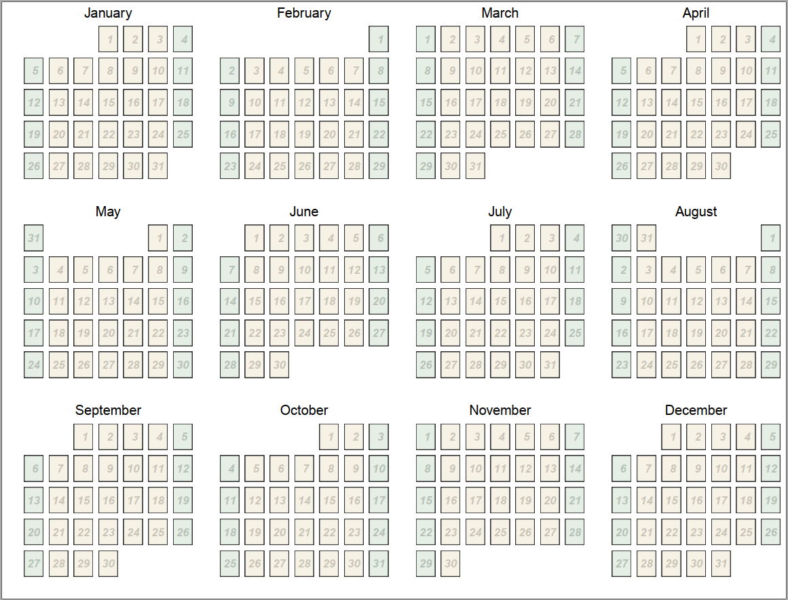
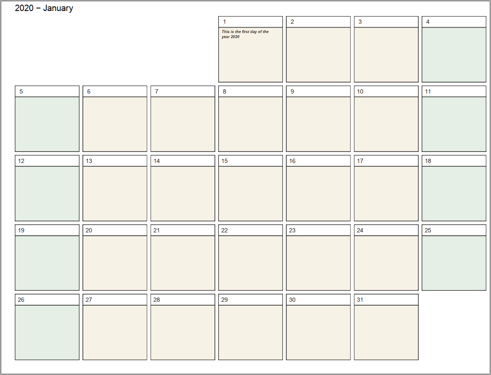
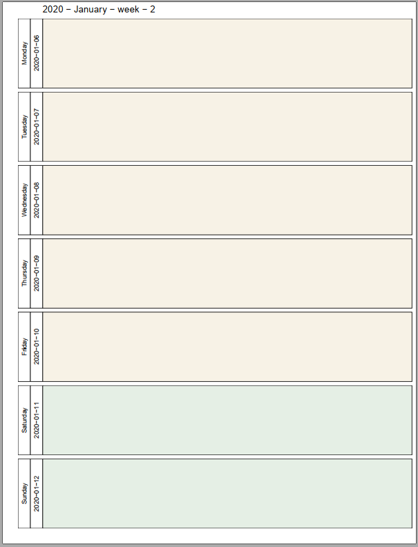

```{r setup, include = FALSE, warning = F, message = F}
knitr::opts_chunk$set(echo = T, message = F, warning = F)
```

---

```{r}
# Load libraries
library(tidyverse); library(lubridate); library(magick); library(fs)
library(extrafont); library(patchwork); library(sugrrants) 
```

---

```{r}
# Prep data
year <- 2021
min_date <- make_date(year)
days <- if_else(leap_year(min_date), 365, 364)
week <- c("Monday","Tuesday","Wednesday","Thursday","Friday","Saturday","Sunday")
year_cal <- data.frame(date = min_date + 0:days, x = 0, y = 0) %>%
  mutate(month = format(date, "%B"),
         weekday = factor(format(date, "%A"), levels = week),
         day = format(date, "%e"), week = NA,
         weekend = as.factor(if_else(weekday %in% c("Saturday","Sunday"), 1, 0)),
         text = NA )
year_cal$weekday <- factor(year_cal$weekday,                  )
week <- 1
for(i in 1:nrow(year_cal)) {
  year_cal[i, "week"] <- week
  if(year_cal$weekday[i] == "Sunday" & i != 1) { week <- week + 1 }
}
# add text
year_cal$text[year_cal$date == "2020-01-01"] <- "This is the first day of the\nyear 2020"
year_cal$text[year_cal$date == "2020-07-01"] <- "Canada Day"
year_cal$text[year_cal$date == "2020-08-10"] <- "My Birthday"
year_cal$text[year_cal$date == "2020-12-25"] <- "Christmas"
```

---

# Create Year Calendar

```{r}
cal<-list()
for (i in 1:12) {
  start_date <- make_date(year, i)
  end_date <- start_date + months(1)
  tbl_cal <- year_cal %>% filter(date >= start_date, date < end_date)
  cal[[i]] <- ggplot(tbl_cal, aes(x = x, y = y)) +
    geom_text(aes(label = day), hjust = 0.5, size = 4, 
              alpha = 0.2, fontface = "bold.italic") +
    geom_rect(aes(fill = weekend), alpha = 0.1, 
              xmin = -1, xmax = 1, ymin = -1, ymax = 1) +
    facet_calendar(~ date, format = "%e", week_start = 7) +
    labs(x = "", y = "", title = tbl_cal$month[1]) +
    scale_fill_manual(values = c(alpha("darkgoldenrod",0.5), alpha("darkgreen",0.5))) +
    theme_bw() +
    theme(plot.title = element_text(hjust = 0.5),
          legend.position = "none",
          axis.ticks = element_blank(),
          axis.text = element_blank(),
          panel.grid.major = element_blank(),
          panel.grid.minor = element_blank(),
          strip.background = element_blank(),
          strip.text = element_blank() 
          )
}
mp <- ggpubr::ggarrange(plotlist = cal, nrow = 3, ncol = 4) +
  annotate("text", label = year)
#
pdf(file = "Calendar_Year.pdf", width = 10.5, height = 8)
mp
dev.off() #dev.set(dev.next())
```



[*Download PDF: Yearly Calendar.*](https://github.com/derekmichaelwright/htmls/raw/master/dblogr/calendar_creation/Calendar_Year.pdf)

---

# Create Monthly Calendar

```{r}
pdf(file = "Calendar_Monthly.pdf", width = 10.5, height = 8)
par(mar = c(1,1,1,1))
for (i in 1:12) {
  im <- image_read(paste0("images/",list.files("images/")[i]))
  im <- grid::rasterGrob(im, interpolate = TRUE)
  month_image <- ggplot() + geom_blank() + theme_void() +
    annotation_custom(im)
  start_date <- make_date(year, i)
  end_date <- start_date + months(1)
  tbl_cal <- year_cal %>% filter(date >= start_date, date < end_date)
  cal <- ggplot(tbl_cal, aes(x = x, y = y)) +
    geom_rect(aes(fill = weekend), alpha = 0.1,
              xmin = -1, xmax = 1, ymin = -1, ymax = 1) +
    # For adding daily text
    geom_text(aes(label = text), x = -0.045, y = 0.045, 
              size = 2, alpha = 0.8, vjust = 1, hjust = 0,
              fontface = "bold.italic", data = tbl_cal %>% filter(!is.na(text))) +
    # Use this for day labels instead of facets
    #geom_text(aes(label = day),
    #  data = tbl_cal %>% filter(!is.na(text)),
    #  size = 4, alpha = 0.2, fontface = "bold.italic") +
    facet_calendar(~ date, format = "%e", week_start = 7) +
    labs(x = "", y = "", title = paste(year,"-",tbl_cal$month[1])) +
    scale_fill_manual(values = c(alpha("darkgoldenrod",0.5), alpha("darkgreen",0.5))) +
    theme_bw() +
    theme(legend.position = "none",
          axis.ticks = element_blank(),
          axis.text = element_blank(),
          panel.grid.major = element_blank(),
          panel.grid.minor = element_blank(),
          strip.background = element_rect(fill = NA),
          strip.text = element_text(hjust = 0) )
  cal
  print(month_image)
  print(cal)
}
dev.off()
```



[*Download PDF: Monthly Calendar.*](https://github.com/derekmichaelwright/htmls/raw/master/dblogr/calendar_creation/Calendar_Monthly.pdf)

---

# Create Weekly Calendar

```{r}
pdf(file = "Calendar_Weekly.pdf", width = 8, height = 10.5)
par(mar = c(1,1,1,1))
for (i in 1:max(year_cal$week)) {
  tbl_cal <- year_cal %>% filter(week == i)
  cal <- ggplot(tbl_cal, aes(x = x, y = y)) +
    geom_rect(aes(fill = weekend), alpha = 0.1,
              xmin = -1, xmax = 1, ymin = -1, ymax = 1) +
    facet_grid(weekday + date ~ ., switch = "y") +
    # For adding daily text
    geom_text(aes(label = text), size = 4, alpha = 0.8,
      data = tbl_cal %>% filter(is.na(text))) +
    #
    labs(x = "", y = "", 
         title = paste(year, "-", tbl_cal$month[1], "- week -", tbl_cal$week[1])) +
    scale_fill_manual(values = c(alpha("darkgoldenrod",0.5), alpha("darkgreen",0.5))) +
    theme_bw() +
    theme(legend.position = "none",
          axis.ticks = element_blank(),
          axis.text = element_blank(),
          panel.grid.major = element_blank(),
          panel.grid.minor = element_blank(),
          strip.background = element_rect(fill = NA) )
  print(cal)
}
dev.off()
```



[*Download PDF: Weekly Calendar.*](https://github.com/derekmichaelwright/htmls/raw/master/dblogr/calendar_creation/Calendar_Weekly.pdf)

---

&copy; Derek Michael Wright 2020 [www.dblogr.com/](https://dblogr.netlify.com/)