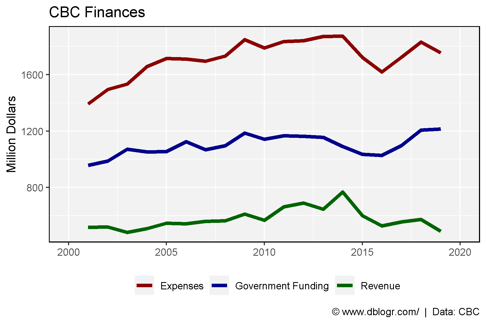
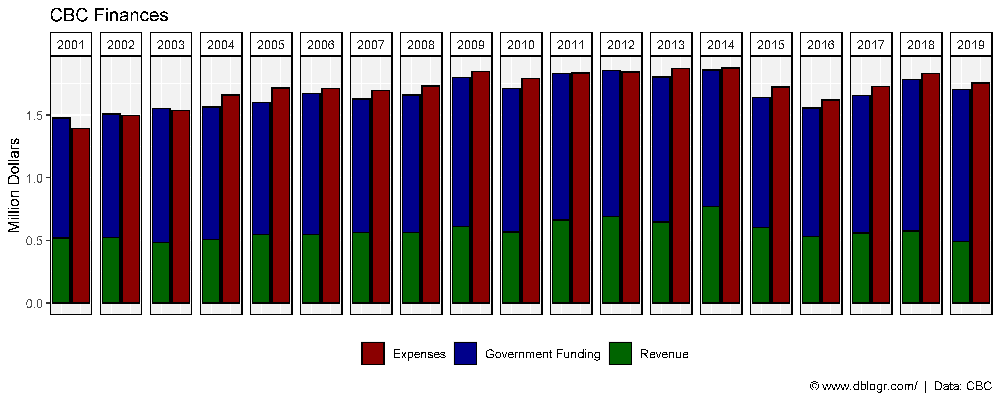
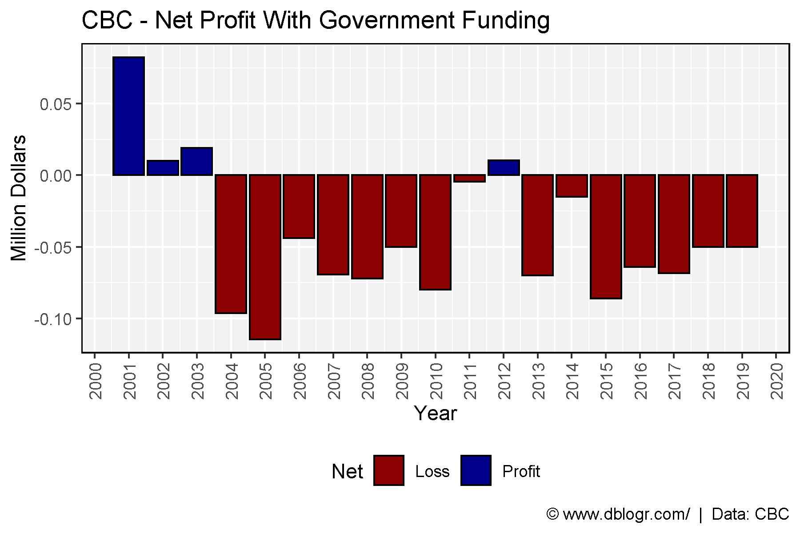
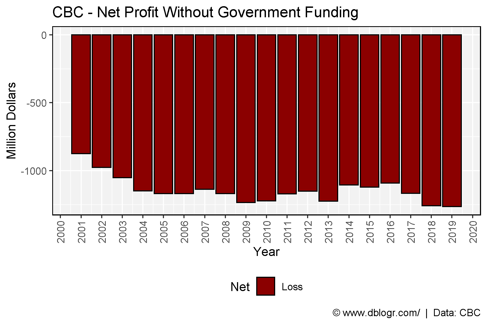

```{r setup, include=FALSE}
knitr::opts_chunk$set(echo = T, message = F, warning = F)
```

---

```{r}
# devtools::install_github("derekmichaelwright/dblogr")
library(dblogr) # Loads: tidyverse, ggpubr, ggbeeswarm, ggrepel
```

```{r}
# Prep data
xx <- dblogr_CBC %>% 
  gather(Source, Value, Revenue, `Government Funding`, Expenses) %>%
  mutate(PlusMinus = ifelse(Source == "Expenses", "Plus", "Minus"),
         Value = Value / 1000000)
```

calculate the cost per person per year

```{r}
# Prep data
cost <- dblogr_CBC %>% filter(Year == 2019) %>% pull(`Government Funding`) 
pop <- dblogr_STATCAN_Population_Q %>% 
  filter(Year == 2019, Quarter == "Q1", Area == "Canada") %>% pull(Number)
cost / pop
```

\pagebreak

# Expenses vs Revenue (Line)

```{r}
mp <- ggplot(xx, aes(x = Year, y = Value, color = Source)) + 
  geom_line(size = 1.5) + 
  scale_x_continuous(breaks = seq(2000, 2020, 5), limits = c(2000, 2020)) +
  scale_color_manual(name = NULL, values = c("darkred" , "darkblue", "darkgreen")) +
  theme_dblogr(legend.position = "bottom") +
  labs(title = "CBC Finances", x = NULL, y = "Million Dollars",
       caption = "\xa9 www.dblogr.com/  |  Data: CBC")
ggsave("cbc_1.png", width = 6, height = 4)
```

```{r echo = F}
ggsave("../../dblogr_graphs/cbc_finances/gallery/gallery/cbc_1.png", mp, width = 6, height = 4)
```



\pagebreak

# Expenses vs Revenue (Bar)

```{r}
mp <- ggplot(xx, aes(x = PlusMinus, y = Value, fill = Source)) + 
  geom_bar(stat = "identity", position = "stack", color = "black") +
  facet_grid(. ~ Year) +
  scale_fill_manual(name = NULL, values = c("darkred" , "darkblue", "darkgreen")) +
  theme_dblogr(legend.position = "bottom",
               axis.text.x = element_blank(), axis.ticks.x = element_blank()) +
  labs(title = "CBC Finances", x = NULL, y = "Million Dollars",
       caption = "\xa9 www.dblogr.com/  |  Data: CBC")
ggsave("cbc_2.png", width = 10, height = 4)
```

```{r echo = F}
ggsave("../../dblogr_graphs/cbc_finances/gallery/gallery/cbc_2.png", mp, width = 10, height = 4)
ggsave("featured.png", mp, width = 10, height = 4)
```



\pagebreak

# Net Profit With Government Funding

```{r}
# Prep data
xx <- dblogr_CBC %>% 
  mutate(Profit = Revenue + `Government Funding` - Expenses,
         Net = ifelse(Profit > 0, "Profit", "Loss") )
# Plot
mp <- ggplot(xx, aes(x = Year, y = Profit / 1000000, fill = Net)) + 
  geom_bar(stat = "identity", color = "black") +
  scale_fill_manual(values = c("darkred","darkblue")) +
  scale_x_continuous(breaks = 2000:2020) +
  theme_dblogr(legend.position = "bottom", rotx = T) +
  labs(title = "CBC - Net Profit With Government Funding", y = "Million Dollars",
       caption = "\xa9 www.dblogr.com/  |  Data: CBC")
ggsave("cbc_3.png", width = 6, height = 4)
```

```{r echo = F}
ggsave("../../dblogr_graphs/cbc_finances/gallery/gallery/cbc_3.png", mp, width = 6, height = 4)
```



\pagebreak

# Net Profit Without Government Funding

```{r}
# Prep data
xx <- dblogr_CBC %>% mutate(Profit = Revenue - Expenses,
                            Net = ifelse(Profit > 0, "Profit", "Loss"))
# Plot
mp <- ggplot(xx, aes(x = Year, y = Profit / 1000000, fill = Net)) + 
  geom_bar(stat = "identity", color = "black") +
  scale_fill_manual(values = c("darkred","darkblue")) +
  scale_x_continuous(breaks = 2000:2020) +
  theme_dblogr(legend.position = "bottom", rotx = T) +
  labs(title = "CBC - Net Profit Without Government Funding", y = "Million Dollars",
       caption = "\xa9 www.dblogr.com/  |  Data: CBC")
ggsave("cbc_4.png", width = 6, height = 4)
```

```{r echo = F}
ggsave("../../dblogr_graphs/cbc_finances/gallery/gallery/cbc_4.png", mp, width = 6, height = 4)
```


