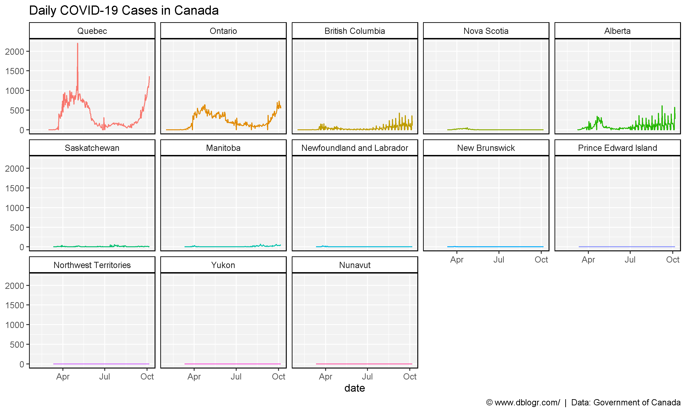
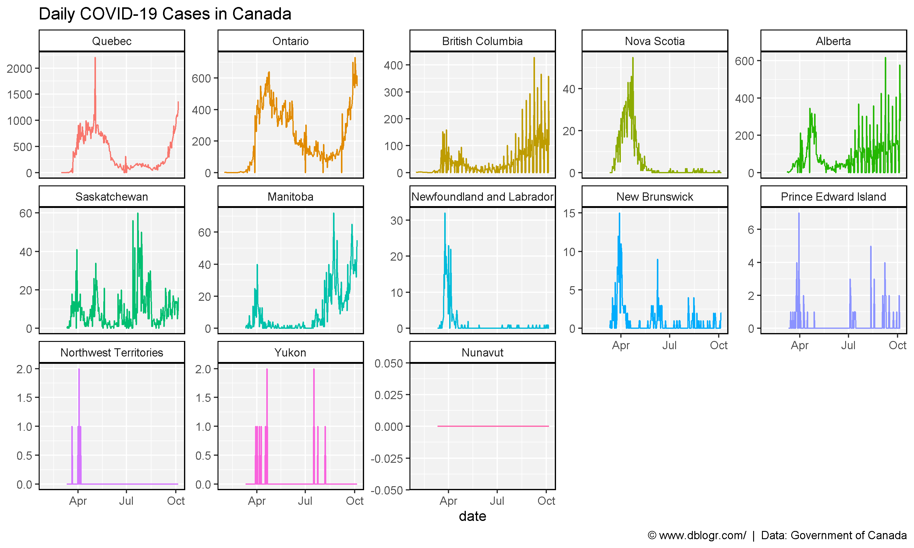
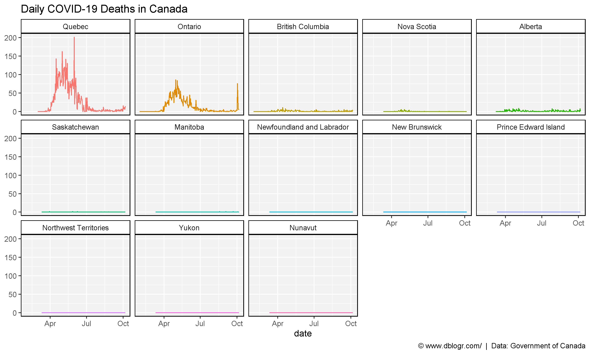
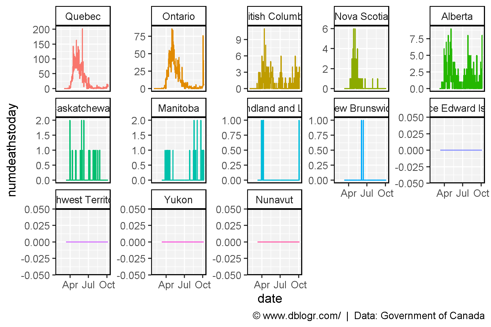
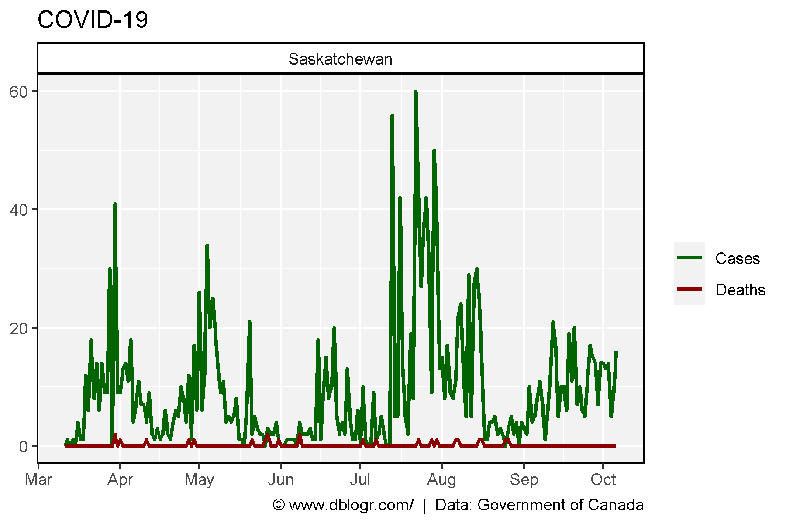
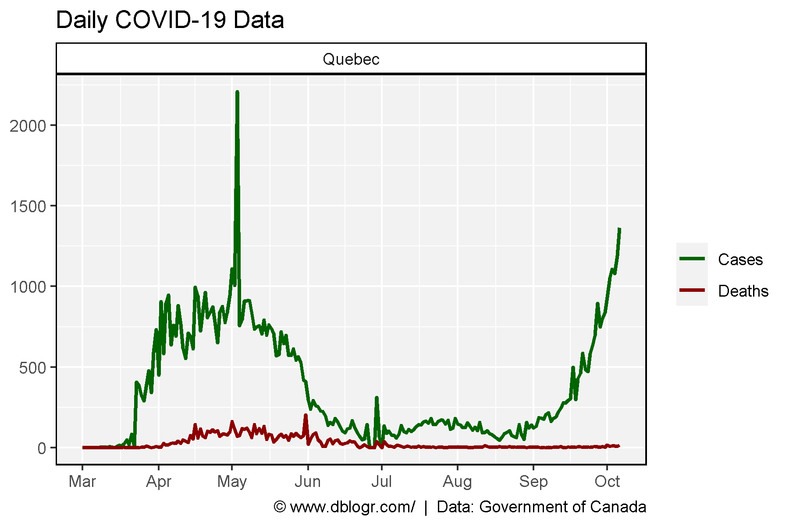
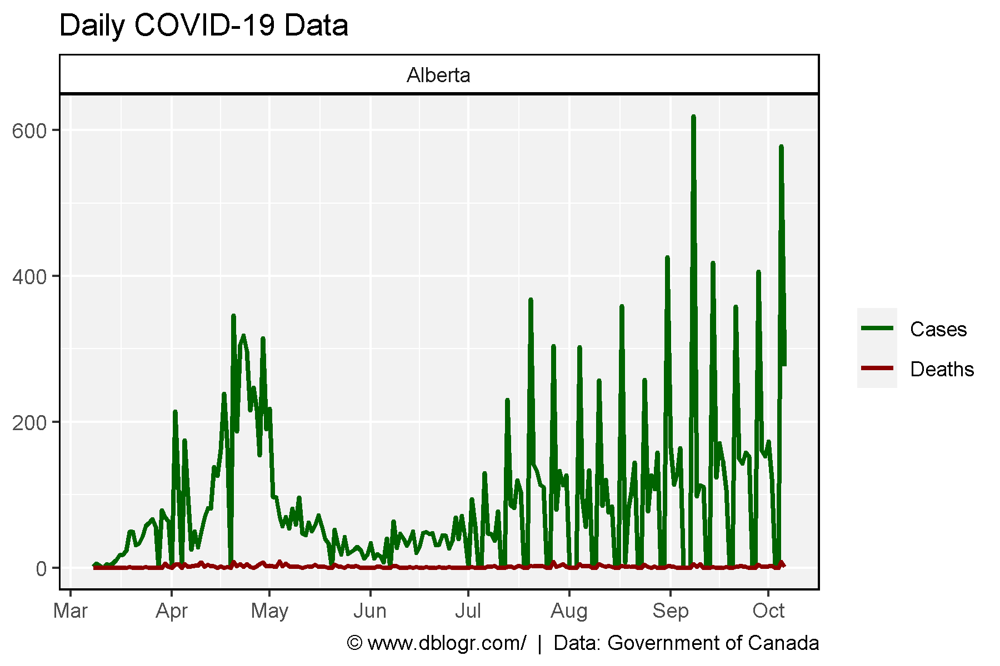
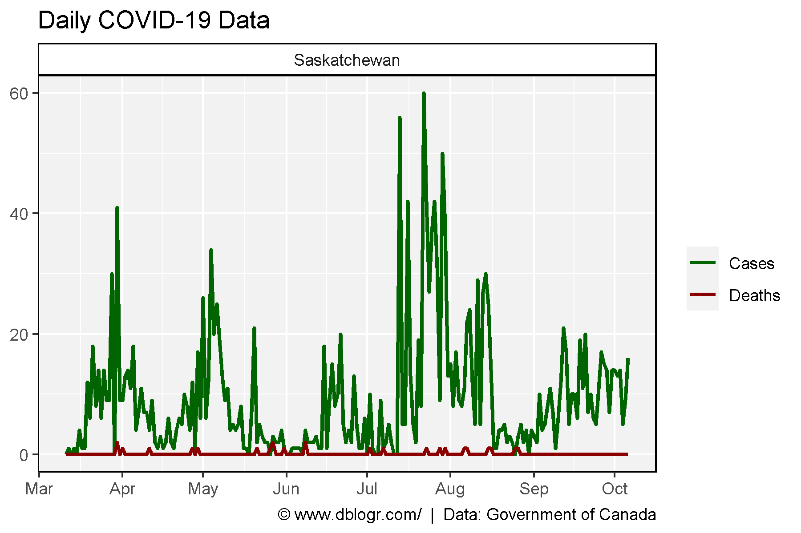
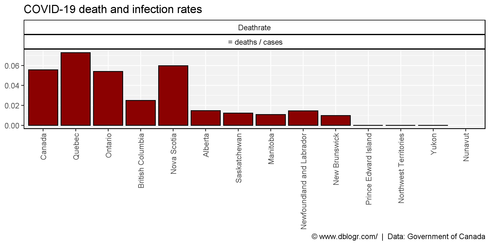

```{r setup, include=FALSE}
knitr::opts_chunk$set(echo = TRUE, message = F, warning = F)
```

---

# Introduction

https://health-infobase.canada.ca/covid-19/dashboard/about.html

```{r}
# devtools::install_github("derekmichaelwright/agData")
library(agData) # Loads: tidyverse, ggpubr, ggbeeswarm, ggrepel
```

---

```{r}
# Prep data
areas <- c("Quebec","Ontario","British Columbia","Nova Scotia","Alberta","Saskatchewan","Manitoba",
           "Newfoundland and Labrador","New Brunswick","Prince Edward Island","Northwest Territories","Yukon","Nunavut")
dd <- read.csv("covid19.csv") %>%
  mutate(date = as.Date(date, format = "%d-%m-%Y"),
         numdeathstoday = ifelse(numdeathstoday < 0, 0, numdeathstoday),
         numtoday = ifelse(numtoday < 0, 0, numtoday))
DT::datatable(dd)
```

---

# Cases

```{r}
xx <- dd %>% 
  filter(!prname %in% c("Canada", "Repatriated travellers")) %>%
  mutate(prname = factor(prname, levels = areas))
# Plot
mp <- ggplot(xx, aes(x = date, y = numtoday, color = prname)) + 
  geom_line() + 
  facet_wrap(prname ~ ., ncol = 5) +
  theme_agData(legend.position = "none") +
  labs(title = "Daily COVID-19 Cases in Canada", y = NULL,
       caption = "\xa9 www.dblogr.com/  |  Data: Government of Canada")
ggsave("Canada_COVID_01.png", mp, width = 10, height = 6)
```

```{r echo = F}
ggsave("../../../myblog/content/graphs_dblogr/covid/gallery/gallery/Canada_COVID_01.png", mp, width = 10, height = 6)
```



---

```{r}
# Plot
mp <- mp + facet_wrap(prname ~ ., ncol = 5, scales = "free_y") 
ggsave("Canada_COVID_02.png", mp, width = 10, height = 6)
```

```{r echo = F}
ggsave("../../../myblog/content/graphs_dblogr/covid/gallery/gallery/Canada_COVID_02.png", mp, width = 10, height = 6)
```



---

# Deaths

```{r}
# Plot
mp <- ggplot(xx, aes(x = date, y = numdeathstoday, color = prname)) + 
  geom_line() + 
  facet_wrap(prname ~ ., ncol = 5) +
  theme_agData(legend.position = "none") +
  labs(title = "Daily COVID-19 Deaths in Canada", y = NULL,
       caption = "\xa9 www.dblogr.com/  |  Data: Government of Canada")
ggsave("Canada_COVID_03.png", mp, width = 10, height = 6)
```

```{r echo = F}
ggsave("../../../myblog/content/graphs_dblogr/covid/gallery/gallery/Canada_COVID_03.png", mp, width = 10, height = 6)
```



---

```{r}
# Plot
mp <- mp + facet_wrap(prname ~ ., ncol = 5, scales = "free_y") 
ggsave("Canada_COVID_04.png", mp, width = 12, height = 6)
```

```{r echo = F}
ggsave("../../../myblog/content/graphs_dblogr/covid/gallery/gallery/Canada_COVID_04.png", mp, width = 12, height = 6)
```



---

# Canada

```{r}
# Create Plotting Function
gg_COVID <- function(x, area) {
  x <- x %>% 
    filter(prname == area) %>% 
    select(prname, date, Cases=numtoday, Deaths=numdeathstoday) %>%
    gather(Trait, Value, Cases, Deaths)
  # Plot
  ggplot(x, aes(x = date, y = Value, color = Trait)) + 
    geom_line(size = 1) + 
    scale_color_manual(name = NULL, values = c("darkgreen","darkred")) +
    facet_wrap(prname ~ ., ncol = 5) +
    scale_x_date(date_breaks = "1 month", date_labels = "%b") +
    theme_agData() +
    labs(title = "Daily COVID-19 Data", y = NULL, x = NULL,
         caption = "\xa9 www.dblogr.com/  |  Data: Government of Canada")
}
# Plot
mp <- gg_COVID(dd, "Canada")
ggsave("Canada_COVID_05.png", mp, width = 6, height = 4)
```

```{r echo = F}
ggsave("../../../myblog/content/graphs_dblogr/covid/gallery/gallery/Canada_COVID_05.png", mp, width = 6, height = 4)
ggsave("../../../myblog/content/posts_dblogr/covid/featured.png", mp, width = 6, height = 4)
```


---

# Ontario

```{r}
# Plot
mp <- gg_COVID(xx, "Ontario")
ggsave("Canada_COVID_06.png", mp, width = 6, height = 4)
```

```{r echo = F}
ggsave("../../../myblog/content/graphs_dblogr/covid/gallery/gallery/Canada_COVID_06.png", mp, width = 6, height = 4)
```



---

# Quebec

```{r}
# Plot
mp <- gg_COVID(xx, "Quebec")
ggsave("Canada_COVID_07.png", mp, width = 6, height = 4)
```

```{r echo = F}
ggsave("../../../myblog/content/graphs_dblogr/covid/gallery/gallery/Canada_COVID_07.png", mp, width = 6, height = 4)
```



---

# Alberta

```{r}
# Plot
mp <- gg_COVID(xx, "Alberta")
ggsave("Canada_COVID_08.png", mp, width = 6, height = 4)
```

```{r echo = F}
ggsave("../../../myblog/content/graphs_dblogr/covid/gallery/gallery/Canada_COVID_08.png", mp, width = 6, height = 4)
```



---

# Saskatchewan

```{r}
# Plot
mp <- gg_COVID(xx, "Saskatchewan")
ggsave("Canada_COVID_09.png", mp, width = 6, height = 4)
```

```{r echo = F}
ggsave("../../../myblog/content/graphs_dblogr/covid/gallery/gallery/Canada_COVID_09.png", mp, width = 6, height = 4)
```



---

# Death Rate

```{r}
lastdate <- max(as.Date(dd$date))
xx <- dd %>% filter(date == lastdate) %>%
  select(prname, numtotal, numdeaths, numtested) %>%
  mutate(prname = factor(prname, levels = c("Canada", areas)),
         Deathrate = numdeaths / numtotal) %>%
  filter(!is.na(prname)) %>%
  gather(Trait, Value, Deathrate)
mp <- ggplot(xx, aes(x = prname, y = Value, fill = Trait)) +
  geom_bar(stat = "identity", color = "black") +
  facet_grid(. ~ Trait + " = deaths / cases") +
  scale_fill_manual(values = c("darkred","darkgreen")) +
  theme_agData(legend.position = "none", rotx = T) +
  labs(title = "COVID-19 death and infection rates", y = NULL, x = NULL,
       caption = "\xa9 www.dblogr.com/  |  Data: Government of Canada")
ggsave("Canada_COVID_10.png", mp, width = 8, height = 4)
```

```{r echo = F}
ggsave("../../../myblog/content/graphs_dblogr/covid/gallery/gallery/Canada_COVID_10.png", mp, width = 8, height = 4)
```



---

&copy; Derek Michael Wright 2020 [www.dblogr.com/](https://dblogr.netlify.com/)