```{r setup, include=FALSE}
knitr::opts_chunk$set(echo = T, message = F, warning = F, out.width = "100%")
```

---

```{r}
# devtools::install_github("derekmichaelwright/dblogr")
library(dblogr) # Loads: tidyverse, ggpubr, ggbeeswarm, ggrepel
```

# Prepare Data

STATCAN data Tables: 36-10-0400-01, 36-10-0402-01, 17-10-0009-01

```{r}
# GDP by province
d1 <- dblogr_STATCAN_GDP_Total
# GDP percent by industry
d2 <- dblogr_STATCAN_GDP_Industry
# Population by province
d3 <- dblogr_STATCAN_Population_Q %>% 
  group_by(Area, Year) %>% 
  summarise(Number = round(mean(Number, na.rm = F))) %>% 
  ungroup()
```

\pagebreak

# GDP

```{r}
# Prep data
xx <- d1 %>% filter(!is.na(`Current dollars`)) %>%
  mutate(`Current dollars` = `Current dollars` / 1000000)
x2 <- xx %>% filter(Year == 2016) %>%
  arrange(desc(`Current dollars`)) %>% 
  mutate(Area = factor(Area, levels = unique(Area)))
# Plot
mp <- ggplot(x2, aes(x = Area, y = `Current dollars`, fill = Area)) + 
  geom_bar(stat = "identity", color = "black") +
  theme_dblogr(legend.position = "none",
        axis.text.x = element_text(angle = 90, vjust = 0.4, hjust = 1)) +
  labs(title = "GDP by Province (2016)", y = "Current Dollars (Million)",
       caption = "\xa9 www.dblogr.com/  |  Data: STATCAN")
ggsave("economics_of_canada_01.png", mp, width = 6, height = 4)
```

```{r echo = F}
ggsave("../../dblogr_graphs/economics_of_canada/gallery/gallery/economics_of_canada_01.png", mp, width = 6, height = 4)
ggsave("featured.png", mp, width = 6, height = 4)
```

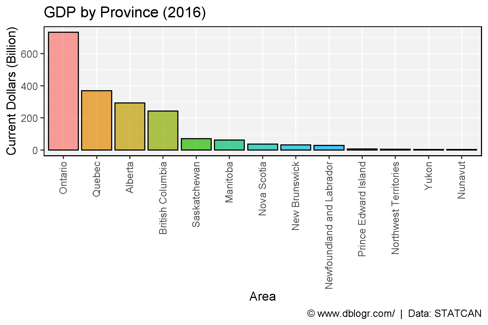

```{r}
# Plot
mp <- ggplot(xx, aes(x = Year, y = `Current dollars`, color = Area)) + 
  geom_line() +
  coord_cartesian(xlim = c(1997.75, 2015.25)) +
  scale_y_continuous(sec.axis = sec_axis(~ ., breaks = x2$`Current dollars`, labels = x2$Area)) +
  theme_dblogr(legend.position = "none") +
  labs(title = "GDP by Province", y = "Current Dollars (Million)",
       caption = "\xa9 www.dblogr.com/  |  Data: STATCAN")
ggsave("economics_of_canada_02.png", mp, width = 6, height = 4)
```

```{r echo = F}
ggsave("../../dblogr_graphs/economics_of_canada/gallery/gallery/economics_of_canada_02.png", mp, width = 6, height = 4)
```

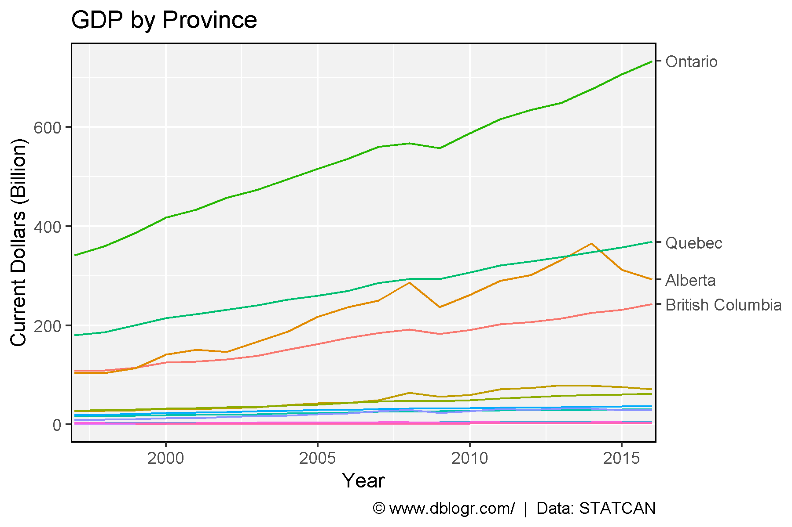

```{r}
# Plot
mp <- mp + facet_wrap(Area~., scale = "free_y", ncol = 5) + 
  scale_y_continuous()
ggsave("economics_of_canada_03.png", mp, width = 10, height = 4)
```

```{r echo = F}
ggsave("../../dblogr_graphs/economics_of_canada/gallery/gallery/economics_of_canada_03.png", mp, width = 10, height = 4)
```

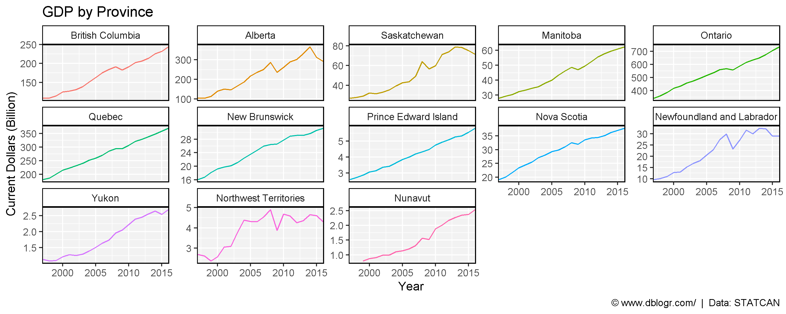

\pagebreak

```{r}
# Prep data
wc <- c("British Columbia", "Alberta", "Saskatchewan", "Manitoba",
        "Yukon", "Northwest Territories", "Nunavut")
xx <- xx %>% filter(!is.na(`Current dollars`)) %>%
  mutate(Region = ifelse(Area %in% wc, "Western Canada", "Eastern Canada")) %>%
  group_by(Region, Year) %>% 
  summarise(`Current dollars` = sum(`Current dollars`))
# Plot
mp <- ggplot(xx, aes(x = Year, y = `Current dollars`, color = Region)) + 
  geom_line() + geom_point() +
  coord_cartesian(xlim = c(1997.75, 2015.25)) +
  theme_dblogr(legend.position = "bottom") +
  labs(y = "Current Dollars (Million)",
       caption = "\xa9 www.dblogr.com/  |  Data: STATCAN")
ggsave("economics_of_canada_04.png", mp, width = 6, height = 4)
```

```{r echo = F}
ggsave("../../dblogr_graphs/economics_of_canada/gallery/gallery/economics_of_canada_04.png", mp, width = 6, height = 4)
```

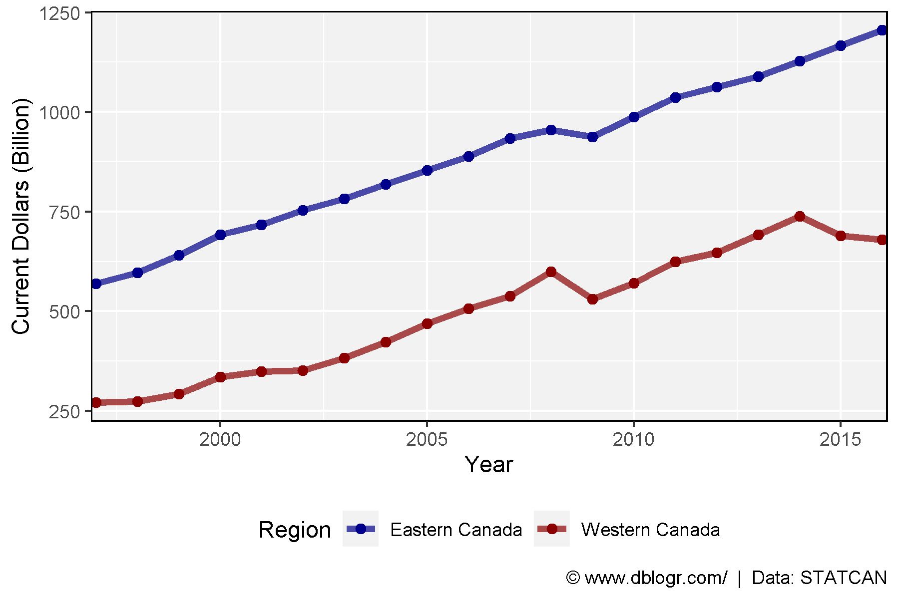

\pagebreak

# GDP Per Person

```{r}
# Prep data
xx <- d1 %>% left_join(d3, by = c("Area", "Year")) %>%
  mutate(GDP_PP = `Current dollars` / Number) %>%
  filter(!is.na(GDP_PP))
x2 <- xx %>% filter(Year == 2016) %>%
  arrange(desc(GDP_PP)) %>% 
  mutate(Area = factor(Area, levels = unique(Area)))
# Plot
mp <- ggplot(x2, aes(x = Area, y = GDP_PP, fill = Area)) + 
  geom_bar(stat = "identity", color = "black") +
  theme_dblogr(legend.position = "none",
        axis.text.x = element_text(angle = 90, vjust = 0.4, hjust = 1)) +
  labs(title = "GDP by Province (2016)", y = "Current Dollars (Million)",
       caption = "\xa9 www.dblogr.com/  |  Data: STATCAN")
ggsave("economics_of_canada_05.png", mp, width = 6, height = 4)
```

```{r echo = F}
ggsave("../../dblogr_graphs/economics_of_canada/gallery/gallery/economics_of_canada_05.png", mp, width = 6, height = 4)
```

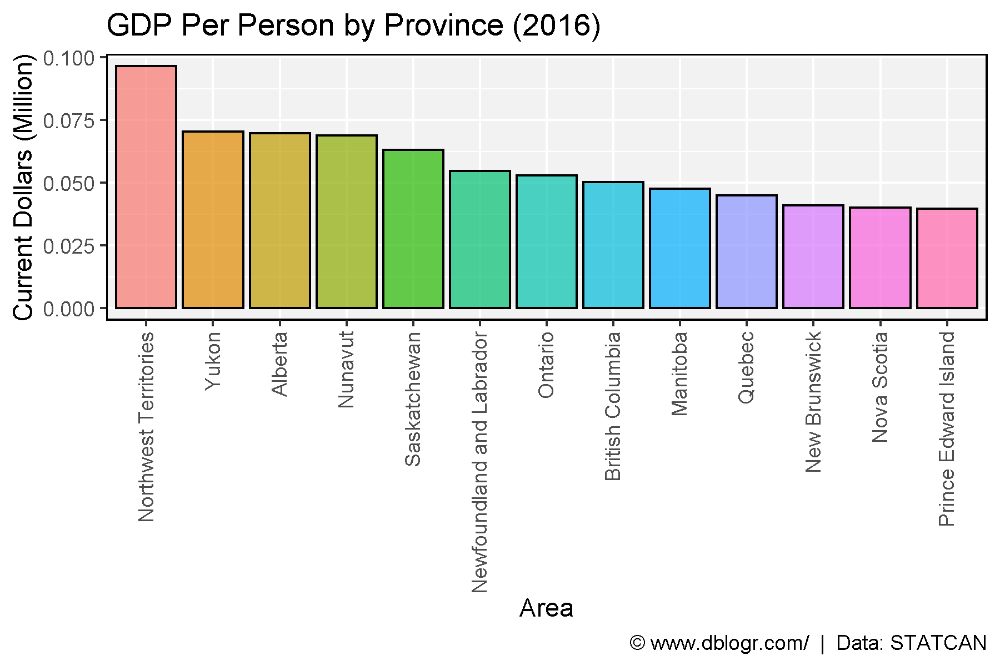

```{r}
mp <- ggplot(xx, aes(x = Year, y = GDP_PP, color = Area)) + 
  geom_line() +
  coord_cartesian(xlim = c(1999.5, 2015.5)) +
  scale_y_continuous(sec.axis = sec_axis(~ ., breaks = x2$GDP_PP, labels = x2$Area)) +
  theme_dblogr(legend.position = "none") +
  labs(title = "GDP Per Person", y = "Million Dollars",
       caption = "\xa9 www.dblogr.com/  |  Data: STATCAN")
ggsave("economics_of_canada_06.png", mp, width = 6, height = 4)
```

```{r echo = F}
ggsave("../../dblogr_graphs/economics_of_canada/gallery/gallery/economics_of_canada_06.png", mp, width = 6, height = 4)
```

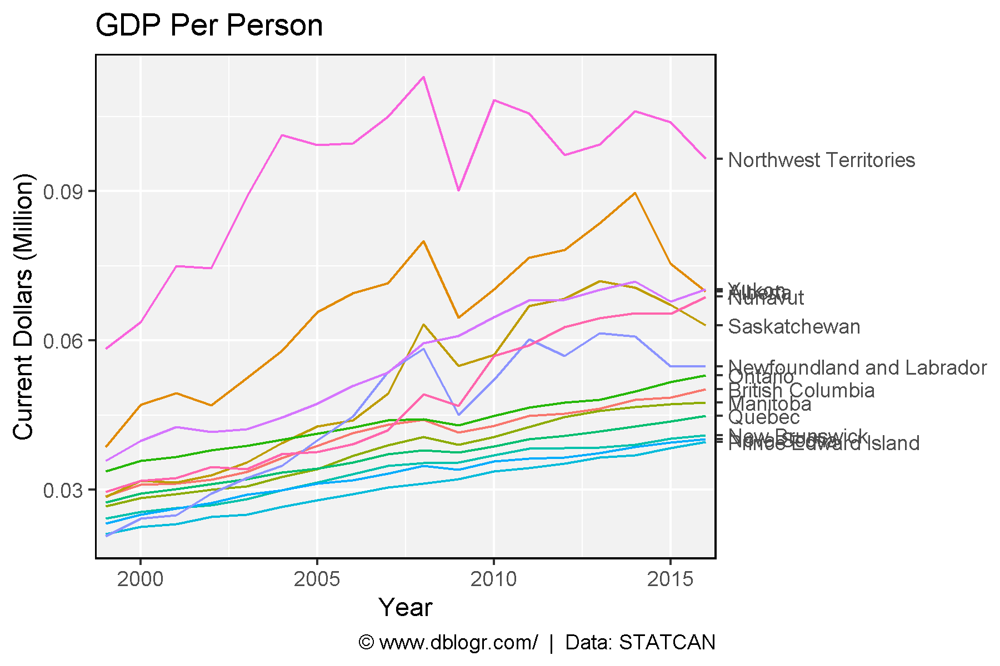

```{r}
mp <- mp + facet_wrap(Area~., ncol = 5) + 
  scale_y_continuous()
ggsave("economics_of_canada_07.png", mp, width = 10, height = 4)
```

```{r echo = F}
ggsave("../../dblogr_graphs/economics_of_canada/gallery/gallery/economics_of_canada_07.png", mp, width = 10, height = 4)
```

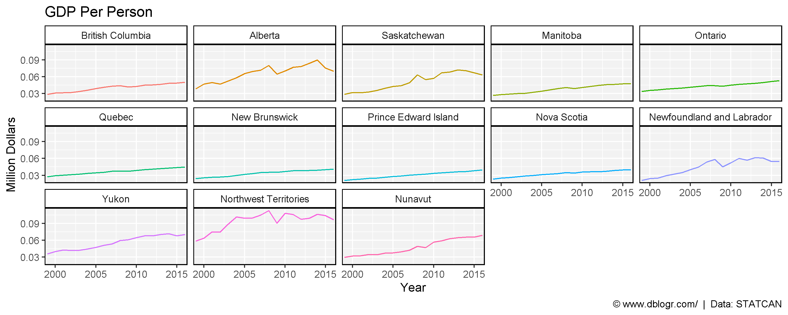

\pagebreak

```{r}
# Prep data
wc <- c("British Columbia", "Alberta", "Saskatchewan", "Manitoba",
        "Yukon", "Northwest Territories", "Nunavut")
xx <- xx %>% filter(!is.na(`Current dollars`)) %>%
  mutate(Region = ifelse(Area %in% wc, "Western Canada", "Eastern Canada")) %>%
  group_by(Region, Year) %>% 
  summarise(GDP_PP = sum(GDP_PP))
# Plot
mp <- ggplot(xx, aes(x = Year, y = GDP_PP, color = Region)) + 
  geom_line() + geom_point() +
  theme_dblogr(legend.position = "bottom") +
  labs(y = "GDP Per Person",
       caption = "\xa9 www.dblogr.com/  |  Data: STATCAN")
ggsave("economics_of_canada_08.png", mp, width = 6, height = 4)
```

```{r echo = F}
ggsave("../../dblogr_graphs/economics_of_canada/gallery/gallery/economics_of_canada_08.png", mp, width = 6, height = 4)
```

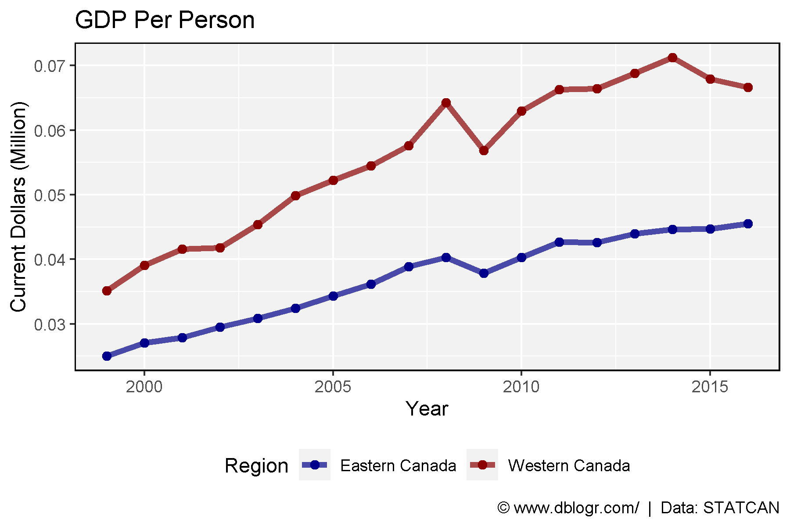

\pagebreak

# Compare Privinces

```{r}
ggGDP_PP <- function(year, areas) {
  # Prep data
  xx <- d2 %>% select(1:3, 9:ncol(.)) %>% 
    filter(Year == year, Area %in% areas) %>%
    gather(Industry, Value, 4:ncol(.)) %>%
    left_join(d3, by = c("Area", "Year")) %>%
    mutate(GDP_PP = Value / Number) %>%
    filter(!is.na(GDP_PP))
  levs <- xx %>% filter(Year == year, Area == areas[1]) %>% 
    arrange(Value) %>% pull(Industry)
  xx <- xx %>% 
    mutate(Industry = factor(Industry, levels = levs),
           Area = factor(Area, levels = areas))
  # Plot
  ggplot(xx, aes(x = Area, y = GDP_PP, fill = Area)) +
    geom_bar(stat = "identity") +
    theme_dblogr(legend.position = "bottom", linesize = 0.1,
                 axis.text.x = element_blank(),
                 axis.ticks.x = element_blank()) +
    facet_grid(.~Industry, labeller = label_wrap_gen(width = 15)) +
    labs(title ="GDP Per Person 2016", y = "Million $ / Person", x = NULL,
         caption = "\xa9 www.dblogr.com/  |  Data: STATCAN")
}
```

```{r}
mp <- ggGDP_PP(2016, c("Alberta", "Quebec"))
ggsave("economics_of_canada_09.png", mp, width = 25, height = 8)
```

```{r echo = F}
ggsave("../../dblogr_graphs/economics_of_canada/gallery/gallery/economics_of_canada_09.png", mp, width = 25, height = 8)
```

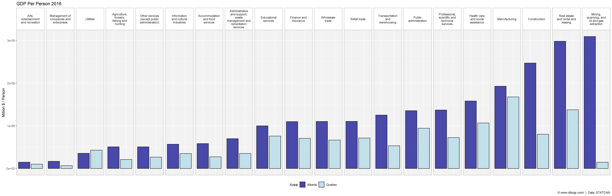

```{r}
mp <- ggGDP_PP(2016, c("Alberta", "Ontario"))
ggsave("economics_of_canada_10.png", mp, width = 25, height = 8)
```

```{r echo = F}
ggsave("../../dblogr_graphs/economics_of_canada/gallery/gallery/economics_of_canada_10.png", mp, width = 25, height = 8)
```

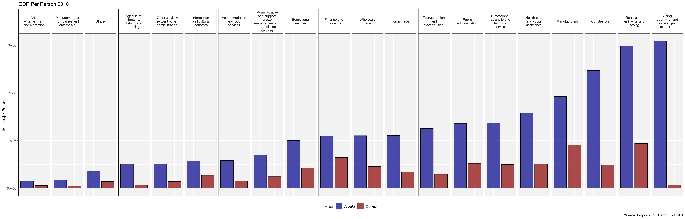

```{r}
mp <- ggGDP_PP(2016, c("Alberta", "British Columbia"))
ggsave("economics_of_canada_11.png", mp, width = 25, height = 8)
```

```{r echo = F}
ggsave("../../dblogr_graphs/economics_of_canada/gallery/gallery/economics_of_canada_11.png", mp, width = 25, height = 8)
```

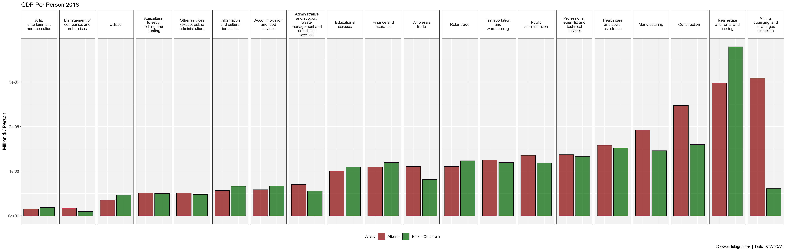

```{r}
mp <- ggGDP_PP(2016, c("Saskatchewan", "Manitoba"))
ggsave("economics_of_canada_12.png", mp, width = 25, height = 8)
```

```{r echo = F}
ggsave("../../dblogr_graphs/economics_of_canada/gallery/gallery/economics_of_canada_12.png", mp, width = 25, height = 8)
```

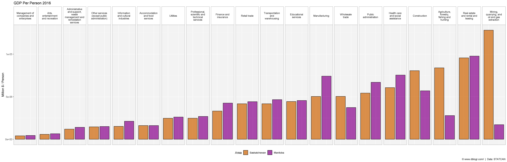
