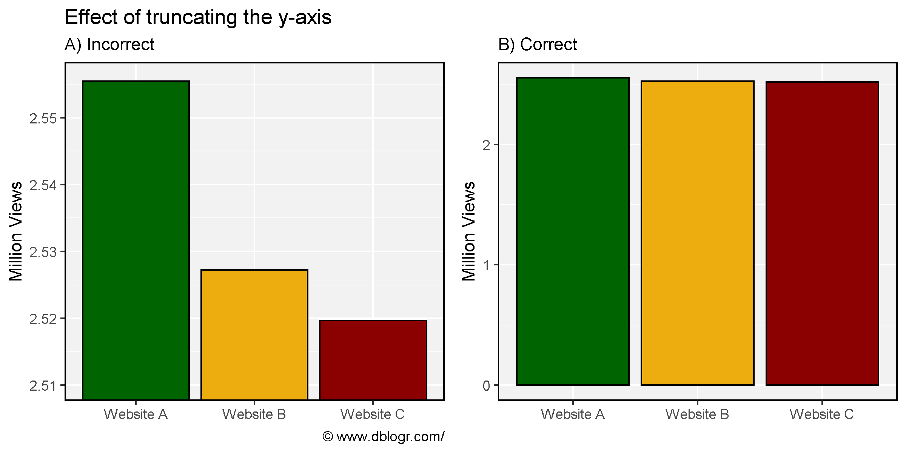
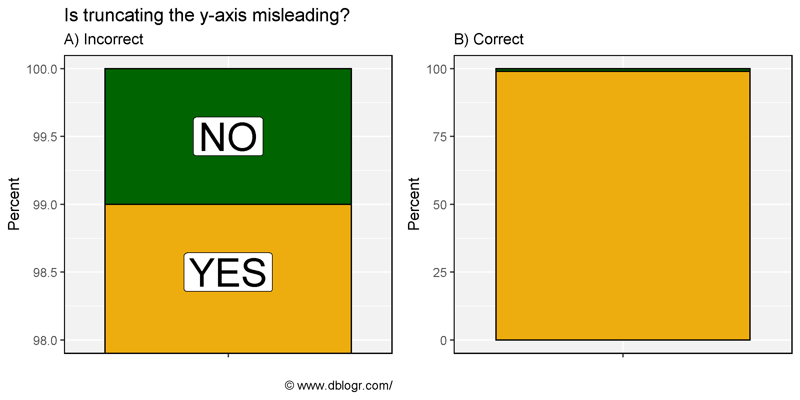
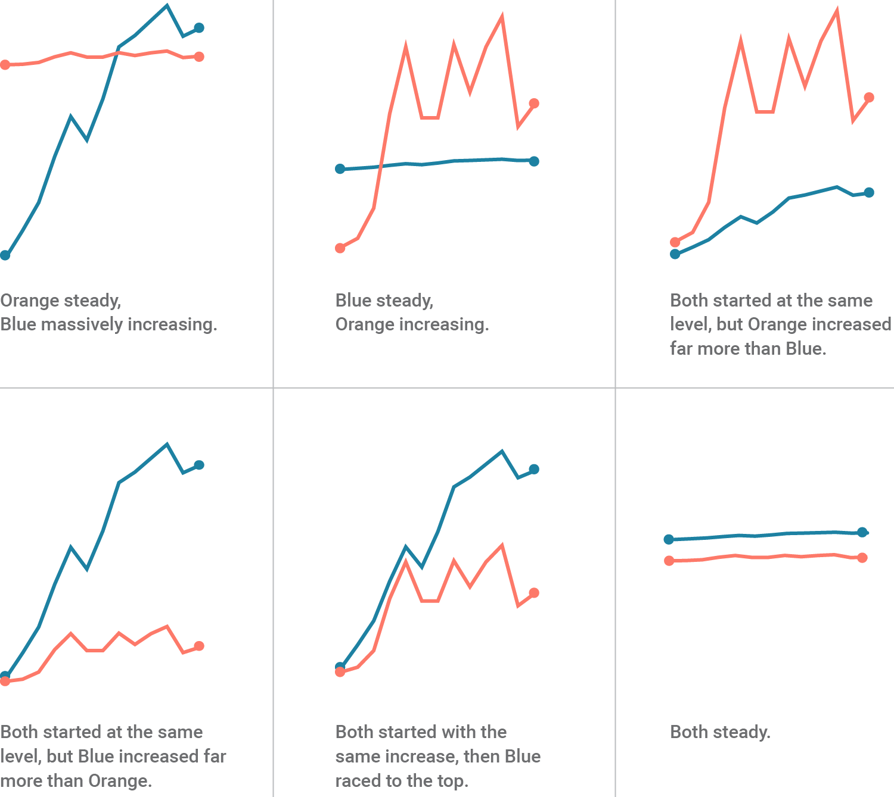
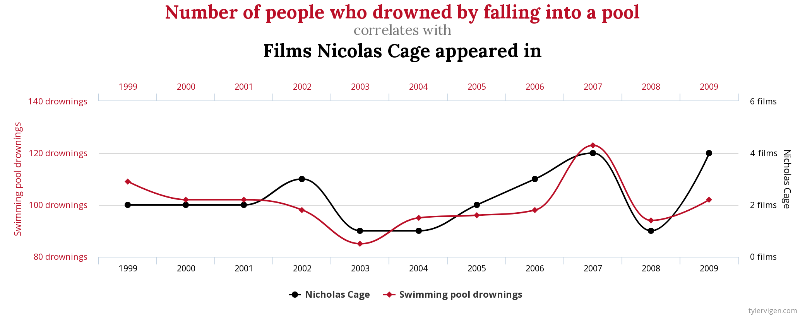
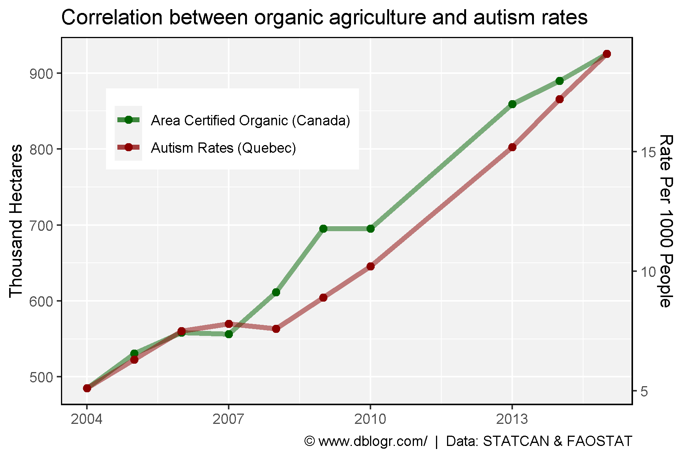
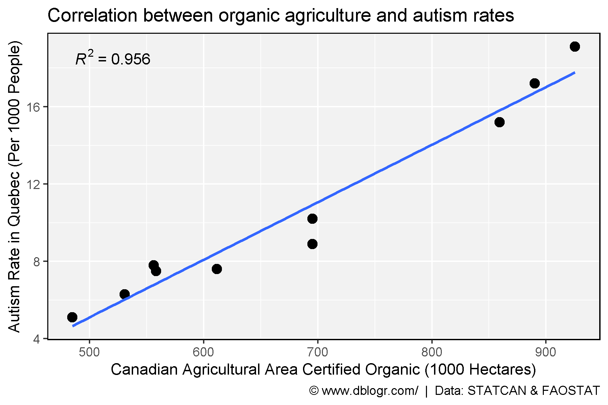
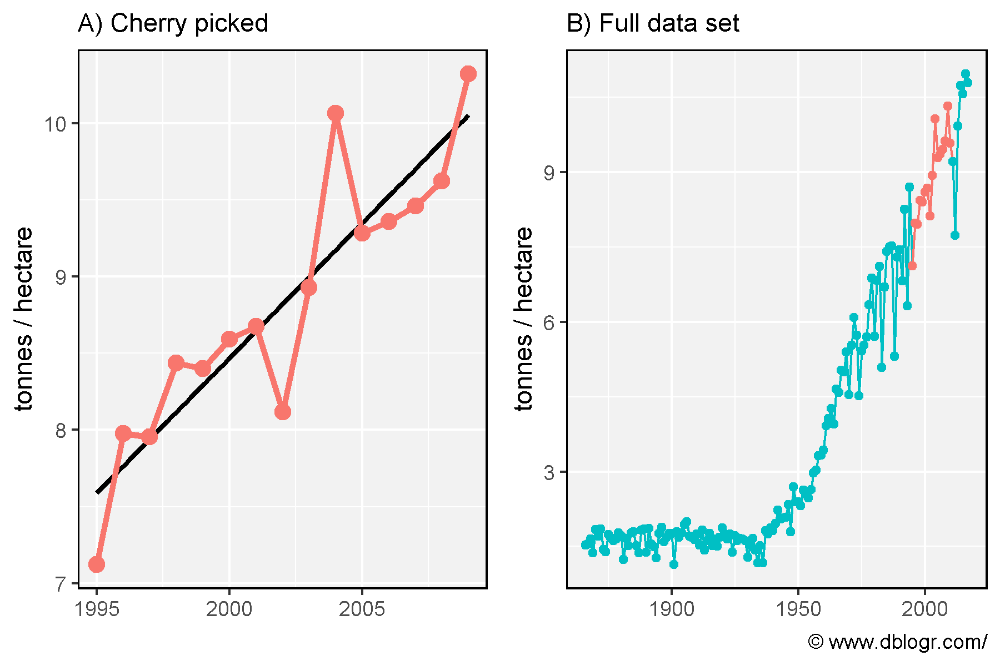

```{r setup, include=FALSE}
knitr::opts_chunk$set(echo = T, message = F, warning = F)
```

---

```{r}
# devtools::install_github("derekmichaelwright/dblogr")
# devtools::install_github("derekmichaelwright/agData")
library(agData) # Loads: tidyverse, ggpubr, ggbeeswarm, ggrepel
library(ggpmisc) # stat_poly_eq()
```

Using statistics to mislead can be a trivial thing. We will go throught some examples of how to mislead people with graphs.

\pagebreak

# Truncating The y-axis

Truncating the y-axis is the most commonly used example for misleading graphs. It is a simple way to create the appearance of a larger difference between groups.

```{r}
# Prep data
xx <- data.frame(Company = c("Website A", "Website B", "Website C"),
                 Views   = c( 2555486,          2527246,          2519643))
# Plot
mp1 <- ggplot(xx, aes( x = Company, y = Views / 1000000, fill = Company)) + 
  geom_bar(stat = "identity", color = "black") +
  theme_agData(legend.position = "none") +
  labs(subtitle = "B)", y = "Million Views", x = NULL)
mp2 <- mp1 + 
  coord_cartesian(ylim = c(2510000, 2556000) / 1000000) +
  labs(title = "Effect of truncating the y-axis",
       subtitle = "A)", y = "Million Views", x = NULL,
       caption = "\xa9 www.dblogr.com/")
mp <- ggarrange(mp2, mp1, ncol = 2, align = "h")
ggsave("misleading_graphs_01.png", mp, width = 8, height = 4)
```

```{r echo = F} 
ggsave("../../../myblog/content/graphs_dblogr/misleading_graphs/gallery/gallery/misleading_graphs_01.png", mp, width = 8, height = 4)
```



[Figure: the first figure of this post](https://dblogr.netlify.app/dblogr_graphs/misleading_graphs/)

\pagebreak

```{r}
# Prep data
xx <- data.frame(Answer   = c("NO", "YES"),
                 Percent  = c(1,    99),
                 Position = c(99.5, 98.5))
# Plot
mp1 <- ggplot(xx, aes(x = "")) + 
  geom_bar(aes(y = Percent, fill = Answer), stat = "identity", color = "black") +
  theme_agData(legend.position = "none") +
  labs(subtitle = "B)", x = NULL)
mp2 <- mp1 + 
  geom_label(aes(y = Position, label = Answer), size = 10) + 
  coord_cartesian(ylim = c(98, 100)) +
  labs(title = "Is truncating the y-axis misleading?", 
       subtitle = "A)", x = NULL, caption = "\xa9 www.dblogr.com/")
mp <- ggarrange(mp2, mp1, ncol = 2, align = "h")
ggsave("misleading_graphs_02.png", mp, width = 8, height = 4)
```

```{r echo = F} 
ggsave("../../../myblog/content/graphs_dblogr/misleading_graphs/gallery/gallery/misleading_graphs_02.png", mp, width = 8, height = 4)
ggsave("../../../myblog/content/posts_dblogr/misleading_graphs/featured.png", mp, width = 8, height = 4)
```



\pagebreak

# Dual y-axis

In some cases, a graph with two y-axes is desired for visualizing two different sets of data. However, this is sometimes frowned upon since the required scaling of the data can be adjusted to fit the desired narative. e.g., 



\pagebreak

To illustrate this, here is a real life example of a graph created by the CBC during the reporting of the Coronoa virus in 2020... while they emphazised that we *should not panic*.


*Source: Canadian Broadcasting Corporation*

If you miss the second y-axis on the right, it would appear that there is **A LOT** more deaths than in reality. In this example, the two data sets are at least related to eachother. However, if they arent, dual y-axes can also lead to spurious correlations



*Source: https://www.tylervigen.com/spurious-correlations*

\pagebreak

Now lets make our own by correlating autism rates with the rise of organic agriculture in Canada.

Data for Canadian autism rates can be found [here](https://www.canada.ca/en/public-health/services/publications/diseases-conditions/autism-spectrum-disorder-children-youth-canada-2018.html).

```{r}
# Prep data
x1 <- read.csv("quebec_autism_rates.csv")
x2 <- agData_FAO_LandUse %>% 
  filter(Item == "Agriculture area certified organic", Area == "Canada") %>%
  select(Year, Oranic_Area=Value)
xx <- left_join(x2, x1, by = "Year")
y1_min <- min(xx$Oranic_Area)
y1_max <- max(xx$Oranic_Area)
y2_min <- min(xx$Rate)
y2_max <- max(xx$Rate)
xx <- xx %>%
  mutate(AR_scaled = (Rate - y2_min) * (y1_max - y1_min) / (y2_max - y2_min) + y1_min)
# Plot
mp <- ggplot(xx, aes(x = Year)) +
  geom_line(aes(y = Oranic_Area, color = "Area Certified Organic (Canada)"), size = 1.5, alpha = 0.5) + 
  geom_point(aes(y = Oranic_Area, color = "Area Certified Organic (Canada)"), size = 2) +
  geom_line(aes(y = AR_scaled, color = "Autism Rates (Quebec)"), size = 1.5, alpha = 0.5) + 
  geom_point(aes(y = AR_scaled, color = "Autism Rates (Quebec)"), size = 2) +
  scale_color_manual(name = NULL, values = c("darkgreen","darkred")) +
  scale_y_continuous(name = "Thousand Hectares",  
                     sec.axis = sec_axis(~ (. - y1_min) * (y2_max - y2_min) / (y1_max - y1_min) + y2_min,
                     name = "Rate Per 1000 People")) +
  theme_agData(legend.position = c(0.30,0.75)) +
  labs(title = "Correlation between organic agriculture and autism rates", x = NULL, 
       caption = "\xa9 www.dblogr.com/  |  Data: STATCAN & FAOSTAT")
ggsave("misleading_graphs_03.png", mp, width = 6, height = 4)
```

```{r echo = F}
ggsave("../../../myblog/content/graphs_dblogr/misleading_graphs/gallery/gallery/misleading_graphs_03.png", mp, width = 6, height = 4)
```



\pagebreak

```{r}
mp <- ggplot(xx, aes(x = Oranic_Area, y = Rate)) + 
  geom_point(size = 3) + 
  geom_smooth(method = "lm", se = F) +
  stat_poly_eq(formula = y ~ x, aes(label = ..rr.label..), rr.digits = 3, parse = T) +
  theme_agData() +
  labs(x = "Canadian Agricultural Area Certified Organic (1000 Hectares)", 
       y = "Autism Rate in Quebec (Per 1000 People)",
       caption = "\xa9 www.dblogr.com/  |  Data: STATCAN & FAOSTAT")
ggsave("misleading_graphs_04.png", mp, width = 6, height = 4)
```

```{r echo = F}
ggsave("../../../myblog/content/graphs_dblogr/misleading_graphs/gallery/gallery/misleading_graphs_04.png", mp, width = 6, height = 4)
```



\pagebreak

# Cherry Picking Data

In 1994 the first GM maize variety was released in the USA. If we only focus on the data from 1995-2009, it looks as if the introduction of GE crop varieties has greatly increased maize yields. However, when we take a step back and look at all the data, we can see there has been a trend of yearly increasing yields from long before the introduction of GE varieties.

```{r}
# Prep data
xx <- agData_USDA_Crops %>%
  filter(Measurement == "Yield", Crop == "Maize") %>%
  mutate(CherryPicked = ifelse(Year > 1994 & Year < 2010, "Yes", "No"),
         CherryPicked = factor(CherryPicked, levels = c("Yes", "No")))
yy <- xx %>% filter(Year > 1994, Year < 2010)
# Plot
mp1 <- ggplot(yy, aes(x = Year, y = Value, color = CherryPicked)) +
  geom_smooth(method = "lm", se = F, color = "black") +
  geom_line(size = 1.25) + geom_point(size = 3) + 
  theme_agData(legend.position = "none") +
  labs(subtitle = "A)", y = "tonnes / hectare", x = NULL)
mp2 <- ggplot(xx, aes(x = Year, y = Value, color = CherryPicked)) + 
  geom_line(aes(group = 1)) + geom_point() +
  theme_agData(legend.position = "none") +
  labs(subtitle = "B)", y = "tonnes / hectare", x = NULL,
       caption = "\xa9 www.dblogr.com/")
mp <- ggarrange(mp1, mp2, ncol = 2, align = "h")
ggsave("misleading_graphs_05.png", mp, width = 6, height = 4)
```

```{r echo = F}
ggsave("../../../myblog/content/graphs_dblogr/misleading_graphs/gallery/gallery/misleading_graphs_05.png", mp, width = 8, height = 4)
```


