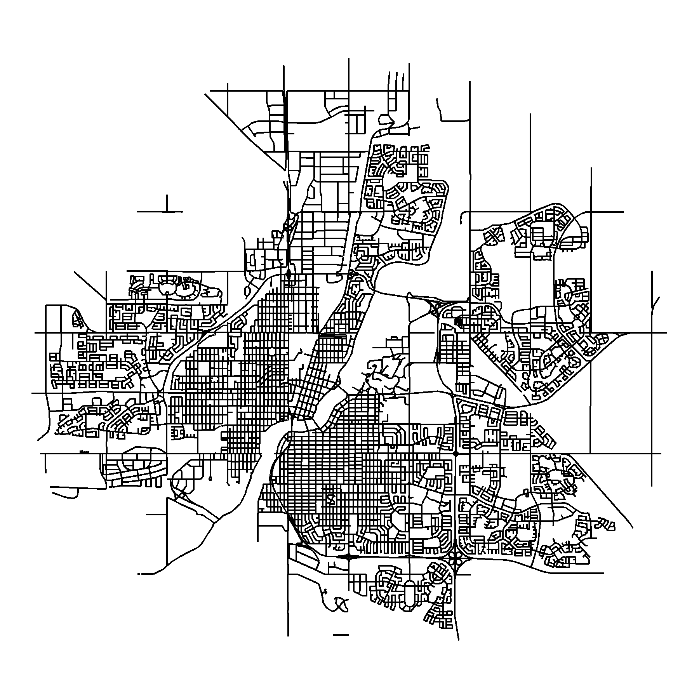
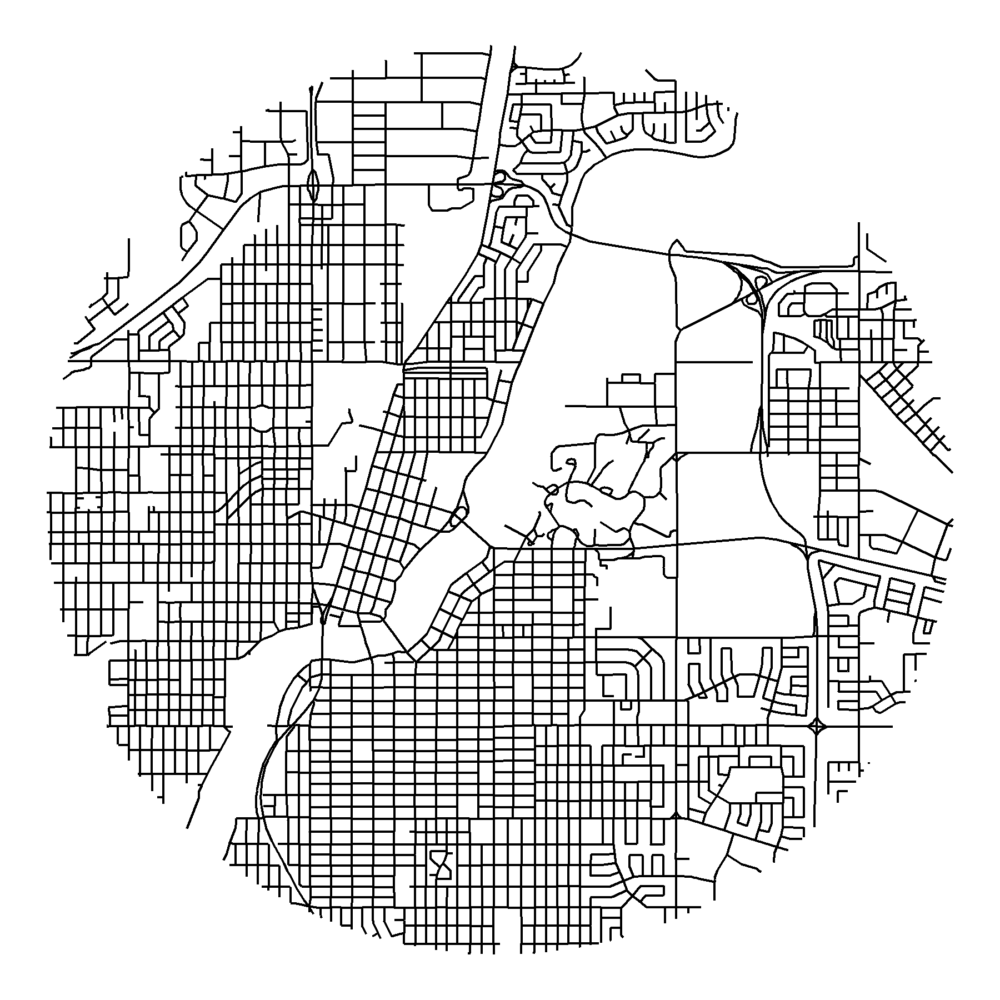
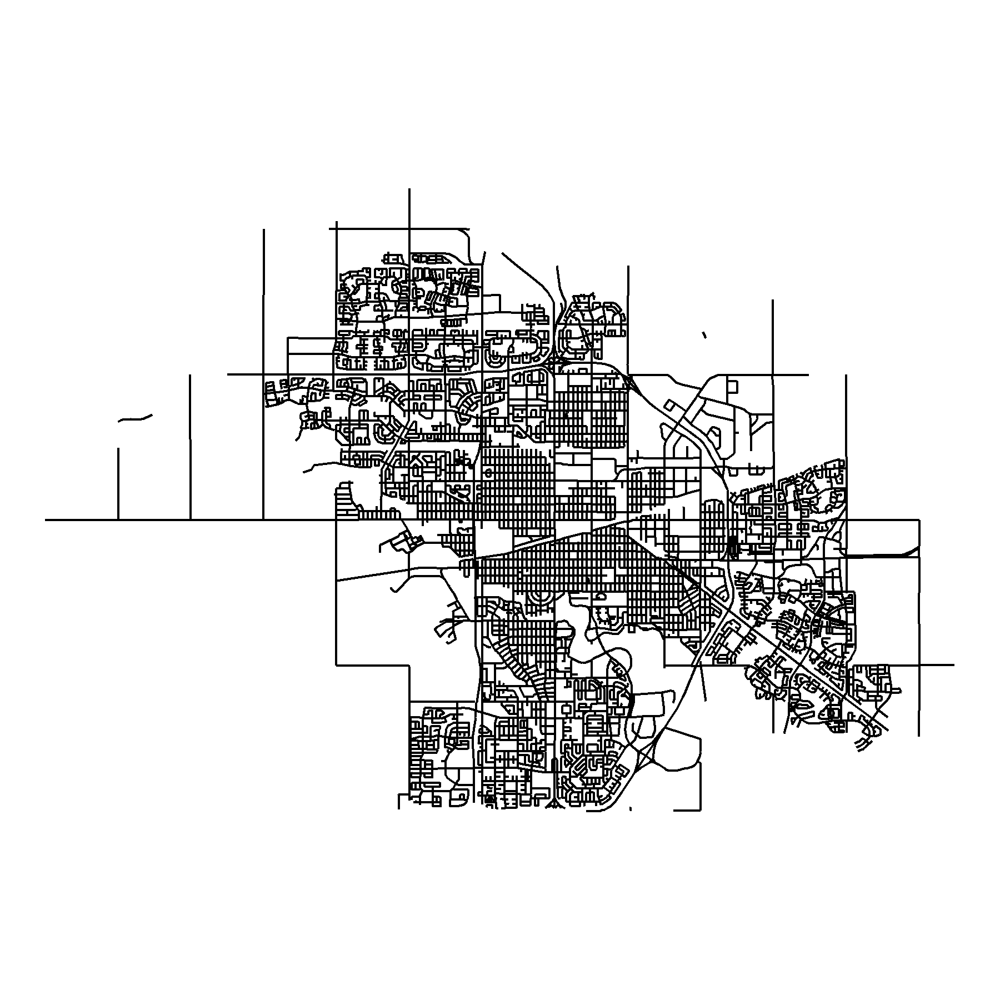
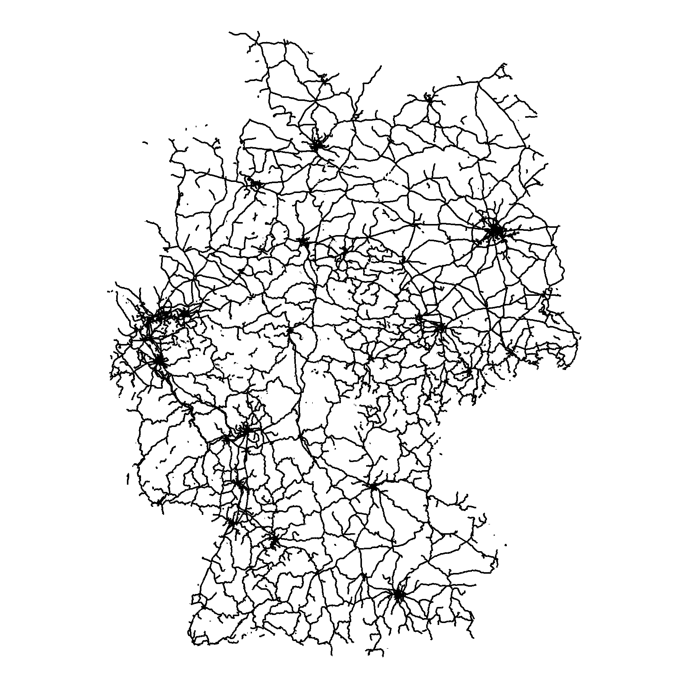

```{r setup, include = FALSE}
knitr::opts_chunk$set(echo = TRUE, message = F, warning = F)
```

---

```{r}
library(tidyverse)
library(sf)
```

# Data

STATCAN road network files

https://www12.statcan.gc.ca/census-recensement/2011/geo/RNF-FRR/index-2011-eng.cfm?year=16

Germany rail roads

https://mapcruzin.com/free-germany-arcgis-maps-shapefiles.htm

```{r eval = F}
# STATCAN file
roads <- st_read("lrnf000r16a_e.shp")
# Filter cities
roads_saskatoon <- roads[roads$CSDNAME_L == "Saskatoon",]
roads_regina    <- roads[roads$CSDNAME_L == "Regina",]
# Save
st_write(roads_saskatoon, "roads_saskatoon.shp")
st_write(roads_regina,    "roads_regina.shp")
#
s_roads <- st_read("railways.shp")
```

\pagebreak

# Saskatoon

```{r}
# Read file
s_roads <- st_read("roads_saskatoon.shp", quiet = T) 
# Crop
s_roads2 <- st_intersection(s_roads, st_buffer(st_centroid(st_union(s_roads)), 8500))
# Plot
mp <- ggplot(s_roads2) +
  geom_sf(color = "black") +
  coord_sf(crs = st_crs(4326)) +
  theme_void() +
  theme(panel.grid.major = element_line("transparent"))
ggsave("roads_saskatoon.png", mp, bg = "transparent", width = 6, height = 6)
```

```{r echo = F}
ggsave("../../dblogr_graphs/street_maps/gallery/gallery/roads_saskatoon.png", mp, bg = "transparent", width = 6, height = 6)
```



\pagebreak

```{r}
# Crop
s_roads2 <- st_intersection(s_roads, st_buffer(st_centroid(st_union(s_roads)), 4000))
# Plot
mp <- ggplot(s_roads2) +
  geom_sf(color = "black") +
  coord_sf(crs = st_crs(4326)) +
  theme_void() +
  theme(panel.grid.major = element_line("transparent"))
ggsave("roads_saskatoon_zoom.png", mp, bg = "transparent", width = 6, height = 6)
```

```{r echo = F}
ggsave("../../dblogr_graphs/street_maps/gallery/gallery/roads_saskatoon_zoom.png", mp, bg = "transparent", width = 6, height = 6)
ggsave("featured.png", mp, bg = "transparent", width = 6, height = 6)
```



\pagebreak

# Regina

```{r}
# Read file
r_roads <- st_read("roads_regina.shp", quiet = T) 
# Crop
r_roads2 <- st_intersection(r_roads, st_buffer(st_centroid(st_union(r_roads)), 8000))
# Plot
mp <- ggplot(r_roads) +
  geom_sf(color = "black") +
  coord_sf(crs = st_crs(4326)) +
  theme_void() +
  theme(panel.grid.major = element_line("transparent"))
ggsave(filename = "roads_regina.png", mp, bg = "transparent", width = 6, height = 6)
```

```{r echo = F}
ggsave("../../dblogr_graphs/street_maps/gallery/gallery/roads_regina.png.png", mp, bg = "transparent", width = 6, height = 6)
```



\pagebreak

# Germany Railroads

```{r}
# Read file
rail_roads <- st_read("railways.shp", quiet = T) 
# Plot
mp <- ggplot(rail_roads) +
  geom_sf(color = "black") +
  coord_sf(crs = st_crs(4326)) +
  theme_void() +
  theme(panel.grid.major = element_line("transparent"))
ggsave("railroads_germany.png", mp, bg = "transparent", width = 6, height = 6)
```

```{r echo = F}
ggsave("../../dblogr_graphs/street_maps/gallery/gallery/railroads_germany.png", mp, bg = "transparent", width = 6, height = 6)
```

